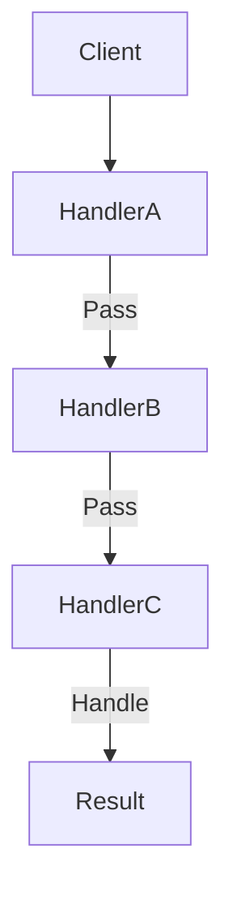

## 7.4. Chain of Responsibility with Process Chains

In the realm of software design patterns, the Chain of Responsibility pattern is a behavioral pattern that allows a request to be passed along a chain of handlers. Each handler can either process the request or pass it to the next handler in the chain. This pattern is particularly useful for scenarios where multiple handlers might be interested in processing a request, such as in middleware systems or validation pipelines.

In Elixir, the Chain of Responsibility pattern can be elegantly implemented using process chains. This approach leverages Elixir's robust concurrency model and process-oriented architecture to create flexible and scalable systems.

### Passing Requests Along a Chain

The primary intent of the Chain of Responsibility pattern is to decouple the sender of a request from its receivers by allowing more than one object to handle the request. This is achieved by chaining the receiving objects and passing the request along the chain until an object handles it.

#### Key Participants

1. **Handler**: Defines an interface for handling requests and optionally sets a successor.
2. **ConcreteHandler**: Handles requests it is responsible for and can access its successor.
3. **Client**: Initiates the request to a handler in the chain.

#### Diagram


```mermaid
flowchart TD
    Client --> HandlerA
    HandlerA -->|Pass| HandlerB
    HandlerB -->|Pass| HandlerC
    HandlerC -->|Handle| Result
```

*This diagram illustrates a chain of handlers where each handler can either process the request or pass it to the next handler.*

### Implementing the Chain of Responsibility

In Elixir, we can implement the Chain of Responsibility pattern using processes. Each process acts as a handler and can decide whether to handle the request or pass it to the next process in the chain.

#### Setting Up a Process Chain

Let's create a simple example where we have a series of processes that handle a request. Each process will either handle the request or pass it to the next process.

```elixir
defmodule Handler do
  def start_link(next_handler \\ nil) do
    spawn_link(fn -> loop(next_handler) end)
  end

  defp loop(next_handler) do
    receive do
      {:handle_request, request, sender} ->
        if can_handle?(request) do
          send(sender, {:response, "Handled by #{inspect(self())}"})
        else
          if next_handler do
            send(next_handler, {:handle_request, request, sender})
          else
            send(sender, {:response, "No handler could process the request"})
          end
        end
        loop(next_handler)
    end
  end

  defp can_handle?(request) do
    # Logic to determine if the request can be handled
    request == :specific_request
  end
end
```

In this code, each `Handler` process checks if it can handle the request. If it can, it sends a response back to the sender. If not, it passes the request to the next handler in the chain.

#### Creating and Using the Chain

Now, let's set up a chain of handlers and send a request through the chain.

```elixir
defmodule Client do
  def send_request(request) do
    handler1 = Handler.start_link()
    handler2 = Handler.start_link(handler1)
    handler3 = Handler.start_link(handler2)

    send(handler3, {:handle_request, request, self()})

    receive do
      {:response, response} -> IO.puts("Response: #{response}")
    end
  end
end

Client.send_request(:specific_request)
Client.send_request(:another_request)
```

In this example, we create three handler processes and chain them together. The client sends a request to the last handler in the chain, which then passes the request along until it is handled.

### Use Cases

The Chain of Responsibility pattern is highly versatile and can be used in various scenarios:

1. **Middleware Systems**: In web applications, middleware components can be chained to process HTTP requests and responses.
2. **Request Validation Pipelines**: Each handler in the chain can validate a part of the request, passing it along if valid.
3. **Event Processing Systems**: Events can be passed through a series of handlers, each capable of processing or ignoring the event.

### Design Considerations

- **Flexibility**: The Chain of Responsibility pattern provides flexibility in adding or removing handlers from the chain without affecting client code.
- **Responsibility**: Ensure that each handler has a clear responsibility to avoid confusion and maintainability issues.
- **Performance**: Consider the performance implications of passing requests through a long chain of handlers.

### Elixir Unique Features

Elixir's concurrency model, based on the actor model, makes it particularly well-suited for implementing the Chain of Responsibility pattern using processes. The lightweight nature of processes in Elixir allows for efficient creation and management of handler chains.

### Differences and Similarities

The Chain of Responsibility pattern shares similarities with other patterns like the Decorator pattern, where functionality is added to objects. However, the key difference is that the Chain of Responsibility pattern focuses on passing requests along a chain, whereas the Decorator pattern focuses on adding behavior to objects.

### Try It Yourself

To deepen your understanding, try modifying the code examples to:

1. Add more handlers to the chain and observe how requests are processed.
2. Implement different logic in the `can_handle?/1` function to handle various types of requests.
3. Create a new client module that sends different types of requests and handles responses.

### Knowledge Check

- What is the primary intent of the Chain of Responsibility pattern?
- How does Elixir's process model enhance the implementation of this pattern?
- What are some common use cases for the Chain of Responsibility pattern?

### Conclusion

The Chain of Responsibility pattern, when implemented using process chains in Elixir, offers a powerful way to build flexible and scalable systems. By leveraging Elixir's concurrency model, developers can create efficient and maintainable handler chains that decouple request handling from the clients that initiate them.

---

## Quiz Time!



### What is the primary intent of the Chain of Responsibility pattern?

- [x] To decouple the sender of a request from its receivers by allowing more than one object to handle the request.
- [ ] To ensure that each request is handled by exactly one handler.
- [ ] To add new behavior to objects dynamically.
- [ ] To create a single point of failure in a system.

> **Explanation:** The Chain of Responsibility pattern allows multiple handlers to have a chance to process a request, decoupling the sender from the receivers.

### How does Elixir's process model enhance the implementation of the Chain of Responsibility pattern?

- [x] By allowing lightweight processes to act as handlers, enabling efficient request passing.
- [ ] By requiring a single process to handle all requests.
- [ ] By enforcing synchronous request handling.
- [ ] By limiting the number of handlers in a chain.

> **Explanation:** Elixir's lightweight processes make it easy to create and manage handler chains, allowing efficient and scalable request passing.

### What is a common use case for the Chain of Responsibility pattern?

- [x] Middleware systems in web applications.
- [ ] Singleton pattern implementation.
- [ ] Creating a single point of entry for requests.
- [ ] Adding behavior to objects at runtime.

> **Explanation:** Middleware systems often use the Chain of Responsibility pattern to process requests through a series of handlers.

### Which of the following is a key participant in the Chain of Responsibility pattern?

- [x] Handler
- [ ] Decorator
- [ ] Singleton
- [ ] Factory

> **Explanation:** The Handler is a key participant in the Chain of Responsibility pattern, responsible for processing requests or passing them along the chain.

### What should each handler in a process chain have?

- [x] A clear responsibility to avoid confusion and maintainability issues.
- [ ] The ability to handle every possible request.
- [ ] Direct access to the client code.
- [ ] The ability to modify the request sender.

> **Explanation:** Each handler should have a clear responsibility to ensure maintainability and clarity in the chain.

### How can you add flexibility to a process chain?

- [x] By allowing handlers to be added or removed without affecting client code.
- [ ] By ensuring all handlers are hardcoded.
- [ ] By limiting the number of handlers to one.
- [ ] By requiring each handler to modify the client code.

> **Explanation:** Flexibility is achieved by allowing handlers to be added or removed without impacting the client code.

### What is a potential design consideration when using the Chain of Responsibility pattern?

- [x] Performance implications of passing requests through a long chain.
- [ ] Ensuring that every handler modifies the client code.
- [ ] Limiting the number of handlers to one.
- [ ] Requiring synchronous request handling.

> **Explanation:** Passing requests through a long chain can have performance implications, so it's important to consider this when designing the chain.

### Which Elixir feature is particularly useful for implementing the Chain of Responsibility pattern?

- [x] Lightweight processes
- [ ] Synchronous function calls
- [ ] Global variables
- [ ] Hardcoded handler chains

> **Explanation:** Elixir's lightweight processes are ideal for implementing the Chain of Responsibility pattern, allowing efficient and scalable handler chains.

### What is a key difference between the Chain of Responsibility and Decorator patterns?

- [x] The Chain of Responsibility focuses on passing requests, while the Decorator adds behavior to objects.
- [ ] Both patterns focus on adding behavior to objects.
- [ ] The Decorator pattern focuses on passing requests along a chain.
- [ ] The Chain of Responsibility pattern focuses on adding behavior to objects.

> **Explanation:** The Chain of Responsibility pattern focuses on passing requests along a chain, while the Decorator pattern focuses on adding behavior to objects.

### True or False: The Chain of Responsibility pattern creates a single point of failure in a system.

- [ ] True
- [x] False

> **Explanation:** The Chain of Responsibility pattern does not create a single point of failure; it allows requests to be handled by multiple handlers, enhancing flexibility and fault tolerance.



Remember, this is just the beginning. As you progress, you'll build more complex and interactive systems using Elixir's powerful concurrency model. Keep experimenting, stay curious, and enjoy the journey!
