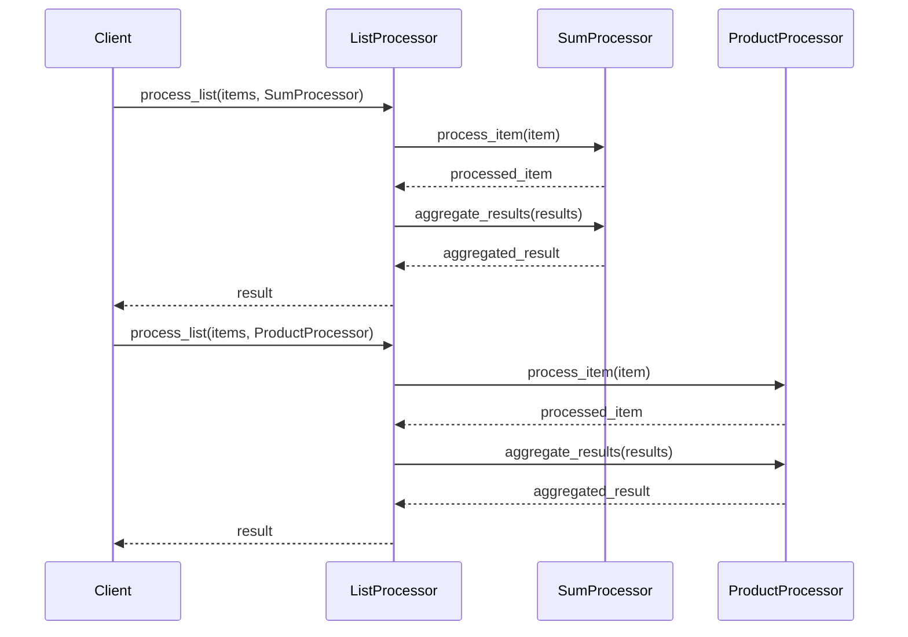

## 7.5. Template Method Pattern using Callbacks and Behaviours

The Template Method Pattern is a behavioral design pattern that defines the skeleton of an algorithm in a method, deferring some steps to subclasses. In Elixir, we can leverage callbacks and behaviours to implement this pattern, allowing us to define algorithm skeletons while deferring the implementation of specific steps to other modules. This approach is particularly useful in functional programming, where we aim to create reusable and composable code.

### Defining Algorithm Skeletons

In the Template Method Pattern, the algorithm's structure is defined in a high-level function, while the specific steps are implemented in separate functions or modules. This separation of concerns allows for flexibility and reuse, as the high-level function can remain unchanged while the specific steps can be modified or extended.

#### Key Concepts

- **Algorithm Skeleton**: The high-level structure of the algorithm, defined in a function.
- **Deferred Steps**: Specific steps of the algorithm that are implemented in separate functions or modules.
- **Callbacks**: Functions that are called at specific points in the algorithm, allowing for customization.
- **Behaviours**: A way to define a set of functions that must be implemented by a module, ensuring consistency and structure.

### Implementing the Template Method Pattern

In Elixir, we can use behaviours to define the required callbacks for our algorithm. A behaviour is essentially a contract that specifies which functions a module must implement. By defining a behaviour, we can ensure that all modules implementing the behaviour provide the necessary functionality.

#### Step-by-Step Implementation

1. **Define the Behaviour**: Create a behaviour module that specifies the required callbacks.
2. **Implement the Template Method**: Define the high-level function that outlines the algorithm's skeleton.
3. **Create Modules Implementing the Behaviour**: Implement the required callbacks in separate modules, providing the specific functionality for each step.
4. **Use the Template Method**: Call the high-level function, passing in the modules that implement the behaviour.

#### Example: Processing a List of Items

Let's consider an example where we want to process a list of items. The algorithm involves iterating over the list, performing an operation on each item, and then aggregating the results.

**Step 1: Define the Behaviour**

```elixir
defmodule ItemProcessor do
  @callback process_item(item :: any()) :: any()
  @callback aggregate_results(results :: list(any())) :: any()
end
```

**Step 2: Implement the Template Method**

```elixir
defmodule ListProcessor do
  @behaviour ItemProcessor

  def process_list(items, processor_module) do
    items
    |> Enum.map(&processor_module.process_item/1)
    |> processor_module.aggregate_results()
  end
end
```

**Step 3: Create Modules Implementing the Behaviour**

```elixir
defmodule SumProcessor do
  @behaviour ItemProcessor

  def process_item(item) do
    item
  end

  def aggregate_results(results) do
    Enum.sum(results)
  end
end

defmodule ProductProcessor do
  @behaviour ItemProcessor

  def process_item(item) do
    item
  end

  def aggregate_results(results) do
    Enum.reduce(results, 1, &*/2)
  end
end
```

**Step 4: Use the Template Method**

```elixir
items = [1, 2, 3, 4, 5]

sum_result = ListProcessor.process_list(items, SumProcessor)
IO.puts("Sum: #{sum_result}")

product_result = ListProcessor.process_list(items, ProductProcessor)
IO.puts("Product: #{product_result}")
```

### Visualizing the Template Method Pattern

To better understand the Template Method Pattern, let's visualize the flow of the algorithm using a sequence diagram.



### Use Cases

The Template Method Pattern is widely used in Elixir, especially in scenarios where a common algorithm needs to be customized. Here are some common use cases:

- **GenServer Callbacks**: Define the structure of a server process, deferring specific operations to callbacks.
- **Plug Pipelines in Phoenix**: Define a sequence of operations for processing HTTP requests, allowing customization through plugs.

### Design Considerations

When implementing the Template Method Pattern in Elixir, consider the following:

- **Flexibility**: Ensure that the behaviour allows for sufficient customization without compromising the algorithm's integrity.
- **Reusability**: Design the algorithm skeleton to be reusable across different contexts and applications.
- **Consistency**: Use behaviours to enforce consistency in the implementation of callbacks.

### Elixir Unique Features

Elixir's support for behaviours and pattern matching makes it particularly well-suited for implementing the Template Method Pattern. The ability to define behaviours ensures that all modules implementing the pattern adhere to a consistent interface, while pattern matching allows for concise and expressive code.

### Differences and Similarities

The Template Method Pattern is often compared to the Strategy Pattern, as both involve defining a high-level algorithm and deferring specific steps. However, the key difference is that the Template Method Pattern defines the algorithm's structure in a single function, while the Strategy Pattern involves selecting a specific strategy at runtime.

### Try It Yourself

Experiment with the code examples provided by modifying the `process_item` and `aggregate_results` functions to implement different operations. For example, try creating a module that calculates the average of the items or filters out certain values before aggregation.

### Knowledge Check

- What is the purpose of the Template Method Pattern?
- How do behaviours facilitate the implementation of the Template Method Pattern in Elixir?
- What are some common use cases for the Template Method Pattern in Elixir?

### Embrace the Journey

Remember, mastering design patterns is a journey. As you continue to explore and experiment with the Template Method Pattern, you'll gain a deeper understanding of how to create flexible and reusable code. Keep experimenting, stay curious, and enjoy the journey!

## Quiz: Template Method Pattern using Callbacks and Behaviours



### What is the primary purpose of the Template Method Pattern?

- [x] To define the skeleton of an algorithm and defer some steps to subclasses or modules
- [ ] To encapsulate a family of algorithms and make them interchangeable
- [ ] To provide a way to access the elements of an aggregate object sequentially
- [ ] To define a one-to-many dependency between objects

> **Explanation:** The Template Method Pattern defines the skeleton of an algorithm, deferring some steps to subclasses or modules for customization.

### How does Elixir's behaviour feature aid in implementing the Template Method Pattern?

- [x] By defining a set of functions that must be implemented by a module
- [ ] By allowing dynamic dispatch of functions at runtime
- [ ] By enabling the creation of anonymous functions
- [ ] By providing a mechanism for pattern matching

> **Explanation:** Behaviours in Elixir define a set of functions that must be implemented by a module, ensuring consistency and structure in the implementation.

### Which of the following is a common use case for the Template Method Pattern in Elixir?

- [x] GenServer callbacks
- [ ] Implementing a linked list
- [ ] Creating a binary search tree
- [ ] Handling HTTP requests in a Phoenix controller

> **Explanation:** GenServer callbacks are a common use case for the Template Method Pattern, as they define the structure of a server process while deferring specific operations to callbacks.

### What is the key difference between the Template Method Pattern and the Strategy Pattern?

- [x] The Template Method Pattern defines the algorithm's structure in a single function, while the Strategy Pattern involves selecting a specific strategy at runtime.
- [ ] The Template Method Pattern is used for creating objects, while the Strategy Pattern is used for defining algorithms.
- [ ] The Template Method Pattern is a structural pattern, while the Strategy Pattern is a creational pattern.
- [ ] The Template Method Pattern is used for managing state, while the Strategy Pattern is used for handling concurrency.

> **Explanation:** The Template Method Pattern defines the algorithm's structure in a single function, while the Strategy Pattern involves selecting a specific strategy at runtime.

### What is the role of callbacks in the Template Method Pattern?

- [x] To allow customization of specific steps in the algorithm
- [ ] To provide a mechanism for error handling
- [ ] To enable asynchronous execution of functions
- [ ] To manage state transitions in a state machine

> **Explanation:** Callbacks allow customization of specific steps in the algorithm, enabling flexibility and reuse.

### Which Elixir feature allows for concise and expressive code in the Template Method Pattern?

- [x] Pattern matching
- [ ] Dynamic typing
- [ ] Lazy evaluation
- [ ] Immutable data structures

> **Explanation:** Pattern matching allows for concise and expressive code in Elixir, making it well-suited for implementing the Template Method Pattern.

### What is a key consideration when designing the Template Method Pattern?

- [x] Ensuring that the behaviour allows for sufficient customization without compromising the algorithm's integrity
- [ ] Maximizing the number of callbacks to increase flexibility
- [ ] Using dynamic dispatch to select the appropriate implementation at runtime
- [ ] Avoiding the use of pattern matching to simplify the code

> **Explanation:** Ensuring that the behaviour allows for sufficient customization without compromising the algorithm's integrity is a key consideration when designing the Template Method Pattern.

### How can you experiment with the Template Method Pattern in Elixir?

- [x] By modifying the `process_item` and `aggregate_results` functions to implement different operations
- [ ] By creating a new behaviour that does not require any callbacks
- [ ] By using macros to dynamically generate the algorithm's structure
- [ ] By implementing the pattern using only anonymous functions

> **Explanation:** Experimenting with the `process_item` and `aggregate_results` functions allows you to implement different operations and explore the flexibility of the Template Method Pattern.

### What is a benefit of using the Template Method Pattern in functional programming?

- [x] It promotes code reuse and separation of concerns
- [ ] It simplifies the creation of complex data structures
- [ ] It enhances the performance of recursive functions
- [ ] It provides a mechanism for managing side effects

> **Explanation:** The Template Method Pattern promotes code reuse and separation of concerns, which are key principles in functional programming.

### True or False: The Template Method Pattern is only applicable in object-oriented programming.

- [ ] True
- [x] False

> **Explanation:** The Template Method Pattern is applicable in both object-oriented and functional programming, as it defines the skeleton of an algorithm and allows for customization of specific steps.


