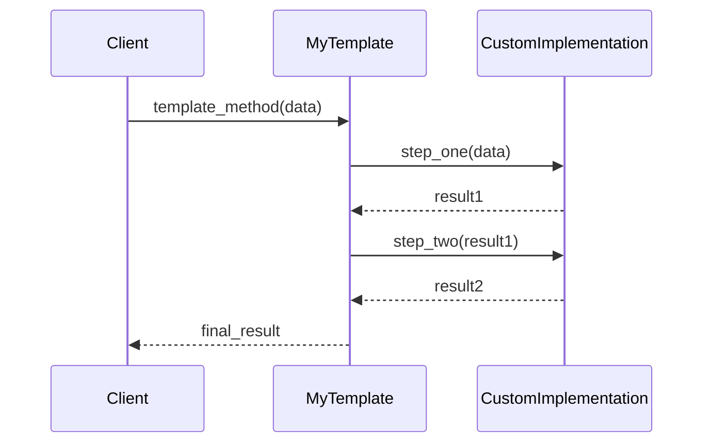

## 7.5. Template Method Pattern Using Callbacks and Behaviours

In the realm of software design, the Template Method Pattern is a powerful tool for defining the skeleton of an algorithm while allowing certain steps to be overridden by subclasses. In Elixir, this pattern can be effectively implemented using callbacks and behaviours, offering a flexible and robust way to structure your code. This section will guide you through the intricacies of the Template Method Pattern in Elixir, illustrating its application with practical examples and visual aids.

### Defining Algorithm Skeletons

The Template Method Pattern is all about defining the outline of an algorithm in a method, deferring some steps to subclasses. This pattern lets subclasses redefine certain steps of an algorithm without changing its structure. In Elixir, we achieve this by using behaviours and callbacks, which allow us to define a contract that must be fulfilled by any module implementing the behaviour.

#### Key Concepts

- **Algorithm Skeleton**: The fixed sequence of steps that define the algorithm. Some of these steps are implemented in the base module, while others are defined as callbacks to be implemented by the consuming modules.
- **Callbacks**: Functions that must be implemented by any module that adopts a behaviour. These are the steps that can vary in the algorithm.
- **Behaviours**: A way to define a set of functions that a module must implement, serving as the contract for the Template Method Pattern.

### Implementing the Template Method Pattern

To implement the Template Method Pattern in Elixir, we define a behaviour that specifies the callbacks required. Then, we create a module that uses this behaviour, implementing the fixed steps of the algorithm and calling the callbacks where necessary.

#### Step-by-Step Implementation

1. **Define the Behaviour**: Create a module that defines the behaviour and the required callbacks.

```elixir
defmodule MyBehaviour do
  @callback step_one(any()) :: any()
  @callback step_two(any()) :: any()
end
```

2. **Implement the Template Method**: Create a module that uses the behaviour and implements the template method, calling the callbacks at the appropriate steps.

```elixir
defmodule MyTemplate do
  @behaviour MyBehaviour

  def template_method(data) do
    data
    |> step_one()
    |> step_two()
  end

  def step_one(data) do
    # Default implementation
    IO.puts("Default step one")
    data
  end

  def step_two(data) do
    # Default implementation
    IO.puts("Default step two")
    data
  end
end
```

3. **Implement the Callbacks**: Create a module that implements the callbacks, customizing the steps as needed.

```elixir
defmodule CustomImplementation do
  @behaviour MyBehaviour

  def step_one(data) do
    IO.puts("Custom step one")
    data + 1
  end

  def step_two(data) do
    IO.puts("Custom step two")
    data * 2
  end
end
```

4. **Use the Template Method**: Call the template method, passing in the data to be processed.

```elixir
CustomImplementation.template_method(5)
```

### Visualizing the Template Method Pattern

To better understand the flow of the Template Method Pattern, let's visualize it using a sequence diagram.


```mermaid
sequenceDiagram
    participant Client
    participant MyTemplate
    participant CustomImplementation

    Client->>MyTemplate: template_method(data)
    MyTemplate->>CustomImplementation: step_one(data)
    CustomImplementation-->>MyTemplate: result1
    MyTemplate->>CustomImplementation: step_two(result1)
    CustomImplementation-->>MyTemplate: result2
    MyTemplate-->>Client: final_result
```

**Diagram Explanation**: The sequence diagram illustrates the interaction between the client, the template module, and the custom implementation. The client calls the `template_method`, which in turn calls the `step_one` and `step_two` callbacks defined in the custom implementation.

### Use Cases

The Template Method Pattern is widely used in Elixir, particularly in the context of GenServer callbacks and plug pipelines in Phoenix. Let's explore these use cases in detail.

#### GenServer Callbacks

In Elixir, GenServer is a generic server implementation that follows the OTP design principles. The GenServer behaviour defines a set of callbacks that must be implemented, such as `handle_call`, `handle_cast`, and `handle_info`. These callbacks allow developers to define custom logic while maintaining the overall structure provided by GenServer.

**Example**:

```elixir
defmodule MyServer do
  use GenServer

  # Client API
  def start_link(initial_state) do
    GenServer.start_link(__MODULE__, initial_state, name: __MODULE__)
  end

  def call_server(data) do
    GenServer.call(__MODULE__, {:process, data})
  end

  # Server Callbacks
  def init(initial_state) do
    {:ok, initial_state}
  end

  def handle_call({:process, data}, _from, state) do
    new_state = process_data(data, state)
    {:reply, new_state, new_state}
  end

  defp process_data(data, state) do
    # Custom processing logic
    data + state
  end
end
```

#### Plug Pipelines in Phoenix

Phoenix, a web framework for Elixir, uses Plug as its underlying abstraction for connection handling. A plug pipeline is a series of plugs that process a connection, similar to a template method where each plug represents a step in the algorithm.

**Example**:

```elixir
defmodule MyAppWeb.Router do
  use MyAppWeb, :router

  pipeline :browser do
    plug :accepts, ["html"]
    plug :fetch_session
    plug :protect_from_forgery
    plug :put_secure_browser_headers
  end

  scope "/", MyAppWeb do
    pipe_through :browser

    get "/", PageController, :index
  end
end
```

### Design Considerations

When implementing the Template Method Pattern in Elixir, consider the following:

- **Flexibility**: The pattern allows for flexibility in implementation while maintaining a consistent structure.
- **Reusability**: By defining the algorithm skeleton in a behaviour, you can easily reuse the template method across different modules.
- **Maintainability**: The separation of concerns between the template method and the callbacks enhances maintainability.

### Elixir Unique Features

Elixir's functional programming paradigm and powerful concurrency model make it an ideal language for implementing the Template Method Pattern. The use of behaviours and callbacks aligns with Elixir's emphasis on immutability and process-based concurrency.

- **Immutability**: Elixir's immutable data structures ensure that the state is not accidentally modified during the execution of the template method.
- **Concurrency**: The ability to run processes concurrently allows for efficient execution of the template method, especially in the context of GenServer and plug pipelines.

### Differences and Similarities

The Template Method Pattern is often compared to the Strategy Pattern, as both involve defining a series of steps that can be customized. However, the key difference is that the Template Method Pattern defines the overall structure of the algorithm, whereas the Strategy Pattern focuses on encapsulating interchangeable algorithms.

### Try It Yourself

To deepen your understanding of the Template Method Pattern, try modifying the code examples provided:

- **Experiment with Different Implementations**: Create additional modules that implement the behaviour with different logic for the callbacks.
- **Add New Steps**: Extend the template method to include additional steps, and update the behaviour accordingly.
- **Test with GenServer and Plug**: Implement a GenServer or Plug pipeline using the Template Method Pattern, and observe how the callbacks influence the execution flow.

### Knowledge Check

- **What is the primary purpose of the Template Method Pattern?**
- **How does Elixir's behaviour mechanism facilitate the implementation of the Template Method Pattern?**
- **Describe a real-world scenario where the Template Method Pattern would be beneficial.**

### Embrace the Journey

Remember, mastering design patterns is a journey. As you explore the Template Method Pattern in Elixir, you'll gain insights into structuring your code for flexibility and maintainability. Keep experimenting, stay curious, and enjoy the process of learning and growing as a software engineer!

## Quiz Time!



### What is the primary purpose of the Template Method Pattern?

- [x] To define the skeleton of an algorithm, deferring some steps to subclasses.
- [ ] To encapsulate interchangeable algorithms.
- [ ] To provide a way to create objects.
- [ ] To define a one-to-many dependency between objects.

> **Explanation:** The Template Method Pattern defines the skeleton of an algorithm, allowing subclasses to redefine certain steps without changing the algorithm's structure.

### How does Elixir's behaviour mechanism facilitate the implementation of the Template Method Pattern?

- [x] By defining a contract that requires implementing specific callbacks.
- [ ] By providing a way to encapsulate data.
- [ ] By allowing dynamic method dispatch.
- [ ] By enabling runtime polymorphism.

> **Explanation:** Behaviours in Elixir define a set of callbacks that must be implemented, providing a contract for the Template Method Pattern.

### In which context is the Template Method Pattern commonly used in Elixir?

- [x] GenServer callbacks and plug pipelines in Phoenix.
- [ ] Data serialization and deserialization.
- [ ] Network communication protocols.
- [ ] File I/O operations.

> **Explanation:** The Template Method Pattern is commonly used in GenServer callbacks and plug pipelines in Phoenix, where the structure is defined, and specific steps are customizable.

### What is a key difference between the Template Method Pattern and the Strategy Pattern?

- [x] The Template Method Pattern defines the overall structure of an algorithm.
- [ ] The Strategy Pattern defines the overall structure of an algorithm.
- [ ] The Template Method Pattern encapsulates interchangeable algorithms.
- [ ] The Strategy Pattern defers some steps to subclasses.

> **Explanation:** The Template Method Pattern defines the overall structure of an algorithm, while the Strategy Pattern focuses on encapsulating interchangeable algorithms.

### What are the benefits of using the Template Method Pattern in Elixir?

- [x] Flexibility, reusability, and maintainability.
- [ ] Simplicity, efficiency, and speed.
- [ ] Security, scalability, and robustness.
- [ ] Portability, compatibility, and interoperability.

> **Explanation:** The Template Method Pattern offers flexibility, reusability, and maintainability by separating the algorithm's structure from its implementation.

### What is a behaviour in Elixir?

- [x] A way to define a set of functions that a module must implement.
- [ ] A mechanism for managing state in processes.
- [ ] A tool for performing asynchronous operations.
- [ ] A method for handling errors and exceptions.

> **Explanation:** A behaviour in Elixir defines a set of functions that a module must implement, serving as a contract for implementing patterns like the Template Method.

### How does immutability in Elixir benefit the Template Method Pattern?

- [x] It ensures that the state is not accidentally modified during execution.
- [ ] It allows for dynamic method dispatch.
- [ ] It enables runtime polymorphism.
- [ ] It provides a way to encapsulate data.

> **Explanation:** Immutability in Elixir ensures that data structures are not accidentally modified during the execution of the template method, maintaining consistency.

### What is a plug in Phoenix?

- [x] A module that can be composed to build a connection processing pipeline.
- [ ] A tool for managing database connections.
- [ ] A mechanism for handling file uploads.
- [ ] A way to define custom routes.

> **Explanation:** A plug in Phoenix is a module that can be composed to build a connection processing pipeline, similar to steps in the Template Method Pattern.

### What is the role of a callback in the Template Method Pattern?

- [x] To define a step that can be customized in the algorithm.
- [ ] To encapsulate data for processing.
- [ ] To manage state in a process.
- [ ] To handle errors and exceptions.

> **Explanation:** A callback in the Template Method Pattern defines a step that can be customized, allowing for flexibility in the algorithm's implementation.

### True or False: The Template Method Pattern is only applicable in object-oriented programming.

- [ ] True
- [x] False

> **Explanation:** False. The Template Method Pattern can be applied in functional programming languages like Elixir, using behaviours and callbacks to implement the pattern.



Remember, this is just the beginning. As you progress, you'll build more complex and interactive systems using Elixir. Keep experimenting, stay curious, and enjoy the journey!
