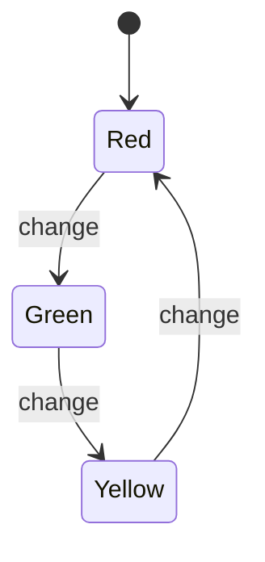

## 7.6. State Pattern with `GenStateMachine`

In the realm of software design patterns, the State Pattern is a powerful tool for managing state-dependent behavior. In Elixir, the `GenStateMachine` module provides a robust framework for implementing this pattern, allowing developers to model state transitions and actions effectively. This section will delve into the intricacies of the State Pattern using `GenStateMachine`, exploring its implementation, use cases, and unique features within the Elixir ecosystem.

### Managing State-Dependent Behavior

The State Pattern is a behavioral design pattern that allows an object to change its behavior when its internal state changes. This pattern is particularly useful in scenarios where an object must exhibit different behaviors based on its current state. By encapsulating state-specific behavior within separate state objects, the State Pattern promotes a clean separation of concerns and enhances code maintainability.

#### Key Concepts

- **State-Dependent Behavior**: The behavior of an object varies depending on its current state.
- **State Transitions**: The process of moving from one state to another, often triggered by events or conditions.
- **Encapsulation**: State-specific behavior is encapsulated within distinct state objects, promoting modularity.

### Implementing the State Pattern with `GenStateMachine`

Elixir's `GenStateMachine` module provides a powerful abstraction for implementing the State Pattern. It allows developers to define state machines with explicit state transitions and actions, making it an ideal choice for modeling complex workflows and protocol implementations.

#### Overview of `GenStateMachine`

`GenStateMachine` is a behavior module in Elixir that facilitates the creation of state machines. It builds upon the `GenServer` module, providing additional capabilities for managing state transitions and handling events.

- **State Definitions**: Define the possible states of the machine.
- **Event Handling**: Specify how the machine responds to events in each state.
- **State Transitions**: Define the conditions under which the machine transitions from one state to another.

#### Sample Code Snippet

Let's explore a simple example of a traffic light system implemented using `GenStateMachine`. This system will have three states: `:red`, `:green`, and `:yellow`, with transitions between them.

```elixir
defmodule TrafficLight do
  use GenStateMachine

  # Initial state
  def init(_) do
    {:ok, :red, %{}}
  end

  # Handle events in the :red state
  def handle_event(:cast, :change, :red, data) do
    IO.puts("Changing from Red to Green")
    {:next_state, :green, data}
  end

  # Handle events in the :green state
  def handle_event(:cast, :change, :green, data) do
    IO.puts("Changing from Green to Yellow")
    {:next_state, :yellow, data}
  end

  # Handle events in the :yellow state
  def handle_event(:cast, :change, :yellow, data) do
    IO.puts("Changing from Yellow to Red")
    {:next_state, :red, data}
  end
end

# Start the state machine
{:ok, pid} = GenStateMachine.start_link(TrafficLight, [])

# Trigger state changes
GenStateMachine.cast(pid, :change)
GenStateMachine.cast(pid, :change)
GenStateMachine.cast(pid, :change)
```

In this example, the `TrafficLight` module defines a simple state machine with three states. The `handle_event/4` function specifies how the machine responds to the `:change` event in each state, transitioning to the next state accordingly.

### Visualizing State Transitions

To better understand the state transitions in our traffic light example, let's visualize the state machine using a state diagram.



**Figure 1**: State diagram of the traffic light system, illustrating the transitions between states.

### Use Cases for the State Pattern

The State Pattern is particularly useful in scenarios where an object's behavior is highly dependent on its current state. Some common use cases include:

- **Protocol Implementations**: Implementing communication protocols that require stateful interactions.
- **Complex Workflow Processes**: Modeling workflows with multiple stages and transitions.
- **Game Development**: Managing game states and transitions between different game modes.

### Design Considerations

When implementing the State Pattern with `GenStateMachine`, consider the following design considerations:

- **State Complexity**: Ensure that the number of states and transitions is manageable. Excessive complexity can lead to maintenance challenges.
- **Event Handling**: Clearly define how the machine responds to events in each state. This promotes predictability and reduces the likelihood of errors.
- **Concurrency**: Leverage Elixir's concurrency model to handle multiple state machines concurrently, enhancing scalability.

### Elixir Unique Features

Elixir's unique features, such as pattern matching and immutability, complement the State Pattern by enabling concise and expressive state definitions. Additionally, the BEAM VM's lightweight process model allows for efficient handling of concurrent state machines.

### Differences and Similarities

The State Pattern is often compared to the Strategy Pattern, as both involve encapsulating behavior. However, the State Pattern focuses on state-dependent behavior, while the Strategy Pattern emphasizes interchangeable algorithms. Understanding these distinctions is crucial for selecting the appropriate pattern for a given problem.

### Try It Yourself

To deepen your understanding of the State Pattern with `GenStateMachine`, try modifying the traffic light example. Experiment with adding new states, such as a `:flashing` state, and define the transitions and behaviors associated with it. This hands-on approach will reinforce your learning and help you grasp the nuances of state management in Elixir.

### Conclusion

The State Pattern, when implemented using `GenStateMachine`, provides a powerful framework for managing state-dependent behavior in Elixir applications. By encapsulating state-specific behavior and leveraging Elixir's unique features, developers can create robust and maintainable systems. As you continue your journey in mastering Elixir design patterns, remember to explore the diverse use cases and applications of the State Pattern, and embrace the opportunities for experimentation and growth.

## Quiz: State Pattern with `GenStateMachine`



### What is the primary purpose of the State Pattern?

- [x] To change an object's behavior based on its internal state.
- [ ] To encapsulate algorithms for interchangeable use.
- [ ] To manage dependencies between objects.
- [ ] To provide a way to create objects without specifying their concrete classes.

> **Explanation:** The State Pattern is designed to change an object's behavior when its internal state changes.

### Which Elixir module is used to implement the State Pattern?

- [ ] GenServer
- [x] GenStateMachine
- [ ] Supervisor
- [ ] Task

> **Explanation:** `GenStateMachine` is the module used in Elixir to implement the State Pattern.

### In the traffic light example, what event triggers a state transition?

- [x] :change
- [ ] :start
- [ ] :stop
- [ ] :reset

> **Explanation:** The `:change` event triggers state transitions in the traffic light example.

### What is a key benefit of using the State Pattern?

- [x] It promotes a clean separation of concerns.
- [ ] It reduces the number of classes needed.
- [ ] It simplifies the user interface.
- [ ] It eliminates the need for error handling.

> **Explanation:** The State Pattern promotes a clean separation of concerns by encapsulating state-specific behavior.

### How does `GenStateMachine` enhance state management in Elixir?

- [x] By providing explicit state transitions and event handling.
- [ ] By simplifying the creation of processes.
- [ ] By reducing memory usage.
- [ ] By eliminating the need for pattern matching.

> **Explanation:** `GenStateMachine` enhances state management by providing explicit state transitions and event handling.

### What is a common use case for the State Pattern?

- [x] Protocol implementations
- [ ] Data serialization
- [ ] User authentication
- [ ] Logging

> **Explanation:** Protocol implementations often require stateful interactions, making them a common use case for the State Pattern.

### What is the relationship between the State Pattern and the Strategy Pattern?

- [x] Both involve encapsulating behavior, but the State Pattern focuses on state-dependent behavior.
- [ ] Both patterns are used for managing dependencies.
- [ ] The State Pattern is a subset of the Strategy Pattern.
- [ ] The Strategy Pattern is used to manage state transitions.

> **Explanation:** Both patterns involve encapsulating behavior, but the State Pattern focuses on state-dependent behavior.

### How can you visualize state transitions in a state machine?

- [x] Using a state diagram
- [ ] Using a class diagram
- [ ] Using a sequence diagram
- [ ] Using a flowchart

> **Explanation:** A state diagram is used to visualize state transitions in a state machine.

### What is a potential pitfall of using the State Pattern?

- [x] Excessive complexity in state definitions and transitions.
- [ ] Lack of flexibility in behavior encapsulation.
- [ ] Difficulty in implementing concurrency.
- [ ] Increased memory usage.

> **Explanation:** Excessive complexity in state definitions and transitions can lead to maintenance challenges.

### True or False: The State Pattern is only applicable in object-oriented programming.

- [ ] True
- [x] False

> **Explanation:** The State Pattern is applicable in both object-oriented and functional programming paradigms, including Elixir.



Remember, mastering the State Pattern with `GenStateMachine` is just one step in your journey to becoming an expert in Elixir design patterns. Keep experimenting, stay curious, and enjoy the process of learning and growing as a developer!
