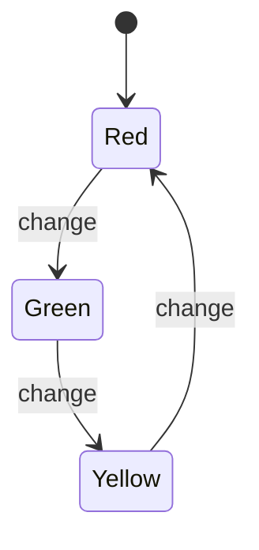

## 7.6. State Pattern with `GenStateMachine`

In this section, we delve into the State Pattern in Elixir, focusing on using `GenStateMachine` to manage state-dependent behavior in your applications. This pattern is invaluable when you need to change an object's behavior based on its internal state, making it a perfect fit for protocol implementations and complex workflow processes.

### Managing State-Dependent Behavior

The State Pattern is a behavioral design pattern that allows an object to alter its behavior when its internal state changes. It's akin to having a state machine where each state represents a different behavior. In Elixir, we can leverage the `GenStateMachine` module to implement this pattern efficiently.

#### Intent

The primary intent of the State Pattern is to encapsulate varying behavior for the same object based on its state. By doing so, it promotes cleaner and more maintainable code, as state-specific behavior is isolated into separate state objects or modules.

### Implementing the State Pattern with `GenStateMachine`

`GenStateMachine` is a powerful tool in Elixir for modeling state machines. It allows you to define states, transitions, and actions, making it ideal for implementing the State Pattern.

#### Key Participants

- **Context**: Maintains an instance of a ConcreteState subclass that defines the current state.
- **State**: Defines an interface for encapsulating the behavior associated with a particular state of the Context.
- **ConcreteState**: Each subclass implements a behavior associated with a state of the Context.

#### Applicability

The State Pattern is applicable when:

- An object's behavior depends on its state, and it must change its behavior at runtime depending on that state.
- Operations have large, multipart conditional statements that depend on the object's state.

#### Sample Code Snippet

Let's walk through a simple example of implementing a traffic light system using `GenStateMachine`.

```elixir
defmodule TrafficLight do
  use GenStateMachine

  # Define states
  def start_link(_) do
    GenStateMachine.start_link(__MODULE__, :red, name: __MODULE__)
  end

  def init(state) do
    {:ok, state}
  end

  # Define state transitions
  def handle_event(:cast, :change, :red) do
    IO.puts("Changing from Red to Green")
    {:next_state, :green, nil}
  end

  def handle_event(:cast, :change, :green) do
    IO.puts("Changing from Green to Yellow")
    {:next_state, :yellow, nil}
  end

  def handle_event(:cast, :change, :yellow) do
    IO.puts("Changing from Yellow to Red")
    {:next_state, :red, nil}
  end

  # Public API
  def change_light do
    GenStateMachine.cast(__MODULE__, :change)
  end
end
```

In this example, the `TrafficLight` module uses `GenStateMachine` to manage state transitions between `:red`, `:green`, and `:yellow`. Each state transition is triggered by the `:change` event, demonstrating how the State Pattern can be implemented using `GenStateMachine`.

### Design Considerations

When implementing the State Pattern, consider the following:

- **State Explosion**: Be wary of creating too many states, which can complicate the state machine.
- **Transition Logic**: Clearly define the conditions under which state transitions occur.
- **Concurrency**: Ensure that state transitions are thread-safe, especially in concurrent environments.

### Elixir Unique Features

Elixir's concurrency model and fault-tolerance features make it particularly well-suited for implementing the State Pattern. `GenStateMachine` leverages Elixir's lightweight processes, allowing you to model complex state-dependent behavior efficiently.

### Differences and Similarities

The State Pattern is often confused with the Strategy Pattern. The key difference is that the State Pattern is used to change behavior based on an object's state, while the Strategy Pattern is used to change behavior by delegating to different strategy objects.

### Visualizing State Transitions

To better understand the state transitions in our traffic light example, let's visualize them using a state diagram.


```mermaid
stateDiagram
    [*] --> Red
    Red --> Green: change
    Green --> Yellow: change
    Yellow --> Red: change
```

This diagram illustrates the state transitions for the traffic light system, showing how the system moves from one state to another based on the `:change` event.

### Use Cases

The State Pattern is particularly useful in scenarios such as:

- **Protocol Implementations**: Managing different states of a communication protocol.
- **Complex Workflow Processes**: Handling various stages of a workflow with distinct behaviors.
- **Game Development**: Managing character states, such as idle, running, or jumping.

### Try It Yourself

To deepen your understanding, try modifying the traffic light example to add a `:blinking` state. Implement the logic to transition to this state and back to the regular cycle.

### Knowledge Check

Before we wrap up, let's pose a few questions to reinforce your understanding:

- How does the State Pattern help manage state-dependent behavior?
- What are some potential pitfalls when using `GenStateMachine`?
- How can you ensure thread safety in state transitions?

### Summary

In this section, we've explored the State Pattern and its implementation using `GenStateMachine` in Elixir. By encapsulating state-dependent behavior, we can create more maintainable and scalable applications. Remember, mastering the State Pattern is just one step in building robust Elixir applications. Keep experimenting, stay curious, and enjoy the journey!

## Quiz Time!



### What is the primary intent of the State Pattern?

- [x] To encapsulate varying behavior for the same object based on its state.
- [ ] To delegate behavior to different strategy objects.
- [ ] To manage dependencies between objects.
- [ ] To implement a singleton instance.

> **Explanation:** The State Pattern's primary intent is to encapsulate behavior based on an object's state, allowing it to change behavior dynamically.

### Which module in Elixir is used to implement the State Pattern?

- [ ] GenServer
- [x] GenStateMachine
- [ ] GenEvent
- [ ] Supervisor

> **Explanation:** `GenStateMachine` is specifically designed to handle state transitions and is ideal for implementing the State Pattern in Elixir.

### What is a key difference between the State Pattern and the Strategy Pattern?

- [x] The State Pattern changes behavior based on an object's state, while the Strategy Pattern delegates behavior to different strategy objects.
- [ ] The State Pattern is used for concurrency, while the Strategy Pattern is not.
- [ ] The Strategy Pattern changes behavior based on an object's state, while the State Pattern delegates behavior to different strategy objects.
- [ ] Both patterns are identical in their implementation.

> **Explanation:** The State Pattern focuses on state-based behavior changes, while the Strategy Pattern uses different strategies for behavior.

### What should you be cautious of when implementing the State Pattern?

- [x] State explosion
- [ ] Insufficient logging
- [ ] Excessive use of macros
- [ ] Lack of documentation

> **Explanation:** State explosion can complicate the state machine, making it harder to maintain and understand.

### What is a common use case for the State Pattern?

- [x] Protocol implementations
- [ ] Data serialization
- [ ] Logging
- [ ] Error handling

> **Explanation:** The State Pattern is useful for managing different states in protocol implementations, where behavior changes based on the protocol state.

### How does `GenStateMachine` help in implementing the State Pattern?

- [x] By providing a framework for defining states, transitions, and actions.
- [ ] By managing database connections.
- [ ] By handling HTTP requests.
- [ ] By generating random numbers.

> **Explanation:** `GenStateMachine` provides a structured way to define and manage states and transitions, aligning well with the State Pattern.

### What is an advantage of using the State Pattern?

- [x] It promotes cleaner and more maintainable code.
- [ ] It increases the number of lines of code.
- [ ] It requires less memory.
- [ ] It is faster than all other patterns.

> **Explanation:** By encapsulating state-specific behavior, the State Pattern leads to cleaner and more maintainable code.

### What is the role of a ConcreteState in the State Pattern?

- [x] It implements behavior associated with a state of the Context.
- [ ] It manages database connections.
- [ ] It handles error logging.
- [ ] It defines the user interface.

> **Explanation:** ConcreteState subclasses implement the behavior associated with a specific state of the Context.

### True or False: The State Pattern and Strategy Pattern are the same.

- [ ] True
- [x] False

> **Explanation:** The State Pattern and Strategy Pattern serve different purposes and are not the same.

### What is a potential pitfall of using `GenStateMachine`?

- [x] Complexity in managing many states and transitions.
- [ ] Lack of concurrency support.
- [ ] Inability to handle errors.
- [ ] Poor performance in handling HTTP requests.

> **Explanation:** Managing a large number of states and transitions can lead to complexity, making the state machine harder to maintain.



Remember, this is just the beginning. As you progress, you'll build more complex and interactive systems. Keep experimenting, stay curious, and enjoy the journey!

---
