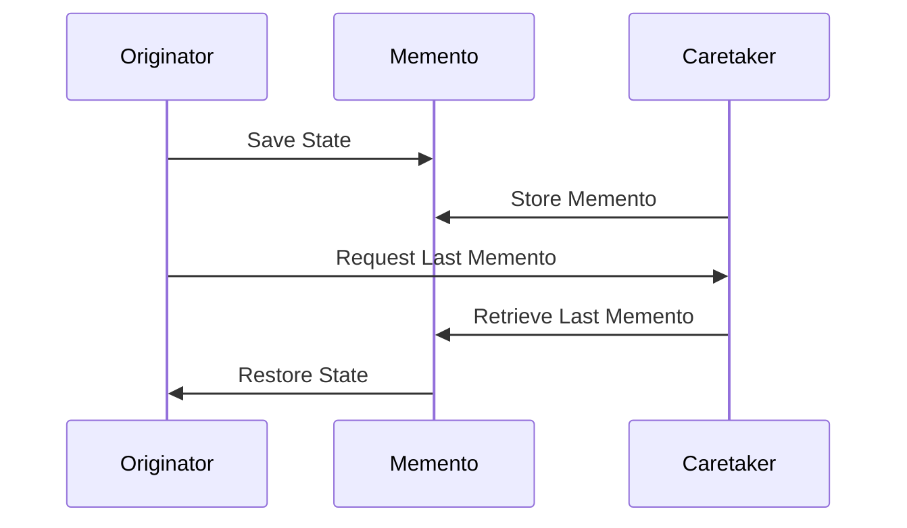

## 7.7. Memento Pattern for State Preservation

In the realm of software design patterns, the Memento Pattern plays a crucial role in capturing and restoring the state of an object without violating encapsulation. This pattern is particularly useful in scenarios where you need to implement undo functionality or rollback operations after errors. In this section, we will delve into the Memento Pattern, explore its implementation in Elixir, and examine its use cases and benefits.

### Capturing and Restoring Object State

The Memento Pattern is a behavioral design pattern that allows you to capture an object's internal state and store it externally so that the object can be restored to this state later. This is done without exposing the object's internal structure, thereby preserving encapsulation.

#### Intent

The primary intent of the Memento Pattern is to provide a way to capture and externalize an object's internal state so that it can be restored later without violating encapsulation. This is particularly useful for implementing features like undo, redo, and rollback.

#### Key Participants

1. **Originator**: The object whose state needs to be saved and restored.
2. **Memento**: The object that stores the state of the Originator.
3. **Caretaker**: The object responsible for keeping track of the Memento.

### Implementing the Memento Pattern in Elixir

In Elixir, the Memento Pattern can be implemented using various techniques, including storing process state snapshots in ETS (Erlang Term Storage) or using external storage solutions. Let's explore a basic implementation of the Memento Pattern in Elixir.

#### Sample Code Snippet

Below is a simple implementation of the Memento Pattern in Elixir. In this example, we will create a module that represents the Originator, a struct for the Memento, and a Caretaker module to manage the state.

```elixir
defmodule Originator do
  defstruct state: nil

  # Function to create a new originator with a given state
  def new(state), do: %Originator{state: state}

  # Function to set a new state
  def set_state(originator, state), do: %Originator{originator | state: state}

  # Function to get the current state
  def get_state(%Originator{state: state}), do: state

  # Function to save the current state to a memento
  def save_to_memento(originator), do: %Memento{state: originator.state}

  # Function to restore the state from a memento
  def restore_from_memento(originator, %Memento{state: state}), do: %Originator{originator | state: state}
end

defmodule Memento do
  defstruct state: nil
end

defmodule Caretaker do
  defstruct mementos: []

  # Function to add a memento to the caretaker
  def add_memento(caretaker, memento), do: %Caretaker{caretaker | mementos: [memento | caretaker.mementos]}

  # Function to get the last saved memento
  def get_last_memento(%Caretaker{mementos: [last | _]}), do: last
end

# Example usage
originator = Originator.new("Initial State")
caretaker = %Caretaker{}

# Save the current state
memento = Originator.save_to_memento(originator)
caretaker = Caretaker.add_memento(caretaker, memento)

# Change the state
originator = Originator.set_state(originator, "New State")

# Restore the state
last_memento = Caretaker.get_last_memento(caretaker)
originator = Originator.restore_from_memento(originator, last_memento)

IO.inspect Originator.get_state(originator) # Output: "Initial State"
```

In this example, the `Originator` module represents the object whose state we want to save and restore. The `Memento` struct is used to store the state, and the `Caretaker` module manages the mementos.

### Design Considerations

When implementing the Memento Pattern in Elixir, consider the following:

- **State Size**: Be mindful of the size of the state being saved. Large states can consume significant memory and storage resources.
- **Performance**: Saving and restoring state can be resource-intensive. Optimize the process to minimize performance impact.
- **Concurrency**: Elixir's concurrency model can complicate state management. Ensure that state changes are thread-safe and consistent.

### Elixir Unique Features

Elixir offers several unique features that can enhance the implementation of the Memento Pattern:

- **Immutability**: Elixir's immutable data structures ensure that state changes do not affect other parts of the system, making it easier to manage state.
- **Concurrency**: Elixir's lightweight processes and message-passing model facilitate concurrent state management.
- **ETS**: Erlang Term Storage (ETS) can be used to store mementos efficiently, providing fast access to state snapshots.

### Use Cases

The Memento Pattern is particularly useful in the following scenarios:

- **Undo Functionality**: Implementing undo and redo operations in applications such as text editors and graphic design tools.
- **State Rollback**: Rolling back to a previous state after an error or failure, ensuring system stability.
- **Version Control**: Managing different versions of an object's state, similar to version control systems.

### Differences and Similarities

The Memento Pattern is often compared to other state management patterns, such as the Command Pattern and the State Pattern. While these patterns share some similarities, they serve different purposes:

- **Command Pattern**: Focuses on encapsulating requests as objects, allowing for parameterization and queuing of requests.
- **State Pattern**: Allows an object to change its behavior when its internal state changes, encapsulating state-specific behavior.

### Visualizing the Memento Pattern

To better understand the Memento Pattern, let's visualize the interaction between the Originator, Memento, and Caretaker using a sequence diagram.



This diagram illustrates the process of saving and restoring state using the Memento Pattern. The Originator saves its state to a Memento, which is then stored by the Caretaker. When the Originator needs to restore its state, it requests the last Memento from the Caretaker.

### Try It Yourself

To gain a deeper understanding of the Memento Pattern, try modifying the code example provided above. Experiment with different state values, add additional mementos, and implement a redo functionality. This hands-on approach will help solidify your understanding of the pattern.

### Knowledge Check

Before we conclude, let's review some key concepts:

- **What is the primary purpose of the Memento Pattern?**
- **How does the Memento Pattern preserve encapsulation?**
- **What are some common use cases for the Memento Pattern?**

### Embrace the Journey

Remember, mastering design patterns is a journey. As you continue to explore and implement patterns like the Memento Pattern, you'll gain valuable insights into building robust and maintainable software systems. Keep experimenting, stay curious, and enjoy the process!

## Quiz: Memento Pattern for State Preservation



### What is the primary purpose of the Memento Pattern?

- [x] To capture and restore an object's state without violating encapsulation.
- [ ] To manage concurrent processes in Elixir.
- [ ] To encapsulate requests as objects.
- [ ] To change an object's behavior based on its state.

> **Explanation:** The Memento Pattern is designed to capture and restore an object's state without violating encapsulation.

### Which of the following is a key participant in the Memento Pattern?

- [x] Originator
- [ ] Observer
- [ ] Adapter
- [ ] Proxy

> **Explanation:** The Originator is a key participant in the Memento Pattern, responsible for saving and restoring state.

### How does the Memento Pattern preserve encapsulation?

- [x] By storing state externally without exposing internal structure.
- [ ] By using public methods to access state.
- [ ] By sharing state across multiple objects.
- [ ] By using global variables to store state.

> **Explanation:** The Memento Pattern preserves encapsulation by storing state externally without exposing the object's internal structure.

### What is a common use case for the Memento Pattern?

- [x] Implementing undo functionality.
- [ ] Managing database transactions.
- [ ] Encapsulating requests as objects.
- [ ] Changing an object's behavior based on its state.

> **Explanation:** A common use case for the Memento Pattern is implementing undo functionality.

### Which Elixir feature enhances the implementation of the Memento Pattern?

- [x] Immutability
- [ ] Dynamic typing
- [ ] Global variables
- [ ] Inheritance

> **Explanation:** Elixir's immutability enhances the implementation of the Memento Pattern by ensuring state changes do not affect other parts of the system.

### What is the role of the Caretaker in the Memento Pattern?

- [x] To manage and store mementos.
- [ ] To change an object's behavior.
- [ ] To encapsulate requests as objects.
- [ ] To manage concurrent processes.

> **Explanation:** The Caretaker is responsible for managing and storing mementos in the Memento Pattern.

### How can ETS be used in the Memento Pattern?

- [x] To store mementos efficiently.
- [ ] To manage concurrent processes.
- [ ] To encapsulate requests as objects.
- [ ] To change an object's behavior.

> **Explanation:** ETS can be used to store mementos efficiently, providing fast access to state snapshots.

### What is a potential drawback of the Memento Pattern?

- [x] Large states can consume significant memory.
- [ ] It violates encapsulation.
- [ ] It cannot be used in functional programming.
- [ ] It requires global variables.

> **Explanation:** A potential drawback of the Memento Pattern is that large states can consume significant memory and storage resources.

### Which pattern is often compared to the Memento Pattern?

- [x] Command Pattern
- [ ] Observer Pattern
- [ ] Adapter Pattern
- [ ] Proxy Pattern

> **Explanation:** The Command Pattern is often compared to the Memento Pattern, but they serve different purposes.

### True or False: The Memento Pattern can be used for version control.

- [x] True
- [ ] False

> **Explanation:** The Memento Pattern can be used for version control by managing different versions of an object's state.


