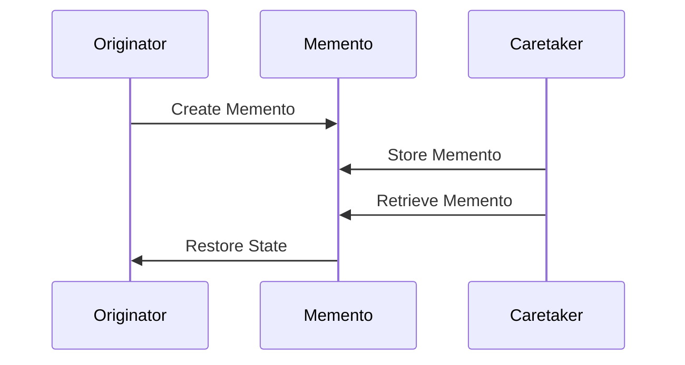

## 7.7. Memento Pattern for State Preservation

In the realm of software design patterns, the Memento Pattern stands out as a vital tool for capturing and restoring an object's state without compromising its encapsulation. This pattern is particularly valuable in scenarios where state preservation and rollback are crucial, such as implementing undo functionality or recovering from errors. In this section, we'll explore how to implement the Memento Pattern in Elixir, leveraging its unique features and functional programming paradigm.

### Capturing and Restoring Object State

The Memento Pattern is a behavioral design pattern that allows you to capture an object's internal state at a particular moment and restore it later without exposing its implementation details. This is achieved by creating a "memento" object that stores the state of the original object. The pattern typically involves three key participants:

- **Originator**: The object whose state needs to be saved and restored.
- **Memento**: The object that stores the internal state of the Originator.
- **Caretaker**: The entity responsible for keeping track of the memento, but it does not modify or inspect its contents.

#### Intent

The primary intent of the Memento Pattern is to provide the ability to restore an object to its previous state. This is particularly useful in applications requiring undo functionality or state rollback after errors.

#### Key Participants

- **Originator**: In Elixir, this can be a process or a module that holds the state.
- **Memento**: A data structure or process that captures the state of the Originator.
- **Caretaker**: A process or module that manages the mementos, typically using ETS or external storage.

### Implementing the Memento Pattern

In Elixir, the Memento Pattern can be implemented using processes and data structures to capture and restore state. Let's walk through a practical example to illustrate this concept.

#### Example: Implementing Undo Functionality

Consider a simple text editor application where we want to implement undo functionality. We'll use the Memento Pattern to capture the state of the text editor at various points and restore it as needed.

```elixir
defmodule TextEditor do
  defstruct content: ""

  # Function to update the content
  def update(editor, new_content) do
    %{editor | content: new_content}
  end

  # Function to create a memento
  def create_memento(editor) do
    %Memento{state: editor.content}
  end

  # Function to restore from a memento
  def restore(editor, %Memento{state: state}) do
    %{editor | content: state}
  end
end

defmodule Memento do
  defstruct state: ""
end

defmodule Caretaker do
  defstruct history: []

  # Function to add a memento to history
  def add_memento(caretaker, memento) do
    %{caretaker | history: [memento | caretaker.history]}
  end

  # Function to get the last memento
  def get_last_memento(%Caretaker{history: [last | rest]}) do
    {last, %{Caretaker | history: rest}}
  end

  def get_last_memento(_caretaker) do
    {nil, _caretaker}
  end
end

# Usage
editor = %TextEditor{}
caretaker = %Caretaker{}

# Update the editor and save states
editor = TextEditor.update(editor, "Hello, World!")
memento = TextEditor.create_memento(editor)
caretaker = Caretaker.add_memento(caretaker, memento)

editor = TextEditor.update(editor, "Hello, Elixir!")
memento = TextEditor.create_memento(editor)
caretaker = Caretaker.add_memento(caretaker, memento)

# Undo the last change
{last_memento, caretaker} = Caretaker.get_last_memento(caretaker)
editor = TextEditor.restore(editor, last_memento)

IO.inspect(editor.content) # Outputs: "Hello, World!"
```

In this example, the `TextEditor` module acts as the Originator, the `Memento` module represents the Memento, and the `Caretaker` module manages the mementos.

### Visualizing the Memento Pattern

To better understand the flow of the Memento Pattern, let's visualize it using a sequence diagram.


```mermaid
sequenceDiagram
    participant Originator
    participant Memento
    participant Caretaker

    Originator->>Memento: Create Memento
    Caretaker->>Memento: Store Memento
    Caretaker->>Memento: Retrieve Memento
    Memento->>Originator: Restore State
```

This diagram illustrates the interaction between the Originator, Memento, and Caretaker during the state capture and restoration process.

### Use Cases

The Memento Pattern is particularly useful in scenarios where you need to:

- **Implement Undo Functionality**: Capture the state before each change and allow users to revert to previous states.
- **State Rollback After Errors**: Preserve a stable state and restore it in case of errors or exceptions.

#### Additional Use Cases

- **Version Control Systems**: Capture snapshots of files or documents at different points in time.
- **Game Development**: Save game states to allow players to revert to previous points.
- **Data Recovery**: Preserve data states to recover from unexpected failures.

### Design Considerations

When implementing the Memento Pattern in Elixir, consider the following:

- **State Size**: Large states may require efficient storage solutions, such as ETS or external databases.
- **Performance**: Frequent state captures can impact performance, so optimize the process.
- **Concurrency**: Ensure thread-safe operations when capturing and restoring states in concurrent environments.

### Elixir Unique Features

Elixir's concurrency model and data structures make it well-suited for implementing the Memento Pattern. Here are some unique features:

- **Processes**: Use lightweight processes to manage state and mementos efficiently.
- **ETS (Erlang Term Storage)**: Store mementos in ETS for fast access and scalability.
- **Immutable Data Structures**: Leverage immutability to ensure consistent state captures.

### Differences and Similarities

The Memento Pattern is often compared to other state management patterns, such as:

- **Command Pattern**: Both patterns involve capturing state, but the Command Pattern focuses on encapsulating operations.
- **Snapshot Pattern**: Similar to the Memento Pattern, but often used in distributed systems for state replication.

### Try It Yourself

Experiment with the provided code example by:

- Modifying the `TextEditor` to include additional state attributes, such as cursor position or formatting.
- Implementing a redo functionality to complement the undo feature.
- Storing mementos in ETS for improved performance in large-scale applications.

### References and Further Reading

- [Elixir Documentation](https://elixir-lang.org/docs.html)
- [Design Patterns: Elements of Reusable Object-Oriented Software](https://en.wikipedia.org/wiki/Design_Patterns)
- [ETS in Elixir](https://elixir-lang.org/getting-started/mix-otp/ets.html)

### Knowledge Check

Reflect on the following questions to reinforce your understanding:

1. How does the Memento Pattern preserve encapsulation?
2. What are the key participants in the Memento Pattern?
3. How can ETS be used to enhance the Memento Pattern in Elixir?

### Embrace the Journey

Remember, mastering design patterns like the Memento Pattern is a journey. As you continue to explore and implement these patterns, you'll gain deeper insights into building robust and scalable applications. Keep experimenting, stay curious, and enjoy the journey!

## Quiz Time!



### What is the primary purpose of the Memento Pattern?

- [x] To capture and restore an object's state without violating encapsulation.
- [ ] To manage concurrent processes in Elixir.
- [ ] To optimize performance in distributed systems.
- [ ] To implement real-time communication in applications.

> **Explanation:** The Memento Pattern is designed to capture and restore an object's state without exposing its internal details, preserving encapsulation.

### Which participant in the Memento Pattern is responsible for storing the object's state?

- [ ] Originator
- [x] Memento
- [ ] Caretaker
- [ ] Observer

> **Explanation:** The Memento is the participant that stores the internal state of the Originator.

### How does the Caretaker interact with the Memento in the Memento Pattern?

- [x] It stores and retrieves mementos but does not modify them.
- [ ] It modifies the memento's state directly.
- [ ] It creates new mementos from the Originator.
- [ ] It acts as the Originator's state manager.

> **Explanation:** The Caretaker is responsible for storing and retrieving mementos without modifying their contents.

### What is a common use case for the Memento Pattern?

- [x] Implementing undo functionality in applications.
- [ ] Managing user authentication sessions.
- [ ] Optimizing database queries.
- [ ] Designing user interfaces.

> **Explanation:** The Memento Pattern is often used to implement undo functionality by capturing and restoring previous states.

### In Elixir, which feature can be used to store mementos efficiently?

- [ ] GenServer
- [x] ETS (Erlang Term Storage)
- [ ] Phoenix Channels
- [ ] Mix Tasks

> **Explanation:** ETS is an efficient storage solution in Elixir for storing mementos and accessing them quickly.

### What is a potential drawback of frequently capturing states in the Memento Pattern?

- [x] It can impact performance.
- [ ] It violates encapsulation.
- [ ] It increases code complexity.
- [ ] It requires external storage.

> **Explanation:** Frequent state captures can affect performance, especially if the states are large or complex.

### How does Elixir's immutability benefit the Memento Pattern?

- [x] It ensures consistent state captures.
- [ ] It allows direct modification of mementos.
- [ ] It simplifies the Caretaker's role.
- [ ] It eliminates the need for a Memento.

> **Explanation:** Elixir's immutability ensures that captured states remain consistent and unchanged.

### What is a key difference between the Memento and Command Patterns?

- [x] The Memento Pattern focuses on state capture, while the Command Pattern encapsulates operations.
- [ ] The Command Pattern is used for state rollback, while the Memento Pattern is not.
- [ ] The Memento Pattern requires multiple participants, while the Command Pattern does not.
- [ ] The Command Pattern is specific to Elixir, while the Memento Pattern is not.

> **Explanation:** The Memento Pattern captures state, whereas the Command Pattern encapsulates operations or commands.

### Which Elixir feature can be leveraged to manage state in the Memento Pattern?

- [x] Processes
- [ ] Phoenix Views
- [ ] Mix Projects
- [ ] EEx Templates

> **Explanation:** Elixir's lightweight processes can be used to manage state and mementos efficiently.

### True or False: The Memento Pattern is only applicable in object-oriented programming languages.

- [ ] True
- [x] False

> **Explanation:** The Memento Pattern can be applied in functional languages like Elixir, using processes and data structures to capture and restore state.




