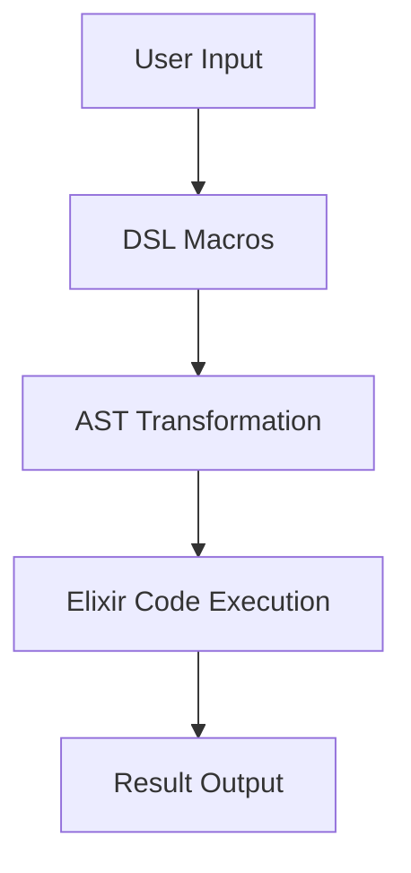

## 7.8. Interpreter Pattern using Macros and DSLs

In this section, we delve into the Interpreter Pattern, a behavioral design pattern that is particularly powerful in the context of Elixir due to its support for macros and Domain-Specific Languages (DSLs). We will explore how to define a representation for a grammar and create interpreters using Elixir's unique features.

### Interpreting Languages

The Interpreter Pattern is used to define a grammar for a language and provide an interpreter to evaluate sentences in that language. This pattern is particularly useful for building configuration languages, expression evaluators, and even small scripting languages.

#### Key Concepts

- **Grammar Representation**: Define the syntax and structure of the language.
- **Interpreter**: Implement logic to parse and execute the language constructs.

### Implementing the Interpreter Pattern

Elixir's metaprogramming capabilities, particularly macros, make it an excellent choice for implementing the Interpreter Pattern. Macros allow us to transform Elixir code at compile time, enabling the creation of powerful DSLs.

#### Creating DSLs with Macros

A Domain-Specific Language (DSL) is a specialized language tailored to a specific application domain. In Elixir, we can use macros to create DSLs that simplify complex tasks by providing a more intuitive syntax.

**Example: A Simple Arithmetic DSL**

Let's create a simple DSL for arithmetic expressions. We'll define a grammar and an interpreter to evaluate expressions like `add(2, multiply(3, 4))`.

```elixir
defmodule ArithmeticDSL do
  defmacro add(a, b) do
    quote do
      unquote(a) + unquote(b)
    end
  end

  defmacro multiply(a, b) do
    quote do
      unquote(a) * unquote(b)
    end
  end
end

# Usage
import ArithmeticDSL

result = add(2, multiply(3, 4))
IO.puts(result) # Output: 14
```

In this example, we define two macros, `add` and `multiply`, which transform the input expressions into Elixir's native arithmetic operations. The `quote` and `unquote` constructs are used to manipulate the Abstract Syntax Tree (AST) of the code.

#### Visualizing the DSL Workflow

To better understand how our DSL processes expressions, let's visualize the workflow using a Mermaid.js diagram.



**Diagram Description**: This diagram illustrates the flow of processing an arithmetic expression using our DSL. The user input is transformed by DSL macros into an AST, which is then executed as Elixir code to produce the result.

### Use Cases

The Interpreter Pattern is versatile and can be applied in various scenarios:

- **Configuration Languages**: Define custom configuration files that can be interpreted and executed by your application.
- **Expression Evaluation**: Implement calculators or expression evaluators that can parse and compute complex expressions.
- **Scripting Languages**: Create small scripting languages for specific tasks within your application.

#### Example: Configuration Language

Consider a scenario where we need to define a configuration language for a web server. We can use the Interpreter Pattern to parse and execute configuration files.

```elixir
defmodule ConfigDSL do
  defmacro set(key, value) do
    quote do
      Application.put_env(:my_app, unquote(key), unquote(value))
    end
  end

  defmacro get(key) do
    quote do
      Application.get_env(:my_app, unquote(key))
    end
  end
end

# Usage
import ConfigDSL

set(:port, 8080)
IO.puts(get(:port)) # Output: 8080
```

In this example, we define a simple DSL for setting and getting configuration values using Elixir's `Application` module.

### Design Considerations

When implementing the Interpreter Pattern in Elixir, consider the following:

- **Complexity**: Ensure that the DSL remains simple and intuitive. Avoid overcomplicating the syntax.
- **Performance**: Macros are executed at compile time, which can improve runtime performance. However, complex macros can increase compilation time.
- **Maintainability**: Keep the DSL well-documented and ensure that it is easy to extend and modify.

### Elixir Unique Features

Elixir's macro system is a powerful tool for implementing the Interpreter Pattern. Unlike many other languages, Elixir allows you to manipulate the AST directly, providing unparalleled flexibility in creating DSLs.

### Differences and Similarities

The Interpreter Pattern is often confused with the Visitor Pattern. While both involve traversing a structure, the Interpreter Pattern focuses on evaluating expressions, whereas the Visitor Pattern is about performing operations on elements of an object structure.

### Try It Yourself

Experiment with the examples provided by modifying the DSL to include additional operations, such as subtraction or division. Try creating a DSL for a different domain, such as a task scheduler or a query language.

### Knowledge Check

- What are the key components of the Interpreter Pattern?
- How do macros facilitate the creation of DSLs in Elixir?
- What are some common use cases for the Interpreter Pattern?

### Embrace the Journey

Remember, mastering the Interpreter Pattern and DSLs in Elixir is a journey. As you experiment and build more complex interpreters, you'll gain a deeper understanding of Elixir's metaprogramming capabilities. Keep exploring, stay curious, and enjoy the process!

## Quiz: Interpreter Pattern using Macros and DSLs



### What is the primary purpose of the Interpreter Pattern?

- [x] To define a grammar and provide an interpreter for a language
- [ ] To optimize code execution
- [ ] To facilitate communication between objects
- [ ] To manage object creation

> **Explanation:** The Interpreter Pattern is used to define a grammar for a language and provide an interpreter to evaluate sentences in that language.

### How do macros in Elixir help in implementing the Interpreter Pattern?

- [x] By transforming code at compile time
- [ ] By executing code at runtime
- [ ] By managing memory allocation
- [ ] By optimizing performance

> **Explanation:** Macros in Elixir allow you to transform code at compile time, enabling the creation of powerful DSLs.

### Which of the following is a common use case for the Interpreter Pattern?

- [x] Configuration languages
- [ ] Memory management
- [ ] Network communication
- [ ] User interface design

> **Explanation:** The Interpreter Pattern is commonly used for configuration languages, expression evaluation, and scripting languages.

### What is a DSL?

- [x] A Domain-Specific Language
- [ ] A Data Serialization Language
- [ ] A Dynamic Scripting Language
- [ ] A Distributed System Language

> **Explanation:** A DSL (Domain-Specific Language) is a specialized language tailored to a specific application domain.

### What is the role of the `quote` and `unquote` constructs in Elixir macros?

- [x] To manipulate the Abstract Syntax Tree (AST)
- [ ] To execute code at runtime
- [ ] To manage memory allocation
- [ ] To optimize performance

> **Explanation:** The `quote` and `unquote` constructs are used to manipulate the Abstract Syntax Tree (AST) in Elixir macros.

### Which pattern is often confused with the Interpreter Pattern?

- [x] Visitor Pattern
- [ ] Singleton Pattern
- [ ] Factory Pattern
- [ ] Observer Pattern

> **Explanation:** The Interpreter Pattern is often confused with the Visitor Pattern, but they serve different purposes.

### What is a key consideration when designing a DSL?

- [x] Simplicity and intuitiveness
- [ ] Maximizing code execution speed
- [ ] Minimizing memory usage
- [ ] Ensuring cross-platform compatibility

> **Explanation:** When designing a DSL, it's important to keep the syntax simple and intuitive.

### How can you extend the arithmetic DSL example provided?

- [x] By adding more operations like subtraction or division
- [ ] By optimizing the existing operations
- [ ] By reducing the number of macros
- [ ] By increasing the complexity of the syntax

> **Explanation:** You can extend the arithmetic DSL by adding more operations like subtraction or division.

### What is a potential downside of using macros in Elixir?

- [x] Increased compilation time
- [ ] Reduced runtime performance
- [ ] Increased memory usage
- [ ] Decreased code readability

> **Explanation:** Complex macros can increase compilation time, although they can improve runtime performance.

### True or False: The Interpreter Pattern is only useful for creating programming languages.

- [ ] True
- [x] False

> **Explanation:** The Interpreter Pattern is not limited to programming languages; it can be used for configuration languages, expression evaluation, and more.


