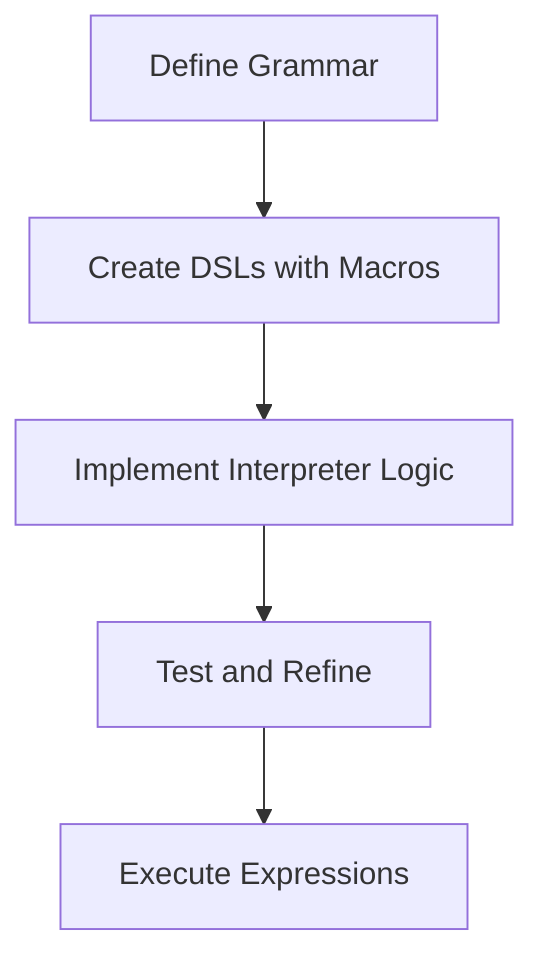

## 7.8. Interpreter Pattern using Macros and DSLs

The Interpreter Pattern is a powerful design pattern used to define a representation for a language's grammar and provide an interpreter to process and execute the language. In Elixir, this pattern can be effectively implemented using macros and Domain-Specific Languages (DSLs), allowing developers to create expressive and efficient code structures. This section will guide you through the concepts, implementation, and practical applications of the Interpreter Pattern in Elixir.

### Interpreting Languages

The Interpreter Pattern is primarily used to interpret and execute a language's grammar. It involves defining a set of rules and representations for the language's syntax and semantics. In Elixir, we can leverage macros and DSLs to create interpreters that are both powerful and flexible.

#### Key Concepts

- **Grammar Representation**: Define the syntax and rules of the language.
- **Interpreter**: Implement the logic to parse and execute the language.
- **DSLs**: Create domain-specific languages to simplify complex operations.

### Implementing the Interpreter Pattern

To implement the Interpreter Pattern in Elixir, we will use macros to define DSLs that can parse and execute code structures. Macros in Elixir allow us to transform abstract syntax trees (ASTs) at compile time, providing a powerful tool for creating interpreters.

#### Step-by-Step Implementation

1. **Define the Grammar**: Start by defining the grammar of the language you want to interpret. This involves specifying the syntax and semantics of the language.

2. **Create DSLs**: Use macros to create DSLs that represent the language's grammar. DSLs provide a way to express complex operations in a concise and readable manner.

3. **Implement the Interpreter**: Write the logic to parse and execute the DSLs. This involves transforming the DSLs into executable code and handling any necessary computations.

4. **Test and Refine**: Test the interpreter with various inputs to ensure it behaves as expected. Refine the DSLs and interpreter logic as needed.

#### Code Example

Let's walk through an example of implementing the Interpreter Pattern in Elixir to evaluate mathematical expressions.

```elixir
defmodule MathDSL do
  defmacro expr(do: block) do
    quote do
      unquote(block)
    end
  end

  defmacro add(a, b) do
    quote do
      unquote(a) + unquote(b)
    end
  end

  defmacro subtract(a, b) do
    quote do
      unquote(a) - unquote(b)
    end
  end

  defmacro multiply(a, b) do
    quote do
      unquote(a) * unquote(b)
    end
  end

  defmacro divide(a, b) do
    quote do
      unquote(a) / unquote(b)
    end
  end
end

import MathDSL

result = expr do
  add(10, multiply(2, 3))
end

IO.puts("Result: #{result}")
```

**Explanation**:
- **Grammar Definition**: We define a simple grammar for mathematical expressions using macros like `add`, `subtract`, `multiply`, and `divide`.
- **DSL Creation**: The `expr` macro allows us to write expressions in a concise manner.
- **Interpreter Logic**: Each macro transforms its arguments into Elixir code that performs the corresponding arithmetic operation.

### Visualizing the Interpreter Pattern

To better understand how the Interpreter Pattern works, let's visualize the process using a flowchart.


```mermaid
flowchart TD
    A[Define Grammar] --> B[Create DSLs with Macros]
    B --> C[Implement Interpreter Logic]
    C --> D[Test and Refine]
    D --> E[Execute Expressions]
```

**Diagram Explanation**:
- **Define Grammar**: Start by defining the language's grammar.
- **Create DSLs with Macros**: Use macros to create DSLs that represent the grammar.
- **Implement Interpreter Logic**: Write the logic to parse and execute the DSLs.
- **Test and Refine**: Test the interpreter and refine the DSLs as needed.
- **Execute Expressions**: Use the interpreter to execute expressions written in the DSL.

### Use Cases

The Interpreter Pattern is useful in various scenarios, including:

- **Configuration Languages**: Define custom configuration languages for applications.
- **Expression Evaluation**: Evaluate mathematical or logical expressions.
- **Scripting Languages**: Implement simple scripting languages for automation tasks.

### Design Considerations

When implementing the Interpreter Pattern in Elixir, consider the following:

- **Complexity**: Ensure the DSLs and interpreter logic are not overly complex.
- **Performance**: Optimize the interpreter for performance, especially for large inputs.
- **Maintainability**: Keep the DSLs and interpreter code maintainable and easy to understand.

### Elixir Unique Features

Elixir's macro system provides unique capabilities for implementing the Interpreter Pattern. Macros allow for compile-time code generation and transformation, enabling the creation of efficient and expressive DSLs.

### Differences and Similarities

The Interpreter Pattern in Elixir shares similarities with other functional languages but leverages Elixir's powerful macro system for DSL creation. Unlike object-oriented languages, Elixir's functional paradigm emphasizes immutability and pure functions, which can influence the design of interpreters.

### Try It Yourself

Now that we've explored the Interpreter Pattern, try modifying the code example to add support for additional operations, such as exponentiation or modulus. Experiment with creating more complex expressions and see how the interpreter handles them.

### Knowledge Check

- **Question**: What are the key components of the Interpreter Pattern?
- **Exercise**: Implement a DSL for a simple scripting language that supports conditional statements and loops.

### Summary

The Interpreter Pattern is a powerful tool for defining and executing custom languages. In Elixir, macros and DSLs provide a flexible and efficient way to implement interpreters. By understanding and applying the Interpreter Pattern, you can create expressive and maintainable code structures for a variety of applications.

## Quiz Time!



### What is the primary purpose of the Interpreter Pattern?

- [x] To define a representation for a language's grammar and provide an interpreter to process and execute the language.
- [ ] To optimize code execution speed.
- [ ] To convert high-level code into machine code.
- [ ] To manage memory allocation in applications.

> **Explanation:** The Interpreter Pattern is used to define a representation for a language's grammar and provide an interpreter to process and execute the language.

### Which Elixir feature is primarily used to implement the Interpreter Pattern?

- [x] Macros
- [ ] Structs
- [ ] Protocols
- [ ] GenServers

> **Explanation:** Macros in Elixir are used to implement the Interpreter Pattern by transforming abstract syntax trees at compile time.

### What is a DSL?

- [x] A Domain-Specific Language designed to simplify complex operations within a specific domain.
- [ ] A general-purpose programming language.
- [ ] A type of database query language.
- [ ] A scripting language for web development.

> **Explanation:** A DSL (Domain-Specific Language) is designed to simplify complex operations within a specific domain.

### What is the role of the `expr` macro in the provided code example?

- [x] To allow writing expressions in a concise manner.
- [ ] To handle error logging.
- [ ] To manage database connections.
- [ ] To define user interfaces.

> **Explanation:** The `expr` macro allows writing expressions in a concise manner by transforming them into executable Elixir code.

### Which of the following is a use case for the Interpreter Pattern?

- [x] Configuration languages
- [x] Expression evaluation
- [ ] Memory management
- [ ] Network communication

> **Explanation:** The Interpreter Pattern is commonly used for configuration languages and expression evaluation.

### What should be considered when implementing the Interpreter Pattern?

- [x] Complexity
- [x] Performance
- [x] Maintainability
- [ ] Color scheme

> **Explanation:** Complexity, performance, and maintainability are important considerations when implementing the Interpreter Pattern.

### What is the benefit of using macros in Elixir for the Interpreter Pattern?

- [x] Compile-time code generation and transformation
- [ ] Simplified error handling
- [ ] Enhanced user interface design
- [ ] Improved network communication

> **Explanation:** Macros in Elixir enable compile-time code generation and transformation, which is beneficial for implementing the Interpreter Pattern.

### Which of the following is NOT a key component of the Interpreter Pattern?

- [ ] Grammar Representation
- [ ] Interpreter
- [ ] DSLs
- [x] Database Schema

> **Explanation:** Database Schema is not a key component of the Interpreter Pattern; the pattern focuses on grammar representation, interpreters, and DSLs.

### True or False: The Interpreter Pattern can only be used in object-oriented languages.

- [ ] True
- [x] False

> **Explanation:** False. The Interpreter Pattern can be used in functional languages like Elixir, leveraging features like macros and DSLs.

### What is a common pitfall when creating DSLs with macros?

- [x] Overly complex DSLs
- [ ] Lack of color coding
- [ ] Insufficient database connections
- [ ] Poor network latency

> **Explanation:** A common pitfall when creating DSLs with macros is making them overly complex, which can lead to maintainability issues.



Remember, this is just the beginning. As you progress, you'll build more complex and interactive interpreters. Keep experimenting, stay curious, and enjoy the journey!
