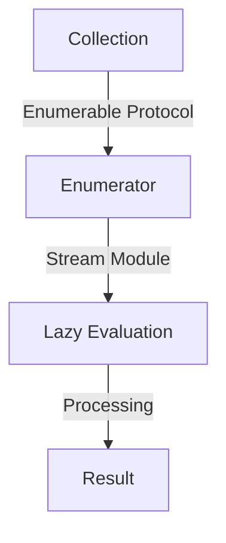

## 7.9. Iterator Pattern with Enumerables and Streams

In the realm of software design patterns, the Iterator Pattern is a fundamental concept that provides a way to access elements of an aggregate object sequentially without exposing its underlying representation. In Elixir, this pattern is elegantly implemented using the Enumerable protocol and the Stream module, which are integral to functional programming and data processing.

### Sequential Access to Elements

The Iterator Pattern is crucial for scenarios where you need to traverse a collection of elements without needing to know the details of its structure. This pattern is particularly useful in Elixir due to its functional nature and emphasis on immutability. By leveraging Enumerables and Streams, Elixir provides powerful tools for sequential access and manipulation of data.

#### Key Participants

- **Enumerable Protocol**: Defines a set of functions for traversing collections.
- **Stream Module**: Facilitates lazy evaluation and efficient data processing.
- **Collection**: The aggregate object whose elements are accessed sequentially.

### Implementing the Iterator Pattern

In Elixir, the Iterator Pattern is implemented using the Enumerable protocol and the Stream module. Let's explore how these components work together to provide efficient data processing capabilities.

#### The Enumerable Protocol

The Enumerable protocol is a cornerstone of Elixir's data processing capabilities. It defines a set of functions that allow collections to be traversed, filtered, and transformed. By implementing the Enumerable protocol, any data structure can be made iterable.

```elixir
defmodule MyList do
  defstruct [:elements]

  defimpl Enumerable do
    def count(%MyList{elements: elements}), do: {:ok, length(elements)}
    def member?(%MyList{elements: elements}, value), do: {:ok, Enum.member?(elements, value)}
    def reduce(%MyList{elements: elements}, acc, fun), do: Enum.reduce(elements, acc, fun)
  end
end
```

In this example, we define a custom data structure `MyList` and implement the Enumerable protocol for it. This allows us to use functions like `Enum.count/1`, `Enum.member?/2`, and `Enum.reduce/3` on instances of `MyList`.

#### The Stream Module

The Stream module in Elixir provides lazy enumeration, which means that elements are processed only as needed. This is particularly useful for handling large datasets or infinite sequences.

```elixir
stream = Stream.cycle([1, 2, 3])
Enum.take(stream, 10)
# Output: [1, 2, 3, 1, 2, 3, 1, 2, 3, 1]
```

In this example, `Stream.cycle/1` creates an infinite stream of the list `[1, 2, 3]`. The `Enum.take/2` function is used to take the first 10 elements from the stream.

### Use Cases

The Iterator Pattern, implemented through Enumerables and Streams, is highly applicable in various scenarios:

- **Data Processing**: Efficiently process large datasets by leveraging lazy evaluation.
- **Lazy Evaluation**: Defer computation until results are needed, optimizing performance.
- **Handling Large Datasets**: Manage memory usage by processing data incrementally.

#### Example: Processing a Large File

Consider a scenario where you need to process a large file line by line. Using Streams, you can achieve this efficiently without loading the entire file into memory.

```elixir
File.stream!("large_file.txt")
|> Stream.map(&String.trim/1)
|> Enum.each(&IO.puts/1)
```

In this example, `File.stream!/1` creates a stream of lines from the file. Each line is trimmed using `Stream.map/2`, and then printed to the console with `Enum.each/2`.

### Visualizing the Iterator Pattern

To better understand the flow of data processing using Enumerables and Streams, let's visualize the process:



**Figure 1**: Visual representation of the Iterator Pattern using Enumerables and Streams in Elixir.

### Design Considerations

When implementing the Iterator Pattern in Elixir, consider the following:

- **Performance**: Use Streams for lazy evaluation to optimize performance when dealing with large datasets.
- **Memory Usage**: Streams help manage memory by processing data incrementally.
- **Complexity**: Ensure that the implementation remains simple and maintainable.

### Elixir Unique Features

Elixir's unique features, such as immutability and concurrency, enhance the implementation of the Iterator Pattern:

- **Immutability**: Ensures that data remains consistent throughout processing.
- **Concurrency**: Allows for parallel processing of data, improving performance.

### Differences and Similarities

The Iterator Pattern in Elixir shares similarities with other functional languages but stands out due to its integration with the BEAM VM, which provides robust concurrency and fault tolerance.

### Try It Yourself

Experiment with the following code examples to deepen your understanding of the Iterator Pattern in Elixir:

1. Modify the `MyList` module to include additional Enumerable functions.
2. Create a stream that generates Fibonacci numbers and take the first 20 numbers.
3. Implement a custom data structure and make it enumerable.

### Knowledge Check

- What is the primary advantage of using Streams in Elixir?
- How does the Enumerable protocol facilitate data processing?
- Describe a scenario where lazy evaluation is beneficial.

### References and Links

- [Elixir's Enumerable Protocol](https://hexdocs.pm/elixir/Enumerable.html)
- [Elixir's Stream Module](https://hexdocs.pm/elixir/Stream.html)
- [Functional Programming Concepts](https://www.martinfowler.com/articles/functional-programming.html)

### Embrace the Journey

Remember, mastering the Iterator Pattern in Elixir is just the beginning. As you progress, you'll discover more advanced patterns and techniques that will enhance your ability to build scalable and efficient applications. Keep experimenting, stay curious, and enjoy the journey!

## Quiz: Iterator Pattern with Enumerables and Streams



### What is the primary purpose of the Iterator Pattern in Elixir?

- [x] To provide a way to access elements of an aggregate object sequentially.
- [ ] To modify elements of a collection in place.
- [ ] To sort elements of a collection.
- [ ] To transform a collection into a different data structure.

> **Explanation:** The Iterator Pattern is designed to provide sequential access to elements without exposing the underlying structure.

### How does the Stream module in Elixir enhance data processing?

- [x] By enabling lazy evaluation.
- [ ] By storing all data in memory.
- [ ] By immediately evaluating all elements.
- [ ] By converting data into a binary format.

> **Explanation:** The Stream module allows for lazy evaluation, meaning elements are processed only as needed, which is efficient for large datasets.

### Which protocol must be implemented to make a data structure enumerable in Elixir?

- [x] Enumerable
- [ ] Collectable
- [ ] Inspect
- [ ] Access

> **Explanation:** The Enumerable protocol defines the functions necessary for a data structure to be traversed and processed.

### What is a key benefit of using lazy evaluation with Streams?

- [x] Reduced memory usage
- [ ] Faster computation of all elements
- [ ] Immediate transformation of data
- [ ] Increased complexity

> **Explanation:** Lazy evaluation processes data incrementally, reducing memory usage and improving efficiency.

### What function is used to create an infinite stream in Elixir?

- [x] Stream.cycle/1
- [ ] Enum.map/2
- [ ] List.flatten/1
- [ ] File.stream!/1

> **Explanation:** Stream.cycle/1 creates an infinite stream by cycling through the given list.

### True or False: The Enumerable protocol can only be implemented for built-in data structures.

- [ ] True
- [x] False

> **Explanation:** The Enumerable protocol can be implemented for any custom data structure, allowing it to be traversed like built-in collections.

### Which function is used to take a specified number of elements from a stream?

- [x] Enum.take/2
- [ ] Stream.map/2
- [ ] List.first/1
- [ ] Enum.reduce/3

> **Explanation:** Enum.take/2 is used to retrieve a specified number of elements from a stream or collection.

### What is the role of the `reduce` function in the Enumerable protocol?

- [x] To process each element and accumulate a result.
- [ ] To filter elements based on a condition.
- [ ] To sort elements in ascending order.
- [ ] To convert elements into strings.

> **Explanation:** The `reduce` function processes each element and accumulates a result, which is a core operation in functional programming.

### How can you make a custom data structure iterable in Elixir?

- [x] By implementing the Enumerable protocol.
- [ ] By using the Stream module.
- [ ] By defining a `to_list` function.
- [ ] By converting it to a list.

> **Explanation:** Implementing the Enumerable protocol allows a custom data structure to be traversed and processed like built-in collections.

### True or False: Streams in Elixir are always finite.

- [ ] True
- [x] False

> **Explanation:** Streams can be infinite, as demonstrated by functions like Stream.cycle/1, which create infinite sequences.


