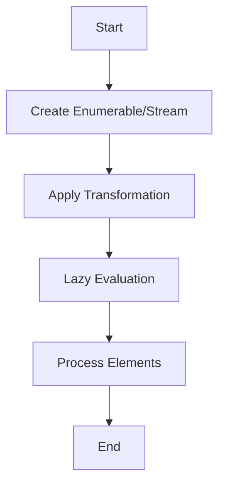

## 7.9. Iterator Pattern with Enumerables and Streams

In this section, we delve into the Iterator Pattern in Elixir, leveraging the power of Enumerables and Streams. This pattern is essential for providing a way to access elements of an aggregate object sequentially without exposing its underlying representation. Elixir's functional programming paradigm, combined with its powerful concurrency model, makes it an ideal language to implement this pattern efficiently.

### Sequential Access to Elements

The Iterator Pattern is a behavioral design pattern that allows sequential access to elements in a collection without exposing the underlying structure. This pattern is particularly useful when dealing with complex data structures or when you want to decouple the iteration logic from the collection itself.

In Elixir, the Iterator Pattern is naturally supported through the `Enumerable` protocol and the `Stream` module. These tools provide a consistent interface for traversing collections, enabling developers to process data in a clean and efficient manner.

### Implementing the Iterator Pattern

#### Utilizing the Enumerable Protocol

The `Enumerable` protocol in Elixir is a powerful abstraction that provides a set of functions for iterating over collections. It is implemented by various data structures such as lists, maps, and ranges. Let's explore how to implement the Iterator Pattern using the `Enumerable` protocol.

```elixir
defmodule MyList do
  defstruct [:elements]

  defimpl Enumerable do
    def count(%MyList{elements: elements}) do
      {:ok, length(elements)}
    end

    def member?(%MyList{elements: elements}, value) do
      {:ok, Enum.member?(elements, value)}
    end

    def reduce(%MyList{elements: elements}, acc, fun) do
      Enum.reduce(elements, acc, fun)
    end
  end
end

# Usage
my_list = %MyList{elements: [1, 2, 3, 4, 5]}
Enum.each(my_list, fn x -> IO.puts(x) end)
```

**Explanation:**

- **Defining a Custom Struct**: We define a `MyList` struct to hold our elements.
- **Implementing the Enumerable Protocol**: We implement the `Enumerable` protocol for our struct, providing custom implementations for `count/1`, `member?/2`, and `reduce/3`.
- **Using Enum Functions**: Once the protocol is implemented, we can use all the functions from the `Enum` module on our custom struct.

#### Leveraging the Stream Module

The `Stream` module in Elixir allows for lazy enumeration of collections. This means that elements are processed on-demand, which is particularly useful for handling large datasets or infinite sequences.

```elixir
# Creating a stream of numbers
stream = Stream.iterate(0, &(&1 + 1))

# Taking the first 10 numbers and printing them
stream
|> Stream.take(10)
|> Enum.each(&IO.puts/1)
```

**Explanation:**

- **Stream Creation**: We create an infinite stream of numbers starting from 0.
- **Lazy Evaluation**: Using `Stream.take/2`, we lazily take the first 10 numbers.
- **Processing with Enum**: The `Enum.each/2` function is used to print each number.

### Use Cases

#### Data Processing

The Iterator Pattern is ideal for data processing tasks where you need to traverse and manipulate collections. By using Enumerables and Streams, you can efficiently process data in a functional manner.

```elixir
# Filtering even numbers and squaring them
1..100
|> Stream.filter(&rem(&1, 2) == 0)
|> Stream.map(&(&1 * &1))
|> Enum.to_list()
```

#### Lazy Evaluation

Lazy evaluation is a key feature of the Iterator Pattern in Elixir. It allows you to defer computation until it is necessary, which can lead to performance improvements, especially when dealing with large datasets.

```elixir
# Infinite stream of Fibonacci numbers
fibonacci = Stream.unfold({0, 1}, fn {a, b} -> {a, {b, a + b}} end)

# Taking the first 10 Fibonacci numbers
fibonacci
|> Stream.take(10)
|> Enum.to_list()
```

#### Handling Large Datasets

When working with large datasets, it is crucial to minimize memory usage and processing time. The Iterator Pattern, combined with Streams, enables you to process data incrementally, reducing the memory footprint.

```elixir
# Simulating a large dataset
large_dataset = 1..1_000_000

# Processing the dataset in chunks
large_dataset
|> Stream.chunk_every(1000)
|> Stream.map(&Enum.sum/1)
|> Enum.to_list()
```

### Visualizing the Iterator Pattern

To better understand the flow of the Iterator Pattern using Enumerables and Streams, let's visualize it with a Mermaid.js diagram.


```mermaid
flowchart TD
    A[Start] --> B[Create Enumerable/Stream]
    B --> C[Apply Transformation]
    C --> D[Lazy Evaluation]
    D --> E[Process Elements]
    E --> F[End]
```

**Diagram Explanation:**

- **Start**: Begin by creating an Enumerable or Stream.
- **Transformation**: Apply any necessary transformations or filters.
- **Lazy Evaluation**: Utilize lazy evaluation to defer computation.
- **Process Elements**: Process each element as needed.
- **End**: Complete the iteration process.

### Elixir Unique Features

Elixir's unique features, such as its powerful concurrency model and robust standard library, make it particularly well-suited for implementing the Iterator Pattern. The language's emphasis on immutability and functional programming ensures that data processing is both safe and efficient.

### Differences and Similarities

The Iterator Pattern in Elixir differs from traditional object-oriented implementations in that it leverages functional constructs like Enumerables and Streams. While object-oriented languages often rely on explicit iterator objects, Elixir's approach is more declarative, focusing on transformations and compositions.

### Design Considerations

When implementing the Iterator Pattern in Elixir, consider the following:

- **Performance**: Use Streams for lazy evaluation to improve performance when dealing with large datasets.
- **Memory Usage**: Streams help reduce memory usage by processing elements on-demand.
- **Complexity**: Keep the iteration logic simple and declarative to maintain readability and maintainability.

### Try It Yourself

To gain a deeper understanding of the Iterator Pattern in Elixir, try modifying the code examples provided. Experiment with different transformations, filters, and data structures. Consider creating custom Enumerables for your specific use cases.

### Knowledge Check

- How does the `Enumerable` protocol facilitate the Iterator Pattern in Elixir?
- What are the benefits of using Streams for lazy evaluation?
- How can the Iterator Pattern be used to handle large datasets efficiently?

### Embrace the Journey

Remember, mastering the Iterator Pattern in Elixir is just the beginning. As you continue to explore the language, you'll discover even more powerful ways to process data and build efficient applications. Keep experimenting, stay curious, and enjoy the journey!

## Quiz Time!



### What is the primary purpose of the Iterator Pattern?

- [x] To provide a way to access elements of an aggregate object sequentially.
- [ ] To modify elements of an aggregate object.
- [ ] To delete elements from an aggregate object.
- [ ] To create a new aggregate object.

> **Explanation:** The Iterator Pattern is designed to provide a way to access elements of an aggregate object sequentially without exposing its underlying representation.

### Which Elixir module is primarily used for lazy enumeration?

- [ ] Enumerable
- [x] Stream
- [ ] Enum
- [ ] Kernel

> **Explanation:** The `Stream` module in Elixir is used for lazy enumeration, allowing elements to be processed on-demand.

### How does the `Enumerable` protocol enhance data processing in Elixir?

- [x] By providing a consistent interface for traversing collections.
- [ ] By modifying the underlying data structure.
- [ ] By creating new data structures.
- [ ] By deleting elements from collections.

> **Explanation:** The `Enumerable` protocol provides a consistent interface for traversing collections, enabling efficient data processing.

### What is a key benefit of using lazy evaluation with Streams?

- [x] It reduces memory usage by processing elements on-demand.
- [ ] It increases memory usage by storing all elements.
- [ ] It speeds up computation by processing all elements at once.
- [ ] It simplifies the code by removing all transformations.

> **Explanation:** Lazy evaluation with Streams reduces memory usage by processing elements on-demand, which is particularly beneficial for large datasets.

### In which scenario is the Iterator Pattern particularly useful?

- [x] When dealing with complex data structures.
- [ ] When modifying elements in place.
- [ ] When deleting elements from a collection.
- [ ] When creating new collections from scratch.

> **Explanation:** The Iterator Pattern is particularly useful when dealing with complex data structures, as it allows for sequential access without exposing the underlying representation.

### What is the role of the `reduce/3` function in the `Enumerable` protocol?

- [x] To accumulate values across a collection.
- [ ] To filter elements in a collection.
- [ ] To map elements to new values.
- [ ] To delete elements from a collection.

> **Explanation:** The `reduce/3` function in the `Enumerable` protocol is used to accumulate values across a collection, applying a function to each element.

### How can you create an infinite sequence in Elixir?

- [x] By using `Stream.iterate/2`.
- [ ] By using `Enum.map/2`.
- [ ] By using `List.duplicate/2`.
- [ ] By using `Kernel.spawn/1`.

> **Explanation:** `Stream.iterate/2` can be used to create an infinite sequence in Elixir, generating elements based on a function.

### What is a common use case for the Iterator Pattern in Elixir?

- [x] Data processing and transformation.
- [ ] Modifying elements in place.
- [ ] Deleting elements from collections.
- [ ] Creating new collections from scratch.

> **Explanation:** A common use case for the Iterator Pattern in Elixir is data processing and transformation, leveraging Enumerables and Streams.

### How does Elixir's functional programming paradigm support the Iterator Pattern?

- [x] By emphasizing immutability and function composition.
- [ ] By allowing mutable state and side effects.
- [ ] By focusing on object-oriented principles.
- [ ] By encouraging global variables and shared state.

> **Explanation:** Elixir's functional programming paradigm supports the Iterator Pattern by emphasizing immutability and function composition, allowing for clean and efficient data processing.

### True or False: Streams in Elixir always evaluate all elements immediately.

- [ ] True
- [x] False

> **Explanation:** False. Streams in Elixir are lazy and do not evaluate elements until necessary, allowing for efficient processing of large datasets.


