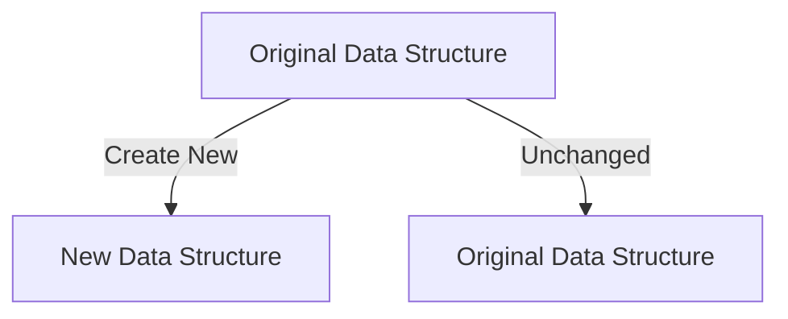

## 8.1. Immutability and Its Implications

In the realm of functional programming, immutability is a cornerstone concept that fundamentally influences how we design and implement software. Elixir, as a functional language, embraces immutability to enhance code reliability, simplify reasoning, and improve concurrency. In this section, we will delve into the concept of immutability, explore its implications, and demonstrate how it can be effectively utilized in Elixir.

### Understanding Immutability

Immutability refers to the inability to change data after it has been created. In Elixir, once a data structure is created, it cannot be modified. Instead, any operation that appears to change a data structure actually returns a new data structure with the desired modifications, leaving the original unchanged.

#### Immutable Data Structures

Elixir provides a variety of immutable data structures, including lists, tuples, maps, and structs. These data structures are designed to be efficient and performant, even when dealing with large datasets.

```elixir
# Example of an immutable list in Elixir
list = [1, 2, 3]
new_list = [0 | list]  # Prepending an element to the list

IO.inspect(list)      # Output: [1, 2, 3]
IO.inspect(new_list)  # Output: [0, 1, 2, 3]
```

In the example above, `list` remains unchanged after `new_list` is created. This immutability ensures that data is consistent and predictable throughout the program.

### Benefits of Immutability

Immutability offers several advantages that make it a preferred choice in functional programming:

1. **Simplified Reasoning**: Since data cannot change, the state of the program is more predictable. This makes it easier to understand and reason about the code.

2. **Concurrency Safety**: Immutability eliminates the risks associated with shared mutable state, making concurrent programming safer and more straightforward.

3. **Ease of Debugging**: With immutable data, you can be confident that data has not been altered unexpectedly, reducing the complexity of debugging.

4. **Functional Purity**: Immutability aligns with the principles of functional programming, promoting pure functions that have no side effects.

### Strategies for Embracing Immutability

To fully leverage immutability in Elixir, consider the following strategies:

#### Using Immutable Collections

Elixir's standard library provides a rich set of immutable collections that can be used to store and manipulate data without altering the original structures.

```elixir
# Example of using an immutable map
map = %{name: "Alice", age: 30}
updated_map = Map.put(map, :age, 31)

IO.inspect(map)         # Output: %{name: "Alice", age: 30}
IO.inspect(updated_map) # Output: %{name: "Alice", age: 31}
```

In this example, `Map.put/3` returns a new map with the updated age, leaving the original `map` unchanged.

#### Avoiding Side-Effects

Side-effects occur when a function modifies some state outside its scope or interacts with the outside world. To maintain immutability, functions should avoid side-effects and instead return new data structures.

```elixir
# Function with no side-effects
defmodule Calculator do
  def add(a, b), do: a + b
end

result = Calculator.add(5, 3)
IO.inspect(result)  # Output: 8
```

By ensuring that functions do not alter external state, we can maintain the integrity of our data and the predictability of our code.

### Visualizing Immutability

To better understand how immutability works in Elixir, let's visualize the process of updating an immutable data structure using a diagram.



In this diagram, the original data structure remains unchanged, while a new data structure is created to reflect any updates. This visual representation highlights the core principle of immutability: data is never altered, only copied and modified.

### Implications of Immutability

The implications of immutability extend beyond code reliability and concurrency. They influence how we design systems, interact with data, and structure our applications.

#### Designing with Immutability

When designing systems with immutability in mind, consider the following:

- **Data Flow**: Design your application to pass data through functions rather than relying on shared state.
- **State Management**: Use immutable data structures to manage state, ensuring that changes are explicit and controlled.
- **Concurrency Models**: Leverage Elixir's concurrency model, which naturally aligns with immutability, to build scalable and fault-tolerant systems.

#### Interacting with Immutable Data

Working with immutable data requires a shift in mindset. Instead of thinking about changing data, focus on transforming it through a series of operations.

```elixir
# Transforming data with pipelines
data = [1, 2, 3, 4, 5]
transformed_data = data
|> Enum.map(&(&1 * 2))
|> Enum.filter(&(&1 > 5))

IO.inspect(transformed_data)  # Output: [6, 8, 10]
```

In this example, we use the pipeline operator (`|>`) to transform the data through a series of operations, resulting in a new list.

### Try It Yourself

To deepen your understanding of immutability, try modifying the code examples provided. Experiment with different data structures and operations to see how immutability affects the behavior of your code.

- **Challenge**: Create a function that takes a list of numbers and returns a new list with each number squared, without modifying the original list.
- **Experiment**: Modify the `Calculator` module to include a function that multiplies two numbers, ensuring it remains free of side-effects.

### References and Further Reading

- [Elixir Documentation](https://elixir-lang.org/docs.html)
- [Functional Programming Principles](https://www.manning.com/books/functional-programming-in-scala)
- [Concurrency in Elixir](https://pragprog.com/titles/elixir16/programming-elixir-1-6/)

### Knowledge Check

To reinforce your understanding of immutability, consider the following questions:

1. What is immutability, and why is it important in functional programming?
2. How does immutability enhance concurrency safety in Elixir?
3. What are some strategies for embracing immutability in your code?
4. How can you transform data in Elixir without altering the original data structures?

### Embrace the Journey

Remember, immutability is a powerful concept that can transform the way you write and reason about code. As you continue to explore Elixir and functional programming, keep experimenting with immutable data structures and embrace the benefits they offer. Stay curious, and enjoy the journey of building reliable and scalable systems with Elixir!

## Quiz: Immutability and Its Implications



### What is immutability in Elixir?

- [x] Data cannot be altered after creation.
- [ ] Data can be altered after creation.
- [ ] Data is always mutable.
- [ ] Data is stored in a database.

> **Explanation:** Immutability means that once data is created, it cannot be changed. Any modifications result in a new data structure.

### How does immutability benefit concurrency?

- [x] It eliminates risks associated with shared mutable state.
- [ ] It allows data to be changed concurrently.
- [ ] It requires locking mechanisms for data access.
- [ ] It complicates concurrent programming.

> **Explanation:** Immutability ensures that data cannot be altered, eliminating issues with shared mutable state and making concurrent programming safer.

### Which Elixir data structure is immutable?

- [x] List
- [ ] GenServer
- [ ] ETS Table
- [ ] Process

> **Explanation:** Lists in Elixir are immutable, meaning they cannot be changed after creation.

### What does the `Map.put/3` function do?

- [x] Returns a new map with the updated key-value pair.
- [ ] Modifies the original map in place.
- [ ] Deletes a key-value pair from the map.
- [ ] Returns the original map unchanged.

> **Explanation:** `Map.put/3` returns a new map with the specified key-value pair updated, leaving the original map unchanged.

### What is a side-effect in functional programming?

- [x] A function modifies some state outside its scope.
- [ ] A function returns a value.
- [ ] A function has no return value.
- [ ] A function is called multiple times.

> **Explanation:** A side-effect occurs when a function modifies some state outside its scope or interacts with the outside world.

### How can you transform data in Elixir?

- [x] Using pipelines and functions like `Enum.map`.
- [ ] By directly modifying the original data structure.
- [ ] By using mutable variables.
- [ ] By altering the data in a database.

> **Explanation:** Data in Elixir can be transformed using pipelines and functions like `Enum.map`, which return new data structures.

### What is the pipeline operator (`|>`) used for?

- [x] To pass the result of one function as the argument to the next.
- [ ] To create new processes.
- [ ] To modify data in place.
- [ ] To handle errors in functions.

> **Explanation:** The pipeline operator (`|>`) is used to pass the result of one function as the argument to the next, facilitating data transformation.

### Why is immutability important for debugging?

- [x] It ensures data has not been altered unexpectedly.
- [ ] It allows data to be changed during debugging.
- [ ] It complicates the debugging process.
- [ ] It requires more complex debugging tools.

> **Explanation:** Immutability ensures that data has not been altered unexpectedly, reducing the complexity of debugging.

### What is a pure function?

- [x] A function with no side-effects.
- [ ] A function that modifies global state.
- [ ] A function that interacts with a database.
- [ ] A function that changes its input data.

> **Explanation:** A pure function is one that has no side-effects and does not modify any state outside its scope.

### Immutability aligns with which programming paradigm?

- [x] Functional programming
- [ ] Object-oriented programming
- [ ] Procedural programming
- [ ] Imperative programming

> **Explanation:** Immutability aligns with the principles of functional programming, promoting pure functions and data consistency.




