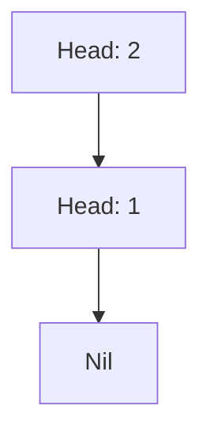
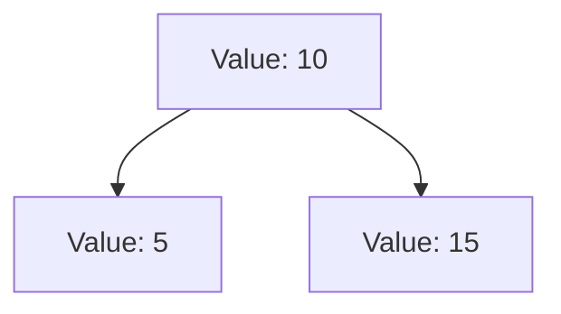

## 8.10. Functional Data Structures

Functional data structures are a cornerstone of functional programming, offering a way to manage data that aligns with the principles of immutability and pure functions. In Elixir, these structures are particularly powerful due to the language's emphasis on concurrency and fault tolerance. In this section, we will delve into the world of functional data structures, focusing on persistent data structures, their benefits, and practical examples in Elixir.

### Introduction to Functional Data Structures

Functional data structures are designed to work seamlessly with the functional programming paradigm. Unlike traditional data structures, which often rely on mutable state, functional data structures are immutable. This means that once a data structure is created, it cannot be changed. Instead, any operation that would modify the data structure results in a new data structure being created.

#### Persistent Data Structures

Persistent data structures are a type of functional data structure that preserves previous versions of the data structure when it is modified. This is achieved through a technique called structural sharing, where unchanged parts of the data structure are reused in the new version. This allows for efficient memory usage and ensures that previous versions remain accessible.

**Examples of Persistent Data Structures:**

- **Linked Lists**: A simple yet powerful data structure that can be easily implemented in a functional style.
- **Immutable Trees**: Trees where nodes are immutable, allowing for efficient updates and queries.
- **Functional Queues**: Queues that maintain immutability while providing efficient enqueue and dequeue operations.

### Benefits of Functional Data Structures

Functional data structures offer several benefits, particularly in a concurrent programming environment like Elixir:

- **Safe Sharing Across Processes**: Since data structures are immutable, they can be safely shared between processes without the risk of data races or corruption.
- **Ease of Reasoning**: Immutability simplifies reasoning about code, as data does not change unexpectedly.
- **Concurrency**: Functional data structures naturally support concurrent operations, as there is no need for locks or synchronization mechanisms.
- **Fault Tolerance**: In systems like those built with Elixir, where fault tolerance is critical, functional data structures help ensure that state remains consistent even in the face of errors.

### Implementing Functional Data Structures in Elixir

Let's explore how to implement some common functional data structures in Elixir, focusing on their unique characteristics and benefits.

#### Linked Lists

Linked lists are a fundamental data structure in functional programming. In Elixir, they are often represented using tuples and lists.

```elixir
# Define a simple linked list
defmodule LinkedList do
  defstruct [:head, :tail]

  # Create a new linked list
  def new(head, tail \\ nil) do
    %LinkedList{head: head, tail: tail}
  end

  # Add an element to the front of the list
  def cons(element, list) do
    %LinkedList{head: element, tail: list}
  end

  # Get the head of the list
  def head(%LinkedList{head: head}), do: head

  # Get the tail of the list
  def tail(%LinkedList{tail: tail}), do: tail
end

# Usage
list = LinkedList.new(1)
list = LinkedList.cons(2, list)
IO.inspect(LinkedList.head(list)) # Output: 2
IO.inspect(LinkedList.tail(list)) # Output: %LinkedList{head: 1, tail: nil}
```

In this example, we define a simple linked list using a struct. The `cons` function adds an element to the front of the list, demonstrating how immutability is maintained by creating a new list rather than modifying the existing one.

#### Immutable Trees

Trees are another common data structure that can be implemented in a functional style. In Elixir, we can use structs to represent nodes and maintain immutability.

```elixir
# Define a binary tree node
defmodule TreeNode do
  defstruct [:value, :left, :right]

  # Create a new tree node
  def new(value, left \\ nil, right \\ nil) do
    %TreeNode{value: value, left: left, right: right}
  end

  # Insert a value into the tree
  def insert(nil, value), do: new(value)
  def insert(%TreeNode{value: v, left: l, right: r} = node, value) when value < v do
    %TreeNode{node | left: insert(l, value)}
  end
  def insert(%TreeNode{value: v, left: l, right: r} = node, value) when value > v do
    %TreeNode{node | right: insert(r, value)}
  end
end

# Usage
tree = TreeNode.new(10)
tree = TreeNode.insert(tree, 5)
tree = TreeNode.insert(tree, 15)
IO.inspect(tree)
```

This example demonstrates a simple binary tree where each node is immutable. The `insert` function creates a new tree with the inserted value, leveraging structural sharing to maintain efficiency.

#### Functional Queues

Queues in functional programming can be implemented using two lists: one for the front of the queue and one for the back. This allows for efficient enqueue and dequeue operations.

```elixir
# Define a functional queue
defmodule FunctionalQueue do
  defstruct [:front, :back]

  # Create a new queue
  def new(), do: %FunctionalQueue{front: [], back: []}

  # Enqueue an element
  def enqueue(%FunctionalQueue{front: f, back: b}, element) do
    %FunctionalQueue{front: f, back: [element | b]}
  end

  # Dequeue an element
  def dequeue(%FunctionalQueue{front: [], back: []}), do: {:error, :empty}
  def dequeue(%FunctionalQueue{front: [], back: b}) do
    [h | t] = Enum.reverse(b)
    {h, %FunctionalQueue{front: t, back: []}}
  end
  def dequeue(%FunctionalQueue{front: [h | t], back: b}) do
    {h, %FunctionalQueue{front: t, back: b}}
  end
end

# Usage
queue = FunctionalQueue.new()
queue = FunctionalQueue.enqueue(queue, 1)
queue = FunctionalQueue.enqueue(queue, 2)
{element, queue} = FunctionalQueue.dequeue(queue)
IO.inspect(element) # Output: 1
```

In this implementation, the queue maintains immutability by creating new versions of itself for each operation. The use of two lists allows for efficient operations without sacrificing immutability.

### Visualizing Functional Data Structures

To better understand how functional data structures work, let's visualize a simple linked list and a binary tree.

#### Linked List Visualization



**Caption:** This diagram represents a simple linked list with two elements, 2 and 1. The list is immutable, and each node points to the next.

#### Binary Tree Visualization



**Caption:** This diagram illustrates a binary tree with a root node value of 10, and two child nodes with values 5 and 15. The tree is immutable, and each node is a separate struct.

### Elixir's Unique Features for Functional Data Structures

Elixir provides several unique features that enhance the use of functional data structures:

- **Pattern Matching**: Elixir's pattern matching capabilities make it easy to deconstruct and manipulate data structures.
- **Immutable Data**: By default, data in Elixir is immutable, aligning perfectly with the principles of functional data structures.
- **Concurrency Support**: Elixir's lightweight processes and message-passing model allow for safe concurrent operations on immutable data structures.

### Differences and Similarities with Other Languages

Functional data structures in Elixir share similarities with those in other functional languages like Haskell and Scala. However, Elixir's focus on concurrency and fault tolerance sets it apart, making these structures particularly well-suited for building robust, scalable systems.

### Design Considerations

When using functional data structures in Elixir, consider the following:

- **Memory Usage**: While structural sharing helps reduce memory usage, be mindful of the potential overhead of creating new data structures.
- **Performance**: Functional data structures can be less performant than their mutable counterparts in certain scenarios. Evaluate the trade-offs based on your application's requirements.
- **Complexity**: Ensure that the use of functional data structures simplifies your code rather than complicating it.

### Try It Yourself

Experiment with the code examples provided by modifying them to suit different use cases. For instance, try implementing a functional stack or a priority queue using similar principles. This hands-on approach will deepen your understanding of functional data structures and their applications in Elixir.

### Knowledge Check

- What are the key benefits of using functional data structures in Elixir?
- How does structural sharing contribute to the efficiency of persistent data structures?
- Implement a functional stack in Elixir using the principles discussed.

### Conclusion

Functional data structures are a powerful tool in the Elixir programmer's toolkit, offering a way to manage data that aligns with the language's emphasis on immutability and concurrency. By understanding and leveraging these structures, you can build more robust, scalable, and maintainable systems.

Remember, this is just the beginning. As you progress, you'll discover more complex data structures and patterns that can further enhance your Elixir applications. Keep experimenting, stay curious, and enjoy the journey!

## Quiz: Functional Data Structures



### What is a key characteristic of functional data structures?

- [x] Immutability
- [ ] Mutability
- [ ] In-place modification
- [ ] Dynamic typing

> **Explanation:** Functional data structures are immutable, meaning they cannot be changed once created.

### How do persistent data structures maintain efficiency?

- [x] Structural sharing
- [ ] Copying entire structures
- [ ] Using mutable state
- [ ] Dynamic typing

> **Explanation:** Persistent data structures use structural sharing to reuse unchanged parts, maintaining efficiency.

### What is a common example of a functional data structure?

- [x] Linked list
- [ ] Array
- [ ] Hash table
- [ ] Stack

> **Explanation:** Linked lists are a common example of functional data structures, often used in functional programming.

### What Elixir feature aids in deconstructing data structures?

- [x] Pattern matching
- [ ] Mutable state
- [ ] Dynamic typing
- [ ] Inheritance

> **Explanation:** Pattern matching in Elixir allows for easy deconstruction and manipulation of data structures.

### What is a benefit of using functional data structures in concurrent environments?

- [x] Safe sharing across processes
- [ ] Increased complexity
- [ ] Mutable state
- [ ] In-place modification

> **Explanation:** Functional data structures are immutable, allowing for safe sharing across processes without data races.

### What is a potential drawback of functional data structures?

- [x] Memory overhead
- [ ] In-place modification
- [ ] Mutable state
- [ ] Dynamic typing

> **Explanation:** Functional data structures can have memory overhead due to the creation of new structures.

### How can you efficiently implement a queue in a functional style?

- [x] Using two lists
- [ ] Using a single array
- [ ] Using mutable state
- [ ] Using dynamic typing

> **Explanation:** A functional queue can be efficiently implemented using two lists, one for the front and one for the back.

### What is a unique feature of Elixir that enhances functional data structures?

- [x] Concurrency support
- [ ] Mutable state
- [ ] Dynamic typing
- [ ] Inheritance

> **Explanation:** Elixir's concurrency support allows for safe concurrent operations on immutable data structures.

### What is a design consideration when using functional data structures?

- [x] Memory usage
- [ ] In-place modification
- [ ] Mutable state
- [ ] Dynamic typing

> **Explanation:** Consider the memory usage and potential overhead when using functional data structures.

### True or False: Functional data structures in Elixir are mutable.

- [ ] True
- [x] False

> **Explanation:** Functional data structures in Elixir are immutable, meaning they cannot be changed once created.


