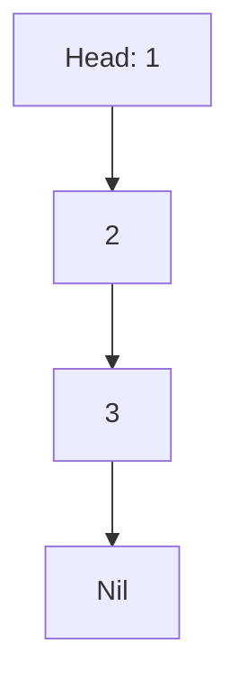
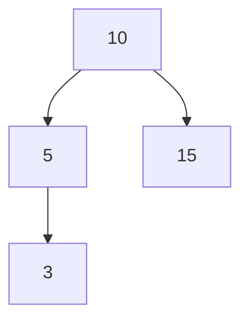

## 8.10. Functional Data Structures

In the realm of functional programming, data structures play a pivotal role in how we manage and manipulate data. Unlike imperative programming, where data structures are often mutable, functional programming emphasizes immutability and persistence. In this section, we will delve into functional data structures, focusing on their design, benefits, and implementation in Elixir. We'll explore persistent data structures, such as linked lists, immutable trees, and functional queues, and understand how they facilitate safe sharing across processes and ease of reasoning.

### Introduction to Functional Data Structures

Functional data structures are designed to work seamlessly with the principles of functional programming. They are immutable by nature, meaning once a data structure is created, it cannot be changed. Instead of modifying data, we create new data structures that reflect the desired changes. This immutability is crucial for enabling safe concurrency and simplifying reasoning about code.

#### Persistent Data Structures

Persistent data structures are a subset of functional data structures that preserve previous versions of themselves after modifications. This means that any update operation on a persistent data structure results in a new version of the data structure, while the old version remains intact and accessible. This is particularly useful in functional programming, where immutability is a core principle.

**Examples of Persistent Data Structures:**

- **Linked Lists**: A simple yet powerful data structure that allows for efficient sequential access and updates.
- **Immutable Trees**: Trees that maintain their structure across updates, often used in scenarios requiring hierarchical data representation.
- **Functional Queues**: Queues that allow for efficient insertion and removal operations without mutating the underlying structure.

#### Benefits of Functional Data Structures

1. **Safe Sharing Across Processes**: Immutability ensures that data can be shared safely across concurrent processes without the risk of race conditions or data corruption.
2. **Ease of Reasoning**: With immutable data structures, the state of the data remains consistent throughout its lifecycle, simplifying reasoning and debugging.
3. **Efficient Data Manipulation**: Functional data structures often provide efficient algorithms for common operations, leveraging immutability to optimize performance.

### Linked Lists in Elixir

Linked lists are a fundamental data structure in functional programming. In Elixir, linked lists are implemented as a series of cons cells, where each cell contains a value and a reference to the next cell. This structure allows for efficient head operations, such as insertion and removal.

#### Implementing Linked Lists

Let's explore how to implement a basic linked list in Elixir:

```elixir
defmodule LinkedList do
  defstruct head: nil, tail: nil

  # Creates a new linked list
  def new(), do: %LinkedList{}

  # Adds an element to the head of the list
  def add_head(%LinkedList{head: head} = list, value) do
    %LinkedList{list | head: {value, head}}
  end

  # Removes the head element from the list
  def remove_head(%LinkedList{head: {_, tail}} = list) do
    %LinkedList{list | head: tail}
  end

  # Converts the linked list to a regular list
  def to_list(%LinkedList{head: nil}), do: []
  def to_list(%LinkedList{head: {value, tail}}) do
    [value | to_list(%LinkedList{head: tail})]
  end
end

# Usage
list = LinkedList.new()
|> LinkedList.add_head(3)
|> LinkedList.add_head(2)
|> LinkedList.add_head(1)

IO.inspect(LinkedList.to_list(list))  # Output: [1, 2, 3]
```

In this example, we define a `LinkedList` module with functions to create a new list, add an element to the head, remove the head element, and convert the linked list to a standard Elixir list.

### Immutable Trees

Trees are versatile data structures used to represent hierarchical data. In functional programming, trees are often immutable, meaning any modification results in a new tree while preserving the original.

#### Implementing Immutable Trees

Consider the implementation of a simple binary tree in Elixir:

```elixir
defmodule BinaryTree do
  defstruct value: nil, left: nil, right: nil

  # Creates a new binary tree
  def new(value), do: %BinaryTree{value: value}

  # Inserts a value into the binary tree
  def insert(nil, value), do: new(value)
  def insert(%BinaryTree{value: v, left: left, right: right} = tree, value) do
    cond do
      value < v -> %BinaryTree{tree | left: insert(left, value)}
      value > v -> %BinaryTree{tree | right: insert(right, value)}
      true -> tree  # Value already exists, do nothing
    end
  end

  # Traverses the tree in order
  def inorder(nil), do: []
  def inorder(%BinaryTree{value: value, left: left, right: right}) do
    inorder(left) ++ [value] ++ inorder(right)
  end
end

# Usage
tree = BinaryTree.new(10)
|> BinaryTree.insert(5)
|> BinaryTree.insert(15)
|> BinaryTree.insert(3)

IO.inspect(BinaryTree.inorder(tree))  # Output: [3, 5, 10, 15]
```

In this example, we define a `BinaryTree` module with functions to create a new tree, insert values, and perform an in-order traversal. Each insertion creates a new version of the tree, preserving immutability.

### Functional Queues

Queues are data structures that follow the First-In-First-Out (FIFO) principle. In functional programming, queues are implemented in a way that allows efficient operations without mutating the underlying structure.

#### Implementing Functional Queues

Here's how you can implement a functional queue in Elixir:

```elixir
defmodule FunctionalQueue do
  defstruct front: [], back: []

  # Creates a new queue
  def new(), do: %FunctionalQueue{}

  # Enqueues an element
  def enqueue(%FunctionalQueue{front: front, back: back} = queue, value) do
    %FunctionalQueue{queue | back: [value | back]}
  end

  # Dequeues an element
  def dequeue(%FunctionalQueue{front: [], back: []}), do: {:error, :empty_queue}
  def dequeue(%FunctionalQueue{front: [], back: back}) do
    [h | t] = Enum.reverse(back)
    {:ok, h, %FunctionalQueue{front: t, back: []}}
  end
  def dequeue(%FunctionalQueue{front: [h | t], back: back}) do
    {:ok, h, %FunctionalQueue{front: t, back: back}}
  end

  # Converts the queue to a list
  def to_list(%FunctionalQueue{front: front, back: back}) do
    front ++ Enum.reverse(back)
  end
end

# Usage
queue = FunctionalQueue.new()
|> FunctionalQueue.enqueue(1)
|> FunctionalQueue.enqueue(2)
|> FunctionalQueue.enqueue(3)

{:ok, value, queue} = FunctionalQueue.dequeue(queue)
IO.inspect(value)  # Output: 1
IO.inspect(FunctionalQueue.to_list(queue))  # Output: [2, 3]
```

In this implementation, we use two lists, `front` and `back`, to manage the queue efficiently. Enqueue operations add elements to the `back`, while dequeue operations extract elements from the `front`. If the `front` is empty, we reverse the `back` to maintain the FIFO order.

### Visualizing Functional Data Structures

To better understand how functional data structures work, let's visualize a simple linked list and a binary tree.

#### Linked List Visualization


```mermaid
graph TD;
    A[Head: 1] --> B[2];
    B --> C[3];
    C --> D[Nil];
```

*Caption: A simple linked list with three elements.*

#### Binary Tree Visualization


```mermaid
graph TD;
    A[10] --> B[5];
    A --> C[15];
    B --> D[3];
```

*Caption: A binary tree with root node 10, left child 5, and right child 15.*

### Key Considerations and Best Practices

- **Immutability**: Always ensure that data structures remain immutable. This is crucial for maintaining consistency and avoiding side effects.
- **Efficiency**: Choose the right data structure for the task at hand. Linked lists are great for sequential access, while trees are better for hierarchical data.
- **Concurrency**: Leverage the immutability of functional data structures to safely share data across concurrent processes.
- **Performance**: Be mindful of performance implications when using persistent data structures, especially in scenarios involving large data sets or frequent updates.

### Elixir's Unique Features

Elixir's functional nature and its underlying Erlang VM (BEAM) provide unique advantages for implementing functional data structures:

- **Pattern Matching**: Elixir's pattern matching capabilities make it easy to work with recursive data structures like linked lists and trees.
- **Concurrency**: The BEAM VM excels at handling concurrent processes, making Elixir an ideal choice for applications that require safe data sharing.
- **Immutable Data**: Elixir's emphasis on immutability aligns perfectly with the principles of functional data structures.

### Try It Yourself

Experiment with the code examples provided in this section. Try modifying the linked list to include additional operations, such as searching for an element or reversing the list. For the binary tree, implement additional traversal methods like pre-order or post-order. By experimenting with these examples, you'll gain a deeper understanding of functional data structures and their applications in Elixir.

### Knowledge Check

- **What are persistent data structures, and why are they important in functional programming?**
- **How does immutability benefit concurrent applications?**
- **What are some common operations you can perform on linked lists and binary trees?**
- **How can you efficiently implement a queue in a functional programming language like Elixir?**

### Summary

Functional data structures are an essential component of functional programming, providing a foundation for safe, efficient, and concurrent data manipulation. By leveraging immutability and persistence, these data structures enable developers to build scalable and maintainable applications. In Elixir, functional data structures are not only a natural fit but also a powerful tool for creating robust software solutions.

Remember, this is just the beginning. As you continue to explore functional programming and Elixir, you'll discover even more advanced techniques and patterns that will enhance your development skills. Keep experimenting, stay curious, and enjoy the journey!

## Quiz Time!



### What is a key characteristic of functional data structures?

- [x] Immutability
- [ ] Mutability
- [ ] Complexity
- [ ] Volatility

> **Explanation:** Functional data structures are immutable, meaning they cannot be changed once created.

### Which data structure is commonly used for hierarchical data representation?

- [ ] Linked list
- [x] Immutable tree
- [ ] Functional queue
- [ ] Hash table

> **Explanation:** Immutable trees are often used for representing hierarchical data.

### What is the primary advantage of persistent data structures?

- [x] They preserve previous versions after modifications.
- [ ] They are faster than mutable structures.
- [ ] They are easier to implement.
- [ ] They require less memory.

> **Explanation:** Persistent data structures maintain previous versions, allowing access to historical states.

### In Elixir, what is the benefit of using pattern matching with data structures?

- [x] Simplifies working with recursive structures.
- [ ] Increases code complexity.
- [ ] Decreases performance.
- [ ] Increases memory usage.

> **Explanation:** Pattern matching simplifies working with recursive data structures like lists and trees.

### What is a functional queue?

- [x] A queue that allows efficient operations without mutating the structure.
- [ ] A queue that is always empty.
- [ ] A queue that uses mutable arrays.
- [ ] A queue that is implemented using stacks.

> **Explanation:** Functional queues allow efficient operations while maintaining immutability.

### How can you safely share data across concurrent processes in Elixir?

- [x] By using immutable data structures.
- [ ] By locking data structures.
- [ ] By using global variables.
- [ ] By copying data structures.

> **Explanation:** Immutable data structures can be safely shared across concurrent processes without risk of data corruption.

### What operation is efficient in a linked list?

- [x] Insertion at the head
- [ ] Random access
- [ ] Sorting
- [ ] Deletion at the tail

> **Explanation:** Linked lists allow efficient insertion at the head due to their structure.

### What does the `inorder` function do in a binary tree?

- [x] Traverses the tree in order.
- [ ] Balances the tree.
- [ ] Deletes nodes.
- [ ] Inserts nodes.

> **Explanation:** The `inorder` function performs an in-order traversal of the tree.

### Which Elixir feature aligns well with functional data structures?

- [x] Concurrency model
- [ ] Object-oriented programming
- [ ] Mutable state
- [ ] Global variables

> **Explanation:** Elixir's concurrency model and immutability align well with functional data structures.

### True or False: Functional data structures in Elixir can be modified once created.

- [ ] True
- [x] False

> **Explanation:** Functional data structures in Elixir are immutable and cannot be modified once created.


