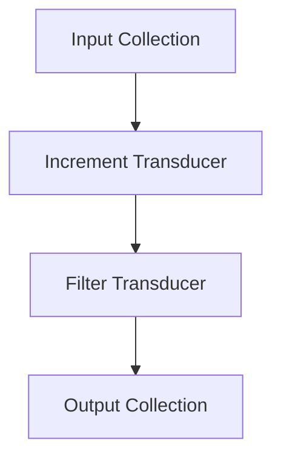

## 8.11. Transducers for Efficient Data Processing

In the realm of functional programming, transducers offer a powerful mechanism for composing data transformations in a way that is both efficient and elegant. They allow us to abstract iteration, thereby improving performance by eliminating intermediate collections. In this section, we will delve into the concept of transducers, how they are implemented in Elixir, and the benefits they bring to data processing tasks.

### Composable Data Transformation

Transducers are a concept that originated in Clojure, and they have been adopted in various functional programming languages, including Elixir. At their core, transducers are composable and reusable transformations that can be applied to different data structures without creating intermediate collections. This makes them particularly useful for processing large datasets or streams of data efficiently.

#### Abstracting Iteration to Improve Performance

In traditional functional programming, operations like `map`, `filter`, and `reduce` are often chained together. While this approach is expressive and easy to understand, it can lead to inefficiencies due to the creation of intermediate collections at each step. Transducers address this issue by allowing these operations to be composed into a single transformation that is applied in a single pass over the data.

### Implementing Transducers

Let's explore how transducers can be implemented in Elixir. We'll start by understanding the basic building blocks and then move on to more complex examples.

#### Basic Transducer Implementation

A transducer in Elixir is essentially a function that takes a reducing function and returns a new reducing function. This new function encapsulates the transformation logic. Here's a simple example of a transducer that increments each element in a collection:

```elixir
defmodule Transducer do
  def increment do
    fn next_reducer ->
      fn acc, value ->
        next_reducer.(acc, value + 1)
      end
    end
  end
end
```

In this example, `increment` is a transducer that takes a `next_reducer` function and returns a new function. This new function applies the transformation (incrementing the value) before passing it to the `next_reducer`.

#### Combining `map`, `filter`, and Other Operations

Transducers can be composed to perform multiple transformations in a single pass. Let's see how we can combine `map` and `filter` operations using transducers:

```elixir
defmodule Transducer do
  def map(transformation) do
    fn next_reducer ->
      fn acc, value ->
        next_reducer.(acc, transformation.(value))
      end
    end
  end

  def filter(predicate) do
    fn next_reducer ->
      fn acc, value ->
        if predicate.(value) do
          next_reducer.(acc, value)
        else
          acc
        end
      end
    end
  end
end

# Usage
increment = Transducer.map(&(&1 + 1))
even_only = Transducer.filter(&rem(&1, 2) == 0)

# Composing transducers
composed_transducer = increment |> even_only

# Applying the composed transducer
result = Enum.reduce([1, 2, 3, 4], [], composed_transducer.(fn acc, x -> [x | acc] end))
IO.inspect(Enum.reverse(result)) # Output: [2, 4]
```

In this example, we define two transducers: `map` and `filter`. We then compose them using the pipe operator (`|>`), and apply the composed transducer to a list using `Enum.reduce`.

### Benefits of Transducers

Transducers provide several benefits, particularly in terms of performance and memory efficiency.

#### Memory Efficiency

By eliminating intermediate collections, transducers reduce memory usage. This is especially beneficial when working with large datasets or streams, where the overhead of creating and managing intermediate collections can be significant.

#### Performance Gains

Transducers enable multiple transformations to be applied in a single pass over the data. This reduces the computational overhead associated with multiple iterations, leading to performance improvements.

### Visualizing Transducers

To better understand how transducers work, let's visualize the process of applying a composed transducer to a collection.



In this diagram, the input collection is processed by the increment transducer, which applies the transformation to each element. The result is then passed to the filter transducer, which applies the filtering logic. The final output collection contains the transformed and filtered elements.

### Elixir Unique Features

Elixir's powerful pattern matching and functional programming capabilities make it an ideal language for implementing transducers. The ability to compose functions and transformations seamlessly allows developers to create efficient data processing pipelines.

### Differences and Similarities

Transducers are often compared to other functional programming concepts like monads and functors. While they share some similarities, transducers are distinct in their focus on composable data transformations without intermediate collections. This makes them particularly well-suited for scenarios where performance and memory efficiency are critical.

### Try It Yourself

To get a hands-on understanding of transducers, try modifying the code examples provided. Experiment with different transformations and predicates to see how they affect the output. Consider implementing additional transducers for operations like `take`, `drop`, or `partition`.

### Knowledge Check

- What are the key benefits of using transducers in Elixir?
- How do transducers improve performance compared to traditional functional programming approaches?
- Can you explain how a transducer is composed and applied to a collection?

### Embrace the Journey

Remember, mastering transducers is just one step in your journey to becoming an expert in functional programming with Elixir. Keep experimenting, stay curious, and enjoy the process of learning and discovery.

### References and Links

- [Clojure Transducers](https://clojure.org/reference/transducers)
- [Elixir Documentation](https://elixir-lang.org/docs.html)
- [Functional Programming Concepts](https://en.wikipedia.org/wiki/Functional_programming)

## Quiz: Transducers for Efficient Data Processing



### What is a key benefit of using transducers in Elixir?

- [x] They eliminate intermediate collections, improving memory efficiency.
- [ ] They allow for parallel processing of data.
- [ ] They simplify error handling in functional programming.
- [ ] They provide a graphical interface for data processing.

> **Explanation:** Transducers eliminate intermediate collections, which reduces memory usage and improves performance.

### How do transducers improve performance?

- [x] By applying multiple transformations in a single pass over the data.
- [ ] By parallelizing data processing tasks.
- [ ] By caching intermediate results for reuse.
- [ ] By using machine learning algorithms for optimization.

> **Explanation:** Transducers improve performance by allowing multiple transformations to be applied in a single pass, reducing computational overhead.

### What is a transducer in Elixir?

- [x] A function that takes a reducing function and returns a new reducing function.
- [ ] A data structure for storing large datasets efficiently.
- [ ] A module for handling concurrent processes.
- [ ] A library for building web applications.

> **Explanation:** A transducer is a function that takes a reducing function and returns a new reducing function, encapsulating transformation logic.

### Which of the following operations can be combined using transducers?

- [x] `map` and `filter`
- [ ] `spawn` and `send`
- [ ] `read` and `write`
- [ ] `connect` and `disconnect`

> **Explanation:** Transducers can combine operations like `map` and `filter` into a single transformation.

### What is the primary focus of transducers?

- [x] Composable data transformations without intermediate collections.
- [ ] Parallel processing of data streams.
- [ ] Error handling and logging.
- [ ] User interface design.

> **Explanation:** Transducers focus on composable data transformations without creating intermediate collections.

### How can transducers be visualized in a data processing pipeline?

- [x] As a series of transformations applied in sequence.
- [ ] As a single monolithic operation.
- [ ] As a parallel processing task.
- [ ] As a graphical user interface.

> **Explanation:** Transducers can be visualized as a series of transformations applied in sequence, processing data efficiently.

### What makes Elixir an ideal language for implementing transducers?

- [x] Its powerful pattern matching and functional programming capabilities.
- [ ] Its object-oriented programming features.
- [ ] Its support for graphical user interfaces.
- [ ] Its built-in database management system.

> **Explanation:** Elixir's pattern matching and functional programming capabilities make it well-suited for implementing transducers.

### How do transducers differ from monads and functors?

- [x] They focus on composable data transformations without intermediate collections.
- [ ] They provide a graphical interface for data processing.
- [ ] They are used for error handling in functional programming.
- [ ] They are specific to object-oriented programming.

> **Explanation:** Transducers differ from monads and functors in their focus on composable data transformations without intermediate collections.

### Can transducers be used with streams of data?

- [x] True
- [ ] False

> **Explanation:** Transducers can be used with streams of data, allowing for efficient processing without intermediate collections.

### What is the role of a reducing function in a transducer?

- [x] It is the function that is transformed by the transducer to apply the desired operation.
- [ ] It is the function that handles error logging.
- [ ] It is the function that manages concurrent processes.
- [ ] It is the function that initializes the data structure.

> **Explanation:** The reducing function is transformed by the transducer to apply the desired operation, encapsulating the transformation logic.




