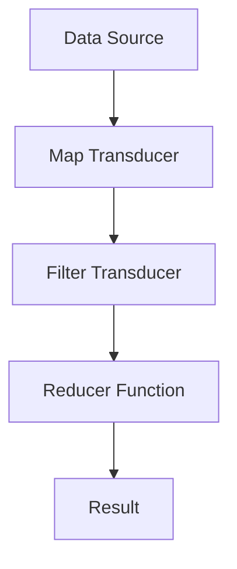

## 8.11. Transducers for Efficient Data Processing

In the realm of functional programming, transducers offer a powerful mechanism for processing data efficiently. They allow developers to compose data transformations without the overhead of creating intermediate collections, thus optimizing both memory usage and performance. In this section, we will delve into the concept of transducers, their implementation in Elixir, and the benefits they bring to data processing tasks.

### Composable Data Transformation

Transducers are a pattern for composing data transformation operations such as `map`, `filter`, and `reduce` in a way that abstracts away the iteration logic. This abstraction allows for the transformation logic to be reused across different data structures, such as lists, streams, or even files, without the need to create intermediate collections.

#### Abstracting Iteration to Improve Performance

The traditional approach to data transformation in functional programming involves chaining operations that create intermediate collections. For example, consider the following code snippet that maps and filters a list:

```elixir
list = [1, 2, 3, 4, 5]

result =
  list
  |> Enum.map(&(&1 * 2))
  |> Enum.filter(&(&1 > 5))
```

In this example, `Enum.map/2` creates an intermediate list before `Enum.filter/2` processes it. This can lead to unnecessary memory allocation, especially with large datasets.

Transducers eliminate these intermediate collections by abstracting the iteration process. They allow you to define a transformation pipeline that can be applied directly to the data source, resulting in more efficient processing.

### Implementing Transducers

Implementing transducers in Elixir involves defining a series of composable transformation functions that can be applied to a data source. Let's explore how to create and use transducers in Elixir.

#### Combining `map`, `filter`, and Other Operations

To implement transducers, we need to define transformation functions that can be composed together. Elixir's `Stream` module provides a foundation for creating transducers. Here's an example of how to define and use a transducer:

```elixir
defmodule TransducerExample do
  def map_transducer(fun) do
    fn next ->
      fn
        :halt -> :halt
        acc -> fn x -> next.(acc, fun.(x)) end
      end
    end
  end

  def filter_transducer(predicate) do
    fn next ->
      fn
        :halt -> :halt
        acc -> fn x -> if predicate.(x), do: next.(acc, x), else: acc end
      end
    end
  end

  def transduce(transducers, reducer, initial, collection) do
    composed = Enum.reduce(transducers, reducer, fn t, acc -> t.(acc) end)
    Enum.reduce(collection, initial, composed)
  end
end

# Usage
transducers = [
  TransducerExample.map_transducer(&(&1 * 2)),
  TransducerExample.filter_transducer(&(&1 > 5))
]

result = TransducerExample.transduce(transducers, fn acc, x -> [x | acc] end, [], [1, 2, 3, 4, 5])
IO.inspect(Enum.reverse(result)) # Output: [6, 8, 10]
```

In this example, we define `map_transducer/1` and `filter_transducer/1` functions that create transducers for mapping and filtering operations. The `transduce/4` function composes these transducers and applies them to a collection using a reducer function.

#### Try It Yourself

Experiment with the transducers by modifying the transformation functions or the collection. Try adding additional transducers, such as one for `take` or `drop`, and observe how the transformations are applied efficiently without intermediate collections.

### Benefits of Using Transducers

Transducers offer several advantages over traditional data transformation techniques:

#### Memory Efficiency

By eliminating intermediate collections, transducers reduce memory usage, especially when processing large datasets. This can lead to significant performance improvements in memory-constrained environments.

#### Performance Gains

Transducers allow for the composition of transformation functions that can be applied directly to the data source. This reduces the overhead associated with creating and managing intermediate collections, resulting in faster data processing.

#### Reusability and Composability

Transducers promote code reusability by allowing transformation functions to be composed and reused across different data structures. This makes it easier to build complex data processing pipelines that can be adapted to various use cases.

### Visualizing Transducers

To better understand how transducers work, let's visualize the process of composing and applying transducers using a flowchart.


```mermaid
graph TD;
    A[Data Source] --> B[Map Transducer]
    B --> C[Filter Transducer]
    C --> D[Reducer Function]
    D --> E[Result]
```

**Diagram Description:** This flowchart illustrates the process of applying transducers to a data source. The data flows from the source through a series of transducers (e.g., map, filter) and is finally reduced to produce the result.

### Elixir Unique Features

Elixir's functional programming paradigm and its powerful `Stream` module make it an ideal language for implementing transducers. The ability to compose functions and leverage lazy evaluation allows developers to build efficient data processing pipelines with minimal memory overhead.

### Differences and Similarities

Transducers are commonly confused with lazy sequences or streams. While both concepts aim to improve efficiency by avoiding intermediate collections, transducers provide a more flexible and composable approach to data transformation. Unlike lazy sequences, which are tied to specific data structures, transducers can be applied to any data source that supports iteration.

### Knowledge Check

As you explore transducers in Elixir, consider the following questions to reinforce your understanding:

1. How do transducers differ from traditional data transformation techniques?
2. What are the key benefits of using transducers in Elixir?
3. How can you compose multiple transducers to build complex data processing pipelines?

### Embrace the Journey

Remember, mastering transducers is just one step in your journey to becoming an expert in Elixir and functional programming. As you continue to explore the language's capabilities, you'll discover new ways to optimize your code and build efficient, scalable systems. Keep experimenting, stay curious, and enjoy the journey!

## Quiz Time!



### What is the primary advantage of using transducers in Elixir?

- [x] They eliminate intermediate collections, improving memory efficiency.
- [ ] They allow for parallel processing of data.
- [ ] They automatically optimize code for the BEAM VM.
- [ ] They provide built-in error handling mechanisms.

> **Explanation:** Transducers eliminate the need for intermediate collections, which improves memory efficiency and performance.

### How do transducers differ from lazy sequences?

- [x] Transducers are more flexible and can be applied to any data source that supports iteration.
- [ ] Transducers are specific to Elixir, while lazy sequences are not.
- [ ] Transducers require more memory than lazy sequences.
- [ ] Transducers are only applicable to lists.

> **Explanation:** Transducers provide a flexible approach to data transformation that can be applied to various data sources, unlike lazy sequences which are tied to specific data structures.

### Which Elixir module provides a foundation for creating transducers?

- [x] Stream
- [ ] Enum
- [ ] List
- [ ] Map

> **Explanation:** The `Stream` module in Elixir provides the necessary functions to create and work with transducers.

### What is the role of a reducer function in a transducer pipeline?

- [x] It aggregates the results of the transformation into a final output.
- [ ] It filters out unwanted elements from the data source.
- [ ] It maps each element to a new value.
- [ ] It initializes the data source for processing.

> **Explanation:** The reducer function aggregates the results of the transformation, producing the final output.

### In the provided transducer example, what is the purpose of the `map_transducer/1` function?

- [x] To create a transducer that applies a mapping function to each element.
- [ ] To filter elements based on a condition.
- [ ] To reduce the data source into a single value.
- [ ] To initialize the transducer pipeline.

> **Explanation:** The `map_transducer/1` function creates a transducer that applies a mapping function to each element in the data source.

### What is the benefit of using the `Stream` module in Elixir for transducers?

- [x] It allows for lazy evaluation, reducing memory usage.
- [ ] It automatically parallelizes data processing.
- [ ] It provides built-in error handling.
- [ ] It improves code readability.

> **Explanation:** The `Stream` module allows for lazy evaluation, which reduces memory usage by processing data elements as needed.

### How can you experiment with transducers in Elixir?

- [x] By modifying transformation functions and observing the effects on data processing.
- [ ] By using the `Enum` module to create transducers.
- [ ] By implementing transducers with the `List` module.
- [ ] By writing imperative loops for data transformation.

> **Explanation:** Experimenting with transformation functions in transducers allows you to observe how changes affect data processing efficiency.

### What is a key characteristic of transducers?

- [x] They are composable and reusable across different data structures.
- [ ] They are specific to Elixir's `List` module.
- [ ] They require intermediate collections to function.
- [ ] They are only applicable to synchronous data processing.

> **Explanation:** Transducers are composable and reusable, allowing them to be applied across various data structures without intermediate collections.

### True or False: Transducers can only be used with lists in Elixir.

- [ ] True
- [x] False

> **Explanation:** Transducers can be applied to any data source that supports iteration, not just lists.

### What is the main goal of using transducers in data processing?

- [x] To improve performance and memory efficiency by eliminating intermediate collections.
- [ ] To simplify error handling in data processing pipelines.
- [ ] To provide a graphical interface for data transformation.
- [ ] To automatically parallelize data processing tasks.

> **Explanation:** The main goal of using transducers is to improve performance and memory efficiency by eliminating the need for intermediate collections.




