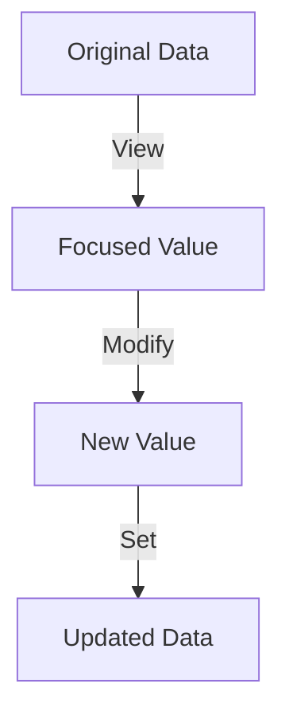

## 8.12. Lens Pattern for Nested Data Access

In the realm of functional programming, dealing with deeply nested data structures is a common challenge. The Lens Pattern offers a powerful abstraction for accessing and modifying nested data without compromising immutability. This section will guide you through understanding and implementing the Lens Pattern in Elixir, providing you with the tools to manage complex data structures efficiently.

### Simplifying Deep Data Access

**Lenses** are composable functional abstractions that allow you to focus on specific parts of a data structure. They provide a way to get, set, and modify values deep within nested structures, such as maps or structs, without having to manually traverse the entire structure.

#### Key Concepts

- **Focus**: A lens focuses on a specific part of a data structure, allowing you to access or modify it.
- **Composability**: Lenses can be composed to focus on deeper levels of a structure.
- **Immutability**: Operations using lenses do not mutate the original data structure but return a new modified version.

### Implementing Lenses

To implement lenses in Elixir, we need to define a few core functions: `view`, `set`, and `over`. These functions will allow us to interact with the data structure through the lens.

#### Defining a Lens

A lens is typically defined as a tuple containing two functions: a getter and a setter. Here's a basic implementation:

```elixir
defmodule Lens do
  def lens(getter, setter) do
    {getter, setter}
  end

  def view({getter, _}, data) do
    getter.(data)
  end

  def set({_, setter}, data, value) do
    setter.(data, value)
  end

  def over(lens, data, func) do
    current_value = view(lens, data)
    new_value = func.(current_value)
    set(lens, data, new_value)
  end
end
```

- **`lens/2`**: Creates a lens from a getter and a setter function.
- **`view/2`**: Retrieves the value focused by the lens.
- **`set/3`**: Sets a new value at the focus of the lens.
- **`over/3`**: Applies a function to the value at the focus of the lens.

#### Example: Accessing Nested Maps

Let's consider a nested map structure and see how we can use lenses to access and modify it:

```elixir
defmodule Example do
  alias Lens

  def nested_map do
    %{
      user: %{
        name: "Alice",
        address: %{
          city: "Wonderland",
          zip: "12345"
        }
      }
    }
  end

  def city_lens do
    Lens.lens(
      fn data -> get_in(data, [:user, :address, :city]) end,
      fn data, value -> put_in(data, [:user, :address, :city], value) end
    )
  end

  def get_city(data) do
    Lens.view(city_lens(), data)
  end

  def set_city(data, new_city) do
    Lens.set(city_lens(), data, new_city)
  end

  def update_city(data, func) do
    Lens.over(city_lens(), data, func)
  end
end

# Usage
data = Example.nested_map()
IO.inspect(Example.get_city(data)) # "Wonderland"
updated_data = Example.set_city(data, "Oz")
IO.inspect(Example.get_city(updated_data)) # "Oz"
```

### Use Cases

Lenses are particularly useful in scenarios where you need to frequently access or update deeply nested data structures. Here are some common use cases:

- **Configuration Management**: Accessing and updating nested configuration settings.
- **Data Transformation**: Applying transformations to specific parts of complex data structures.
- **State Management**: Managing state in applications with deeply nested state trees.

### Visualizing Lenses

To better understand how lenses work, let's visualize the process of accessing and modifying nested data using a lens.



**Diagram Explanation**: The diagram illustrates the lens operation flow. Starting with the original data, the lens focuses on a specific value, which can then be modified. The modified value is set back into the data structure, resulting in an updated version.

### Design Considerations

When implementing lenses, consider the following:

- **Performance**: Lenses can introduce overhead due to function calls and data copying. Ensure that performance is acceptable for your use case.
- **Complexity**: While lenses simplify data access, they can add complexity to your codebase. Use them judiciously.
- **Composability**: Take advantage of the composability of lenses to build complex data access patterns.

### Elixir Unique Features

Elixir's pattern matching and functional programming paradigm make it an ideal language for implementing lenses. The `get_in/2` and `put_in/3` functions provide a solid foundation for building lens operations.

### Differences and Similarities

Lenses are often compared to other data access patterns, such as Zippers. While both provide ways to navigate and modify data structures, lenses focus on composability and immutability, whereas zippers offer more flexibility in navigating data structures.

### Try It Yourself

Experiment with the lens implementation by modifying the code examples. Try creating lenses for different parts of the data structure or applying different transformations using the `over/3` function.

### Knowledge Check

- What are the core functions of a lens?
- How do lenses maintain immutability?
- What are some common use cases for lenses?

### Embrace the Journey

Remember, mastering lenses is just one step in your functional programming journey. As you continue to explore Elixir, you'll discover more powerful abstractions and patterns. Keep experimenting, stay curious, and enjoy the process!

## Quiz: Lens Pattern for Nested Data Access



### What is the primary purpose of a lens in functional programming?

- [x] To access and modify nested data structures
- [ ] To perform side effects
- [ ] To manage stateful computations
- [ ] To handle concurrency

> **Explanation:** Lenses are used to focus on specific parts of a data structure, allowing access and modification without mutating the original structure.

### Which Elixir functions are commonly used to implement lenses?

- [x] `get_in/2` and `put_in/3`
- [ ] `Enum.map/2` and `Enum.reduce/3`
- [ ] `Task.async/1` and `Task.await/1`
- [ ] `GenServer.call/2` and `GenServer.cast/2`

> **Explanation:** `get_in/2` and `put_in/3` are used to access and update nested data structures, making them suitable for implementing lenses.

### What are the two main components of a lens?

- [x] Getter and Setter
- [ ] Producer and Consumer
- [ ] Encoder and Decoder
- [ ] Publisher and Subscriber

> **Explanation:** A lens is composed of a getter and a setter function, which define how to access and modify the focused part of the data structure.

### How do lenses ensure immutability?

- [x] By returning a new modified version of the data structure
- [ ] By using mutable state
- [ ] By locking data structures
- [ ] By using global variables

> **Explanation:** Lenses do not mutate the original data structure; instead, they return a new version with the modifications applied.

### What is a common use case for lenses?

- [x] Updating complex nested maps or structs
- [ ] Performing asynchronous tasks
- [ ] Managing database connections
- [ ] Handling user authentication

> **Explanation:** Lenses are particularly useful for accessing and updating deeply nested data structures, such as maps or structs.

### Which of the following is a benefit of using lenses?

- [x] Composability
- [ ] Increased complexity
- [ ] Reduced performance
- [ ] Global state management

> **Explanation:** Lenses are composable, allowing you to build complex data access patterns by combining simpler lenses.

### What is the `over/3` function used for in a lens?

- [x] To apply a function to the value at the focus of the lens
- [ ] To create a new lens
- [ ] To delete a value from the data structure
- [ ] To merge two data structures

> **Explanation:** The `over/3` function applies a transformation function to the value focused by the lens, returning a new modified data structure.

### How can lenses be visualized in terms of data flow?

- [x] As a process of viewing, modifying, and setting data
- [ ] As a sequence of asynchronous events
- [ ] As a series of database transactions
- [ ] As a network of interconnected nodes

> **Explanation:** Lenses can be visualized as a flow where data is viewed, modified, and then set back into the structure, resulting in an updated version.

### What is a potential drawback of using lenses?

- [x] Performance overhead due to function calls and data copying
- [ ] Inability to handle nested data
- [ ] Lack of composability
- [ ] Mutability of data structures

> **Explanation:** Lenses can introduce performance overhead due to the additional function calls and data copying involved in maintaining immutability.

### True or False: Lenses mutate the original data structure.

- [ ] True
- [x] False

> **Explanation:** Lenses do not mutate the original data structure; they return a new version with the modifications applied.


