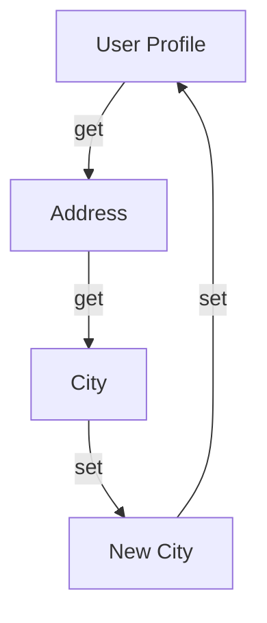

## 8.12. Lens Pattern for Nested Data Access

In the realm of functional programming, manipulating deeply nested data structures can often become cumbersome and error-prone. The Lens Pattern offers a powerful solution to this problem by providing a clean and efficient way to access and update nested data. This pattern is particularly beneficial in Elixir, where immutability is a core principle, and data structures are frequently nested.

### Simplifying Deep Data Access

The Lens Pattern is a functional design pattern that abstracts the process of focusing on a particular part of a data structure, allowing for both retrieval and modification of data. This is akin to having a "lens" through which you can view and alter specific elements within a complex structure without directly interacting with the entire structure.

#### Key Concepts of the Lens Pattern

- **Focus**: A lens focuses on a specific part of a data structure, allowing you to view or modify it.
- **Immutability**: Lenses operate in a way that respects the immutability of data structures, returning a new structure with the desired changes.
- **Composability**: Lenses can be composed to access deeper levels of nested data structures, making them highly versatile.

### Implementing Lenses in Elixir

In Elixir, implementing lenses involves creating functions that encapsulate the logic for accessing and updating parts of a data structure. Let's explore how to create and use lenses in Elixir.

#### Basic Lens Structure

A lens is typically represented by a pair of functions: one for getting a value and another for setting a value. Here's a basic example:

```elixir
defmodule Lens do
  defstruct get: nil, set: nil

  def make(getter, setter) do
    %Lens{get: getter, set: setter}
  end

  def get(lens, data) do
    lens.get.(data)
  end

  def set(lens, data, value) do
    lens.set.(data, value)
  end
end
```

In this module, we define a `Lens` struct with `get` and `set` functions. The `make` function creates a lens by taking a getter and a setter function.

#### Creating a Lens for Nested Maps

Consider a nested map structure representing a user's profile:

```elixir
user_profile = %{
  name: "Alice",
  address: %{
    city: "Wonderland",
    zip: "12345"
  }
}
```

To create a lens for accessing the city in the address, we can define:

```elixir
city_lens = Lens.make(
  fn profile -> profile.address.city end,
  fn profile, new_city -> put_in(profile, [:address, :city], new_city) end
)
```

#### Using the Lens

With the `city_lens`, we can easily get and set the city:

```elixir
# Getting the city
city = Lens.get(city_lens, user_profile)
IO.puts(city)  # Output: Wonderland

# Setting a new city
updated_profile = Lens.set(city_lens, user_profile, "ElixirLand")
IO.inspect(updated_profile)
```

### Use Cases for Lenses

Lenses are particularly useful in scenarios where you frequently need to access or update deeply nested data structures. Some common use cases include:

- **Configuration Management**: Updating specific settings in a deeply nested configuration map.
- **Data Transformation**: Applying transformations to specific fields within nested data structures.
- **State Management**: Managing state in applications with complex nested state representations.

### Visualizing Lenses

To better understand how lenses work, let's visualize the process of accessing and updating nested data using a lens.


```mermaid
graph TD;
    A[User Profile] -->|get| B[Address]
    B -->|get| C[City]
    C -->|set| D[New City]
    D -->|set| A
```

In this diagram, the lens focuses on the `City` within the `Address` of the `User Profile`, allowing both retrieval and modification.

### Advanced Lens Techniques

#### Composing Lenses

One of the powerful features of lenses is their composability. You can compose multiple lenses to access deeper levels of a data structure. Here's how you can compose lenses:

```elixir
address_lens = Lens.make(
  fn profile -> profile.address end,
  fn profile, new_address -> %{profile | address: new_address} end
)

city_lens = Lens.make(
  fn address -> address.city end,
  fn address, new_city -> %{address | city: new_city} end
)

composed_lens = Lens.make(
  fn profile -> Lens.get(city_lens, Lens.get(address_lens, profile)) end,
  fn profile, new_city ->
    address = Lens.get(address_lens, profile)
    new_address = Lens.set(city_lens, address, new_city)
    Lens.set(address_lens, profile, new_address)
  end
)
```

#### Lens Libraries

While implementing lenses from scratch can be educational, there are libraries available that provide robust implementations of lenses in Elixir. One such library is [Elixir's Lens](https://hex.pm/packages/lens), which offers a comprehensive set of functions for working with lenses.

### Design Considerations

When using the Lens Pattern, consider the following:

- **Performance**: While lenses provide a clean abstraction, they may introduce overhead in performance-sensitive applications.
- **Complexity**: Overusing lenses can lead to complex and hard-to-maintain code. Use them judiciously.
- **Readability**: Ensure that the use of lenses enhances code readability and does not obscure the logic.

### Elixir Unique Features

Elixir's immutability and pattern matching capabilities make it an ideal candidate for implementing lenses. The language's focus on functional programming aligns well with the principles of the Lens Pattern.

### Differences and Similarities

The Lens Pattern is often compared to other functional patterns like Monads and Functors. While they share some similarities in terms of abstraction and composition, lenses are specifically focused on data access and manipulation.

### Try It Yourself

Experiment with the Lens Pattern by creating lenses for different parts of a nested data structure. Try modifying the code to handle different types of nested structures, such as lists or tuples.

### Knowledge Check

- What are the key components of a lens in Elixir?
- How can lenses be composed to access deeper levels of a data structure?
- What are some common use cases for the Lens Pattern?

Remember, mastering the Lens Pattern is just the beginning. As you continue to explore Elixir's capabilities, you'll discover even more powerful ways to manipulate data. Keep experimenting, stay curious, and enjoy the journey!

## Quiz Time!



### What is the primary purpose of the Lens Pattern in Elixir?

- [x] To simplify access and modification of nested data structures
- [ ] To improve the performance of data processing
- [ ] To replace pattern matching in Elixir
- [ ] To enhance concurrency in applications

> **Explanation:** The Lens Pattern is primarily used to simplify the access and modification of nested data structures, providing a clean abstraction for these operations.

### Which of the following is NOT a component of a basic lens in Elixir?

- [ ] Getter function
- [ ] Setter function
- [x] Concurrency control
- [ ] Data structure focus

> **Explanation:** A basic lens in Elixir consists of a getter and a setter function, focusing on a specific part of a data structure. Concurrency control is not a component of a lens.

### How can lenses be composed in Elixir?

- [x] By combining multiple lenses to access deeper levels of a data structure
- [ ] By using concurrency primitives like GenServer
- [ ] By applying pattern matching on the data structure
- [ ] By using Elixir's built-in Enum module

> **Explanation:** Lenses can be composed by combining multiple lenses, allowing access to deeper levels of a nested data structure.

### What is a potential drawback of using lenses in performance-sensitive applications?

- [x] They may introduce overhead
- [ ] They make code unreadable
- [ ] They cannot handle nested lists
- [ ] They require external libraries

> **Explanation:** Lenses can introduce overhead in performance-sensitive applications due to the abstraction they provide.

### Which Elixir feature aligns well with the principles of the Lens Pattern?

- [x] Immutability
- [ ] Concurrency
- [ ] Dynamic typing
- [ ] Meta-programming

> **Explanation:** Elixir's immutability aligns well with the principles of the Lens Pattern, as it ensures data structures remain unchanged during operations.

### What is a common use case for the Lens Pattern?

- [x] Updating specific settings in a configuration map
- [ ] Enhancing concurrency in applications
- [ ] Replacing Elixir's pattern matching
- [ ] Building real-time web applications

> **Explanation:** A common use case for the Lens Pattern is updating specific settings in a deeply nested configuration map.

### What should be considered when using the Lens Pattern?

- [x] Performance and complexity
- [ ] Only readability
- [ ] Only immutability
- [ ] Only concurrency

> **Explanation:** When using the Lens Pattern, it's important to consider both performance and complexity to ensure the code remains efficient and maintainable.

### What is a benefit of using lenses over direct manipulation of data structures?

- [x] They provide a clean abstraction for data access and modification
- [ ] They automatically optimize performance
- [ ] They eliminate the need for pattern matching
- [ ] They replace the need for recursion

> **Explanation:** Lenses provide a clean abstraction for data access and modification, making the code more readable and maintainable.

### Which library can be used for robust lens implementations in Elixir?

- [x] Elixir's Lens
- [ ] Elixir's Enum
- [ ] Elixir's GenServer
- [ ] Elixir's Stream

> **Explanation:** Elixir's Lens library provides robust implementations of lenses, offering a comprehensive set of functions for working with lenses.

### True or False: The Lens Pattern can only be used with map data structures in Elixir.

- [ ] True
- [x] False

> **Explanation:** False. The Lens Pattern can be used with various data structures, including maps, lists, and tuples, to simplify nested data access and manipulation.


