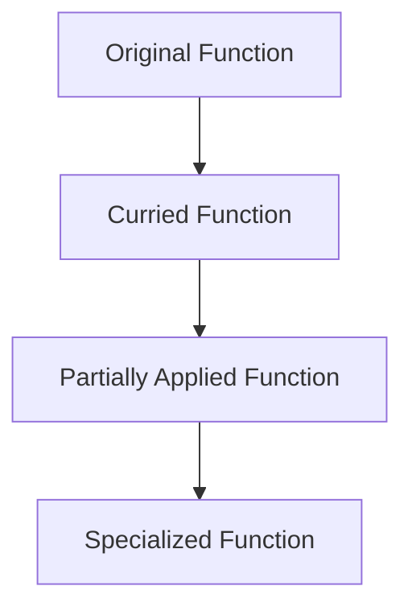

## 8.2. Currying and Partial Application

In the realm of functional programming, currying and partial application are powerful techniques that allow developers to transform and manipulate functions to achieve greater flexibility and reusability. In this section, we will delve into these concepts, explore their implementation in Elixir, and examine their practical applications.

### Function Transformation

At the heart of currying and partial application is the idea of function transformation. This involves breaking down complex functions into simpler, more manageable components. By doing so, we can create a chain of functions, each taking a single argument, which can be combined to achieve the desired functionality.

#### Breaking Down Functions

Consider a function that takes multiple arguments. In traditional programming, you might pass all arguments at once. However, with currying, you can break this function into a series of functions, each accepting a single argument. This transformation allows for more modular and composable code.

```elixir
# Original function taking two arguments
def add(a, b) do
  a + b
end

# Curried version of the function
def curried_add(a) do
  fn b -> a + b end
end

# Usage
add_five = curried_add(5)
result = add_five.(10) # result is 15
```

In this example, `curried_add` is a function that returns another function. The returned function takes the second argument and performs the addition. This approach allows us to create specialized functions like `add_five` by partially applying the first argument.

### Implementing Currying

Currying in Elixir can be achieved using closures. A closure is a function that captures the environment in which it was created. This allows the function to access variables from its enclosing scope, making it ideal for currying.

#### Creating Partially Applied Functions

Partial application is a technique where a function is applied to some of its arguments, producing another function that takes the remaining arguments. This is particularly useful for creating specialized functions from more general ones.

```elixir
# General function
def multiply(a, b) do
  a * b
end

# Partially applied function
def partial_multiply(a) do
  fn b -> multiply(a, b) end
end

# Usage
double = partial_multiply(2)
result = double.(5) # result is 10
```

In this example, `partial_multiply` creates a new function that multiplies its argument by a fixed value. This allows us to define `double` as a function that doubles any given number.

### Use Cases

Currying and partial application have numerous use cases in software development. They can simplify function arguments, create specialized functions, and enhance code reusability.

#### Simplifying Function Arguments

By breaking down functions into smaller components, currying can simplify the process of passing arguments. This is particularly beneficial in scenarios where functions are used as arguments to other functions.

```elixir
# Function that takes a function and a list
def apply_to_list(func, list) do
  Enum.map(list, func)
end

# Curried function
def curried_increment(a) do
  fn b -> a + b end
end

# Usage
increment_by_two = curried_increment(2)
result = apply_to_list(increment_by_two, [1, 2, 3]) # result is [3, 4, 5]
```

In this example, `apply_to_list` is a higher-order function that applies a given function to each element of a list. By using a curried function, we can easily create specialized functions like `increment_by_two`.

#### Creating Specialized Functions

Currying and partial application allow developers to create specialized functions tailored to specific tasks. This can lead to more readable and maintainable code.

```elixir
# General logging function
def log(level, message) do
  IO.puts("[#{level}] #{message}")
end

# Partially applied functions for specific log levels
def info_log do
  fn message -> log("INFO", message) end
end

def error_log do
  fn message -> log("ERROR", message) end
end

# Usage
info = info_log()
error = error_log()

info.("This is an informational message.")
error.("This is an error message.")
```

In this example, we create specialized logging functions for different log levels. This approach makes it easy to log messages with consistent formatting.

### Visualizing Currying and Partial Application

To better understand the flow of currying and partial application, let's visualize the process using a diagram.



This diagram illustrates the transformation of an original function into a curried function, which is then partially applied to create a specialized function.

### Elixir Unique Features

Elixir's support for first-class functions and closures makes it an ideal language for implementing currying and partial application. The language's emphasis on immutability and functional programming principles further enhances the effectiveness of these techniques.

#### Differences and Similarities

Currying and partial application are often confused with each other. While both involve transforming functions, currying specifically refers to breaking down a function into a series of unary functions, whereas partial application involves fixing some arguments of a function to create a new function.

### Try It Yourself

To deepen your understanding of currying and partial application, try modifying the examples provided. Experiment with different functions and arguments to see how these techniques can be applied in various scenarios.

### Knowledge Check

- What is the difference between currying and partial application?
- How can closures be used to implement currying in Elixir?
- What are some practical use cases for currying and partial application?

### Embrace the Journey

Remember, mastering currying and partial application is just the beginning. As you continue to explore functional programming in Elixir, you'll discover even more powerful techniques for writing clean, efficient, and reusable code. Keep experimenting, stay curious, and enjoy the journey!

## Quiz: Currying and Partial Application



### What is currying in functional programming?

- [x] Transforming a function with multiple arguments into a series of functions with single arguments.
- [ ] Combining multiple functions into a single function.
- [ ] Creating a function that takes no arguments.
- [ ] Transforming a function into a recursive function.

> **Explanation:** Currying involves transforming a function with multiple arguments into a series of functions, each taking a single argument.

### How is partial application different from currying?

- [x] Partial application fixes some arguments of a function, while currying transforms it into unary functions.
- [ ] Partial application transforms a function into unary functions, while currying fixes some arguments.
- [ ] Both are the same and interchangeable.
- [ ] Partial application is a subset of currying.

> **Explanation:** Partial application involves fixing some arguments of a function to create a new function, while currying transforms a function into a series of unary functions.

### Which Elixir feature is essential for implementing currying?

- [x] Closures
- [ ] Pattern matching
- [ ] Recursion
- [ ] GenServer

> **Explanation:** Closures are essential for implementing currying as they allow functions to capture their environment.

### What is a practical use case for partial application?

- [x] Creating specialized functions from general ones.
- [ ] Transforming functions into recursive functions.
- [ ] Combining multiple functions into one.
- [ ] Creating functions that take no arguments.

> **Explanation:** Partial application is useful for creating specialized functions from more general ones by fixing some arguments.

### How can currying simplify function arguments?

- [x] By breaking down functions into smaller components.
- [ ] By combining multiple functions into one.
- [ ] By transforming functions into recursive functions.
- [ ] By creating functions that take no arguments.

> **Explanation:** Currying simplifies function arguments by breaking down functions into smaller components, each taking a single argument.

### What is a closure in Elixir?

- [x] A function that captures its surrounding environment.
- [ ] A function that takes no arguments.
- [ ] A function that is recursive.
- [ ] A function that combines multiple functions.

> **Explanation:** A closure is a function that captures its surrounding environment, allowing it to access variables from its enclosing scope.

### Which of the following is a benefit of using currying?

- [x] Enhanced code reusability
- [ ] Increased code complexity
- [ ] Reduced code readability
- [ ] Decreased function flexibility

> **Explanation:** Currying enhances code reusability by allowing functions to be broken down into smaller, more manageable components.

### What is the result of applying a curried function?

- [x] A series of unary functions
- [ ] A single function with multiple arguments
- [ ] A recursive function
- [ ] A function with no arguments

> **Explanation:** Applying a curried function results in a series of unary functions, each taking a single argument.

### How does partial application enhance code readability?

- [x] By creating specialized functions with fixed arguments.
- [ ] By combining multiple functions into one.
- [ ] By transforming functions into recursive functions.
- [ ] By creating functions that take no arguments.

> **Explanation:** Partial application enhances code readability by creating specialized functions with fixed arguments, making the code more understandable.

### True or False: Currying and partial application are the same.

- [ ] True
- [x] False

> **Explanation:** Currying and partial application are not the same. Currying transforms a function into unary functions, while partial application fixes some arguments of a function.



By mastering currying and partial application, you are well on your way to becoming an expert in functional programming with Elixir. Keep exploring these concepts, and you'll unlock new possibilities for writing clean, efficient, and reusable code.
