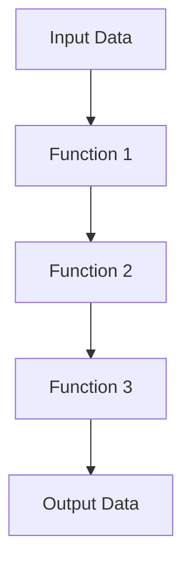

## 8.3. Higher-Order Functions and Function Composition

In the realm of functional programming, higher-order functions and function composition are two fundamental concepts that empower developers to write more modular, reusable, and expressive code. Elixir, being a functional language, embraces these concepts wholeheartedly, allowing developers to harness their full potential. In this section, we will delve into the intricacies of higher-order functions and function composition, exploring their significance, use cases, and practical applications in Elixir.

### Functions as First-Class Citizens

In Elixir, functions are first-class citizens, meaning they can be treated like any other data type. This allows functions to be passed as arguments to other functions, returned as values from functions, and assigned to variables. This flexibility is a cornerstone of functional programming and enables the creation of higher-order functions.

#### Higher-Order Functions

A higher-order function is a function that takes one or more functions as arguments or returns a function as its result. Higher-order functions are instrumental in abstracting control flow and creating reusable logic.

**Example: Using Higher-Order Functions**

```elixir
defmodule MathOperations do
  # A higher-order function that takes a function and two numbers as arguments
  def apply_operation(operation, a, b) do
    operation.(a, b)
  end
end

# Define some basic operations
add = fn a, b -> a + b end
subtract = fn a, b -> a - b end

# Use the higher-order function
IO.puts MathOperations.apply_operation(add, 5, 3)      # Output: 8
IO.puts MathOperations.apply_operation(subtract, 5, 3) # Output: 2
```

In this example, `apply_operation` is a higher-order function that takes an operation (a function) and two numbers as arguments. It applies the operation to the numbers, demonstrating how higher-order functions can encapsulate and reuse logic.

### Function Composition

Function composition is the process of combining two or more functions to produce a new function. This new function represents the application of the composed functions in sequence. Function composition is a powerful tool for building complex operations from simple, reusable functions.

#### Composing Functions in Elixir

Elixir provides several ways to compose functions, including the `|>` operator and the `&` capture operator. Let's explore these methods.

**Example: Function Composition with the Pipe Operator**

```elixir
defmodule StringOperations do
  def reverse_and_upcase(string) do
    string
    |> String.reverse()
    |> String.upcase()
  end
end

IO.puts StringOperations.reverse_and_upcase("hello") # Output: "OLLEH"
```

In this example, the pipe operator (`|>`) is used to compose the `String.reverse/1` and `String.upcase/1` functions. The `reverse_and_upcase` function takes a string, reverses it, and then converts it to uppercase, demonstrating how function composition can create a clear and concise data transformation pipeline.

### Use Cases for Higher-Order Functions and Function Composition

Higher-order functions and function composition are versatile tools that can be applied in various scenarios. Let's explore some common use cases.

#### Data Transformation Pipelines

Data transformation pipelines are sequences of operations applied to data to transform it from one form to another. Higher-order functions and function composition are ideal for building such pipelines, as they allow for clear and concise expression of the transformation logic.

**Example: Data Transformation Pipeline**

```elixir
defmodule DataPipeline do
  def transform(data) do
    data
    |> Enum.map(&(&1 * 2))
    |> Enum.filter(&(&1 > 10))
    |> Enum.sort()
  end
end

IO.inspect DataPipeline.transform([1, 5, 10, 15, 20]) # Output: [20, 30, 40]
```

In this example, a data transformation pipeline is created using higher-order functions and function composition. The pipeline doubles each element in the list, filters out elements less than or equal to 10, and sorts the remaining elements.

#### Reusable Logic Blocks

Higher-order functions enable the creation of reusable logic blocks that can be applied in different contexts. By abstracting common patterns into higher-order functions, developers can reduce code duplication and improve maintainability.

**Example: Reusable Logic Block**

```elixir
defmodule Logger do
  def log(level, message) do
    IO.puts "[#{level}] #{message}"
  end

  def with_logging(func) do
    fn args ->
      log(:info, "Function called with args: #{inspect(args)}")
      result = func.(args)
      log(:info, "Function returned: #{inspect(result)}")
      result
    end
  end
end

# Define a simple function
multiply = fn {a, b} -> a * b end

# Wrap the function with logging
logged_multiply = Logger.with_logging(multiply)

# Call the wrapped function
logged_multiply.({3, 4})
```

In this example, the `with_logging` higher-order function wraps another function, adding logging before and after its execution. This demonstrates how higher-order functions can create reusable logic blocks that enhance existing functions with additional behavior.

### Visualizing Function Composition

To better understand function composition, let's visualize the process using a flowchart. This diagram illustrates how functions are composed to form a data transformation pipeline.



**Caption:** This flowchart represents a data transformation pipeline where input data is processed through a sequence of functions, resulting in transformed output data.

### Elixir's Unique Features for Higher-Order Functions and Function Composition

Elixir provides several unique features that enhance the use of higher-order functions and function composition:

- **Pattern Matching:** Elixir's pattern matching allows for concise and expressive function definitions, making it easier to work with higher-order functions.
- **Immutability:** Elixir's immutable data structures ensure that functions do not have side effects, promoting the use of pure functions in composition.
- **Concurrency:** Elixir's lightweight processes and message-passing model enable the parallel execution of composed functions, enhancing performance.

### Differences and Similarities with Other Languages

While higher-order functions and function composition are common in functional languages, Elixir's approach has some unique aspects:

- **Compared to JavaScript:** Elixir's pattern matching and immutability provide more robust guarantees about function behavior, reducing the risk of side effects.
- **Compared to Haskell:** Elixir's syntax and concurrency model make it more approachable for developers familiar with imperative languages, while still offering powerful functional capabilities.

### Design Considerations

When using higher-order functions and function composition, consider the following:

- **Readability:** Ensure that composed functions remain readable and maintainable. Avoid overly complex compositions that obscure the logic.
- **Performance:** Be mindful of the performance implications of function composition, especially in large data pipelines. Consider using lazy evaluation with streams to optimize performance.
- **Testing:** Test composed functions thoroughly to ensure that each component behaves as expected and that the overall composition produces the desired results.

### Try It Yourself

To deepen your understanding of higher-order functions and function composition, try modifying the examples provided:

- **Experiment with Different Operations:** Modify the `apply_operation` function to support additional operations, such as multiplication or division.
- **Create a New Data Pipeline:** Build a data transformation pipeline that performs a series of operations on a list of strings, such as trimming whitespace, converting to lowercase, and removing duplicates.
- **Enhance the Logger:** Extend the `with_logging` function to include additional logging levels, such as `:debug` or `:error`.

### Knowledge Check

Before moving on, take a moment to reflect on what you've learned:

- **What are higher-order functions, and how do they differ from regular functions?**
- **How does function composition enhance code reusability and maintainability?**
- **What are some common use cases for higher-order functions and function composition in Elixir?**

### Embrace the Journey

Remember, mastering higher-order functions and function composition is a journey. As you continue to explore these concepts, you'll discover new ways to simplify and enhance your code. Keep experimenting, stay curious, and enjoy the process of learning and growing as a developer.

## Quiz: Higher-Order Functions and Function Composition



### What is a higher-order function?

- [x] A function that takes other functions as arguments or returns a function as a result.
- [ ] A function that performs complex mathematical operations.
- [ ] A function that is defined at a higher level in the code hierarchy.
- [ ] A function that is used only in object-oriented programming.

> **Explanation:** Higher-order functions are functions that can take other functions as arguments or return them as results, enabling more abstract and reusable code.

### How does function composition benefit code?

- [x] It allows for building complex operations from simple, reusable functions.
- [ ] It increases the execution speed of the code.
- [ ] It makes the code more object-oriented.
- [ ] It reduces the number of functions needed in a program.

> **Explanation:** Function composition enables developers to build complex operations by combining simple functions, enhancing code reusability and maintainability.

### Which Elixir feature enhances the use of higher-order functions?

- [x] Pattern matching
- [ ] Object inheritance
- [ ] Global variables
- [ ] Dynamic typing

> **Explanation:** Elixir's pattern matching allows for concise and expressive function definitions, making it easier to work with higher-order functions.

### What is the purpose of the pipe operator (`|>`) in Elixir?

- [x] To compose functions by passing the result of one function as the input to the next.
- [ ] To declare a variable.
- [ ] To define a new module.
- [ ] To create a loop structure.

> **Explanation:** The pipe operator (`|>`) is used in Elixir to compose functions by passing the result of one function as the input to the next, creating a clear and concise data transformation pipeline.

### What should be considered when using function composition?

- [x] Readability and performance
- [ ] The number of lines of code
- [ ] The use of global variables
- [ ] The order of function definitions

> **Explanation:** When using function composition, it's important to ensure that composed functions remain readable and maintainable, and to be mindful of performance implications.

### What is a common use case for higher-order functions?

- [x] Data transformation pipelines
- [ ] Defining global variables
- [ ] Creating object hierarchies
- [ ] Implementing inheritance

> **Explanation:** Higher-order functions are commonly used in data transformation pipelines, where they enable the creation of reusable logic blocks for transforming data.

### How can higher-order functions improve code maintainability?

- [x] By abstracting common patterns into reusable logic blocks
- [ ] By increasing the number of functions in a program
- [ ] By making the code more complex
- [ ] By reducing the need for documentation

> **Explanation:** Higher-order functions improve code maintainability by abstracting common patterns into reusable logic blocks, reducing code duplication and enhancing readability.

### What is a key advantage of Elixir's immutability in function composition?

- [x] It ensures that functions do not have side effects.
- [ ] It allows for dynamic typing.
- [ ] It enables object inheritance.
- [ ] It supports global variables.

> **Explanation:** Elixir's immutability ensures that functions do not have side effects, promoting the use of pure functions in composition and enhancing code reliability.

### How does Elixir's concurrency model benefit function composition?

- [x] It enables the parallel execution of composed functions.
- [ ] It allows for dynamic typing.
- [ ] It supports object inheritance.
- [ ] It reduces the need for error handling.

> **Explanation:** Elixir's lightweight processes and message-passing model enable the parallel execution of composed functions, enhancing performance in concurrent applications.

### True or False: Function composition is only useful in functional programming languages.

- [ ] True
- [x] False

> **Explanation:** While function composition is a fundamental concept in functional programming, it can be useful in any programming paradigm where functions can be treated as first-class citizens.




