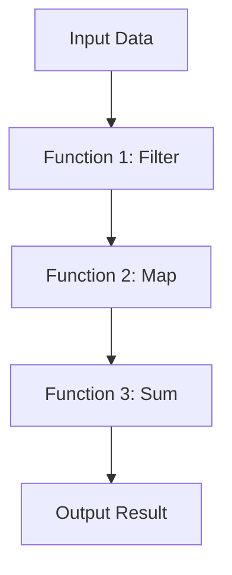

## 8.3. Higher-Order Functions and Function Composition

In the realm of functional programming, higher-order functions and function composition are powerful tools that enable developers to write clean, modular, and reusable code. In Elixir, these concepts are fundamental, allowing us to treat functions as first-class citizens. Let's delve into these concepts, explore their applications, and see how they can be leveraged to create elegant solutions in Elixir.

### Functions as First-Class Citizens

In Elixir, functions are first-class citizens, which means they can be passed as arguments to other functions, returned as values from functions, and assigned to variables. This capability is a cornerstone of functional programming, providing flexibility and expressiveness in code design.

#### Passing Functions as Arguments

Passing functions as arguments allows you to create more abstract and reusable code. For example, you might have a function that applies a given operation to each element of a list.

```elixir
defmodule MathOperations do
  # Applies a given function to each element in the list
  def apply_to_list(list, func) do
    Enum.map(list, func)
  end
end

# Example usage:
square = fn x -> x * x end
MathOperations.apply_to_list([1, 2, 3, 4], square)
# Output: [1, 4, 9, 16]
```

In this example, `apply_to_list/2` takes a list and a function `func` as arguments. It uses `Enum.map/2` to apply `func` to each element of the list, demonstrating how functions can be passed around and utilized dynamically.

#### Returning Functions from Other Functions

Functions can also return other functions, enabling the creation of function generators or closures that capture and maintain state.

```elixir
defmodule Greeter do
  # Returns a function that greets with the given name
  def make_greeting(name) do
    fn -> "Hello, #{name}!" end
  end
end

# Example usage:
greet_john = Greeter.make_greeting("John")
greet_john.()
# Output: "Hello, John!"
```

Here, `make_greeting/1` returns a function that, when called, greets the specified name. This encapsulation of logic within a function allows for flexible and dynamic behavior.

### Function Composition

Function composition involves combining simple functions to build more complex operations. This technique is akin to mathematical function composition, where the output of one function becomes the input of another.

#### Combining Functions

In Elixir, you can compose functions using the `&` operator and the `|>` pipeline operator. This approach allows you to build complex transformations from simpler, reusable components.

```elixir
defmodule StringOperations do
  def reverse_and_upcase(str) do
    str
    |> String.reverse()
    |> String.upcase()
  end
end

# Example usage:
StringOperations.reverse_and_upcase("hello")
# Output: "OLLEH"
```

In this example, `reverse_and_upcase/1` composes two functions: `String.reverse/1` and `String.upcase/1`. The pipeline operator `|>` passes the result of one function to the next, creating a clear and readable transformation sequence.

#### Creating Custom Compositions

Elixir also allows you to create custom composition functions that can chain multiple operations together.

```elixir
defmodule Compositor do
  def compose(f, g) do
    fn x -> g.(f.(x)) end
  end
end

# Example usage:
add_one = fn x -> x + 1 end
square = fn x -> x * x end

add_one_and_square = Compositor.compose(add_one, square)
add_one_and_square.(2)
# Output: 9
```

Here, `compose/2` takes two functions, `f` and `g`, and returns a new function that applies `f` to its input and then `g` to the result. This pattern is useful for building complex operations from simpler functions.

### Use Cases

Higher-order functions and function composition have numerous applications in Elixir, particularly in data transformation pipelines and creating reusable logic blocks.

#### Data Transformation Pipelines

Data transformation pipelines are sequences of operations applied to data, often used in processing collections or streams of data.

```elixir
defmodule DataPipeline do
  def transform(data) do
    data
    |> Enum.filter(&(&1 > 0))
    |> Enum.map(&(&1 * 2))
    |> Enum.sum()
  end
end

# Example usage:
DataPipeline.transform([-1, 2, 3, -4, 5])
# Output: 20
```

In this pipeline, negative numbers are filtered out, the remaining numbers are doubled, and then summed. Each step is a simple function, composed to form a complex operation.

#### Reusable Logic Blocks

By encapsulating logic in higher-order functions, you can create reusable blocks of code that can be applied in different contexts.

```elixir
defmodule Logger do
  def log_with_prefix(prefix) do
    fn message -> IO.puts("#{prefix}: #{message}") end
  end
end

# Example usage:
info_logger = Logger.log_with_prefix("[INFO]")
info_logger.("Application started")
# Output: "[INFO]: Application started"
```

Here, `log_with_prefix/1` returns a function that logs messages with a specified prefix, demonstrating how higher-order functions can encapsulate and reuse logic.

### Visualizing Function Composition

To better understand function composition, let's visualize how functions are combined to form a pipeline.


```mermaid
graph TD;
    A[Input Data] --> B[Function 1: Filter]
    B --> C[Function 2: Map]
    C --> D[Function 3: Sum]
    D --> E[Output Result]
```

This diagram illustrates a data pipeline where input data is passed through a series of functions, each transforming the data and passing it to the next. This flow is typical in functional programming, where operations are chained to achieve a desired result.

### Key Takeaways

- **Higher-Order Functions**: Functions that take other functions as arguments or return them as results, enabling dynamic and flexible code.
- **Function Composition**: The process of combining simple functions to build complex operations, enhancing code modularity and reusability.
- **Use Cases**: Commonly used in data transformation pipelines and creating reusable logic blocks, making code more expressive and maintainable.

### Try It Yourself

Experiment with the concepts discussed by modifying the code examples. Try creating your own higher-order functions and composing them to perform different operations. Consider how these techniques can be applied to your current projects to improve code structure and readability.

### References and Further Reading

- [Elixir Official Documentation](https://elixir-lang.org/docs.html)
- [Functional Programming Concepts](https://en.wikipedia.org/wiki/Functional_programming)
- [Higher-Order Functions in Elixir](https://elixir-lang.org/getting-started/enumerables-and-streams.html)

### Knowledge Check

- What are higher-order functions, and how do they enhance code flexibility?
- How does function composition improve code modularity and readability?
- Can you think of a scenario in your projects where these concepts could be applied?

Remember, mastering higher-order functions and function composition is a journey. As you continue to explore these concepts, you'll find new ways to write more expressive and efficient Elixir code. Keep experimenting, stay curious, and enjoy the journey!

## Quiz Time!



### What is a higher-order function?

- [x] A function that takes other functions as arguments or returns them as results
- [ ] A function that only performs mathematical operations
- [ ] A function that is executed at a higher priority
- [ ] A function that can only be used once

> **Explanation:** Higher-order functions are those that take other functions as arguments or return them, allowing for more dynamic and flexible code.

### How can functions be composed in Elixir?

- [x] By using the `|>` pipeline operator
- [x] By using custom composition functions
- [ ] By using the `++` operator
- [ ] By using the `--` operator

> **Explanation:** Functions can be composed using the `|>` pipeline operator or by creating custom composition functions that chain operations together.

### What is the benefit of function composition?

- [x] It allows building complex operations from simple functions
- [ ] It makes code execution faster
- [ ] It reduces the number of lines of code
- [ ] It is only useful for mathematical operations

> **Explanation:** Function composition allows developers to build complex operations from simple, reusable functions, enhancing code modularity and readability.

### In Elixir, what does it mean for functions to be first-class citizens?

- [x] Functions can be passed as arguments, returned from other functions, and assigned to variables
- [ ] Functions can only be used within modules
- [ ] Functions have higher execution priority
- [ ] Functions are automatically parallelized

> **Explanation:** Functions being first-class citizens means they can be passed around, returned, and assigned, providing flexibility in how they are used.

### Which operator is commonly used for function composition in Elixir?

- [x] `|>`
- [ ] `+`
- [ ] `*`
- [ ] `-`

> **Explanation:** The `|>` pipeline operator is commonly used in Elixir for function composition, allowing the output of one function to be passed as the input to the next.

### What is a common use case for higher-order functions?

- [x] Creating reusable logic blocks
- [ ] Performing only mathematical calculations
- [ ] Writing low-level system code
- [ ] Managing database connections

> **Explanation:** Higher-order functions are often used to create reusable logic blocks that can be applied in various contexts, enhancing code flexibility.

### How does Elixir handle function composition differently from object-oriented languages?

- [x] By using functional constructs like the pipeline operator
- [ ] By using inheritance
- [ ] By using class hierarchies
- [ ] By using method overloading

> **Explanation:** Elixir uses functional constructs like the pipeline operator for function composition, which is different from object-oriented approaches like inheritance or method overloading.

### What is the purpose of the `compose/2` function in the provided example?

- [x] To create a new function that applies two functions in sequence
- [ ] To execute two functions simultaneously
- [ ] To reverse the order of function execution
- [ ] To perform mathematical calculations

> **Explanation:** The `compose/2` function creates a new function that applies two functions in sequence, allowing for custom function composition.

### What does the `|>` operator do in Elixir?

- [x] Passes the result of one function as the input to the next
- [ ] Adds two numbers together
- [ ] Compares two values
- [ ] Concatenates strings

> **Explanation:** The `|>` operator in Elixir is used to pass the result of one function as the input to the next, facilitating function composition.

### True or False: Function composition is only useful in mathematical applications.

- [ ] True
- [x] False

> **Explanation:** False. Function composition is useful in a wide range of applications beyond mathematics, including data transformation pipelines and reusable logic blocks.


