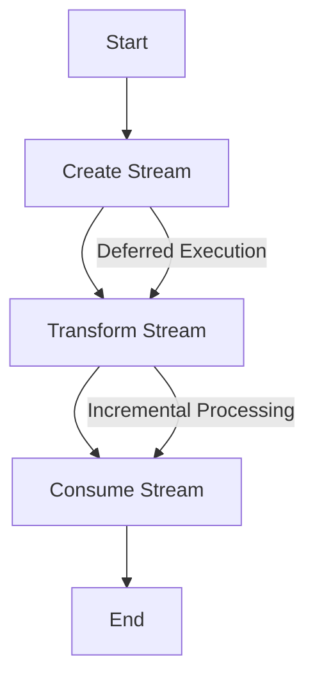

## 8.4. Lazy Evaluation with Streams

In the world of functional programming, lazy evaluation is a powerful concept that allows us to defer computation until it is absolutely necessary. This approach can lead to significant improvements in memory efficiency and the ability to handle potentially infinite data sequences. In Elixir, lazy evaluation is primarily achieved through the use of the `Stream` module. In this section, we will delve into the intricacies of lazy evaluation, explore how to implement it using streams, and discuss the benefits it brings to our Elixir applications.

### Deferring Computation

Lazy evaluation is a technique where expressions are not evaluated until their values are needed. This deferral of computation can lead to more efficient programs, as it avoids unnecessary calculations and memory usage. In Elixir, lazy evaluation is particularly useful when dealing with large datasets or infinite sequences, as it allows us to process data incrementally without loading everything into memory at once.

#### Key Concepts of Lazy Evaluation

- **Deferred Execution**: Computation is postponed until the result is required.
- **Incremental Processing**: Data is processed piece by piece, rather than all at once.
- **Memory Efficiency**: Only the necessary data is kept in memory, reducing the overall footprint.
- **Infinite Sequences**: Lazy evaluation enables handling of infinite data streams without exhausting system resources.

### Implementing Lazy Evaluation

Elixir provides the `Stream` module to facilitate lazy evaluation. Streams allow us to create lazy enumerables that generate values on demand. This is in contrast to eager enumerables, like lists, which compute all their values upfront.

#### The Stream Module

The `Stream` module in Elixir offers a variety of functions to create and manipulate lazy enumerables. Let's explore some of the key functions and how they can be used to implement lazy evaluation.

#### Creating Streams

To create a stream, we can use functions like `Stream.iterate/2`, `Stream.cycle/1`, and `Stream.unfold/2`. These functions allow us to define potentially infinite sequences that are evaluated lazily.

```elixir
# Stream.iterate/2: Generates an infinite stream by repeatedly applying a function
stream = Stream.iterate(0, &(&1 + 1))
Enum.take(stream, 5) # [0, 1, 2, 3, 4]

# Stream.cycle/1: Repeats a finite list infinitely
cycle_stream = Stream.cycle([1, 2, 3])
Enum.take(cycle_stream, 6) # [1, 2, 3, 1, 2, 3]

# Stream.unfold/2: Generates a stream based on a function
unfold_stream = Stream.unfold(0, fn x -> {x, x + 1} end)
Enum.take(unfold_stream, 5) # [0, 1, 2, 3, 4]
```

#### Transforming Streams

Streams can be transformed using functions like `Stream.map/2`, `Stream.filter/2`, and `Stream.flat_map/2`. These functions allow us to apply transformations lazily, processing each element only when needed.

```elixir
# Stream.map/2: Applies a function to each element of the stream
mapped_stream = Stream.map(stream, &(&1 * 2))
Enum.take(mapped_stream, 5) # [0, 2, 4, 6, 8]

# Stream.filter/2: Filters elements based on a predicate
filtered_stream = Stream.filter(stream, &rem(&1, 2) == 0)
Enum.take(filtered_stream, 5) # [0, 2, 4, 6, 8]

# Stream.flat_map/2: Maps and flattens the result
flat_mapped_stream = Stream.flat_map(stream, fn x -> [x, x * 2] end)
Enum.take(flat_mapped_stream, 5) # [0, 0, 1, 2, 2]
```

#### Consuming Streams

To actually evaluate a stream, we need to consume it using functions like `Enum.to_list/1`, `Enum.take/2`, or `Enum.reduce/3`. These functions trigger the computation of the stream's elements.

```elixir
# Enum.to_list/1: Converts a stream to a list, evaluating all elements
list = Enum.to_list(Stream.take(stream, 5)) # [0, 1, 2, 3, 4]

# Enum.reduce/3: Reduces a stream to a single value
sum = Enum.reduce(Stream.take(stream, 5), 0, &(&1 + &2)) # 10
```

### Benefits of Lazy Evaluation

Lazy evaluation with streams offers several advantages, particularly in terms of memory efficiency and the ability to handle infinite sequences.

#### Memory Efficiency

By processing data incrementally, streams minimize memory usage. This is especially beneficial when working with large datasets, as it prevents the need to load everything into memory at once.

#### Handling Infinite Sequences

Streams enable us to work with infinite sequences by generating values on demand. This allows us to perform operations on potentially unbounded data without running into memory constraints.

### Visualizing Lazy Evaluation

To better understand how lazy evaluation works, let's visualize the process using a flowchart. This diagram illustrates the flow of data through a stream, highlighting the deferred computation and incremental processing.



**Diagram Description:** This flowchart represents the process of lazy evaluation with streams in Elixir. It shows how a stream is created, transformed, and consumed, with deferred execution and incremental processing occurring between each step.

### Try It Yourself

To get hands-on experience with lazy evaluation, try modifying the code examples provided above. Experiment with different stream functions, transformations, and consumption methods. Observe how changes affect memory usage and performance.

### Knowledge Check

Before we wrap up, let's reinforce what we've learned with a few questions:

- What is lazy evaluation, and how does it differ from eager evaluation?
- How can streams be used to handle infinite sequences in Elixir?
- What are the benefits of using lazy evaluation in terms of memory efficiency?

### Embrace the Journey

Remember, mastering lazy evaluation with streams is just one step in your journey to becoming an expert Elixir developer. Keep experimenting, stay curious, and enjoy the process of learning and growing your skills.

### References and Links

For further reading on lazy evaluation and streams in Elixir, check out the following resources:

- [Elixir's Stream Module Documentation](https://hexdocs.pm/elixir/Stream.html)
- [Functional Programming Concepts](https://en.wikipedia.org/wiki/Functional_programming)
- [Memory Efficiency in Programming](https://en.wikipedia.org/wiki/Memory_management)

## Quiz: Lazy Evaluation with Streams



### What is lazy evaluation?

- [x] A technique where expressions are evaluated only when needed
- [ ] A technique where expressions are evaluated immediately
- [ ] A technique where expressions are evaluated in parallel
- [ ] A technique where expressions are evaluated randomly

> **Explanation:** Lazy evaluation defers computation until the result is required, allowing for more efficient memory usage and handling of infinite sequences.

### Which Elixir module is used for lazy evaluation?

- [ ] Enum
- [x] Stream
- [ ] List
- [ ] Map

> **Explanation:** The `Stream` module in Elixir is used for lazy evaluation, providing functions to create and manipulate lazy enumerables.

### What is the benefit of using streams for data processing?

- [x] Memory efficiency
- [x] Ability to handle infinite sequences
- [ ] Faster computation
- [ ] Increased complexity

> **Explanation:** Streams allow for memory-efficient processing and the ability to handle infinite sequences by generating values on demand.

### How do you consume a stream in Elixir?

- [ ] Using Stream.map/2
- [ ] Using Stream.filter/2
- [x] Using Enum.to_list/1
- [x] Using Enum.reduce/3

> **Explanation:** To consume a stream, you can use functions like `Enum.to_list/1` or `Enum.reduce/3`, which trigger the computation of the stream's elements.

### What does Stream.iterate/2 do?

- [x] Generates an infinite stream by repeatedly applying a function
- [ ] Generates a finite list by applying a function
- [ ] Generates a stream by filtering elements
- [ ] Generates a stream by mapping elements

> **Explanation:** `Stream.iterate/2` generates an infinite stream by repeatedly applying a given function to its elements.

### What is the purpose of Stream.cycle/1?

- [x] To repeat a finite list infinitely
- [ ] To create a finite list
- [ ] To filter elements in a stream
- [ ] To map elements in a stream

> **Explanation:** `Stream.cycle/1` creates a stream that repeats a finite list infinitely, allowing for cyclic data processing.

### How does Stream.unfold/2 work?

- [x] Generates a stream based on a function
- [ ] Generates a finite list based on a function
- [ ] Generates a stream by filtering elements
- [ ] Generates a stream by mapping elements

> **Explanation:** `Stream.unfold/2` generates a stream by applying a function to produce each element and the next state.

### What is the result of Enum.take(Stream.iterate(0, &(&1 + 1)), 5)?

- [x] [0, 1, 2, 3, 4]
- [ ] [1, 2, 3, 4, 5]
- [ ] [0, 2, 4, 6, 8]
- [ ] [1, 3, 5, 7, 9]

> **Explanation:** `Enum.take/2` takes the first 5 elements from the infinite stream generated by `Stream.iterate/2`, resulting in `[0, 1, 2, 3, 4]`.

### True or False: Streams in Elixir are evaluated eagerly.

- [ ] True
- [x] False

> **Explanation:** Streams in Elixir are evaluated lazily, meaning their computation is deferred until the values are needed.

### What is a key advantage of lazy evaluation?

- [x] Reduced memory usage
- [ ] Increased memory usage
- [ ] Immediate computation
- [ ] Increased complexity

> **Explanation:** Lazy evaluation reduces memory usage by processing data incrementally and only keeping necessary data in memory.


