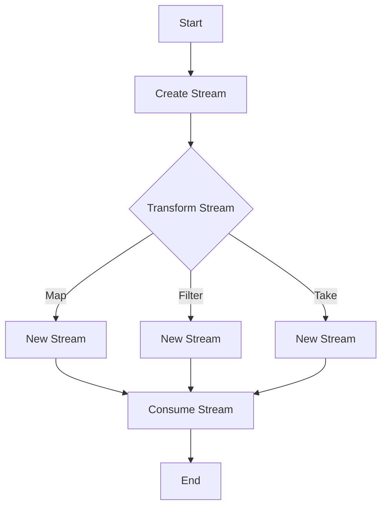

## 8.4. Lazy Evaluation with Streams

### Introduction

Lazy evaluation is a powerful concept in functional programming that allows you to defer computation until it is absolutely necessary. This approach can lead to significant improvements in memory usage and performance, especially when dealing with large datasets or potentially infinite sequences. In Elixir, lazy evaluation is primarily achieved through the use of the `Stream` module, which provides a set of functions for creating and manipulating lazy enumerables.

In this section, we will dive deep into the concept of lazy evaluation, explore how to implement it using Elixir's `Stream` module, and discuss the numerous benefits it offers. We will also provide practical examples and code snippets to illustrate these concepts in action.

### Deferring Computation

Lazy evaluation, also known as call-by-need, is a strategy where expressions are not evaluated until their values are actually needed. This can lead to more efficient programs by avoiding unnecessary calculations and reducing memory consumption.

#### Key Concepts

- **Deferred Execution**: Computation is postponed until the result is required, allowing for optimizations such as short-circuiting and avoiding redundant calculations.
- **Thunks**: A thunk is a deferred computation. In lazy evaluation, expressions are wrapped in thunks, which are evaluated only when needed.
- **Infinite Data Structures**: Lazy evaluation makes it possible to work with infinite data structures, as only the required portion of the structure is computed.

### Implementing Lazy Evaluation with the Stream Module

Elixir's `Stream` module provides a comprehensive set of tools for working with lazy enumerables. Unlike lists, which are eager and compute their elements immediately, streams compute their elements on demand.

#### Creating Streams

To create a stream, you can use the `Stream` module functions such as `Stream.cycle/1`, `Stream.iterate/2`, or `Stream.unfold/2`.

```elixir
# Create an infinite stream of natural numbers starting from 1
natural_numbers = Stream.iterate(1, &(&1 + 1))

# Create a stream that cycles through the given list
cycled_stream = Stream.cycle([:a, :b, :c])

# Create a stream using unfold
fibonacci_stream = Stream.unfold({0, 1}, fn {a, b} -> {a, {b, a + b}} end)
```

#### Transforming Streams

Streams can be transformed using functions like `Stream.map/2`, `Stream.filter/2`, and `Stream.take/2`. These functions return a new stream without evaluating the elements.

```elixir
# Transform a stream of numbers by squaring each number
squared_numbers = Stream.map(natural_numbers, &(&1 * &1))

# Filter even numbers from a stream
even_numbers = Stream.filter(natural_numbers, &rem(&1, 2) == 0)

# Take the first 10 elements from a stream
first_ten_numbers = Stream.take(natural_numbers, 10)
```

#### Consuming Streams

To actually evaluate a stream and obtain its elements, you need to consume it using functions like `Enum.to_list/1`, `Enum.take/2`, or `Enum.reduce/3`.

```elixir
# Convert a stream to a list
list_of_numbers = Enum.to_list(first_ten_numbers)

# Sum the first 100 even numbers
sum_of_even_numbers = natural_numbers
|> Stream.filter(&rem(&1, 2) == 0)
|> Enum.take(100)
|> Enum.sum()
```

### Benefits of Lazy Evaluation

Lazy evaluation offers several benefits, particularly in the context of Elixir's functional programming paradigm:

- **Memory Efficiency**: By computing elements only when needed, lazy evaluation can significantly reduce memory consumption, especially when working with large datasets or infinite sequences.
- **Performance Optimization**: Lazy evaluation can improve performance by avoiding unnecessary calculations and enabling short-circuiting in logical operations.
- **Infinite Sequences**: Lazy evaluation allows you to work with infinite sequences, as only the required portion of the sequence is computed.

### Practical Examples

Let's explore some practical examples to see how lazy evaluation with streams can be applied in real-world scenarios.

#### Example 1: Processing Large Files

Suppose you have a large log file and you want to extract and process specific lines without loading the entire file into memory.

```elixir
# Stream the file line by line
File.stream!("large_log_file.txt")
|> Stream.filter(&String.contains?(&1, "ERROR"))
|> Stream.map(&String.trim/1)
|> Enum.take(10)
```

In this example, we use `File.stream!/1` to create a stream of lines from the file. We then filter the lines to find those containing the word "ERROR" and trim whitespace from each line. Finally, we take the first 10 matching lines.

#### Example 2: Generating Prime Numbers

Using lazy evaluation, we can generate an infinite sequence of prime numbers.

```elixir
defmodule Prime do
  def is_prime?(n) when n < 2, do: false
  def is_prime?(2), do: true
  def is_prime?(n), do: Enum.all?(2..:math.sqrt(n) |> floor, &(rem(n, &1) != 0))

  def primes do
    Stream.iterate(2, &(&1 + 1))
    |> Stream.filter(&is_prime?/1)
  end
end

# Take the first 10 prime numbers
Enum.take(Prime.primes(), 10)
```

Here, we define a `Prime` module with a function `is_prime?/1` to check if a number is prime. We then create an infinite stream of numbers starting from 2 and filter it to include only prime numbers.

### Visualizing Lazy Evaluation

Let's visualize how lazy evaluation works with streams using a flowchart.


```mermaid
graph TD;
    A[Start] --> B[Create Stream];
    B --> C{Transform Stream};
    C -->|Map| D[New Stream];
    C -->|Filter| E[New Stream];
    C -->|Take| F[New Stream];
    D --> G[Consume Stream];
    E --> G;
    F --> G;
    G --> H[End];
```

In this diagram, we start by creating a stream, then transform it using various operations such as map, filter, or take. Finally, we consume the stream to obtain the results.

### Try It Yourself

Now that we've covered the basics of lazy evaluation with streams, it's time to experiment with the concepts we've discussed. Try modifying the code examples above to see how different transformations and operations affect the output. Here are a few suggestions:

- Modify the `fibonacci_stream` to generate a different sequence, such as the sequence of triangular numbers.
- Create a stream that generates random numbers and filter out those below a certain threshold.
- Implement a function that finds the first 10 numbers in a stream that are both even and divisible by 3.

### Key Takeaways

- Lazy evaluation defers computation until necessary, optimizing memory and performance.
- Elixir's `Stream` module provides powerful tools for working with lazy enumerables.
- Lazy evaluation enables efficient processing of large datasets and infinite sequences.
- Streams can be transformed and consumed using a variety of functions, allowing for flexible data processing.

### Further Reading

For more information on lazy evaluation and streams in Elixir, consider exploring the following resources:

- [Elixir's Stream Module Documentation](https://hexdocs.pm/elixir/Stream.html)
- [Functional Programming in Elixir](https://pragprog.com/titles/elixir/programming-elixir/)
- [Learn You Some Erlang for Great Good!](http://learnyousomeerlang.com/)

## Quiz Time!



### What is lazy evaluation?

- [x] A strategy where expressions are not evaluated until their values are needed.
- [ ] A method of optimizing memory by precomputing values.
- [ ] A technique for parallel processing of data.
- [ ] A way to cache results for future use.

> **Explanation:** Lazy evaluation defers computation until the result is required, optimizing memory and performance.

### Which Elixir module is primarily used for lazy evaluation?

- [x] Stream
- [ ] Enum
- [ ] List
- [ ] Agent

> **Explanation:** The `Stream` module in Elixir is used for lazy evaluation, allowing for deferred computation.

### What is a thunk in the context of lazy evaluation?

- [x] A deferred computation that is evaluated only when needed.
- [ ] A type of error that occurs during lazy evaluation.
- [ ] A function that executes immediately.
- [ ] A data structure used to store lazy results.

> **Explanation:** A thunk is a deferred computation, evaluated only when its result is needed.

### How can you create an infinite stream of numbers in Elixir?

- [x] Stream.iterate/2
- [ ] Enum.map/2
- [ ] List.duplicate/2
- [ ] Agent.start_link/2

> **Explanation:** `Stream.iterate/2` is used to create an infinite stream of numbers by repeatedly applying a function.

### Which function would you use to transform elements in a stream?

- [x] Stream.map/2
- [ ] Stream.filter/2
- [ ] Enum.reduce/3
- [ ] List.flatten/1

> **Explanation:** `Stream.map/2` is used to transform each element in a stream.

### What is the benefit of using lazy evaluation with large datasets?

- [x] Memory efficiency and reduced computation time.
- [ ] Increased data accuracy.
- [ ] Simplified code structure.
- [ ] Enhanced security.

> **Explanation:** Lazy evaluation improves memory efficiency and reduces computation time by deferring unnecessary calculations.

### How do you consume a lazy stream in Elixir?

- [x] Enum.to_list/1
- [ ] Stream.start/1
- [ ] List.flatten/1
- [ ] Agent.get/2

> **Explanation:** `Enum.to_list/1` is used to consume a lazy stream and convert it to a list.

### Can lazy evaluation handle infinite sequences?

- [x] Yes
- [ ] No

> **Explanation:** Lazy evaluation can handle infinite sequences by computing only the required portion.

### Which function filters elements in a stream?

- [x] Stream.filter/2
- [ ] Stream.map/2
- [ ] Enum.reduce/3
- [ ] List.keyfind/3

> **Explanation:** `Stream.filter/2` is used to filter elements in a stream based on a condition.

### True or False: Lazy evaluation always improves performance.

- [ ] True
- [x] False

> **Explanation:** While lazy evaluation can improve performance in many cases, it may introduce overhead in scenarios where immediate computation is more efficient.



Remember, this is just the beginning. As you progress, you'll build more complex and efficient data processing systems using lazy evaluation. Keep experimenting, stay curious, and enjoy the journey!
