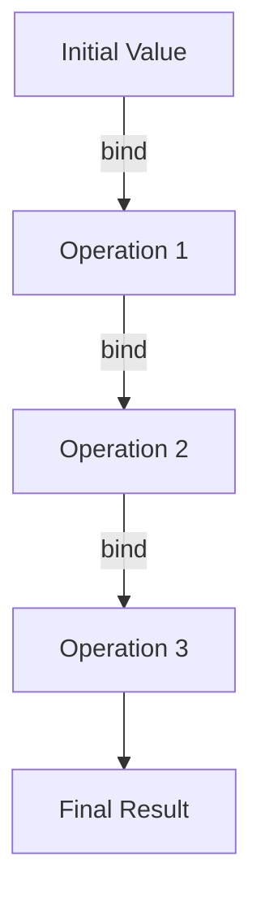

## 8.5. Using Monads in Elixir

Monads are a powerful concept in functional programming that allow developers to handle computations as chains, manage side effects, and sequence operations in a clean and structured manner. In Elixir, while monads are not built into the language as first-class citizens, we can still implement and use them to great effect. In this section, we will explore how to use monads in Elixir, focusing on handling computations as chains, managing side effects, and implementing monadic patterns for error handling and asynchronous computations.

### Handling Computations as Chains

Monads provide a way to chain computations together, allowing each step to be executed in sequence, with the output of one step serving as the input to the next. This is particularly useful when dealing with operations that may fail or produce side effects.

#### Understanding Monadic Composition

Monadic composition involves chaining operations together in a way that handles intermediate results and potential errors gracefully. This is often achieved using the `bind` operation, which applies a function to a monadic value and returns a new monadic value.

```elixir
defmodule Maybe do
  defstruct [:value]

  def bind(%Maybe{value: nil}, _func), do: %Maybe{value: nil}
  def bind(%Maybe{value: value}, func), do: func.(value)
end

# Example usage:
result = %Maybe{value: 10}
|> Maybe.bind(fn x -> %Maybe{value: x + 5} end)
|> Maybe.bind(fn x -> %Maybe{value: x * 2} end)

IO.inspect(result) # %Maybe{value: 30}
```

In this example, we define a simple `Maybe` monad that can handle computations that might result in `nil`. The `bind` function applies a given function to the value inside the monad, allowing us to chain operations together.

#### Visualizing Monadic Chains

To better understand how monadic chains work, consider the following diagram that illustrates the flow of data through a series of monadic operations:



Each operation in the chain transforms the input and passes it to the next, with the monad handling any necessary context (such as error handling or side effects).

### Managing Side Effects and Sequence-Dependent Operations

Monads are particularly useful for managing side effects and ensuring that operations are executed in the correct sequence. This is crucial in functional programming, where side effects are often minimized or isolated.

#### Using the `with` Construct

Elixir provides the `with` construct, which can be used to sequence operations and handle errors in a monadic style. The `with` construct allows us to chain together a series of pattern matches, with each step depending on the success of the previous one.

```elixir
defmodule FileReader do
  def read_file(path) do
    with {:ok, file} <- File.open(path),
         {:ok, data} <- IO.read(file, :all),
         :ok <- File.close(file) do
      {:ok, data}
    else
      error -> {:error, error}
    end
  end
end

# Example usage:
case FileReader.read_file("example.txt") do
  {:ok, data} -> IO.puts("File content: #{data}")
  {:error, reason} -> IO.puts("Failed to read file: #{reason}")
end
```

In this example, the `with` construct is used to open a file, read its contents, and then close it, all while handling any errors that may occur at each step.

### Implementing Monads

While Elixir does not have built-in support for monads, we can implement them using custom data structures and functions. This allows us to create monadic patterns that suit our specific needs.

#### Creating a Result Monad for Error Handling

A common use case for monads is error handling. We can create a `Result` monad that encapsulates either a successful value or an error.

```elixir
defmodule Result do
  defstruct [:value, :error]

  def ok(value), do: %Result{value: value}
  def error(error), do: %Result{error: error}

  def bind(%Result{error: error}, _func), do: %Result{error: error}
  def bind(%Result{value: value}, func), do: func.(value)
end

# Example usage:
result = Result.ok(10)
|> Result.bind(fn x -> Result.ok(x + 5) end)
|> Result.bind(fn x -> Result.ok(x * 2) end)

IO.inspect(result) # %Result{value: 30}
```

This `Result` monad allows us to chain operations together, with each step handling potential errors gracefully.

#### Using Monadic Libraries

There are several libraries available in the Elixir ecosystem that provide monadic abstractions, such as `Witchcraft` and `Algae`. These libraries offer a variety of monads and other functional programming constructs that can be used to simplify complex computations.

```elixir
# Using Witchcraft's Maybe monad
import Witchcraft.Maybe

result = maybe(10)
|> bind(fn x -> maybe(x + 5) end)
|> bind(fn x -> maybe(x * 2) end)

IO.inspect(result) # Just(30)
```

These libraries provide a more comprehensive set of tools for working with monads and other functional programming patterns.

### Use Cases for Monads in Elixir

Monads can be used in a variety of scenarios in Elixir, including error handling, asynchronous computations, and more.

#### Error Handling

Monads are particularly useful for handling errors in a clean and structured way. By encapsulating errors within a monad, we can chain operations together without having to explicitly handle errors at each step.

```elixir
defmodule SafeMath do
  def divide(a, b) do
    if b == 0 do
      {:error, "Division by zero"}
    else
      {:ok, a / b}
    end
  end
end

result = with {:ok, x} <- SafeMath.divide(10, 2),
             {:ok, y} <- SafeMath.divide(x, 2) do
  {:ok, y}
else
  error -> error
end

IO.inspect(result) # {:ok, 2.5}
```

In this example, the `with` construct is used to chain together a series of division operations, with errors being handled automatically.

#### Asynchronous Computations

Monads can also be used to manage asynchronous computations, allowing us to sequence operations that may complete at different times.

```elixir
defmodule Async do
  def async_task(value) do
    Task.async(fn -> value * 2 end)
  end

  def await_task(task) do
    Task.await(task)
  end
end

result = Async.async_task(10)
|> Async.await_task()
|> Async.async_task()
|> Async.await_task()

IO.inspect(result) # 40
```

In this example, we use Elixir's `Task` module to perform asynchronous computations, with monadic chaining allowing us to sequence these operations.

### Key Takeaways

- **Monads in Elixir**: While not built-in, monads can be implemented using custom data structures and libraries, allowing for clean and structured handling of computations.
- **Handling Computations as Chains**: Monads enable chaining of operations, managing side effects, and sequencing operations in a functional manner.
- **Error Handling and Asynchronous Computations**: Monads are particularly useful for error handling and managing asynchronous computations, providing a clean and structured way to handle these scenarios.

### Try It Yourself

Experiment with the code examples provided in this section by modifying them to suit your own use cases. Try creating your own monads or using existing libraries to handle computations in a monadic style.

## Quiz Time!



### What is the primary purpose of using monads in functional programming?

- [x] To handle computations as chains and manage side effects
- [ ] To create complex object hierarchies
- [ ] To replace all loops and conditionals
- [ ] To enforce strict typing

> **Explanation:** Monads are used to handle computations as chains, manage side effects, and sequence operations in a functional programming context.

### How can you implement a simple monad in Elixir?

- [x] By defining a custom data structure and a `bind` function
- [ ] By using the `defmodule` keyword alone
- [ ] By creating a new keyword in Elixir
- [ ] By overriding existing Elixir functions

> **Explanation:** A simple monad can be implemented by defining a custom data structure and a `bind` function that applies operations to the monadic value.

### Which Elixir construct can be used to sequence operations in a monadic style?

- [x] `with`
- [ ] `case`
- [ ] `if`
- [ ] `for`

> **Explanation:** The `with` construct allows for sequencing operations in a monadic style, handling errors and dependencies between operations.

### What is the role of the `bind` function in a monad?

- [x] To apply a function to a monadic value and return a new monadic value
- [ ] To initialize a monadic value
- [ ] To convert a monadic value to a string
- [ ] To terminate a monadic chain

> **Explanation:** The `bind` function applies a function to a monadic value and returns a new monadic value, enabling chaining of operations.

### Which library provides monadic abstractions in Elixir?

- [x] Witchcraft
- [ ] Ecto
- [ ] Phoenix
- [ ] Plug

> **Explanation:** Witchcraft is a library that provides monadic abstractions and other functional programming constructs in Elixir.

### What is a common use case for monads in Elixir?

- [x] Error handling
- [ ] Creating GUIs
- [ ] Managing database connections
- [ ] Designing web pages

> **Explanation:** Monads are commonly used for error handling, allowing for clean and structured handling of errors in computations.

### How can monads help with asynchronous computations?

- [x] By allowing operations to be sequenced even if they complete at different times
- [ ] By eliminating the need for asynchronous operations
- [ ] By converting all operations to synchronous ones
- [ ] By making asynchronous operations unnecessary

> **Explanation:** Monads can help manage asynchronous computations by allowing operations to be sequenced and handled in a structured way, even if they complete at different times.

### What is the result of chaining operations with a monad when an error occurs?

- [x] The chain is terminated, and the error is propagated
- [ ] The chain continues with a default value
- [ ] The error is ignored, and the chain completes
- [ ] The chain restarts from the beginning

> **Explanation:** When an error occurs in a monadic chain, the chain is typically terminated, and the error is propagated through the chain.

### Can monads be used to manage side effects in Elixir?

- [x] True
- [ ] False

> **Explanation:** Monads can be used to manage side effects in Elixir by encapsulating operations and handling their sequencing and dependencies.

### What is a key benefit of using monads in functional programming?

- [x] They provide a structured way to handle computations, errors, and side effects
- [ ] They increase the complexity of code
- [ ] They replace all imperative constructs
- [ ] They enforce a single coding style

> **Explanation:** Monads provide a structured way to handle computations, errors, and side effects, making code more predictable and easier to reason about.



Remember, this is just the beginning. As you progress, you'll find more ways to leverage monads and other functional programming patterns to build robust and maintainable applications in Elixir. Keep experimenting, stay curious, and enjoy the journey!
