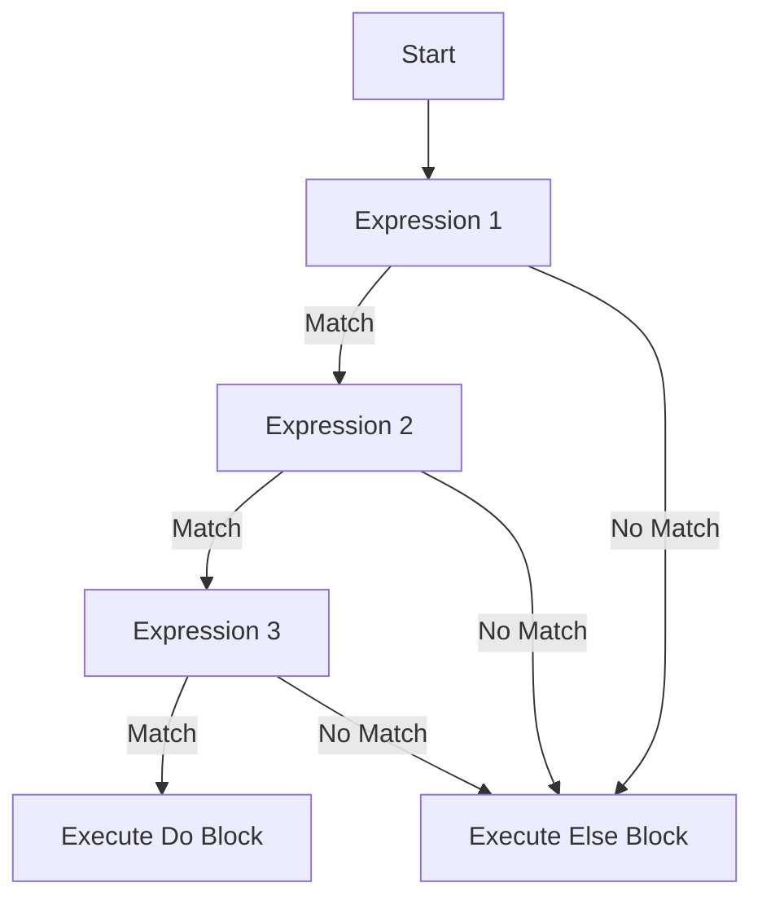

## 8.7. The `with` Construct for Control Flow

In the world of Elixir, the `with` construct is a powerful tool for managing control flow, especially when dealing with sequences of operations that may fail. It provides a clean and readable way to handle complex logic, reducing the need for deeply nested case statements. In this section, we will explore how to effectively use the `with` construct to simplify your code, handle errors gracefully, and chain operations in a functional programming style.

### Simplifying Nested Case Statements

One of the common challenges in programming is dealing with multiple operations that depend on the success of previous ones. In many languages, this often results in deeply nested conditional statements, which can be difficult to read and maintain. Elixir's `with` construct offers a solution by allowing you to flatten these sequences into a more linear and readable form.

#### Example of Nested Case Statements

Consider a scenario where you need to perform a series of operations, each of which may fail. Traditionally, you might use nested case statements to handle this:

```elixir
def process_data(input) do
  case step_one(input) do
    {:ok, result1} ->
      case step_two(result1) do
        {:ok, result2} ->
          case step_three(result2) do
            {:ok, final_result} ->
              {:ok, final_result}
            {:error, reason} ->
              {:error, reason}
          end
        {:error, reason} ->
          {:error, reason}
      end
    {:error, reason} ->
      {:error, reason}
  end
end
```

This approach quickly becomes unwieldy as the number of steps increases. The `with` construct allows us to refactor this into a more elegant solution.

#### Refactoring with the `with` Construct

Using the `with` construct, we can rewrite the above example to be more concise and readable:

```elixir
def process_data(input) do
  with {:ok, result1} <- step_one(input),
       {:ok, result2} <- step_two(result1),
       {:ok, final_result} <- step_three(result2) do
    {:ok, final_result}
  else
    {:error, reason} -> {:error, reason}
  end
end
```

In this refactored version, each step is clearly laid out in a sequence, and the error handling is centralized in the `else` block. This not only makes the code easier to read but also reduces the potential for errors.

### Implementing `with` Statements

The `with` construct in Elixir is designed to chain pattern matches together, allowing you to handle failures elegantly. It works by evaluating each expression in sequence, and if all match successfully, the final block is executed. If any expression fails to match, the `else` block is executed with the non-matching value.

#### Syntax and Structure

The basic syntax of a `with` construct is as follows:

```elixir
with pattern1 <- expression1,
     pattern2 <- expression2,
     ... do
  # Code to execute if all patterns match
else
  # Code to execute if any pattern fails
end
```

- **Patterns**: Each pattern is matched against the result of its corresponding expression.
- **Expressions**: These are evaluated in sequence, and each must match its pattern for the `do` block to execute.
- **Else Block**: This block handles any non-matching results, allowing for centralized error handling.

#### Key Features

- **Linear Flow**: The `with` construct provides a linear flow of logic, making it easier to follow the sequence of operations.
- **Centralized Error Handling**: By using the `else` block, you can handle errors in one place, reducing code duplication.
- **Pattern Matching**: Each step in the sequence uses pattern matching, which is a core feature of Elixir, to ensure that only successful operations proceed.

### Use Cases for the `with` Construct

The `with` construct is particularly useful in scenarios where you need to perform multiple operations that depend on each other. Here are some common use cases:

#### Database Transactions

When working with databases, it's common to perform a series of operations that must all succeed for the transaction to be valid. The `with` construct can help manage these operations cleanly:

```elixir
def perform_transaction(user_id, amount) do
  with {:ok, user} <- fetch_user(user_id),
       {:ok, _} <- validate_balance(user, amount),
       {:ok, _} <- debit_account(user, amount),
       {:ok, _} <- log_transaction(user, amount) do
    {:ok, "Transaction successful"}
  else
    {:error, reason} -> {:error, "Transaction failed: #{reason}"}
  end
end
```

In this example, each step of the transaction is clearly defined, and any failure is handled in the `else` block.

#### Multi-step Validations

When validating data, you often need to perform a series of checks, each of which must pass for the data to be considered valid. The `with` construct can streamline this process:

```elixir
def validate_user_input(input) do
  with {:ok, _} <- check_presence(input),
       {:ok, _} <- check_format(input),
       {:ok, _} <- check_uniqueness(input) do
    {:ok, "Input is valid"}
  else
    {:error, reason} -> {:error, "Validation failed: #{reason}"}
  end
end
```

This approach ensures that each validation step is executed in sequence, and any failure is handled gracefully.

### Visualizing the `with` Construct

To better understand how the `with` construct works, let's visualize the flow of operations using a flowchart.



**Figure 1: Flowchart of the `with` Construct**

In this flowchart, each expression is evaluated in sequence. If all expressions match their patterns, the `do` block is executed. If any expression fails to match, the `else` block is executed.

### Design Considerations

When using the `with` construct, there are several design considerations to keep in mind:

- **Error Handling**: Ensure that the `else` block is comprehensive enough to handle all possible failure cases.
- **Readability**: While the `with` construct can simplify code, it's important to maintain readability by not overusing it for overly complex logic.
- **Performance**: Consider the performance implications of each expression, especially if they involve expensive operations like database queries.

### Elixir Unique Features

Elixir's `with` construct leverages the language's powerful pattern matching capabilities, allowing for concise and expressive control flow. This is a unique feature that sets Elixir apart from many other functional programming languages, which may not have a direct equivalent.

### Differences and Similarities

The `with` construct is often compared to monadic constructs in other functional languages, such as Haskell's `do` notation. While they share similarities in chaining operations, Elixir's `with` construct is more focused on pattern matching and error handling.

### Try It Yourself

To get a hands-on understanding of the `with` construct, try modifying the code examples provided. Experiment with different patterns and expressions to see how the control flow changes. Consider adding additional steps or error cases to test the robustness of your `with` constructs.

### Knowledge Check

Before we conclude, let's review some key points:

- How does the `with` construct improve code readability?
- What are the benefits of centralized error handling with the `else` block?
- How does pattern matching enhance the functionality of the `with` construct?

### Embrace the Journey

Remember, mastering the `with` construct is just one step in your journey to becoming an expert Elixir developer. As you continue to explore Elixir's powerful features, you'll discover new ways to write clean, efficient, and maintainable code. Keep experimenting, stay curious, and enjoy the journey!

## Quiz: The `with` Construct for Control Flow



### What is the primary benefit of using the `with` construct in Elixir?

- [x] Simplifying complex control flow
- [ ] Enhancing performance
- [ ] Reducing memory usage
- [ ] Increasing code verbosity

> **Explanation:** The `with` construct simplifies complex control flow by allowing linear chaining of operations and centralized error handling.

### How does the `with` construct handle errors?

- [ ] By ignoring them
- [x] Through the `else` block
- [ ] By raising exceptions
- [ ] By logging them

> **Explanation:** The `with` construct uses the `else` block to handle errors when any pattern match fails.

### Which of the following is a common use case for the `with` construct?

- [ ] Looping through lists
- [x] Database transactions
- [ ] String manipulation
- [ ] File I/O operations

> **Explanation:** The `with` construct is commonly used for database transactions where multiple dependent operations need to succeed.

### What happens if all patterns in a `with` construct match successfully?

- [x] The `do` block is executed
- [ ] The `else` block is executed
- [ ] An error is raised
- [ ] The program exits

> **Explanation:** If all patterns match successfully, the `do` block is executed.

### What is the role of pattern matching in the `with` construct?

- [ ] To iterate over collections
- [x] To ensure each operation succeeds before proceeding
- [ ] To format strings
- [ ] To handle concurrency

> **Explanation:** Pattern matching in the `with` construct ensures that each operation succeeds before proceeding to the next.

### Can the `with` construct be used without an `else` block?

- [x] Yes, but it's not recommended
- [ ] No, it's mandatory
- [ ] Only in certain cases
- [ ] Only in Elixir 1.12 and above

> **Explanation:** While the `else` block is not mandatory, it's recommended for handling potential errors.

### What is a potential downside of overusing the `with` construct?

- [ ] Improved readability
- [ ] Increased performance
- [x] Reduced readability
- [ ] Enhanced error handling

> **Explanation:** Overusing the `with` construct can lead to reduced readability if the logic becomes too complex.

### How does the `with` construct differ from nested case statements?

- [x] It flattens the control flow
- [ ] It increases nesting
- [ ] It uses loops
- [ ] It requires more code

> **Explanation:** The `with` construct flattens the control flow, making it more linear and readable compared to nested case statements.

### What is a key feature of the `with` construct?

- [ ] It supports loops
- [x] It centralizes error handling
- [ ] It enhances concurrency
- [ ] It optimizes memory usage

> **Explanation:** A key feature of the `with` construct is its ability to centralize error handling in the `else` block.

### True or False: The `with` construct is unique to Elixir.

- [x] True
- [ ] False

> **Explanation:** The `with` construct is a unique feature of Elixir, leveraging its pattern matching capabilities for control flow.


