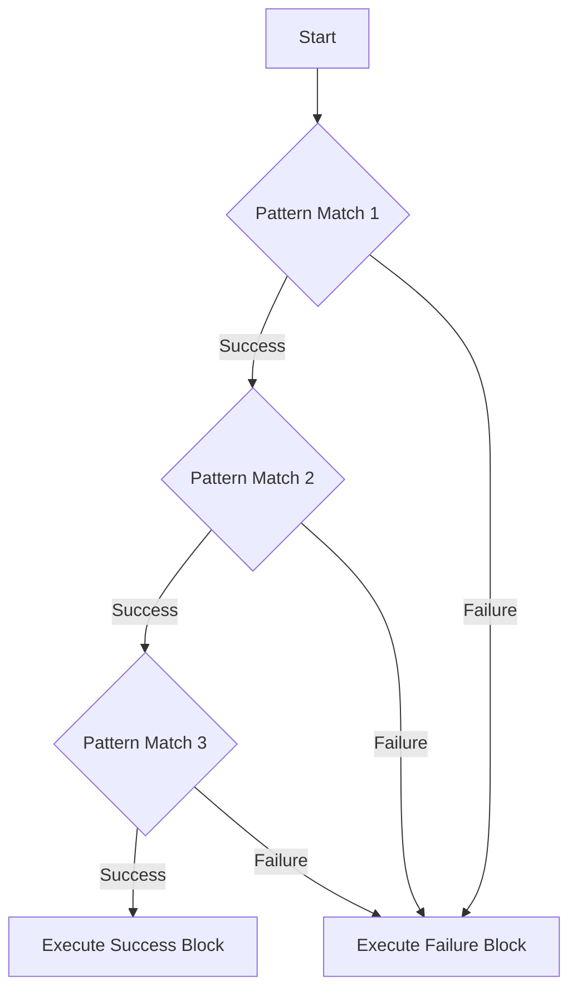

## 8.7. The `with` Construct for Control Flow

In the world of functional programming, managing complex control flows can sometimes be challenging, especially when dealing with multiple conditions and potential failure points. Elixir, with its robust functional programming paradigm, offers a powerful construct called `with` to simplify these scenarios. This article will delve into the intricacies of the `with` construct, exploring its syntax, use cases, and best practices for expert software engineers and architects.

### Simplifying Nested Case Statements

Nested `case` statements can quickly become cumbersome and difficult to read, especially when each step in a sequence of operations depends on the successful completion of the previous steps. The `with` construct provides a cleaner and more readable alternative by allowing you to chain pattern matches and handle failures elegantly.

#### Example of Nested Case Statements

Consider the following example, which uses nested `case` statements to handle a sequence of operations:

```elixir
def process_data(input) do
  case validate(input) do
    {:ok, valid_data} ->
      case transform(valid_data) do
        {:ok, transformed_data} ->
          case store(transformed_data) do
            {:ok, result} -> {:ok, result}
            {:error, reason} -> {:error, reason}
          end
        {:error, reason} -> {:error, reason}
      end
    {:error, reason} -> {:error, reason}
  end
end
```

This code is functional but not very readable. The nested structure makes it difficult to follow the flow of logic, and the repetition of error handling is tedious.

#### Flattening with `with`

The `with` construct allows us to flatten these nested structures into a more linear and readable format:

```elixir
def process_data(input) do
  with {:ok, valid_data} <- validate(input),
       {:ok, transformed_data} <- transform(valid_data),
       {:ok, result} <- store(transformed_data) do
    {:ok, result}
  else
    {:error, reason} -> {:error, reason}
  end
end
```

Here, the `with` construct chains the operations together, and the flow of logic is clear and concise. If any step fails, the `else` block handles the error, providing a unified error handling strategy.

### Implementing `with` Statements

The `with` construct is a powerful tool for chaining pattern matches and handling failures in a concise manner. Let's break down its syntax and usage.

#### Basic Syntax

The basic syntax of a `with` statement is as follows:

```elixir
with pattern1 <- expression1,
     pattern2 <- expression2,
     ... do
  # Success block
else
  # Failure block
end
```

- **Patterns**: The left side of each `<-` is a pattern that the result of the expression on the right is matched against.
- **Expressions**: The right side of each `<-` is an expression that returns a value to be matched.
- **Success Block**: If all pattern matches succeed, the code inside the `do` block is executed.
- **Failure Block**: If any pattern match fails, the `else` block is executed.

#### Handling Failures

The `else` block in a `with` construct is used to handle cases where any of the pattern matches fail. It can match on the values that caused the failure and provide appropriate error handling.

```elixir
def process_data(input) do
  with {:ok, valid_data} <- validate(input),
       {:ok, transformed_data} <- transform(valid_data),
       {:ok, result} <- store(transformed_data) do
    {:ok, result}
  else
    {:error, :validation_failed} -> {:error, "Validation failed"}
    {:error, :transformation_failed} -> {:error, "Transformation failed"}
    {:error, reason} -> {:error, reason}
  end
end
```

In this example, specific error cases are handled in the `else` block, allowing for more granular error reporting.

### Use Cases

The `with` construct is particularly useful in scenarios where multiple operations need to be performed in sequence, and each step depends on the successful completion of the previous step. Here are some common use cases:

#### Database Transactions

When working with database transactions, it's common to have multiple steps that need to be executed in sequence. The `with` construct can simplify the control flow and error handling.

```elixir
def perform_transaction(user_id, amount) do
  with {:ok, user} <- fetch_user(user_id),
       {:ok, _} <- validate_balance(user, amount),
       {:ok, transaction} <- create_transaction(user, amount),
       {:ok, _} <- update_balance(user, amount) do
    {:ok, transaction}
  else
    {:error, reason} -> {:error, reason}
  end
end
```

#### Multi-step Validations

In scenarios where multiple validations need to be performed, the `with` construct can streamline the process and ensure that all validations pass before proceeding.

```elixir
def validate_user_input(input) do
  with {:ok, _} <- validate_presence(input),
       {:ok, _} <- validate_format(input),
       {:ok, _} <- validate_uniqueness(input) do
    {:ok, "Input is valid"}
  else
    {:error, :missing_field} -> {:error, "Missing required field"}
    {:error, :invalid_format} -> {:error, "Invalid format"}
    {:error, :not_unique} -> {:error, "Input is not unique"}
  end
end
```

### Design Considerations

When using the `with` construct, there are several design considerations to keep in mind:

- **Error Handling**: Ensure that the `else` block is comprehensive and handles all potential failure cases.
- **Readability**: While the `with` construct can improve readability, overusing it or chaining too many operations can have the opposite effect. Aim for a balance between conciseness and clarity.
- **Performance**: Consider the performance implications of each operation in the chain, especially if they involve I/O or complex computations.

### Elixir Unique Features

Elixir's pattern matching and immutability make the `with` construct particularly powerful. The ability to match on specific patterns and handle failures in a functional way aligns well with Elixir's design philosophy.

### Differences and Similarities

The `with` construct is unique to Elixir and does not have a direct equivalent in many other programming languages. However, it shares similarities with monadic constructs in languages like Haskell, where operations are chained together, and failures are propagated through the chain.

### Try It Yourself

To get a better understanding of the `with` construct, try modifying the code examples provided. Experiment with different patterns and failure cases to see how the `with` construct handles them.

### Visualizing the `with` Construct

To better understand the flow of the `with` construct, let's visualize it using a flowchart:


```mermaid
flowchart TD
    A[Start] --> B{Pattern Match 1}
    B -- Success --> C{Pattern Match 2}
    C -- Success --> D{Pattern Match 3}
    D -- Success --> E[Execute Success Block]
    B -- Failure --> F[Execute Failure Block]
    C -- Failure --> F
    D -- Failure --> F
```

In this diagram, each pattern match is represented as a decision point. If all matches succeed, the success block is executed. If any match fails, the failure block is executed.

### Knowledge Check

Before we conclude, let's reinforce what we've learned with a few questions:

1. What is the primary purpose of the `with` construct in Elixir?
2. How does the `with` construct improve code readability compared to nested `case` statements?
3. What role does the `else` block play in a `with` statement?
4. Can you use the `with` construct for operations that do not involve pattern matching?
5. What are some common use cases for the `with` construct?

### Embrace the Journey

Remember, mastering the `with` construct is just one step in your journey as an Elixir developer. As you continue to explore the language, you'll discover even more powerful tools and patterns that will help you write clean, efficient, and maintainable code. Keep experimenting, stay curious, and enjoy the journey!

## Quiz Time!



### What is the primary purpose of the `with` construct in Elixir?

- [x] To simplify complex control flows by chaining pattern matches and handling failures.
- [ ] To perform asynchronous operations.
- [ ] To manage state in a functional way.
- [ ] To replace all `case` statements in the code.

> **Explanation:** The `with` construct is designed to simplify complex control flows by allowing developers to chain pattern matches and handle failures in a clear and concise manner.

### How does the `with` construct improve code readability compared to nested `case` statements?

- [x] By flattening nested structures into a linear format.
- [ ] By reducing the number of lines of code.
- [ ] By eliminating the need for error handling.
- [ ] By automatically optimizing performance.

> **Explanation:** The `with` construct improves readability by flattening nested `case` statements into a linear format, making the flow of logic easier to follow.

### What role does the `else` block play in a `with` statement?

- [x] It handles cases where any pattern match fails.
- [ ] It executes additional operations after the success block.
- [ ] It is optional and rarely used.
- [ ] It is used to define default values.

> **Explanation:** The `else` block in a `with` statement is used to handle cases where any of the pattern matches fail, allowing for custom error handling.

### Can you use the `with` construct for operations that do not involve pattern matching?

- [ ] Yes, it is designed for all types of operations.
- [x] No, it is specifically for chaining pattern matches.
- [ ] Yes, but it is not recommended.
- [ ] No, it is only for error handling.

> **Explanation:** The `with` construct is specifically designed for chaining pattern matches and is not intended for operations that do not involve pattern matching.

### What are some common use cases for the `with` construct?

- [x] Database transactions and multi-step validations.
- [ ] Real-time data processing.
- [ ] Asynchronous task execution.
- [ ] Memory management.

> **Explanation:** Common use cases for the `with` construct include scenarios like database transactions and multi-step validations where multiple operations need to be performed in sequence.

### What is a key benefit of using the `with` construct?

- [x] It provides a unified error handling strategy.
- [ ] It eliminates the need for pattern matching.
- [ ] It automatically optimizes code performance.
- [ ] It replaces all other control flow constructs.

> **Explanation:** A key benefit of the `with` construct is that it provides a unified error handling strategy, allowing developers to handle failures in a consistent manner.

### How does the `with` construct handle failures?

- [x] By executing the `else` block with the failure reason.
- [ ] By retrying the failed operation.
- [ ] By logging the error and continuing.
- [ ] By terminating the process.

> **Explanation:** The `with` construct handles failures by executing the `else` block with the reason for the failure, allowing for custom error handling.

### Is the `with` construct unique to Elixir?

- [x] Yes, it is a feature specific to Elixir.
- [ ] No, it is common in many programming languages.
- [ ] Yes, but it is similar to constructs in other languages.
- [ ] No, it is a standard functional programming feature.

> **Explanation:** The `with` construct is unique to Elixir and does not have a direct equivalent in many other programming languages.

### What should you consider when using the `with` construct?

- [x] Error handling, readability, and performance.
- [ ] Only the number of operations.
- [ ] The size of the codebase.
- [ ] The version of Elixir being used.

> **Explanation:** When using the `with` construct, developers should consider error handling, readability, and performance to ensure the code remains maintainable and efficient.

### True or False: The `with` construct can replace all `case` statements in Elixir code.

- [ ] True
- [x] False

> **Explanation:** False. While the `with` construct can simplify certain control flows, it is not a replacement for all `case` statements. It is specifically useful for chaining pattern matches and handling failures.


