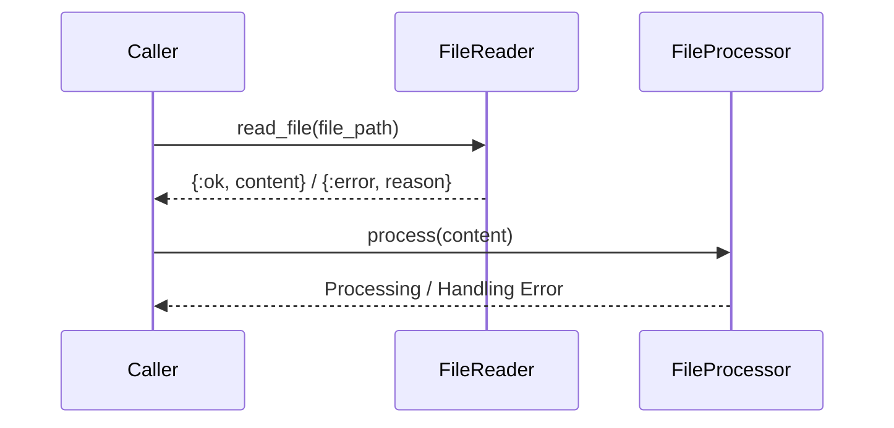

## 8.8. Error Handling Patterns with `{:ok, result}` and `{:error, reason}`

Error handling is a critical aspect of software development, especially in functional programming languages like Elixir. In this section, we'll delve into the error handling patterns using tagged tuples, specifically `{:ok, result}` and `{:error, reason}`. These patterns are instrumental in providing a consistent and clear approach to managing errors, enhancing both error propagation and debugging.

### Consistent Error Representation

In Elixir, it's common to represent the outcome of operations using tagged tuples. This approach provides a uniform way to handle both successful and unsuccessful results, facilitating easier pattern matching and error management.

#### Using Tagged Tuples for Function Results

Tagged tuples are a simple yet powerful way to encapsulate the result of a function. By using a tuple with an atom as the first element, we can clearly distinguish between successful and erroneous outcomes.

```elixir
defmodule FileReader do
  def read_file(file_path) do
    case File.read(file_path) do
      {:ok, content} -> {:ok, content}
      {:error, reason} -> {:error, reason}
    end
  end
end
```

In the example above, the `read_file/1` function returns `{:ok, content}` if the file is read successfully, and `{:error, reason}` if an error occurs. This pattern ensures that the caller can easily handle both cases.

### Pattern Matching on Results

Elixir's pattern matching capabilities make it particularly well-suited for handling tagged tuples. By matching on the tuple's first element, we can direct the flow of our program based on the outcome of an operation.

#### Simplifying Result Handling with Pattern Matching

Pattern matching allows us to write concise and expressive code that handles both success and error cases.

```elixir
defmodule FileProcessor do
  def process(file_path) do
    case FileReader.read_file(file_path) do
      {:ok, content} -> process_content(content)
      {:error, reason} -> handle_error(reason)
    end
  end

  defp process_content(content) do
    IO.puts("Processing content: #{content}")
  end

  defp handle_error(reason) do
    IO.puts("Failed to read file: #{reason}")
  end
end
```

In this example, the `process/1` function uses pattern matching to determine whether to proceed with processing the file content or handle an error.

### Benefits of Using Tagged Tuples

The use of tagged tuples for error handling offers several advantages:

- **Clear Error Propagation**: By consistently using `{:ok, result}` and `{:error, reason}`, we can propagate errors through the call stack, making it easier to trace the source of an error.
- **Easier Debugging**: With a uniform error handling approach, debugging becomes more straightforward, as developers can quickly identify and address issues.
- **Improved Code Readability**: Pattern matching on tagged tuples leads to cleaner and more readable code, as the intent of each operation is clear.

### Elixir Unique Features

Elixir's functional nature and support for pattern matching make it uniquely suited for this error handling pattern. The language's emphasis on immutability and pure functions further enhances the reliability and predictability of error handling.

### Design Considerations

When implementing error handling patterns in Elixir, consider the following:

- **Consistency**: Ensure that all functions in your application consistently return tagged tuples for error handling.
- **Documentation**: Clearly document the expected return values for each function, including the possible error reasons.
- **Error Granularity**: Decide on the level of granularity for error reasons. More detailed error reasons can aid debugging but may increase complexity.

### Differences and Similarities

While the `{:ok, result}` and `{:error, reason}` pattern is similar to the `Result` type in languages like Rust, Elixir's pattern matching provides a more concise and expressive way to handle these results. Unlike exceptions in object-oriented languages, this pattern encourages explicit error handling, leading to more robust and maintainable code.

### Try It Yourself

To gain a deeper understanding of this pattern, try modifying the `FileReader` and `FileProcessor` modules to handle different file operations, such as writing to a file or deleting a file. Experiment with different error reasons and see how they affect the program's flow.

```elixir
defmodule FileModifier do
  def write_file(file_path, content) do
    case File.write(file_path, content) do
      :ok -> {:ok, "File written successfully"}
      {:error, reason} -> {:error, reason}
    end
  end

  def delete_file(file_path) do
    case File.rm(file_path) do
      :ok -> {:ok, "File deleted successfully"}
      {:error, reason} -> {:error, reason}
    end
  end
end
```

### Visualizing Error Handling Flow

To better understand the flow of error handling in Elixir, consider the following sequence diagram:



This diagram illustrates the interaction between the caller, the `FileReader`, and the `FileProcessor`, highlighting the flow of data and error handling.

### References and Links

- [Elixir Documentation on Pattern Matching](https://elixir-lang.org/getting-started/pattern-matching.html)
- [Elixir's File Module](https://hexdocs.pm/elixir/File.html)
- [Functional Programming Concepts](https://en.wikipedia.org/wiki/Functional_programming)

### Knowledge Check

1. What are the benefits of using tagged tuples for error handling in Elixir?
2. How does pattern matching enhance error handling in Elixir?
3. What are some considerations when implementing error handling patterns in Elixir?

### Embrace the Journey

Remember, mastering error handling in Elixir is a journey. As you continue to explore and experiment with these patterns, you'll gain a deeper understanding of functional programming and error management. Keep practicing, stay curious, and enjoy the process!

## Quiz Time!



### What is the main advantage of using tagged tuples for error handling in Elixir?

- [x] Consistent error representation
- [ ] Improved performance
- [ ] Reduced memory usage
- [ ] Simplified syntax

> **Explanation:** Tagged tuples provide a consistent way to represent errors, making it easier to handle and propagate them.

### How does pattern matching help in error handling?

- [x] It allows for concise and clear handling of different outcomes.
- [ ] It automatically logs errors.
- [ ] It improves the performance of the program.
- [ ] It eliminates the need for error handling.

> **Explanation:** Pattern matching enables concise and clear handling of different outcomes by matching on the tuple's first element.

### What should be considered when implementing error handling patterns in Elixir?

- [x] Consistency and documentation
- [ ] Performance and memory usage
- [ ] Syntax and readability
- [ ] Automatic error logging

> **Explanation:** Consistency and documentation are crucial for effective error handling patterns in Elixir.

### Which of the following is a benefit of using tagged tuples?

- [x] Easier debugging
- [ ] Automatic error resolution
- [ ] Improved syntax
- [ ] Reduced code size

> **Explanation:** Tagged tuples make debugging easier by providing a clear and consistent way to handle errors.

### What is a key feature of Elixir that enhances error handling?

- [x] Pattern matching
- [ ] Object-oriented programming
- [ ] Dynamic typing
- [ ] Inheritance

> **Explanation:** Pattern matching is a key feature of Elixir that enhances error handling by allowing concise handling of different outcomes.

### In the context of Elixir, what does the tuple `{:error, reason}` represent?

- [x] An error outcome with a specific reason
- [ ] A successful operation
- [ ] A function call
- [ ] A data structure

> **Explanation:** The tuple `{:error, reason}` represents an error outcome with a specific reason.

### How can tagged tuples improve code readability?

- [x] By providing a clear and consistent way to handle results
- [ ] By reducing the number of lines of code
- [ ] By using less complex syntax
- [ ] By automatically handling errors

> **Explanation:** Tagged tuples improve code readability by providing a clear and consistent way to handle results.

### What is a common pattern for handling file operations in Elixir?

- [x] Using tagged tuples to represent outcomes
- [ ] Using exceptions to catch errors
- [ ] Using global variables to store results
- [ ] Using inline error handling

> **Explanation:** A common pattern for handling file operations in Elixir is using tagged tuples to represent outcomes.

### True or False: Elixir's pattern matching can automatically resolve errors.

- [ ] True
- [x] False

> **Explanation:** Elixir's pattern matching does not automatically resolve errors; it allows for clear handling of different outcomes.

### What is the purpose of the `FileReader` module in the example?

- [x] To read files and return results using tagged tuples
- [ ] To write files and handle errors
- [ ] To process file content
- [ ] To delete files

> **Explanation:** The `FileReader` module is used to read files and return results using tagged tuples.


