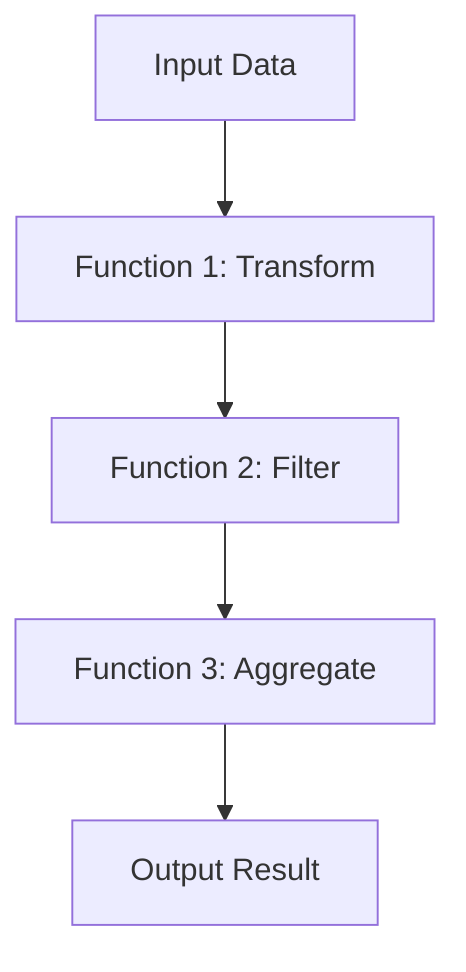

## 8.9. Pipeline Patterns with `|>`

In the realm of functional programming, Elixir stands out with its elegant and expressive syntax, and one of its most powerful features is the pipeline operator `|>`. This operator allows developers to chain function calls in a way that is both readable and efficient. In this section, we will delve into the intricacies of pipeline patterns, exploring how to effectively use the `|>` operator to enhance your Elixir applications.

### Chaining Function Calls

The pipeline operator `|>` is a syntactic sugar that simplifies the process of passing the output of one function as the input to the next. This is akin to Unix pipes, where the output of one command serves as the input to another. In Elixir, this operator enhances code readability and maintainability by reducing nested function calls and making the data flow explicit.

#### Example of Chaining Function Calls

Consider a scenario where you need to process a list of numbers by doubling each number, filtering out the odd numbers, and then summing the result. Without the pipeline operator, the code might look like this:

```elixir
sum = Enum.sum(Enum.filter(Enum.map([1, 2, 3, 4], fn x -> x * 2 end), fn x -> rem(x, 2) == 0 end))
```

Using the pipeline operator, the same logic becomes more readable:

```elixir
sum = [1, 2, 3, 4]
|> Enum.map(&(&1 * 2))
|> Enum.filter(&rem(&1, 2) == 0)
|> Enum.sum()
```

In this example, each function call is clearly separated, and the data transformation process is easy to follow.

### Designing Functions for Pipelines

To fully leverage the power of the pipeline operator, it's crucial to design functions that are pipeline-friendly. This typically means structuring functions to accept the data to be transformed as the first argument. This convention allows functions to seamlessly integrate into a pipeline.

#### Example of Pipeline-Friendly Function Design

Let's create a simple module with functions designed for pipeline use:

```elixir
defmodule DataProcessor do
  def double(numbers) do
    Enum.map(numbers, &(&1 * 2))
  end

  def filter_even(numbers) do
    Enum.filter(numbers, &rem(&1, 2) == 0)
  end

  def sum(numbers) do
    Enum.sum(numbers)
  end
end
```

With these functions, you can easily create a pipeline:

```elixir
result = [1, 2, 3, 4]
|> DataProcessor.double()
|> DataProcessor.filter_even()
|> DataProcessor.sum()
```

This approach not only improves readability but also encourages modular and reusable code.

### Use Cases for Pipeline Patterns

Pipeline patterns are particularly useful in scenarios involving data processing and functional transformations. They allow for a clean and concise representation of complex data flows, making them ideal for tasks such as data transformation, validation, and aggregation.

#### Data Processing Example

Imagine you are working with a dataset of user information and need to extract and process specific fields. Pipelines can simplify this task:

```elixir
users = [
  %{name: "Alice", age: 30},
  %{name: "Bob", age: 25},
  %{name: "Charlie", age: 35}
]

average_age = users
|> Enum.map(& &1.age)
|> Enum.sum()
|> Kernel./(length(users))
```

In this example, the pipeline extracts the ages, sums them, and calculates the average, all in a clear and concise manner.

### Visualizing Pipeline Patterns

To better understand how data flows through a pipeline, let's visualize the process using a flowchart. This diagram illustrates the transformation of data as it passes through each function in the pipeline.



**Diagram Description:** This flowchart represents a typical pipeline pattern, where data is transformed, filtered, and aggregated through a series of functions.

### Key Considerations

When using pipeline patterns, keep the following considerations in mind:

- **Function Signature:** Ensure that functions are designed to accept the data to be transformed as the first argument.
- **Readability:** Use pipelines to enhance code readability, but avoid overly long pipelines that may become difficult to follow.
- **Error Handling:** Consider how errors will be handled within a pipeline. You may need to incorporate error-checking functions or use pattern matching to manage exceptions.

### Elixir Unique Features

Elixir's pipeline operator is a unique feature that sets it apart from many other functional programming languages. Its integration with Elixir's core libraries, such as `Enum` and `Stream`, makes it a powerful tool for data manipulation and transformation.

### Differences and Similarities

The pipeline operator in Elixir is similar to method chaining in object-oriented languages but offers greater flexibility due to Elixir's functional nature. Unlike method chaining, which is limited to objects and their methods, the pipeline operator can chain any functions that adhere to the pipeline-friendly design.

### Try It Yourself

To deepen your understanding of pipeline patterns, try modifying the code examples provided. Experiment with different data sets, add additional transformation functions, or incorporate error handling into the pipeline. This hands-on approach will solidify your grasp of pipeline patterns and their applications.

### Knowledge Check

- **Question:** What is the primary benefit of using the pipeline operator in Elixir?
- **Exercise:** Refactor a nested function call into a pipeline using the `|>` operator.

### Embrace the Journey

Remember, mastering pipeline patterns is just one step in your journey to becoming an expert Elixir developer. As you continue to explore Elixir's features, you'll discover new ways to write clean, efficient, and maintainable code. Keep experimenting, stay curious, and enjoy the journey!

## Quiz: Pipeline Patterns with `|>`



### What is the primary purpose of the pipeline operator `|>` in Elixir?

- [x] To chain function calls in a readable manner
- [ ] To perform asynchronous operations
- [ ] To handle errors in a pipeline
- [ ] To optimize memory usage

> **Explanation:** The pipeline operator `|>` is used to chain function calls, making the code more readable and maintainable by passing the output of one function as the input to the next.

### How should functions be designed to be pipeline-friendly?

- [x] By accepting the data to be transformed as the first argument
- [ ] By returning a tuple with `{:ok, result}`
- [ ] By using recursion
- [ ] By implementing GenServer

> **Explanation:** Functions should be designed to accept the data to be transformed as the first argument to seamlessly integrate into a pipeline.

### Which of the following is a benefit of using pipeline patterns?

- [x] Improved code readability
- [ ] Increased execution speed
- [ ] Reduced memory usage
- [ ] Enhanced security

> **Explanation:** Pipeline patterns improve code readability by making the data flow explicit and reducing nested function calls.

### What is a common use case for pipeline patterns?

- [x] Data processing and functional transformations
- [ ] Network communication
- [ ] File I/O operations
- [ ] User interface design

> **Explanation:** Pipeline patterns are commonly used for data processing and functional transformations, allowing for a clean and concise representation of complex data flows.

### How can errors be handled in a pipeline?

- [x] By incorporating error-checking functions
- [ ] By using the `try` and `catch` keywords
- [ ] By ignoring them
- [ ] By using global variables

> **Explanation:** Errors in a pipeline can be handled by incorporating error-checking functions or using pattern matching to manage exceptions.

### What is a key difference between the pipeline operator and method chaining?

- [x] The pipeline operator can chain any functions, while method chaining is limited to objects and their methods
- [ ] The pipeline operator is only used for asynchronous operations
- [ ] The pipeline operator requires recursion
- [ ] The pipeline operator is slower than method chaining

> **Explanation:** The pipeline operator can chain any functions that adhere to the pipeline-friendly design, whereas method chaining is limited to objects and their methods.

### What is a potential pitfall of using overly long pipelines?

- [x] They may become difficult to follow
- [ ] They increase memory usage
- [ ] They reduce code execution speed
- [ ] They cause syntax errors

> **Explanation:** Overly long pipelines may become difficult to follow, reducing code readability and maintainability.

### Which Elixir core library is commonly used with the pipeline operator for data manipulation?

- [x] Enum
- [ ] GenServer
- [ ] Logger
- [ ] Ecto

> **Explanation:** The `Enum` library is commonly used with the pipeline operator for data manipulation and transformation.

### True or False: The pipeline operator `|>` is unique to Elixir and has no equivalent in other programming languages.

- [ ] True
- [x] False

> **Explanation:** While the pipeline operator `|>` is a unique feature of Elixir, similar concepts exist in other languages, such as method chaining in object-oriented languages.

### What is a recommended practice when designing functions for pipelines?

- [x] Ensure they accept the data to be transformed as the first argument
- [ ] Use global variables for data storage
- [ ] Implement them as GenServers
- [ ] Avoid using pattern matching

> **Explanation:** When designing functions for pipelines, it's recommended to ensure they accept the data to be transformed as the first argument to facilitate seamless integration into a pipeline.


