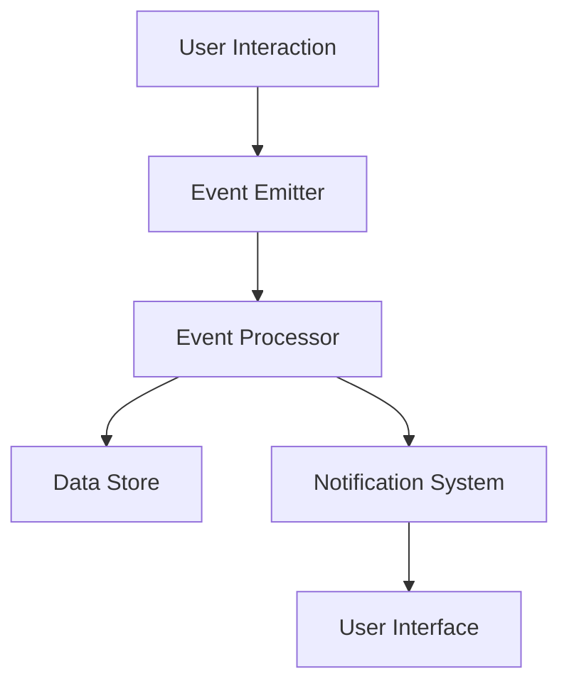

## 9.1. Introduction to Reactive Programming

Reactive programming is a paradigm that focuses on building responsive systems capable of reacting to changes in data and events. In the context of Elixir, a language known for its concurrency and fault-tolerance, reactive programming can be a powerful tool for creating scalable and resilient applications. This section will delve into the principles of reactive programming, its benefits, and how it can be effectively implemented in Elixir.

### Responsive Systems

Responsive systems are designed to react to events and data changes in real-time. This responsiveness is crucial in modern applications where user expectations for real-time updates and interactions are high. In Elixir, the Actor Model and the OTP framework provide a robust foundation for building such systems.

#### Designing Applications That React to Events and Data Changes

To design a responsive system, you must focus on the following aspects:

1. **Event-Driven Architecture**: This involves structuring your application around events. Each component of the system reacts to events, processes them, and potentially emits new events. This decouples components and allows for more flexible and scalable architectures.

2. **Asynchronous Data Streams**: Data streams allow for the continuous flow of data between components. By processing data asynchronously, systems can handle high-throughput scenarios without blocking operations.

3. **Backpressure Management**: In a system where data flows continuously, managing backpressure is crucial. Backpressure ensures that the system does not become overwhelmed by data it cannot process in time.

4. **State Management**: Reactive systems often need to manage state in a way that is consistent and reliable. Elixir's immutable data structures and process-based state management provide a solid foundation for this.

### Principles of Reactive Programming

Reactive programming is built on several core principles that guide the development of responsive systems:

#### Asynchronous Data Streams

Asynchronous data streams are the backbone of reactive programming. They allow systems to process data as it arrives, without waiting for other operations to complete. This is particularly useful in scenarios where data is generated continuously, such as sensor data or user interactions.

**Example:**

```elixir
# Define a simple asynchronous data stream using GenStage
defmodule Producer do
  use GenStage

  def start_link(initial) do
    GenStage.start_link(__MODULE__, initial, name: __MODULE__)
  end

  def init(initial) do
    {:producer, initial}
  end

  def handle_demand(demand, state) when demand > 0 do
    events = Enum.to_list(state..(state + demand - 1))
    {:noreply, events, state + demand}
  end
end

defmodule Consumer do
  use GenStage

  def start_link() do
    GenStage.start_link(__MODULE__, :ok, name: __MODULE__)
  end

  def init(:ok) do
    {:consumer, :ok}
  end

  def handle_events(events, _from, state) do
    for event <- events do
      IO.inspect(event, label: "Consumed")
    end
    {:noreply, [], state}
  end
end

{:ok, producer} = Producer.start_link(0)
{:ok, consumer} = Consumer.start_link()
GenStage.sync_subscribe(consumer, to: producer)
```

In this example, we define a simple producer-consumer setup using GenStage, which is a powerful abstraction for handling asynchronous data streams in Elixir.

#### Backpressure and Event Propagation

Backpressure is a mechanism that allows a system to handle varying loads by controlling the flow of data. It ensures that producers do not overwhelm consumers with more data than they can handle.

**Example:**

In the previous example, GenStage automatically manages backpressure by controlling the demand from the consumer to the producer. This ensures that the producer only sends as much data as the consumer can process.

#### Event Propagation

Event propagation is the process of transmitting events through a system. In a reactive system, components listen for events, process them, and may emit new events in response.

**Example:**

```elixir
defmodule EventEmitter do
  use GenServer

  def start_link() do
    GenServer.start_link(__MODULE__, :ok, name: __MODULE__)
  end

  def init(:ok) do
    {:ok, []}
  end

  def handle_call({:emit, event}, _from, state) do
    IO.puts("Event received: #{event}")
    {:reply, :ok, [event | state]}
  end
end

{:ok, emitter} = EventEmitter.start_link()
GenServer.call(emitter, {:emit, "Hello, World!"})
```

In this example, we create a simple GenServer that acts as an event emitter. It receives events and logs them, demonstrating basic event propagation.

### Benefits of Reactive Programming

Reactive programming offers several benefits that make it an attractive choice for building modern applications:

1. **Scalability**: Reactive systems can handle a large number of concurrent operations, making them suitable for high-load scenarios.

2. **Resilience**: By decoupling components and using asynchronous communication, reactive systems can recover from failures more easily.

3. **Real-Time Responsiveness**: Reactive systems can provide real-time updates and interactions, enhancing the user experience.

4. **Flexibility**: The event-driven nature of reactive systems allows for easy modification and extension of functionality.

### Visualizing Reactive Systems

To better understand the flow of events and data in a reactive system, let's visualize a simple event-driven architecture using Mermaid.js:



**Diagram Description**: This diagram represents a basic event-driven architecture. User interactions trigger events that are emitted by the Event Emitter. These events are processed by the Event Processor, which may update a Data Store or send notifications to the User Interface.

### Elixir's Unique Features for Reactive Programming

Elixir, with its roots in Erlang, offers several unique features that make it well-suited for reactive programming:

- **Lightweight Processes**: Elixir's lightweight processes allow for massive concurrency, which is essential for handling asynchronous data streams.
- **Fault Tolerance**: The "let it crash" philosophy and OTP's supervision trees provide resilience in the face of failures.
- **Immutable Data Structures**: Immutability ensures that data remains consistent across concurrent operations.
- **Pattern Matching**: Elixir's pattern matching simplifies the handling of complex data structures and event processing.

### Differences and Similarities with Other Paradigms

Reactive programming shares similarities with other paradigms, such as event-driven programming and functional programming. However, it distinguishes itself through its focus on asynchronous data streams and backpressure management.

- **Event-Driven vs. Reactive**: While both paradigms focus on events, reactive programming emphasizes the flow of data and the propagation of changes through the system.
- **Functional vs. Reactive**: Both paradigms value immutability and pure functions, but reactive programming extends these concepts to handle asynchronous data flows.

### Try It Yourself

To deepen your understanding of reactive programming in Elixir, try modifying the code examples provided. Experiment with different data sources, event types, and backpressure strategies. Observe how these changes affect the system's responsiveness and scalability.

### References and Links

- [Reactive Programming in Elixir](https://elixir-lang.org/getting-started/mix-otp/introduction-to-genstage.html)
- [GenStage Documentation](https://hexdocs.pm/gen_stage/GenStage.html)
- [Elixir's Concurrency Model](https://elixir-lang.org/getting-started/processes.html)

### Knowledge Check

- What are the core principles of reactive programming?
- How does Elixir's concurrency model support reactive programming?
- What is backpressure, and why is it important in reactive systems?

### Embrace the Journey

Remember, mastering reactive programming is a journey. As you explore and experiment with these concepts, you'll gain a deeper understanding of how to build responsive, scalable systems. Keep pushing the boundaries, stay curious, and enjoy the process!

## Quiz: Introduction to Reactive Programming



### What is a key benefit of reactive programming?

- [x] Scalability
- [ ] Simplicity
- [ ] Synchronous processing
- [ ] Manual memory management

> **Explanation:** Reactive programming enhances scalability by allowing systems to handle numerous concurrent operations efficiently.

### Which Elixir feature is crucial for handling asynchronous data streams?

- [x] Lightweight processes
- [ ] Mutable state
- [ ] Synchronous functions
- [ ] Manual memory management

> **Explanation:** Elixir's lightweight processes enable massive concurrency, which is essential for managing asynchronous data streams.

### What is backpressure in reactive systems?

- [x] A mechanism to control data flow
- [ ] A type of error handling
- [ ] A method for data encryption
- [ ] A way to increase data throughput

> **Explanation:** Backpressure is a mechanism that regulates the flow of data to prevent overwhelming the system.

### How does Elixir's "let it crash" philosophy contribute to reactive programming?

- [x] It enhances fault tolerance
- [ ] It simplifies code readability
- [ ] It increases data throughput
- [ ] It reduces memory usage

> **Explanation:** The "let it crash" philosophy improves fault tolerance by allowing processes to fail and recover gracefully.

### What is the role of an event emitter in a reactive system?

- [x] To generate and propagate events
- [ ] To store data persistently
- [ ] To manage user authentication
- [ ] To encrypt data

> **Explanation:** An event emitter generates and propagates events throughout the system, enabling components to react to changes.

### Which of the following is NOT a principle of reactive programming?

- [ ] Asynchronous data streams
- [ ] Backpressure management
- [x] Synchronous processing
- [ ] Event propagation

> **Explanation:** Reactive programming focuses on asynchronous processing, not synchronous.

### What is a common use case for reactive programming?

- [x] Real-time data processing
- [ ] Batch processing
- [ ] Manual memory management
- [ ] Static website generation

> **Explanation:** Reactive programming is ideal for real-time data processing due to its ability to handle continuous data flows.

### How does Elixir's pattern matching aid reactive programming?

- [x] Simplifies event handling
- [ ] Increases memory usage
- [ ] Enhances synchronous processing
- [ ] Complicates data flow

> **Explanation:** Pattern matching simplifies the handling of complex data structures and event processing in reactive systems.

### What is the primary focus of reactive programming?

- [x] Asynchronous data flow
- [ ] Manual memory management
- [ ] Synchronous processing
- [ ] Static data storage

> **Explanation:** Reactive programming primarily focuses on managing asynchronous data flows and event-driven architectures.

### True or False: Reactive programming in Elixir relies heavily on mutable state.

- [ ] True
- [x] False

> **Explanation:** Reactive programming in Elixir relies on immutable data structures to ensure consistency across concurrent operations.




