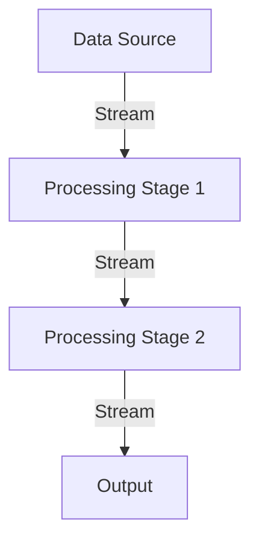
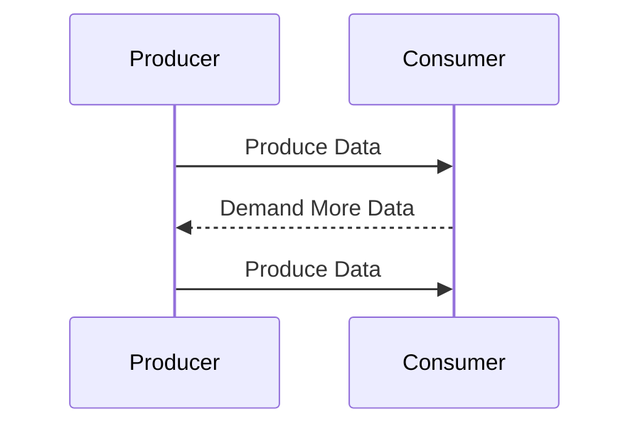

## 9.1. Introduction to Reactive Programming

As software engineers and architects, we are continually seeking ways to build systems that are not only efficient but also resilient and responsive to the ever-changing demands of users and data. Reactive programming offers a paradigm that aligns perfectly with these goals, especially in the context of Elixir, a language designed for concurrency and fault tolerance. In this section, we delve into the core concepts of reactive programming, its principles, benefits, and how it can be effectively implemented in Elixir.

### Responsive Systems

Reactive programming is fundamentally about creating systems that are responsive to events and data changes. This responsiveness is achieved through the use of asynchronous data streams and event-driven architectures. In Elixir, these concepts are seamlessly integrated with the language's concurrency model, allowing developers to build applications that can handle high loads and provide real-time feedback to users.

#### Designing Applications that React to Events and Data Changes

In a reactive system, components are designed to react to changes in their environment. This means that instead of polling for changes or waiting for a request, components are notified of changes and can respond immediately. This approach leads to systems that are more efficient and responsive, as they can handle events as they occur rather than in a batch or scheduled manner.

Consider a real-time chat application. In a reactive system, messages are pushed to clients as soon as they are sent, rather than clients having to poll the server for new messages. This results in a more seamless and engaging user experience.

### Principles of Reactive Programming

Reactive programming is built on several key principles that guide the design and implementation of reactive systems. Understanding these principles is crucial for leveraging the full potential of reactive programming in Elixir.

#### Asynchronous Data Streams

One of the core concepts of reactive programming is the use of asynchronous data streams. These streams represent sequences of data or events that can be processed asynchronously. In Elixir, this can be achieved using processes and message passing, allowing for the creation of complex data pipelines that can handle large volumes of data efficiently.

##### Code Example: Asynchronous Data Stream in Elixir

```elixir
defmodule ReactiveStream do
  def start_stream do
    stream = Stream.interval(1000) # Emit a value every second
    Enum.each(stream, fn _ ->
      IO.puts("New data received at #{Timex.now()}")
    end)
  end
end

ReactiveStream.start_stream()
```

In this example, we create a simple stream that emits a value every second. The `Stream.interval/1` function is used to create an asynchronous data stream, and `Enum.each/2` is used to process each value as it is emitted.

#### Backpressure

Backpressure is a mechanism for handling situations where the rate of data production exceeds the rate of data consumption. In reactive systems, it's essential to manage backpressure to prevent resource exhaustion and ensure system stability. Elixir's GenStage and Flow libraries provide powerful tools for managing backpressure in concurrent applications.

##### Code Example: Managing Backpressure with GenStage

```elixir
defmodule Producer do
  use GenStage

  def start_link(initial) do
    GenStage.start_link(__MODULE__, initial, name: __MODULE__)
  end

  def init(initial) do
    {:producer, initial}
  end

  def handle_demand(demand, state) do
    events = Enum.to_list(state..state + demand - 1)
    {:noreply, events, state + demand}
  end
end

defmodule Consumer do
  use GenStage

  def start_link do
    GenStage.start_link(__MODULE__, :ok, name: __MODULE__)
  end

  def init(:ok) do
    {:consumer, :ok}
  end

  def handle_events(events, _from, state) do
    Enum.each(events, fn event ->
      IO.inspect(event, label: "Consumed event")
    end)
    {:noreply, [], state}
  end
end

{:ok, producer} = Producer.start_link(0)
{:ok, consumer} = Consumer.start_link()
GenStage.sync_subscribe(consumer, to: producer)
```

In this example, we define a producer and a consumer using GenStage. The producer generates events based on demand, and the consumer processes these events. This setup allows for effective backpressure management, as the producer only generates events when the consumer is ready to process them.

#### Event Propagation

Event propagation is the process by which changes or events are communicated throughout a system. In a reactive system, events are propagated asynchronously, allowing components to react to changes as they occur. This leads to more dynamic and responsive applications.

### Benefits of Reactive Programming

Reactive programming offers several benefits that make it an attractive choice for building modern applications, particularly in Elixir.

#### Scalability

Reactive systems are inherently scalable, as they are designed to handle large volumes of events and data efficiently. By leveraging asynchronous data streams and backpressure, reactive systems can scale horizontally to accommodate increased load without sacrificing performance.

#### Resilience

Resilience is a key characteristic of reactive systems. By decoupling components and using asynchronous communication, reactive systems can isolate failures and recover gracefully. This is particularly important in distributed systems, where failures are inevitable.

#### Real-Time Responsiveness

Reactive systems provide real-time responsiveness by processing events as they occur. This leads to more engaging user experiences, as applications can provide immediate feedback to users. In Elixir, this is achieved through the use of processes and message passing, which allow for low-latency communication between components.

### Visualizing Reactive Programming Concepts

To better understand the flow of data and events in a reactive system, let's visualize these concepts using Mermaid.js diagrams.

#### Asynchronous Data Stream Flow


```mermaid
graph TD;
  A[Data Source] -->|Stream| B[Processing Stage 1];
  B -->|Stream| C[Processing Stage 2];
  C -->|Stream| D[Output];
```

**Diagram Description:** This diagram illustrates the flow of data through a series of processing stages in an asynchronous data stream. Data is emitted from a source and flows through each stage, where it is processed before reaching the final output.

#### Backpressure Management


```mermaid
sequenceDiagram
  participant Producer
  participant Consumer
  Producer->>Consumer: Produce Data
  Consumer-->>Producer: Demand More Data
  Producer->>Consumer: Produce Data
```

**Diagram Description:** This sequence diagram shows the interaction between a producer and a consumer in a system with backpressure management. The consumer requests data from the producer, and the producer only sends data when the consumer is ready to process it.

### Implementing Reactive Programming in Elixir

Now that we have a solid understanding of the principles and benefits of reactive programming, let's explore how to implement these concepts in Elixir. We'll focus on key libraries and techniques that enable reactive programming in the Elixir ecosystem.

#### Using GenStage for Reactive Streams

GenStage is a powerful library in Elixir that provides a framework for building reactive data pipelines. It allows developers to define producers, consumers, and stages that can process and transform data asynchronously.

##### Code Example: Building a Reactive Pipeline with GenStage

```elixir
defmodule NumberProducer do
  use GenStage

  def start_link do
    GenStage.start_link(__MODULE__, 0, name: __MODULE__)
  end

  def init(counter) do
    {:producer, counter}
  end

  def handle_demand(demand, counter) do
    events = Enum.to_list(counter..counter + demand - 1)
    {:noreply, events, counter + demand}
  end
end

defmodule NumberConsumer do
  use GenStage

  def start_link do
    GenStage.start_link(__MODULE__, :ok, name: __MODULE__)
  end

  def init(:ok) do
    {:consumer, :ok}
  end

  def handle_events(events, _from, state) do
    Enum.each(events, fn event ->
      IO.inspect(event, label: "Processed number")
    end)
    {:noreply, [], state}
  end
end

{:ok, producer} = NumberProducer.start_link()
{:ok, consumer} = NumberConsumer.start_link()
GenStage.sync_subscribe(consumer, to: producer)
```

In this example, we define a simple reactive pipeline using GenStage. The `NumberProducer` generates a sequence of numbers, and the `NumberConsumer` processes these numbers as they are produced. This setup demonstrates the core concepts of reactive programming: asynchronous data streams, backpressure, and event propagation.

#### Integrating with Flow for Parallel Processing

Flow is another powerful library in Elixir that builds on top of GenStage to provide parallel data processing capabilities. It allows developers to define complex data processing pipelines that can be executed concurrently across multiple cores.

##### Code Example: Parallel Data Processing with Flow

```elixir
defmodule ParallelProcessor do
  def process_data(data) do
    data
    |> Flow.from_enumerable()
    |> Flow.map(&(&1 * 2))
    |> Flow.partition()
    |> Flow.reduce(fn -> 0 end, &(&1 + &2))
    |> Enum.to_list()
  end
end

data = 1..100
result = ParallelProcessor.process_data(data)
IO.inspect(result, label: "Processed Data")
```

In this example, we use Flow to process a range of numbers in parallel. The `Flow.from_enumerable/1` function creates a flow from an enumerable, and `Flow.map/2` applies a transformation to each element. The `Flow.partition/1` function divides the data into partitions for parallel processing, and `Flow.reduce/3` aggregates the results.

### Try It Yourself

Now that we've covered the basics of reactive programming in Elixir, it's time to experiment with the concepts and code examples we've discussed. Here are a few suggestions for modifications and experiments:

1. **Modify the Data Stream:** Change the interval or data source in the `ReactiveStream` example to see how it affects the output.
2. **Add More Stages:** In the GenStage example, try adding additional processing stages to the pipeline and observe how data flows through the system.
3. **Experiment with Flow:** Modify the `ParallelProcessor` example to perform different transformations or aggregations on the data.

### References and Links

- [Elixir GenStage Documentation](https://hexdocs.pm/gen_stage/GenStage.html)
- [Elixir Flow Documentation](https://hexdocs.pm/flow/Flow.html)
- [ReactiveX - Introduction to Reactive Programming](http://reactivex.io/intro.html)

### Knowledge Check

To reinforce your understanding of reactive programming in Elixir, consider the following questions and challenges:

1. What are the key principles of reactive programming, and how do they apply to Elixir?
2. How does backpressure help manage data flow in a reactive system?
3. What are the benefits of using GenStage and Flow for building reactive applications in Elixir?

### Embrace the Journey

Reactive programming opens up a world of possibilities for building responsive, scalable, and resilient applications. As you continue to explore and experiment with these concepts in Elixir, remember that this is just the beginning. Keep pushing the boundaries, stay curious, and enjoy the journey of mastering reactive programming in Elixir.

## Quiz Time!



### What is a core concept of reactive programming?

- [x] Asynchronous data streams
- [ ] Synchronous data processing
- [ ] Monolithic architecture
- [ ] Single-threaded execution

> **Explanation:** Asynchronous data streams are a fundamental concept in reactive programming, allowing for non-blocking and event-driven data processing.

### What is backpressure in the context of reactive programming?

- [x] A mechanism to manage data flow when production exceeds consumption
- [ ] A method to increase data processing speed
- [ ] A technique to reduce memory usage
- [ ] A strategy for error handling

> **Explanation:** Backpressure is used to manage situations where the rate of data production exceeds the rate of consumption, ensuring system stability.

### Which Elixir library is used for building reactive data pipelines?

- [x] GenStage
- [ ] Ecto
- [ ] Phoenix
- [ ] Plug

> **Explanation:** GenStage is a library in Elixir specifically designed for building reactive data pipelines with support for backpressure.

### What benefit does reactive programming offer?

- [x] Scalability
- [ ] Increased memory usage
- [ ] Slower response times
- [ ] Reduced concurrency

> **Explanation:** Reactive programming offers scalability by efficiently handling large volumes of data and events.

### What is the purpose of the `Flow.partition/1` function in Elixir?

- [x] To divide data into partitions for parallel processing
- [ ] To combine multiple data streams into one
- [ ] To filter data based on conditions
- [ ] To sort data in ascending order

> **Explanation:** `Flow.partition/1` is used to divide data into partitions, enabling parallel processing across multiple cores.

### How does event propagation work in a reactive system?

- [x] Events are communicated asynchronously to components
- [ ] Events are processed in a batch at scheduled intervals
- [ ] Events are ignored until a request is made
- [ ] Events are stored and processed later

> **Explanation:** In a reactive system, events are propagated asynchronously, allowing components to react to changes as they occur.

### What is a key characteristic of reactive systems?

- [x] Real-time responsiveness
- [ ] High latency
- [ ] Synchronous communication
- [ ] Centralized control

> **Explanation:** Reactive systems are characterized by real-time responsiveness, providing immediate feedback to users.

### Which Elixir library provides parallel data processing capabilities?

- [x] Flow
- [ ] GenServer
- [ ] Plug
- [ ] Ecto

> **Explanation:** Flow is a library in Elixir that provides parallel data processing capabilities, building on top of GenStage.

### True or False: Reactive programming is only suitable for small-scale applications.

- [ ] True
- [x] False

> **Explanation:** Reactive programming is suitable for both small-scale and large-scale applications, offering scalability and resilience.

### What is the main advantage of using asynchronous data streams?

- [x] Non-blocking and event-driven data processing
- [ ] Increased complexity
- [ ] Reduced performance
- [ ] Synchronous execution

> **Explanation:** Asynchronous data streams allow for non-blocking and event-driven data processing, enhancing system responsiveness.


