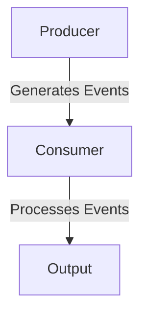

## 9.10. Best Practices in Reactive Programming

Reactive programming is a paradigm that focuses on asynchronous data streams and the propagation of change. In Elixir, reactive programming is often implemented using libraries like GenStage and Flow, which provide powerful abstractions for building concurrent and distributed systems. This section will guide you through the best practices in reactive programming, focusing on design considerations, performance tuning, and scalability.

### Understanding Reactive Programming

Reactive programming is about building systems that react to changes in data over time. This is particularly useful in applications that require real-time updates, such as financial systems, IoT applications, and interactive web applications. In Elixir, reactive programming leverages the actor model and the capabilities of the BEAM VM to handle concurrency and fault tolerance efficiently.

### Design Considerations

When designing reactive systems in Elixir, it's crucial to keep modules focused and handle errors gracefully. Let's explore these considerations in detail.

#### Keeping Modules Focused

1. **Single Responsibility Principle**: Ensure each module has a single responsibility. This makes your code easier to test, maintain, and extend. For example, a module responsible for fetching data should not also handle data transformation.

2. **Separation of Concerns**: Divide your system into distinct sections, each handling a specific aspect of the application. This separation allows for more straightforward debugging and enhances the system's modularity.

3. **Use of Behaviours**: Implement behaviours to define a common interface for modules. This practice ensures consistency and allows for easy swapping of implementations.

4. **Decoupling Components**: Use message passing to decouple components. This approach reduces dependencies and allows components to evolve independently.

#### Handling Errors Gracefully

1. **Let It Crash Philosophy**: Embrace the "let it crash" philosophy of Erlang/Elixir. Design your system to recover from failures by using supervisors to restart failed processes.

2. **Error Logging and Monitoring**: Implement robust logging and monitoring to track errors and system performance. Use tools like Logger and Telemetry to gain insights into your system's behavior.

3. **Graceful Degradation**: Design your system to degrade gracefully in the event of failures. For example, if a service is unavailable, provide a fallback mechanism or a cached response.

4. **Circuit Breaker Pattern**: Implement the circuit breaker pattern to prevent cascading failures. This pattern temporarily halts requests to a failing service, allowing it time to recover.

### Performance Tuning

Performance tuning is critical in reactive systems to ensure they can handle high loads efficiently. Here are some best practices for optimizing reactive pipelines in Elixir.

#### Monitoring and Profiling

1. **Use Telemetry**: Integrate Telemetry to collect metrics about your application's performance. This data can help identify bottlenecks and guide optimization efforts.

2. **Profiling Tools**: Use profiling tools like ExProf or fprof to analyze the performance of your application. These tools can help pinpoint slow functions and optimize them.

3. **Benchmarking**: Regularly benchmark your application using tools like Benchee to measure performance under different conditions. This practice helps ensure your application meets performance requirements.

#### Optimizing Reactive Pipelines

1. **Backpressure Management**: Implement backpressure mechanisms to prevent overwhelming your system with data. GenStage provides built-in support for backpressure, allowing you to control the flow of data through your system.

2. **Efficient Data Structures**: Use efficient data structures to minimize memory usage and improve performance. For example, prefer using maps over lists for lookups.

3. **Parallel Processing**: Leverage parallel processing to distribute work across multiple cores. Use Flow to create parallel data processing pipelines that can handle large volumes of data efficiently.

4. **Lazy Evaluation**: Use lazy evaluation to defer computation until necessary. This approach can reduce memory usage and improve performance by avoiding unnecessary calculations.

### Scalability

Scalability is a critical aspect of reactive systems, enabling them to handle increasing loads without sacrificing performance. Here are some best practices for designing scalable reactive systems in Elixir.

#### Designing for Horizontal Scaling

1. **Stateless Components**: Design components to be stateless whenever possible. Stateless components can be easily replicated across multiple nodes, facilitating horizontal scaling.

2. **Distributed Systems**: Leverage Elixir's support for distributed systems to scale your application across multiple nodes. Use tools like Phoenix PubSub for message broadcasting in distributed environments.

3. **Service Discovery**: Implement service discovery mechanisms to enable dynamic scaling. Tools like Consul or Kubernetes can help manage service discovery and load balancing.

#### Managing Resources Efficiently

1. **Resource Pooling**: Use resource pooling to manage connections and other resources efficiently. Libraries like Poolboy can help manage pools of worker processes.

2. **Load Balancing**: Implement load balancing to distribute requests evenly across your system. This practice helps prevent any single component from becoming a bottleneck.

3. **Caching Strategies**: Use caching strategies to reduce load on your system and improve response times. Cachex is a popular caching library in Elixir that can help implement efficient caching mechanisms.

### Code Example: Implementing a Reactive Pipeline with GenStage

Let's explore a simple example of a reactive pipeline using GenStage. We'll create a producer, a consumer, and a pipeline to process data.

```elixir
defmodule Producer do
  use GenStage

  def start_link(initial) do
    GenStage.start_link(__MODULE__, initial, name: __MODULE__)
  end

  def init(initial) do
    {:producer, initial}
  end

  def handle_demand(demand, state) when demand > 0 do
    events = Enum.to_list(state..(state + demand - 1))
    {:noreply, events, state + demand}
  end
end

defmodule Consumer do
  use GenStage

  def start_link() do
    GenStage.start_link(__MODULE__, :ok, name: __MODULE__)
  end

  def init(:ok) do
    {:consumer, :ok}
  end

  def handle_events(events, _from, state) do
    Enum.each(events, fn event ->
      IO.inspect(event, label: "Consumed")
    end)
    {:noreply, [], state}
  end
end

defmodule Pipeline do
  def start() do
    {:ok, producer} = Producer.start_link(0)
    {:ok, consumer} = Consumer.start_link()

    GenStage.sync_subscribe(consumer, to: producer)
  end
end

Pipeline.start()
```

In this example, the `Producer` generates a sequence of numbers, and the `Consumer` processes these numbers by printing them to the console. The `Pipeline` module sets up the subscription between the producer and consumer, creating a simple reactive pipeline.

### Visualizing the Reactive Pipeline

Below is a diagram illustrating the flow of data in our reactive pipeline:



**Diagram Description**: The diagram shows the flow of data from the `Producer` to the `Consumer`, which processes the events and produces an output.

### Try It Yourself

Experiment with the code example by modifying the range of numbers generated by the `Producer` or by adding additional stages to the pipeline. For instance, you could add a `Transformer` stage that modifies the data before it reaches the `Consumer`.

### Knowledge Check

- What is the "let it crash" philosophy, and how does it apply to reactive programming?
- How can you implement backpressure in a GenStage pipeline?
- What are the benefits of using lazy evaluation in reactive systems?

### Summary

In this section, we've explored best practices in reactive programming with Elixir, focusing on design considerations, performance tuning, and scalability. By keeping modules focused, handling errors gracefully, and optimizing reactive pipelines, you can build robust and efficient reactive systems. Remember, reactive programming is a powerful paradigm that, when used effectively, can significantly enhance the responsiveness and scalability of your applications.

### Embrace the Journey

As you continue your journey in reactive programming, remember that practice and experimentation are key. Keep exploring new patterns, refining your skills, and embracing the challenges that come with building reactive systems. Stay curious, and enjoy the process of creating responsive and scalable applications with Elixir.

## Quiz: Best Practices in Reactive Programming



### What is a key principle of reactive programming in Elixir?

- [x] Asynchronous data streams
- [ ] Synchronous data processing
- [ ] Monolithic architecture
- [ ] Single-threaded execution

> **Explanation:** Reactive programming focuses on asynchronous data streams and the propagation of change.

### How can you manage backpressure in a GenStage pipeline?

- [x] By controlling the flow of data
- [ ] By increasing the number of consumers
- [ ] By reducing the number of producers
- [ ] By using synchronous processing

> **Explanation:** GenStage provides built-in support for backpressure, allowing you to control the flow of data through your system.

### What is the "let it crash" philosophy?

- [x] Designing systems to recover from failures
- [ ] Preventing any failures from occurring
- [ ] Avoiding the use of supervisors
- [ ] Using synchronous error handling

> **Explanation:** The "let it crash" philosophy involves designing systems to recover from failures by using supervisors to restart failed processes.

### Which tool can be used for profiling Elixir applications?

- [x] ExProf
- [ ] Logger
- [ ] Mix
- [ ] Hex

> **Explanation:** ExProf is a profiling tool that can be used to analyze the performance of Elixir applications.

### What is a benefit of using lazy evaluation in reactive systems?

- [x] Reducing memory usage
- [ ] Increasing computation time
- [ ] Decreasing system responsiveness
- [ ] Increasing memory usage

> **Explanation:** Lazy evaluation can reduce memory usage and improve performance by avoiding unnecessary calculations.

### How can you implement service discovery in a distributed Elixir system?

- [x] Using Consul or Kubernetes
- [ ] Using Logger
- [ ] Using Mix
- [ ] Using ExUnit

> **Explanation:** Tools like Consul or Kubernetes can help manage service discovery and load balancing in distributed systems.

### What is a best practice for designing scalable reactive systems?

- [x] Designing stateless components
- [ ] Designing stateful components
- [ ] Using synchronous processing
- [ ] Avoiding the use of supervisors

> **Explanation:** Stateless components can be easily replicated across multiple nodes, facilitating horizontal scaling.

### Which library can be used for caching in Elixir?

- [x] Cachex
- [ ] Logger
- [ ] Mix
- [ ] Hex

> **Explanation:** Cachex is a popular caching library in Elixir that can help implement efficient caching mechanisms.

### What is the purpose of using behaviours in Elixir?

- [x] To define a common interface for modules
- [ ] To increase code complexity
- [ ] To avoid using protocols
- [ ] To prevent code reuse

> **Explanation:** Behaviours are used to define a common interface for modules, ensuring consistency and allowing for easy swapping of implementations.

### True or False: Reactive programming in Elixir leverages the actor model.

- [x] True
- [ ] False

> **Explanation:** Reactive programming in Elixir leverages the actor model and the capabilities of the BEAM VM to handle concurrency and fault tolerance efficiently.


