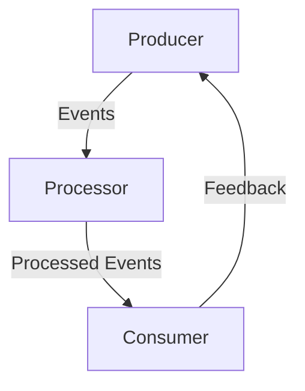

## 9.10. Best Practices in Reactive Programming

Reactive programming in Elixir is a powerful paradigm that allows developers to build systems that are responsive, resilient, and elastic. By leveraging Elixir's strengths in concurrency and fault tolerance, reactive programming enables the creation of applications that can handle real-time data streams and dynamic environments efficiently. In this section, we will explore best practices for implementing reactive programming in Elixir, focusing on design considerations, performance tuning, and scalability.

### Introduction to Reactive Programming

Reactive programming is a programming paradigm oriented around data flows and the propagation of change. It is particularly well-suited for applications that require high responsiveness and real-time updates, such as user interfaces, data processing pipelines, and distributed systems.

In Elixir, reactive programming can be implemented using various tools and libraries, such as GenStage, Flow, and the Phoenix framework. These tools allow developers to create reactive systems that can handle large volumes of data and complex event-driven architectures.

### Design Considerations

When designing a reactive system in Elixir, it is crucial to keep modules focused and handle errors gracefully. Here are some best practices to consider:

#### 1. Keep Modules Focused

- **Single Responsibility Principle**: Ensure that each module has a single responsibility and encapsulates a specific piece of functionality. This makes the system easier to understand, maintain, and test.
- **Modular Design**: Break down the system into smaller, reusable components. This allows for better code organization and promotes reusability across different parts of the application.

#### 2. Handle Errors Gracefully

- **Error Propagation**: Use Elixir's built-in error handling mechanisms, such as `try`, `catch`, and `rescue`, to propagate errors through the system. This ensures that errors are handled at the appropriate level and do not cause the system to crash.
- **Supervision Trees**: Leverage OTP's supervision trees to monitor and restart failed processes. This provides a robust mechanism for handling failures and ensures that the system remains operational even in the face of errors.

```elixir
defmodule MyApp.Supervisor do
  use Supervisor

  def start_link(init_arg) do
    Supervisor.start_link(__MODULE__, init_arg, name: __MODULE__)
  end

  def init(_init_arg) do
    children = [
      {MyApp.Worker, []}
    ]

    Supervisor.init(children, strategy: :one_for_one)
  end
end
```

In the example above, a supervision tree is used to manage a worker process. If the worker process crashes, the supervisor will automatically restart it, ensuring that the system remains resilient.

### Performance Tuning

Performance is a critical aspect of reactive programming, especially when dealing with high-throughput systems. Here are some best practices for monitoring, profiling, and optimizing reactive pipelines in Elixir:

#### 1. Monitor System Performance

- **Telemetry**: Use Elixir's Telemetry library to collect and analyze performance metrics. This allows you to gain insights into the system's behavior and identify potential bottlenecks.
- **Logging**: Implement logging to capture important events and errors. This provides valuable information for debugging and performance analysis.

#### 2. Profile Reactive Pipelines

- **Profiling Tools**: Use tools like `:observer` and `:fprof` to profile the system and identify performance hotspots. These tools provide detailed information about process execution and resource usage.
- **Benchmarking**: Conduct benchmarking tests to measure the performance of different components and identify areas for optimization.

#### 3. Optimize Pipeline Performance

- **Batch Processing**: Use batch processing to reduce the overhead of handling individual events. This can significantly improve throughput and reduce latency.
- **Backpressure Management**: Implement backpressure mechanisms to prevent the system from being overwhelmed by incoming data. This ensures that the system remains responsive and stable under load.

```elixir
defmodule MyApp.Producer do
  use GenStage

  def init(state) do
    {:producer, state}
  end

  def handle_demand(demand, state) do
    events = Enum.take(state, demand)
    {:noreply, events, state}
  end
end
```

In the example above, a GenStage producer is used to manage backpressure by controlling the flow of events based on demand.

### Scalability

Scalability is a key consideration in reactive programming, as it allows the system to handle increased load and adapt to changing conditions. Here are some best practices for designing scalable reactive systems in Elixir:

#### 1. Design for Horizontal Scaling

- **Distributed Systems**: Leverage Elixir's support for distributed systems to scale the application horizontally across multiple nodes. This allows the system to handle increased load by distributing work across a cluster of machines.
- **Load Balancing**: Implement load balancing to distribute incoming requests evenly across available resources. This ensures that no single resource becomes a bottleneck.

#### 2. Manage Resources Efficiently

- **Resource Pooling**: Use resource pooling to manage limited resources, such as database connections and file handles. This prevents resource exhaustion and improves system stability.
- **Dynamic Scaling**: Implement dynamic scaling mechanisms to adjust resource allocation based on current load. This allows the system to adapt to changing conditions and optimize resource usage.

```elixir
defmodule MyApp.Pool do
  use Poolboy

  def start_link(opts) do
    Poolboy.start_link(__MODULE__, opts, [])
  end

  def init(_opts) do
    {:ok, []}
  end
end
```

In the example above, Poolboy is used to manage a pool of resources, allowing the system to efficiently allocate and release resources as needed.

### Try It Yourself

To solidify your understanding of reactive programming in Elixir, try experimenting with the following exercises:

1. **Modify the Supervision Tree**: Extend the supervision tree example to include multiple worker processes with different restart strategies. Observe how the system behaves under different failure scenarios.

2. **Implement Backpressure**: Create a GenStage pipeline with multiple producers and consumers. Implement backpressure mechanisms to control the flow of data through the pipeline.

3. **Profile and Optimize**: Use profiling tools to analyze the performance of a reactive system. Identify bottlenecks and implement optimizations to improve throughput and reduce latency.

### Visualizing Reactive Systems

To better understand the flow of data and control in a reactive system, let's visualize a simple reactive pipeline using Mermaid.js:


```mermaid
graph TD;
    A[Producer] -->|Events| B[Processor]
    B -->|Processed Events| C[Consumer]
    C -->|Feedback| A
```

In this diagram, the producer generates events that are processed by the processor and consumed by the consumer. Feedback is provided to the producer to control the flow of events, implementing backpressure.

### References and Links

For further reading on reactive programming in Elixir, consider exploring the following resources:

- [Elixir School: GenStage](https://elixirschool.com/en/lessons/advanced/genstage/)
- [Phoenix Framework Documentation](https://hexdocs.pm/phoenix/)
- [Telemetry Library](https://hexdocs.pm/telemetry/)
- [Elixir's Official Documentation](https://elixir-lang.org/docs.html)

### Knowledge Check

To reinforce your understanding of reactive programming in Elixir, consider the following questions:

1. What is the primary goal of reactive programming, and how does it differ from traditional programming paradigms?
2. How can supervision trees be used to improve the resilience of a reactive system?
3. What are some common techniques for managing backpressure in a reactive pipeline?
4. How does horizontal scaling improve the scalability of a reactive system?
5. What tools and techniques can be used to profile and optimize the performance of a reactive system?

### Embrace the Journey

Remember, mastering reactive programming in Elixir is a journey. As you continue to explore and experiment with reactive patterns, you'll gain a deeper understanding of how to build efficient, scalable, and fault-tolerant systems. Keep experimenting, stay curious, and enjoy the journey!

### Quiz Time!



### What is the primary goal of reactive programming?

- [x] To create systems that are responsive, resilient, and elastic
- [ ] To simplify the codebase by reducing the number of modules
- [ ] To eliminate the need for error handling
- [ ] To ensure that all processes run in parallel

> **Explanation:** Reactive programming aims to create systems that are responsive, resilient, and elastic, allowing them to handle real-time data streams and dynamic environments efficiently.

### How can supervision trees improve the resilience of a reactive system?

- [x] By monitoring and restarting failed processes
- [ ] By eliminating the need for error handling
- [ ] By reducing the number of processes in the system
- [ ] By ensuring that all processes run in parallel

> **Explanation:** Supervision trees monitor and restart failed processes, providing a robust mechanism for handling failures and ensuring that the system remains operational.

### What is a common technique for managing backpressure in a reactive pipeline?

- [x] Implementing demand-based flow control
- [ ] Increasing the number of consumer processes
- [ ] Reducing the number of producer processes
- [ ] Eliminating the use of supervision trees

> **Explanation:** Demand-based flow control is a common technique for managing backpressure, ensuring that the system remains responsive and stable under load.

### How does horizontal scaling improve the scalability of a reactive system?

- [x] By distributing work across multiple nodes
- [ ] By reducing the number of processes in the system
- [ ] By eliminating the need for error handling
- [ ] By ensuring that all processes run in parallel

> **Explanation:** Horizontal scaling distributes work across multiple nodes, allowing the system to handle increased load by leveraging a cluster of machines.

### What tools can be used to profile and optimize the performance of a reactive system?

- [x] :observer and :fprof
- [ ] Mix and Hex
- [ ] :logger and :telemetry
- [ ] GenServer and GenStage

> **Explanation:** Tools like `:observer` and `:fprof` can be used to profile the system and identify performance hotspots, providing detailed information about process execution and resource usage.

### What is the purpose of using batch processing in a reactive pipeline?

- [x] To reduce the overhead of handling individual events
- [ ] To increase the number of consumer processes
- [ ] To eliminate the need for error handling
- [ ] To ensure that all processes run in parallel

> **Explanation:** Batch processing reduces the overhead of handling individual events, significantly improving throughput and reducing latency.

### What is the role of Telemetry in reactive programming?

- [x] To collect and analyze performance metrics
- [ ] To reduce the number of processes in the system
- [ ] To eliminate the need for error handling
- [ ] To ensure that all processes run in parallel

> **Explanation:** Telemetry is used to collect and analyze performance metrics, providing insights into the system's behavior and helping identify potential bottlenecks.

### What is a key benefit of modular design in reactive systems?

- [x] Improved code organization and reusability
- [ ] Elimination of error handling
- [ ] Reduction in the number of processes
- [ ] Ensuring all processes run in parallel

> **Explanation:** Modular design improves code organization and promotes reusability, making the system easier to understand, maintain, and test.

### How does resource pooling contribute to system stability?

- [x] By managing limited resources efficiently
- [ ] By increasing the number of consumer processes
- [ ] By eliminating the need for error handling
- [ ] By ensuring that all processes run in parallel

> **Explanation:** Resource pooling manages limited resources efficiently, preventing resource exhaustion and improving system stability.

### True or False: Reactive programming eliminates the need for error handling.

- [ ] True
- [x] False

> **Explanation:** Reactive programming does not eliminate the need for error handling. Instead, it emphasizes handling errors gracefully and ensuring that the system remains operational even in the face of failures.



By following these best practices, you'll be well-equipped to build reactive systems in Elixir that are efficient, scalable, and resilient. Keep exploring and experimenting with reactive patterns to further enhance your skills and understanding.
