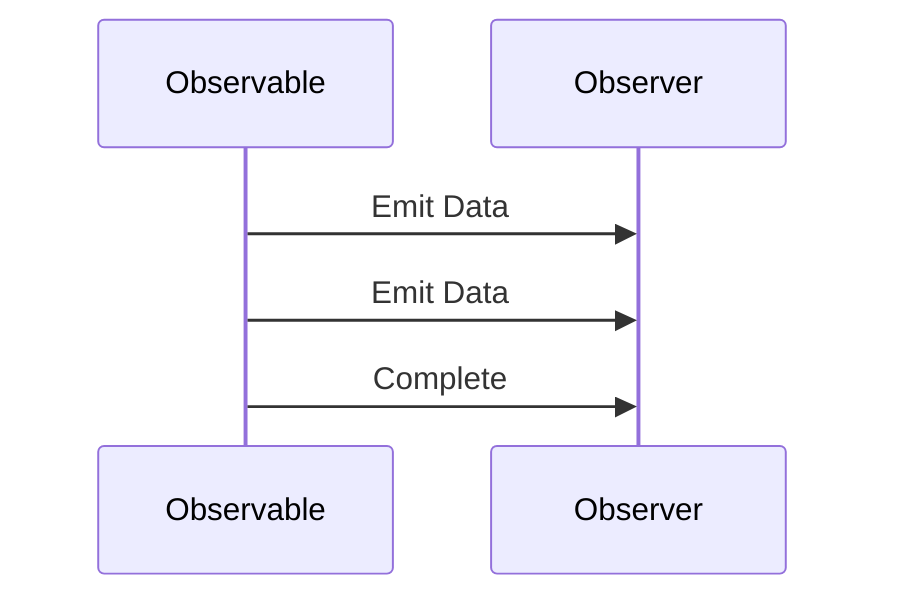

## 9.2. Implementing Observables in Elixir

In the realm of reactive programming, observables play a pivotal role in managing asynchronous data streams. Elixir, with its robust concurrency model and functional programming paradigm, offers a unique platform for implementing observables. In this section, we will delve into the concept of observables, explore how to implement them in Elixir using libraries like RxElixir, and examine real-world use cases.

### Observables and Observers

**Observables** are a core concept in reactive programming, representing a data stream that can be observed. They emit data over time, allowing observers to subscribe and react to these emissions. This pattern is particularly useful for handling asynchronous data flows, such as user interactions, network requests, or real-time data feeds.

**Observers**, on the other hand, are entities that subscribe to observables to receive updates. They define how to handle the data emitted by the observable, enabling a responsive and dynamic application architecture.

#### Key Concepts

- **Data Streams**: Continuous flow of data that can be observed and processed.
- **Subscription**: The act of an observer registering to receive updates from an observable.
- **Emission**: The process of an observable sending data to its subscribers.
- **Unsubscription**: The act of an observer deregistering from an observable, stopping the flow of data.

### Implementing Observables

In Elixir, implementing observables can be achieved through libraries like RxElixir, which brings the power of Reactive Extensions (Rx) to the Elixir ecosystem. Alternatively, you can create custom solutions tailored to your specific needs.

#### Using RxElixir

RxElixir is a library that provides a set of tools for working with observables in Elixir. It is inspired by the Reactive Extensions (Rx) library, which is widely used in other programming languages like JavaScript and C#.

To get started with RxElixir, you need to add it to your project dependencies. Here’s how you can do it:

```elixir
defp deps do
  [
    {:rx_elixir, "~> 0.1.0"}
  ]
end
```

After adding the dependency, run `mix deps.get` to install the library.

#### Creating an Observable

Let's create a simple observable that emits a sequence of numbers:

```elixir
defmodule NumberObservable do
  use RxElixir.Observable

  def start do
    RxElixir.Observable.create(fn observer ->
      for i <- 1..5 do
        RxElixir.Observer.next(observer, i)
      end
      RxElixir.Observer.complete(observer)
    end)
  end
end
```

In this example, we define a module `NumberObservable` that uses the `RxElixir.Observable` module. The `start` function creates an observable that emits numbers from 1 to 5 and then completes the stream.

#### Subscribing to an Observable

To receive data from an observable, you need to subscribe an observer to it:

```elixir
defmodule NumberObserver do
  def handle_next(value) do
    IO.puts("Received: #{value}")
  end

  def handle_complete do
    IO.puts("Stream complete")
  end
end

observable = NumberObservable.start()

RxElixir.Observable.subscribe(observable, %{
  next: &NumberObserver.handle_next/1,
  complete: &NumberObserver.handle_complete/0
})
```

Here, we define a module `NumberObserver` with functions to handle the emitted values and the completion of the stream. We then subscribe to the observable using these handler functions.

### Custom Observable Implementation

While libraries like RxElixir provide a convenient way to work with observables, there may be cases where you need a custom implementation. Elixir's powerful concurrency model and process-based architecture make it well-suited for this task.

#### Creating a Custom Observable

Let's create a custom observable that emits random numbers at regular intervals:

```elixir
defmodule RandomNumberObservable do
  def start(interval) do
    spawn(fn -> loop(interval) end)
  end

  defp loop(interval) do
    :timer.sleep(interval)
    number = :rand.uniform(100)
    IO.puts("Emitting: #{number}")
    loop(interval)
  end
end
```

In this example, we define a module `RandomNumberObservable` with a `start` function that spawns a new process. The process emits a random number every specified interval.

#### Subscribing to a Custom Observable

To subscribe to this custom observable, you can use a simple GenServer to handle the emitted values:

```elixir
defmodule RandomNumberObserver do
  use GenServer

  def start_link do
    GenServer.start_link(__MODULE__, %{}, name: __MODULE__)
  end

  def init(state) do
    {:ok, state}
  end

  def handle_info({:number, number}, state) do
    IO.puts("Received random number: #{number}")
    {:noreply, state}
  end
end

{:ok, _pid} = RandomNumberObserver.start_link()
RandomNumberObservable.start(1000)
```

In this example, we define a GenServer `RandomNumberObserver` that listens for messages containing random numbers. The observable process sends these messages to the observer, which prints them to the console.

### Use Cases

Observables are versatile and can be applied in various scenarios. Here are some common use cases:

#### Real-Time Notifications

Observables are ideal for implementing real-time notification systems. For example, you can use them to notify users of new messages, updates, or alerts in a chat application.

#### Live Data Feeds

In applications that require live data feeds, such as stock market tickers or sports scores, observables provide an efficient way to stream data to users in real-time.

#### User Interface Updates

Observables can be used to manage user interface updates in response to user interactions or data changes. This approach ensures a responsive and dynamic user experience.

### Visualizing Observables

To better understand the flow of data in observables, let's visualize the process using a sequence diagram:



**Diagram Description**: This sequence diagram illustrates the interaction between an observable and an observer. The observable emits data to the observer, and once all data is emitted, it sends a completion signal.

### Design Considerations

When implementing observables in Elixir, consider the following design aspects:

- **Concurrency**: Leverage Elixir's lightweight processes to handle concurrent data streams efficiently.
- **Error Handling**: Implement robust error handling to manage exceptions and ensure the reliability of data streams.
- **Performance**: Optimize data emission and processing to minimize latency and maximize throughput.

### Elixir Unique Features

Elixir's unique features, such as its actor-based concurrency model and fault-tolerant design, make it an excellent choice for implementing observables. The language's emphasis on immutability and functional programming principles further enhances the reliability and maintainability of observable-based systems.

### Differences and Similarities

Observables in Elixir share similarities with those in other languages, such as JavaScript or C#. However, Elixir's process-based architecture and functional paradigm offer distinct advantages, such as improved concurrency and fault tolerance.

### Try It Yourself

To deepen your understanding of observables in Elixir, try modifying the code examples provided. Experiment with different data sources, emission intervals, and observer behaviors. This hands-on approach will help solidify your grasp of the concepts and techniques discussed.

### Knowledge Check

- What are the key components of an observable pattern?
- How do observables differ from traditional event listeners?
- What are some real-world applications of observables?

### Embrace the Journey

Implementing observables in Elixir opens up a world of possibilities for building responsive and dynamic applications. As you explore this powerful pattern, remember to experiment, iterate, and enjoy the process of discovery.

## Quiz: Implementing Observables in Elixir



### What is the primary role of an observable in reactive programming?

- [x] To emit data over time that observers can subscribe to
- [ ] To store data in a database
- [ ] To manage user sessions
- [ ] To handle HTTP requests

> **Explanation:** Observables are designed to emit data over time, allowing observers to subscribe and react to these emissions.

### Which Elixir library is commonly used for implementing observables?

- [x] RxElixir
- [ ] Ecto
- [ ] Phoenix
- [ ] Plug

> **Explanation:** RxElixir is a library that provides tools for working with observables in Elixir, inspired by Reactive Extensions.

### What is the purpose of the `complete` function in an observable?

- [x] To signal that the observable has finished emitting data
- [ ] To start the observable
- [ ] To pause data emission
- [ ] To reset the observable

> **Explanation:** The `complete` function is used to indicate that the observable has finished emitting data to its subscribers.

### How can you create a custom observable in Elixir?

- [x] By using Elixir's process-based architecture to emit data at intervals
- [ ] By using a database trigger
- [ ] By implementing a REST API
- [ ] By writing a SQL query

> **Explanation:** Custom observables can be created using Elixir's lightweight processes to emit data at specified intervals.

### What is a common use case for observables?

- [x] Real-time notifications
- [ ] File storage
- [ ] Batch processing
- [ ] Static web pages

> **Explanation:** Observables are ideal for real-time notifications, where data needs to be pushed to users as it becomes available.

### What is the role of an observer in the observable pattern?

- [x] To subscribe to an observable and handle emitted data
- [ ] To store data in a database
- [ ] To manage user authentication
- [ ] To render HTML pages

> **Explanation:** Observers subscribe to observables to receive and handle the data they emit.

### How does Elixir's concurrency model benefit observables?

- [x] It allows efficient handling of concurrent data streams
- [ ] It simplifies database transactions
- [ ] It enhances static typing
- [ ] It improves file I/O operations

> **Explanation:** Elixir's concurrency model, based on lightweight processes, enables efficient handling of concurrent data streams.

### What is a key advantage of using RxElixir for observables?

- [x] It provides a set of tools inspired by Reactive Extensions
- [ ] It simplifies HTML rendering
- [ ] It enhances CSS styling
- [ ] It manages server configurations

> **Explanation:** RxElixir offers tools inspired by Reactive Extensions, making it easier to work with observables in Elixir.

### True or False: Observables can only be used for real-time applications.

- [ ] True
- [x] False

> **Explanation:** While observables are ideal for real-time applications, they can be used in various scenarios where asynchronous data handling is required.

### Which of the following is NOT a component of the observable pattern?

- [ ] Observable
- [ ] Observer
- [ ] Subscription
- [x] Database

> **Explanation:** The observable pattern consists of observables, observers, and subscriptions, but not databases.



Remember, this is just the beginning. As you progress, you'll build more complex and interactive applications using observables in Elixir. Keep experimenting, stay curious, and enjoy the journey!
