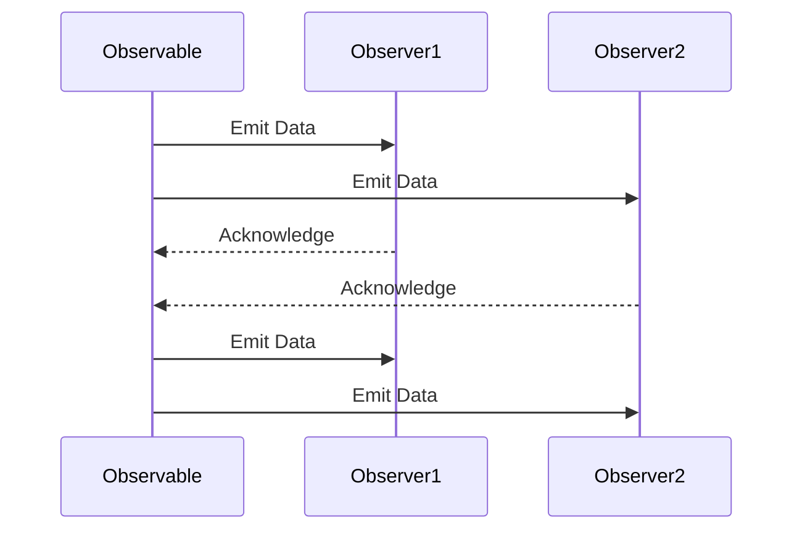

## 9.2. Implementing Observables in Elixir

In the realm of reactive programming, observables play a crucial role by providing a powerful abstraction for handling asynchronous data streams. Elixir, with its functional programming paradigm and robust concurrency model, offers unique opportunities to implement observables effectively. In this section, we will explore the concept of observables, how to implement them in Elixir using libraries like RxElixir or custom solutions, and delve into practical use cases such as real-time notifications and live data feeds.

### Observables and Observers

**Observables** are entities that emit a sequence of values over time. They are the source of data in a reactive system. Observers, on the other hand, are entities that subscribe to observables to receive and react to the emitted data. This pattern allows for a decoupled architecture where data producers and consumers operate independently.

#### Establishing a Data Stream

In a reactive system, establishing a data stream involves defining how data is emitted and how observers can subscribe to this stream. Let's break down the process:

1. **Define the Observable**: An observable is defined by its ability to emit data. This can be a continuous stream, such as sensor data, or discrete events, like user interactions.

2. **Create Observers**: Observers are entities that listen to the observable. They define how to handle the data emitted by the observable.

3. **Subscription Mechanism**: Observers subscribe to observables to start receiving data. This subscription can be managed to allow for dynamic addition and removal of observers.

4. **Data Emission and Notification**: Once subscribed, observers receive notifications whenever the observable emits new data.

### Implementing Observables in Elixir

Elixir provides several ways to implement observables, from using existing libraries like RxElixir to creating custom solutions tailored to specific needs.

#### Using RxElixir

[RxElixir](https://github.com/coingaming/rx_elixir) is a library that brings the power of Reactive Extensions (Rx) to Elixir. It provides a set of tools to work with observables in a functional and declarative manner.

##### Key Features of RxElixir

- **Functional Composition**: Allows chaining of operations on data streams.
- **Concurrency Support**: Leverages Elixir's concurrency model for efficient data processing.
- **Error Handling**: Provides mechanisms to handle errors gracefully in data streams.

##### Example: Creating an Observable with RxElixir

Let's create a simple observable that emits a sequence of numbers and an observer that logs these numbers.

```elixir
defmodule NumberObservable do
  use RxElixir.Observable

  def start_stream do
    RxElixir.Observable.create(fn observer ->
      for i <- 1..5 do
        RxElixir.Observer.next(observer, i)
      end
      RxElixir.Observer.complete(observer)
    end)
  end
end

defmodule NumberObserver do
  def handle_data(data) do
    IO.puts("Received: #{data}")
  end
end

# Start the observable stream
observable = NumberObservable.start_stream()

# Subscribe the observer to the observable
RxElixir.Observable.subscribe(observable, &NumberObserver.handle_data/1)
```

In this example, `NumberObservable` emits numbers from 1 to 5. `NumberObserver` is a simple observer that logs the received data.

#### Creating Custom Observables

While libraries like RxElixir provide a robust framework, there are scenarios where creating custom observables is more appropriate. This approach gives you full control over the data stream and its behavior.

##### Steps to Create a Custom Observable

1. **Define the Data Source**: Identify the source of data, such as a sensor, database, or external API.

2. **Implement the Observable Logic**: Define how data is emitted and how observers can subscribe to it.

3. **Manage Subscriptions**: Implement a mechanism to add and remove observers dynamically.

4. **Handle Data Emission**: Ensure that data is emitted efficiently and observers are notified in a timely manner.

##### Example: Custom Observable in Elixir

Let's create a custom observable that emits random numbers at regular intervals.

```elixir
defmodule RandomNumberObservable do
  use GenServer

  def start_link(_) do
    GenServer.start_link(__MODULE__, [], name: __MODULE__)
  end

  def init(_) do
    schedule_emit()
    {:ok, []}
  end

  def handle_info(:emit, state) do
    number = :rand.uniform(100)
    IO.puts("Emitting: #{number}")
    notify_observers(number)
    schedule_emit()
    {:noreply, state}
  end

  defp schedule_emit do
    Process.send_after(self(), :emit, 1000)
  end

  defp notify_observers(number) do
    # Notify all subscribed observers
    # This is a placeholder for actual observer notification logic
  end
end

# Start the observable
{:ok, _pid} = RandomNumberObservable.start_link([])
```

In this example, `RandomNumberObservable` uses a GenServer to emit random numbers every second. The `notify_observers/1` function is a placeholder for the logic to notify subscribed observers.

### Use Cases for Observables

Observables are versatile and can be applied to various real-world scenarios. Let's explore some common use cases:

#### Real-Time Notifications

In applications that require real-time updates, such as chat applications or stock tickers, observables can be used to push updates to clients as soon as they occur.

##### Example: Real-Time Chat Notifications

In a chat application, you can use observables to notify users of new messages in real-time. Each chat room can be an observable that emits new messages, and users can subscribe to these observables to receive updates.

```elixir
defmodule ChatRoom do
  use GenServer

  def start_link(room_name) do
    GenServer.start_link(__MODULE__, %{name: room_name, subscribers: []}, name: room_name)
  end

  def init(state) do
    {:ok, state}
  end

  def handle_cast({:new_message, message}, %{subscribers: subscribers} = state) do
    Enum.each(subscribers, fn subscriber ->
      send(subscriber, {:new_message, message})
    end)
    {:noreply, state}
  end

  def subscribe(room_name, pid) do
    GenServer.cast(room_name, {:subscribe, pid})
  end

  def handle_cast({:subscribe, pid}, state) do
    {:noreply, %{state | subscribers: [pid | state.subscribers]}}
  end
end

# Start a chat room
{:ok, chat_room} = ChatRoom.start_link(:general)

# Subscribe a user to the chat room
ChatRoom.subscribe(:general, self())

# Send a new message
GenServer.cast(:general, {:new_message, "Hello, world!"})
```

In this example, `ChatRoom` is an observable that emits new messages to its subscribers. Users can subscribe to receive real-time notifications of new messages.

#### Live Data Feeds

For applications that require continuous data feeds, such as financial market data or IoT sensor readings, observables provide an efficient way to handle and process this data.

##### Example: Stock Market Data Feed

Consider a stock market application that provides live updates of stock prices. Each stock can be represented as an observable that emits price updates, and traders can subscribe to these observables to receive timely information.

```elixir
defmodule StockMarket do
  use GenServer

  def start_link(stock_symbol) do
    GenServer.start_link(__MODULE__, %{symbol: stock_symbol, subscribers: []}, name: stock_symbol)
  end

  def init(state) do
    schedule_price_update()
    {:ok, state}
  end

  def handle_info(:update_price, %{symbol: symbol, subscribers: subscribers} = state) do
    new_price = fetch_stock_price(symbol)
    Enum.each(subscribers, fn subscriber ->
      send(subscriber, {:price_update, symbol, new_price})
    end)
    schedule_price_update()
    {:noreply, state}
  end

  defp schedule_price_update do
    Process.send_after(self(), :update_price, 5000)
  end

  defp fetch_stock_price(_symbol) do
    # Simulate fetching stock price
    :rand.uniform(1000)
  end

  def subscribe(stock_symbol, pid) do
    GenServer.cast(stock_symbol, {:subscribe, pid})
  end

  def handle_cast({:subscribe, pid}, state) do
    {:noreply, %{state | subscribers: [pid | state.subscribers]}}
  end
end

# Start a stock market feed for a specific stock
{:ok, _} = StockMarket.start_link(:AAPL)

# Subscribe a trader to the stock updates
StockMarket.subscribe(:AAPL, self())
```

In this example, `StockMarket` is an observable that emits price updates for a specific stock. Traders can subscribe to receive real-time price updates.

### Design Considerations

When implementing observables in Elixir, consider the following design considerations:

- **Concurrency**: Leverage Elixir's concurrency model to handle multiple observers efficiently.
- **Error Handling**: Implement robust error handling to ensure that errors in one observer do not affect others.
- **Scalability**: Design observables to scale with the number of subscribers and the volume of data.
- **Performance**: Optimize data emission and notification mechanisms to minimize latency.

### Elixir Unique Features

Elixir's unique features, such as the actor model, lightweight processes, and message passing, make it an ideal choice for implementing observables. These features allow for efficient handling of concurrent data streams and provide a solid foundation for building reactive systems.

### Differences and Similarities

While observables in Elixir share similarities with those in other languages, such as JavaScript's RxJS, the implementation details differ due to Elixir's functional nature and concurrency model. It's important to understand these differences to leverage Elixir's strengths effectively.

### Try It Yourself

Now that we've explored the implementation of observables in Elixir, let's encourage you to experiment with the concepts:

- **Modify the RandomNumberObservable**: Change the interval or the range of random numbers emitted.
- **Create a New Observable**: Implement an observable for a different use case, such as monitoring system metrics or user interactions.
- **Experiment with RxElixir**: Explore additional features of RxElixir and integrate them into your observables.

### Visualizing Observables in Elixir

To better understand the flow of data in an observable system, let's visualize the process using a Mermaid.js diagram.


```mermaid
sequenceDiagram
    participant Observable
    participant Observer1
    participant Observer2

    Observable->>Observer1: Emit Data
    Observable->>Observer2: Emit Data
    Observer1-->>Observable: Acknowledge
    Observer2-->>Observable: Acknowledge
    Observable->>Observer1: Emit Data
    Observable->>Observer2: Emit Data
```

**Diagram Description**: This sequence diagram illustrates the interaction between an observable and two observers. The observable emits data to both observers, who acknowledge receipt of the data.

### References and Links

For further reading and exploration, consider the following resources:

- [RxElixir GitHub Repository](https://github.com/coingaming/rx_elixir)
- [ReactiveX Documentation](http://reactivex.io/)
- [Elixir Official Documentation](https://elixir-lang.org/docs.html)

### Knowledge Check

Before we conclude, let's pose a few questions to reinforce your understanding:

1. What is the role of an observable in a reactive system?
2. How can you implement a custom observable in Elixir?
3. What are some common use cases for observables?
4. How does Elixir's concurrency model benefit the implementation of observables?

### Embrace the Journey

Implementing observables in Elixir is just the beginning of your journey into reactive programming. As you continue to explore and experiment, you'll discover new ways to harness the power of observables to build responsive and efficient systems. Keep pushing the boundaries, stay curious, and enjoy the journey!

## Quiz Time!



### What is the primary role of an observable in a reactive system?

- [x] To emit a sequence of values over time.
- [ ] To process data in batches.
- [ ] To store data persistently.
- [ ] To manage user sessions.

> **Explanation:** An observable is responsible for emitting a sequence of values over time, which observers can subscribe to.

### Which Elixir library is commonly used for implementing observables?

- [x] RxElixir
- [ ] Phoenix
- [ ] Ecto
- [ ] Plug

> **Explanation:** RxElixir is a library that brings Reactive Extensions (Rx) to Elixir, providing tools to work with observables.

### What is a key feature of RxElixir?

- [x] Functional Composition
- [ ] Object-Oriented Design
- [ ] Monolithic Architecture
- [ ] Synchronous Processing

> **Explanation:** RxElixir allows for functional composition, enabling chaining of operations on data streams.

### How does Elixir's concurrency model benefit observables?

- [x] It allows efficient handling of multiple observers.
- [ ] It enforces synchronous processing.
- [ ] It restricts the number of concurrent processes.
- [ ] It simplifies error handling.

> **Explanation:** Elixir's concurrency model allows for efficient handling of multiple observers by leveraging lightweight processes.

### What is a common use case for observables?

- [x] Real-time notifications
- [ ] Batch processing
- [ ] Static page rendering
- [ ] Data archiving

> **Explanation:** Observables are commonly used for real-time notifications, where updates need to be pushed to clients as they occur.

### How can you create a custom observable in Elixir?

- [x] By using GenServer to manage data emission and subscriptions.
- [ ] By creating a new Phoenix controller.
- [ ] By defining a new Ecto schema.
- [ ] By writing a Plug middleware.

> **Explanation:** A custom observable can be created using GenServer to manage data emission and subscriptions.

### What should be considered when designing observables in Elixir?

- [x] Concurrency, error handling, scalability, and performance.
- [ ] Only the user interface design.
- [ ] The database schema.
- [ ] The deployment strategy.

> **Explanation:** When designing observables, it's important to consider concurrency, error handling, scalability, and performance.

### What is the purpose of the `notify_observers/1` function in a custom observable?

- [x] To notify all subscribed observers of new data.
- [ ] To log errors.
- [ ] To update the database.
- [ ] To start a new process.

> **Explanation:** The `notify_observers/1` function is responsible for notifying all subscribed observers of new data.

### What is a benefit of using RxElixir for observables?

- [x] It provides a declarative way to handle data streams.
- [ ] It simplifies database queries.
- [ ] It enhances static page rendering.
- [ ] It manages user authentication.

> **Explanation:** RxElixir provides a declarative way to handle data streams, making it easier to work with observables.

### True or False: Observables in Elixir are identical to those in JavaScript's RxJS.

- [ ] True
- [x] False

> **Explanation:** While observables in Elixir share similarities with those in JavaScript's RxJS, the implementation details differ due to Elixir's functional nature and concurrency model.


