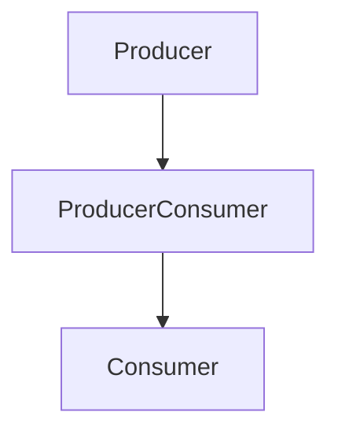

## 9.3. Using GenStage for Reactive Streams

In the world of reactive programming, handling streams of data efficiently is crucial, especially when dealing with high-throughput systems. Elixir's GenStage is a powerful tool that allows developers to build concurrent and backpressure-aware data processing pipelines. In this section, we will delve into the intricacies of using GenStage for reactive streams, exploring its architecture, implementation, and practical use cases.

### Understanding GenStage

GenStage is a specification and computational flow for Elixir that allows you to build concurrent data processing pipelines. It is designed to handle backpressure, which is the ability to manage the rate of data flow between producers and consumers, ensuring that systems do not become overwhelmed by data.

#### Key Concepts

- **Producer**: A process that emits data.
- **Consumer**: A process that receives data.
- **Producer-Consumer**: A process that acts as both a producer and a consumer.
- **Backpressure**: A mechanism to control the flow of data, ensuring that producers do not overwhelm consumers.

### Backpressure-Aware Processing

Backpressure is a critical concept in reactive systems, ensuring that data flows smoothly without overwhelming any part of the system. GenStage provides built-in support for backpressure, allowing consumers to request data at their own pace.

#### Managing Demand Between Producers and Consumers

In GenStage, consumers explicitly request data from producers. This demand-driven model allows consumers to control the flow of data, preventing overload and ensuring efficient processing.

```elixir
defmodule Producer do
  use GenStage

  def start_link(initial) do
    GenStage.start_link(__MODULE__, initial, name: __MODULE__)
  end

  def init(counter) do
    {:producer, counter}
  end

  def handle_demand(demand, state) when demand > 0 do
    events = Enum.to_list(state..state + demand - 1)
    {:noreply, events, state + demand}
  end
end

defmodule Consumer do
  use GenStage

  def start_link() do
    GenStage.start_link(__MODULE__, :ok, name: __MODULE__)
  end

  def init(:ok) do
    {:consumer, :the_state_does_not_matter}
  end

  def handle_events(events, _from, state) do
    for event <- events do
      IO.inspect(event, label: "Consumed")
    end
    {:noreply, [], state}
  end
end
```

In this example, the `Producer` generates a sequence of numbers, and the `Consumer` processes them. The consumer requests data as needed, demonstrating backpressure management.

### Implementing GenStage Pipelines

Building pipelines with GenStage involves chaining multiple stages together, where each stage can be a producer, consumer, or both. This allows for complex data processing flows, leveraging Elixir's concurrency model.

#### Building Concurrent and Stage-Based Data Processing Flows

To create a pipeline, you can link multiple stages together, each responsible for a specific part of the data processing.

```elixir
defmodule ProducerConsumer do
  use GenStage

  def start_link() do
    GenStage.start_link(__MODULE__, :ok, name: __MODULE__)
  end

  def init(:ok) do
    {:producer_consumer, :the_state_does_not_matter}
  end

  def handle_events(events, _from, state) do
    processed_events = Enum.map(events, &(&1 * 2))
    {:noreply, processed_events, state}
  end
end

{:ok, producer} = Producer.start_link(0)
{:ok, producer_consumer} = ProducerConsumer.start_link()
{:ok, consumer} = Consumer.start_link()

GenStage.sync_subscribe(consumer, to: producer_consumer)
GenStage.sync_subscribe(producer_consumer, to: producer)
```

In this pipeline, the `ProducerConsumer` stage doubles each number before passing it to the `Consumer`. This demonstrates how stages can be composed to form complex processing flows.

### Use Cases for GenStage

GenStage is particularly useful in scenarios where data needs to be processed in real-time, with varying rates of data production and consumption. Here are some common use cases:

#### Data Ingestion

In systems that ingest large volumes of data, such as log processing or telemetry collection, GenStage can efficiently manage the flow of data from producers (data sources) to consumers (processing units).

#### Event Processing Systems

Event-driven architectures benefit from GenStage's ability to handle streams of events with backpressure, ensuring that event consumers are not overwhelmed by bursts of data.

### Visualizing GenStage Pipelines

To better understand how GenStage pipelines work, let's visualize a simple pipeline with producers, consumers, and producer-consumers.



In this diagram, data flows from the `Producer` to the `ProducerConsumer`, and finally to the `Consumer`. Each stage can process data concurrently, leveraging Elixir's lightweight processes.

### Design Considerations

When designing GenStage pipelines, consider the following:

- **Concurrency**: Leverage Elixir's concurrency model to maximize throughput.
- **Backpressure**: Ensure that consumers can handle the rate of data production.
- **Fault Tolerance**: Use supervision trees to manage failures and ensure system reliability.

### Elixir Unique Features

Elixir's lightweight processes and message-passing model make it an ideal language for building reactive systems with GenStage. The ability to spawn thousands of processes allows for highly concurrent and scalable pipelines.

### Differences and Similarities

GenStage is often compared to other reactive programming libraries, such as Akka Streams in Scala or RxJava in Java. While they share similar goals, GenStage's integration with Elixir's concurrency model and its focus on backpressure make it unique.

### Try It Yourself

To deepen your understanding of GenStage, try modifying the code examples:

- **Experiment with Different Data Rates**: Adjust the rate at which the producer generates data and observe how the consumer handles it.
- **Add More Stages**: Introduce additional producer-consumer stages to create a more complex pipeline.
- **Implement Error Handling**: Add error handling logic to manage failures gracefully.

### Knowledge Check

- What is backpressure, and why is it important in reactive systems?
- How does GenStage manage demand between producers and consumers?
- What are some common use cases for GenStage?

### Embrace the Journey

Remember, mastering GenStage is just the beginning of your journey into reactive programming with Elixir. As you explore more complex systems, you'll discover new ways to leverage GenStage's power. Keep experimenting, stay curious, and enjoy the journey!

## Quiz: Using GenStage for Reactive Streams



### What is the primary purpose of GenStage in Elixir?

- [x] To build concurrent and backpressure-aware data processing pipelines
- [ ] To manage database connections
- [ ] To handle HTTP requests
- [ ] To perform mathematical calculations

> **Explanation:** GenStage is designed to create concurrent data processing pipelines with backpressure management.

### How does GenStage handle backpressure?

- [x] By allowing consumers to request data at their own pace
- [ ] By limiting the number of producers
- [ ] By increasing the number of consumers
- [ ] By buffering data indefinitely

> **Explanation:** Consumers in GenStage request data as needed, controlling the flow and preventing overload.

### In a GenStage pipeline, what is a producer-consumer?

- [x] A stage that acts as both a producer and a consumer
- [ ] A stage that only produces data
- [ ] A stage that only consumes data
- [ ] A stage that does not process data

> **Explanation:** A producer-consumer in GenStage both receives and emits data, acting as an intermediary stage.

### What is a common use case for GenStage?

- [x] Event processing systems
- [ ] Static website hosting
- [ ] File storage
- [ ] Image rendering

> **Explanation:** GenStage is well-suited for event-driven architectures and real-time data processing.

### What is the role of backpressure in reactive systems?

- [x] To control the flow of data and prevent overload
- [ ] To increase data production speed
- [ ] To decrease data consumption speed
- [ ] To store data temporarily

> **Explanation:** Backpressure ensures that data flows smoothly without overwhelming any part of the system.

### How can you visualize a GenStage pipeline?

- [x] Using a flowchart to represent data flow between stages
- [ ] Using a pie chart to show data distribution
- [ ] Using a bar graph to compare data sizes
- [ ] Using a scatter plot to show data points

> **Explanation:** Flowcharts are effective for visualizing the flow of data between stages in a GenStage pipeline.

### What is a key feature of Elixir that makes it suitable for GenStage?

- [x] Lightweight processes and message-passing model
- [ ] Strong typing system
- [ ] Object-oriented programming support
- [ ] Built-in GUI libraries

> **Explanation:** Elixir's lightweight processes and message-passing model enable highly concurrent and scalable pipelines.

### What should you consider when designing GenStage pipelines?

- [x] Concurrency, backpressure, and fault tolerance
- [ ] Data storage, file access, and UI design
- [ ] Network latency, bandwidth, and encryption
- [ ] User interface, user experience, and accessibility

> **Explanation:** Concurrency, backpressure, and fault tolerance are crucial considerations for GenStage pipelines.

### How does a consumer in GenStage request data?

- [x] By explicitly requesting data from producers
- [ ] By passively waiting for data to arrive
- [ ] By polling the producer at regular intervals
- [ ] By subscribing to a data feed

> **Explanation:** Consumers in GenStage explicitly request data, allowing them to control the flow and manage backpressure.

### True or False: GenStage can only be used for batch processing.

- [ ] True
- [x] False

> **Explanation:** GenStage is designed for real-time data processing and can handle both batch and stream processing.


