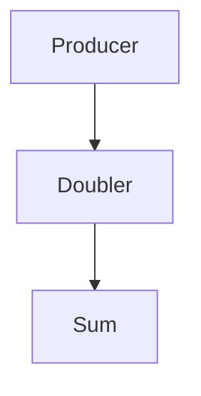

## 9.3. Using GenStage for Reactive Streams

In the realm of reactive programming, managing data flow efficiently and effectively is crucial, especially when dealing with large volumes of data. Elixir’s GenStage provides a robust framework for building reactive streams with backpressure-aware processing, allowing developers to manage demand between producers and consumers seamlessly. In this section, we will explore how to leverage GenStage to implement reactive streams, build concurrent data processing pipelines, and examine practical use cases such as data ingestion and event processing systems.

### Understanding GenStage

GenStage is a specification and computational flow model for Elixir that enables the creation of concurrent and stage-based data processing flows. It is designed to handle backpressure, a common challenge in reactive systems where the rate of data production outpaces the rate of data consumption. GenStage provides a structured way to manage this flow, ensuring that producers do not overwhelm consumers.

#### Key Concepts

- **Producer**: A process that emits data. It can be thought of as the source of the data stream.
- **Consumer**: A process that receives and processes data. It acts as the sink for the data stream.
- **Producer-Consumer**: A process that acts as both a producer and a consumer, allowing for intermediate processing stages in a pipeline.
- **Backpressure**: A mechanism to control the flow of data, ensuring that producers do not send more data than consumers can handle.

### Backpressure-Aware Processing

Backpressure is a critical aspect of reactive streams, as it ensures that data flows smoothly from producers to consumers without overwhelming any part of the system. GenStage provides built-in support for backpressure, allowing consumers to request data at their own pace.

#### Managing Demand

In GenStage, consumers explicitly request data from producers. This demand-driven approach allows consumers to control the flow of data, preventing overload. Producers only send data when there is demand, ensuring that the system remains responsive and efficient.

```elixir
defmodule Producer do
  use GenStage

  def start_link(initial) do
    GenStage.start_link(__MODULE__, initial, name: __MODULE__)
  end

  def init(initial) do
    {:producer, initial}
  end

  def handle_demand(demand, state) do
    events = Enum.take(state, demand)
    {:noreply, events, Enum.drop(state, demand)}
  end
end

defmodule Consumer do
  use GenStage

  def start_link() do
    GenStage.start_link(__MODULE__, :ok, name: __MODULE__)
  end

  def init(:ok) do
    {:consumer, :ok}
  end

  def handle_events(events, _from, state) do
    for event <- events do
      IO.inspect(event, label: "Consumed")
    end
    {:noreply, [], state}
  end
end

{:ok, producer} = Producer.start_link(1..100)
{:ok, consumer} = Consumer.start_link()

GenStage.sync_subscribe(consumer, to: producer)
```

In this example, the `Producer` generates a range of numbers, and the `Consumer` processes these numbers. The consumer requests data based on its capacity, thus managing the flow and preventing backpressure.

### Implementing GenStage Pipelines

Building a GenStage pipeline involves creating a series of stages that process data concurrently. Each stage can act as a producer, consumer, or both, allowing for flexible and powerful data processing flows.

#### Building a Simple Pipeline

Let's create a simple pipeline that processes a stream of numbers, doubles them, and then sums them up.

```elixir
defmodule Doubler do
  use GenStage

  def start_link() do
    GenStage.start_link(__MODULE__, :ok, name: __MODULE__)
  end

  def init(:ok) do
    {:producer_consumer, :ok}
  end

  def handle_events(events, _from, state) do
    doubled = Enum.map(events, &(&1 * 2))
    {:noreply, doubled, state}
  end
end

defmodule Sum do
  use GenStage

  def start_link() do
    GenStage.start_link(__MODULE__, :ok, name: __MODULE__)
  end

  def init(:ok) do
    {:consumer, 0}
  end

  def handle_events(events, _from, state) do
    sum = Enum.sum(events)
    IO.inspect(sum, label: "Sum")
    {:noreply, [], state + sum}
  end
end

{:ok, producer} = Producer.start_link(1..10)
{:ok, doubler} = Doubler.start_link()
{:ok, sum} = Sum.start_link()

GenStage.sync_subscribe(doubler, to: producer)
GenStage.sync_subscribe(sum, to: doubler)
```

In this pipeline, the `Doubler` stage doubles each number, and the `Sum` stage calculates the sum of the doubled numbers. Each stage operates concurrently, processing data as it becomes available.

#### Visualizing the Pipeline

To better understand the flow of data through the GenStage pipeline, let's visualize it using a Mermaid.js diagram.


```mermaid
graph TD;
    A[Producer] --> B[Doubler]
    B --> C[Sum]
```

This diagram illustrates the flow of data from the `Producer` to the `Doubler`, and finally to the `Sum` stage. Each arrow represents the flow of data between stages.

### Use Cases for GenStage

GenStage is well-suited for a variety of applications, particularly those involving data ingestion and event processing. Let's explore some common use cases.

#### Data Ingestion

In data ingestion systems, data is often produced at a high rate and must be processed in real-time. GenStage provides a scalable solution for ingesting data, applying transformations, and storing it in a database or other storage system.

- **Example**: A log processing system that ingests logs from multiple sources, applies filters, and stores them in a database for analysis.

#### Event Processing Systems

Event-driven architectures benefit greatly from GenStage's ability to handle streams of events efficiently. By processing events as they occur, systems can respond to changes in real-time.

- **Example**: A stock trading platform that processes market data, executes trades, and updates user portfolios in real-time.

### Design Considerations

When designing systems with GenStage, consider the following:

- **Concurrency**: Leverage the concurrent nature of GenStage to maximize throughput and minimize latency.
- **Fault Tolerance**: Use GenStage's built-in supervision strategies to handle failures gracefully.
- **Scalability**: Design your pipeline to scale horizontally by adding more stages or increasing the number of consumers.

### Elixir Unique Features

Elixir's concurrency model, based on the Erlang VM, provides unique advantages when using GenStage:

- **Lightweight Processes**: Elixir processes are lightweight and can be created in large numbers, making them ideal for concurrent data processing.
- **Fault Tolerance**: Elixir's supervision trees ensure that failures are isolated and do not affect the entire system.

### Differences and Similarities

GenStage is often compared to other reactive programming libraries, such as Akka Streams in Scala. While both provide similar functionality, GenStage's integration with Elixir's concurrency model offers unique advantages in terms of fault tolerance and scalability.

### Try It Yourself

To deepen your understanding of GenStage, try modifying the pipeline to include additional stages or change the processing logic. Experiment with different data sources and see how GenStage handles varying loads.

### Conclusion

GenStage is a powerful tool for building reactive streams in Elixir, providing backpressure-aware processing and seamless integration with Elixir's concurrency model. By leveraging GenStage, developers can build scalable, fault-tolerant systems that handle data ingestion and event processing efficiently.

### Knowledge Check

- What is backpressure, and why is it important in reactive streams?
- How does GenStage manage demand between producers and consumers?
- What are some common use cases for GenStage in data processing systems?

### Embrace the Journey

Remember, mastering GenStage is just the beginning. As you continue to explore reactive programming in Elixir, you'll discover new ways to build efficient, responsive systems. Keep experimenting, stay curious, and enjoy the journey!

## Quiz Time!



### What is the primary purpose of GenStage in Elixir?

- [x] To create concurrent and stage-based data processing flows
- [ ] To manage database connections
- [ ] To handle HTTP requests
- [ ] To perform mathematical computations

> **Explanation:** GenStage is designed for building concurrent, stage-based data processing flows, allowing for efficient handling of data streams with backpressure.

### How does GenStage handle backpressure?

- [x] By allowing consumers to request data at their own pace
- [ ] By buffering data until consumers are ready
- [ ] By dropping excess data
- [ ] By slowing down producers

> **Explanation:** GenStage uses a demand-driven approach where consumers request data, ensuring that producers only send data when there is demand.

### In a GenStage pipeline, what role does a Producer-Consumer play?

- [x] It acts as both a producer and a consumer, allowing for intermediate processing stages
- [ ] It only produces data
- [ ] It only consumes data
- [ ] It manages subscriptions

> **Explanation:** A Producer-Consumer acts as both a producer and a consumer, enabling intermediate processing within a GenStage pipeline.

### Which of the following is a common use case for GenStage?

- [x] Data ingestion
- [ ] Managing user sessions
- [ ] Rendering web pages
- [ ] Sending emails

> **Explanation:** GenStage is commonly used in data ingestion systems to handle high-rate data streams and process them efficiently.

### What is a key advantage of using Elixir's concurrency model with GenStage?

- [x] Lightweight processes that can be created in large numbers
- [ ] Built-in support for relational databases
- [ ] Automatic code optimization
- [ ] Native support for web sockets

> **Explanation:** Elixir's concurrency model supports lightweight processes, making it ideal for handling large numbers of concurrent data processing tasks with GenStage.

### What is the role of the `handle_demand` function in a GenStage producer?

- [x] To generate and send data based on the consumer's demand
- [ ] To initialize the producer's state
- [ ] To log errors
- [ ] To terminate the producer

> **Explanation:** The `handle_demand` function in a GenStage producer is responsible for generating and sending data based on the demand from consumers.

### How can you visualize the flow of data in a GenStage pipeline?

- [x] Using a Mermaid.js diagram
- [ ] By printing logs to the console
- [ ] By using an external monitoring tool
- [ ] By drawing on a whiteboard

> **Explanation:** A Mermaid.js diagram can be used to visually represent the flow of data between stages in a GenStage pipeline.

### What should you consider when designing systems with GenStage?

- [x] Concurrency, fault tolerance, and scalability
- [ ] Database schema design
- [ ] User interface elements
- [ ] File system organization

> **Explanation:** When designing systems with GenStage, consider concurrency, fault tolerance, and scalability to ensure efficient and reliable data processing.

### Which Elixir feature is particularly beneficial for GenStage's fault tolerance?

- [x] Supervision trees
- [ ] Pattern matching
- [ ] The pipe operator
- [ ] List comprehensions

> **Explanation:** Elixir's supervision trees provide fault tolerance by isolating failures, ensuring that they do not affect the entire system.

### True or False: GenStage can only be used for data processing tasks.

- [ ] True
- [x] False

> **Explanation:** While GenStage is primarily used for data processing, its flexibility allows it to be applied in various scenarios where concurrent data flow management is needed.


