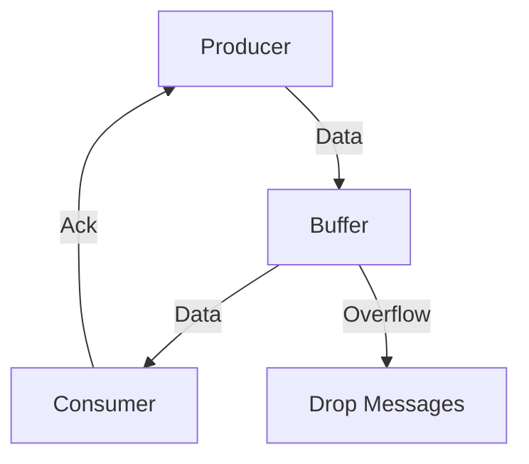

## 9.4. Backpressure Management

In the realm of reactive programming, managing backpressure is a crucial aspect of building robust and efficient systems. Backpressure refers to the mechanism of controlling the flow of data between producers and consumers to prevent system overload. In Elixir, a language known for its concurrency and fault-tolerance, mastering backpressure management is essential for developing scalable applications.

### Understanding Backpressure

Backpressure is the process of regulating the rate at which data is produced and consumed. When a producer generates data faster than a consumer can process it, the system can become overwhelmed, leading to performance degradation or even failure. Effective backpressure management ensures that the system remains stable and resources are optimized.

#### Key Concepts

- **Data Flow Control**: The practice of managing the rate and volume of data moving through a system.
- **Producer**: An entity that generates data.
- **Consumer**: An entity that processes data.
- **Buffering**: Temporarily storing data to manage differences in production and consumption rates.
- **Dropping Messages**: Discarding excess data when the system cannot handle the load.

### Strategies for Backpressure Management

Elixir provides several strategies for managing backpressure, each with its own advantages and trade-offs. Understanding these strategies is key to implementing effective backpressure management in your applications.

#### Synchronous Communication

Synchronous communication involves coordinating the producer and consumer to ensure that data is only produced when the consumer is ready to process it. This approach can be implemented using blocking calls or acknowledgments.

```elixir
defmodule SynchronousProducer do
  def produce(data, consumer) do
    send(consumer, {:data, data})
    receive do
      :ack -> :ok
    end
  end
end

defmodule SynchronousConsumer do
  def consume do
    receive do
      {:data, data} ->
        process(data)
        send(self(), :ack)
    end
  end

  defp process(data) do
    # Simulate data processing
    IO.puts("Processing #{data}")
  end
end
```

In this example, the producer waits for an acknowledgment from the consumer before sending more data, ensuring that the consumer is not overwhelmed.

#### Buffering

Buffering involves temporarily storing data in a queue or buffer when the consumer is not ready to process it. This approach can help smooth out fluctuations in data flow but requires careful management to avoid buffer overflow.

```elixir
defmodule BufferedProducer do
  def produce(data, buffer) do
    :queue.in(data, buffer)
  end
end

defmodule BufferedConsumer do
  def consume(buffer) do
    case :queue.out(buffer) do
      {:empty, _} -> :ok
      {{:value, data}, new_buffer} ->
        process(data)
        consume(new_buffer)
    end
  end

  defp process(data) do
    # Simulate data processing
    IO.puts("Processing #{data}")
  end
end
```

Here, data is added to a queue by the producer and consumed by the consumer as it becomes available.

#### Dropping Messages

In some cases, it may be acceptable to drop messages when the system is under heavy load. This approach can prevent system overload but may result in data loss.

```elixir
defmodule DroppingProducer do
  def produce(data, consumer) do
    if can_send?(consumer) do
      send(consumer, {:data, data})
    else
      IO.puts("Dropping #{data}")
    end
  end

  defp can_send?(consumer) do
    # Check if the consumer can accept more data
    true
  end
end
```

This example demonstrates a simple mechanism for dropping messages when the consumer cannot handle additional data.

### Benefits of Backpressure Management

Implementing effective backpressure management in Elixir applications offers several benefits:

- **System Stability**: Prevents system overload and ensures consistent performance.
- **Resource Optimization**: Efficiently utilizes system resources by matching production and consumption rates.
- **Improved Scalability**: Enables the system to handle varying loads without degradation.

### Visualizing Backpressure Management

To better understand the flow of data and the role of backpressure management, consider the following diagram:



This diagram illustrates the flow of data from the producer to the consumer, with a buffer in between to manage differences in processing rates. Acknowledgments from the consumer help regulate the flow, while excess data is dropped to prevent overload.

### Elixir's Unique Features for Backpressure Management

Elixir's concurrency model and the OTP (Open Telecom Platform) framework provide unique features that facilitate backpressure management:

- **Lightweight Processes**: Elixir's lightweight processes allow for efficient handling of concurrent tasks, making it easier to implement backpressure strategies.
- **GenStage**: A specialized library for building data processing pipelines with built-in backpressure management.
- **Flow**: A library for parallel data processing that leverages GenStage to handle backpressure.

#### Using GenStage for Backpressure Management

GenStage is a powerful tool for building data processing pipelines with backpressure management. It allows you to define producers, consumers, and stages that process data in parallel.

```elixir
defmodule Producer do
  use GenStage

  def start_link(initial) do
    GenStage.start_link(__MODULE__, initial, name: __MODULE__)
  end

  def init(initial) do
    {:producer, initial}
  end

  def handle_demand(demand, state) do
    events = Enum.take(state, demand)
    {:noreply, events, state -- events}
  end
end

defmodule Consumer do
  use GenStage

  def start_link() do
    GenStage.start_link(__MODULE__, :ok, name: __MODULE__)
  end

  def init(:ok) do
    {:consumer, :ok}
  end

  def handle_events(events, _from, state) do
    Enum.each(events, &IO.puts("Consumed #{&1}"))
    {:noreply, [], state}
  end
end

{:ok, producer} = Producer.start_link(1..100)
{:ok, consumer} = Consumer.start_link()

GenStage.sync_subscribe(consumer, to: producer)
```

In this example, the `Producer` generates a range of numbers, and the `Consumer` processes them. GenStage automatically manages backpressure by controlling the flow of data based on demand.

### Design Considerations

When implementing backpressure management in Elixir, consider the following:

- **System Requirements**: Determine the acceptable trade-offs between data loss, latency, and throughput.
- **Resource Constraints**: Ensure that your system can handle the buffer size and processing requirements.
- **Scalability**: Design your system to scale with increasing loads and data volumes.

### Differences and Similarities with Other Patterns

Backpressure management is often confused with flow control and rate limiting. While they share similarities, they serve different purposes:

- **Flow Control**: Manages the rate of data transmission to prevent congestion.
- **Rate Limiting**: Restricts the number of requests or data points processed over a period.

Backpressure management focuses on balancing production and consumption rates to maintain system stability.

### Try It Yourself

Experiment with the provided code examples by modifying the data production rate or buffer size. Observe how these changes affect the system's ability to manage backpressure. Consider implementing additional strategies, such as prioritizing certain data types or dynamically adjusting buffer sizes based on system load.

### Knowledge Check

- What is backpressure, and why is it important in reactive programming?
- How does synchronous communication help manage backpressure?
- What are the trade-offs of using buffering as a backpressure strategy?
- How can GenStage be used to implement backpressure management in Elixir?
- What are the differences between backpressure management, flow control, and rate limiting?

### Embrace the Journey

Remember, mastering backpressure management is a journey. As you continue to explore Elixir's capabilities, you'll discover new ways to optimize data flow and build resilient systems. Keep experimenting, stay curious, and enjoy the process of learning and growing as a developer.

## Quiz: Backpressure Management



### What is backpressure in the context of reactive programming?

- [x] A mechanism to control data flow between producers and consumers
- [ ] A method to increase data production rates
- [ ] A technique to prioritize certain data types
- [ ] A strategy for reducing system latency

> **Explanation:** Backpressure is a mechanism to control the flow of data between producers and consumers to prevent system overload.

### Which strategy involves temporarily storing data to manage differences in production and consumption rates?

- [ ] Synchronous communication
- [x] Buffering
- [ ] Dropping messages
- [ ] Rate limiting

> **Explanation:** Buffering involves temporarily storing data in a queue or buffer to manage differences in production and consumption rates.

### How does synchronous communication help manage backpressure?

- [x] By coordinating the producer and consumer to ensure data is only produced when the consumer is ready
- [ ] By increasing the production rate to match the consumer's capacity
- [ ] By discarding excess data when the system is overloaded
- [ ] By prioritizing certain data types

> **Explanation:** Synchronous communication coordinates the producer and consumer to ensure data is only produced when the consumer is ready to process it.

### What is a potential downside of using buffering as a backpressure strategy?

- [ ] Increased data production rates
- [ ] Reduced system stability
- [x] Buffer overflow
- [ ] Decreased resource optimization

> **Explanation:** Buffering can lead to buffer overflow if the buffer size is not managed properly.

### Which Elixir library is specifically designed for building data processing pipelines with backpressure management?

- [ ] Ecto
- [ ] Phoenix
- [x] GenStage
- [ ] Plug

> **Explanation:** GenStage is a library for building data processing pipelines with built-in backpressure management.

### What is the primary goal of backpressure management?

- [ ] To increase data production rates
- [x] To maintain system stability and optimize resource usage
- [ ] To prioritize certain data types
- [ ] To reduce system latency

> **Explanation:** The primary goal of backpressure management is to maintain system stability and optimize resource usage by balancing production and consumption rates.

### How does GenStage manage backpressure?

- [ ] By increasing the production rate to match the consumer's capacity
- [ ] By discarding excess data when the system is overloaded
- [x] By controlling the flow of data based on demand
- [ ] By prioritizing certain data types

> **Explanation:** GenStage manages backpressure by controlling the flow of data based on demand from consumers.

### What is a key difference between backpressure management and rate limiting?

- [ ] Backpressure management restricts the number of requests processed over a period
- [x] Backpressure management balances production and consumption rates
- [ ] Rate limiting manages the rate of data transmission
- [ ] Rate limiting focuses on maintaining system stability

> **Explanation:** Backpressure management focuses on balancing production and consumption rates, while rate limiting restricts the number of requests or data points processed over a period.

### Which of the following is NOT a strategy for managing backpressure?

- [ ] Synchronous communication
- [ ] Buffering
- [ ] Dropping messages
- [x] Increasing data production rates

> **Explanation:** Increasing data production rates is not a strategy for managing backpressure; it can lead to system overload.

### True or False: Backpressure management is only relevant in Elixir applications.

- [ ] True
- [x] False

> **Explanation:** Backpressure management is relevant in any system where data flow between producers and consumers needs to be controlled to prevent overload.


