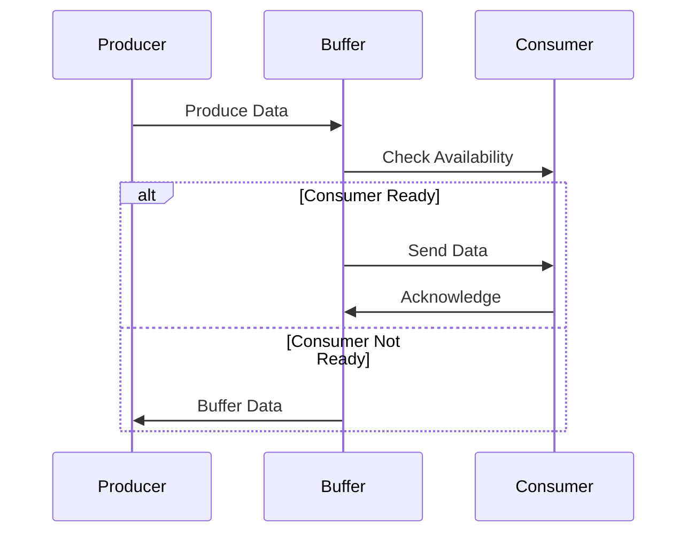

## 9.4. Backpressure Management

In the realm of reactive programming, managing the flow of data between producers and consumers is crucial for maintaining system stability and performance. Backpressure is a mechanism that ensures data producers do not overwhelm consumers by regulating the rate at which data is sent. This section delves into the intricacies of backpressure management in Elixir, providing expert insights and practical strategies to control data flow effectively.

### Understanding Backpressure

Backpressure is a concept that arises when the rate of data production exceeds the rate of data consumption. Without proper management, this imbalance can lead to system overload, resource exhaustion, and degraded performance. In Elixir, with its focus on concurrency and fault tolerance, managing backpressure is essential for building robust and scalable applications.

#### Key Concepts

- **Data Flow Control:** Ensuring that data is produced and consumed at a manageable rate.
- **System Stability:** Maintaining consistent performance and avoiding bottlenecks.
- **Resource Optimization:** Efficiently utilizing system resources to handle varying loads.

### Strategies for Backpressure Management

Elixir offers several strategies to manage backpressure effectively. These strategies can be employed individually or in combination, depending on the specific requirements of your application.

#### Synchronous Communication

Synchronous communication involves coordinating the data flow between producers and consumers to ensure that data is only sent when the consumer is ready to process it. This approach inherently manages backpressure by aligning production with consumption.

```elixir
defmodule SyncProducer do
  def produce(data, consumer) do
    send(consumer, {:data, data})
    receive do
      :ack -> :ok
    end
  end
end

defmodule SyncConsumer do
  def consume do
    receive do
      {:data, data} ->
        process(data)
        send(self(), :ack)
    end
  end

  defp process(data) do
    # Process the data
  end
end
```

In this example, the producer waits for an acknowledgment from the consumer before sending more data, ensuring that the consumer is not overwhelmed.

#### Buffering

Buffering involves temporarily storing data in a queue or buffer until the consumer is ready to process it. This strategy can be useful when the production rate is variable, but the consumption rate is relatively stable.

```elixir
defmodule BufferedQueue do
  def start_link do
    {:ok, spawn_link(__MODULE__, :loop, [[]])}
  end

  def loop(buffer) do
    receive do
      {:produce, data} ->
        loop([data | buffer])
      {:consume, pid} ->
        case buffer do
          [h | t] ->
            send(pid, {:data, h})
            loop(t)
          [] ->
            send(pid, :empty)
            loop(buffer)
        end
    end
  end
end
```

Here, data is buffered in a list, and the consumer can request data when ready. This approach helps manage backpressure by decoupling the production and consumption rates.

#### Dropping Messages

In scenarios where maintaining low latency is critical, dropping messages can be an effective strategy. This involves discarding excess data that cannot be processed in a timely manner, ensuring that the system remains responsive.

```elixir
defmodule Dropper do
  def produce(data, consumer, max_queue_size) do
    if length(consumer.queue) < max_queue_size do
      send(consumer, {:data, data})
    else
      :drop
    end
  end
end
```

This approach is suitable for applications where data loss is acceptable, such as in real-time analytics or monitoring systems.

### Benefits of Backpressure Management

Implementing effective backpressure management strategies in Elixir offers several benefits:

- **System Stability:** By controlling data flow, backpressure management prevents system overload and ensures consistent performance.
- **Resource Optimization:** Efficiently managing data flow reduces resource consumption, leading to better utilization of memory and CPU.
- **Scalability:** Proper backpressure management allows systems to handle varying loads gracefully, supporting scalability and growth.

### Visualizing Backpressure Management

To better understand the flow of data and the role of backpressure, let's visualize the process using a sequence diagram.


```mermaid
sequenceDiagram
    participant Producer
    participant Buffer
    participant Consumer

    Producer->>Buffer: Produce Data
    Buffer->>Consumer: Check Availability
    alt Consumer Ready
        Buffer->>Consumer: Send Data
        Consumer->>Buffer: Acknowledge
    else Consumer Not Ready
        Buffer->>Producer: Buffer Data
    end
```

In this diagram, we see how data flows from the producer to the buffer and then to the consumer. The buffer acts as an intermediary, managing the data flow based on the consumer's readiness.

### Elixir Unique Features in Backpressure Management

Elixir, built on the Erlang VM (BEAM), offers unique features that enhance backpressure management:

- **Lightweight Processes:** Elixir's lightweight processes allow for efficient handling of concurrent tasks, making it easier to implement backpressure strategies.
- **Fault Tolerance:** The "let it crash" philosophy in Elixir supports robust error handling, ensuring that backpressure management mechanisms can recover from failures gracefully.
- **GenStage and Flow:** These libraries provide abstractions for building concurrent and reactive data processing pipelines, with built-in support for backpressure management.

#### Using GenStage for Backpressure Management

GenStage is a powerful tool in Elixir for building concurrent data processing pipelines with backpressure support. It allows you to define producers, consumers, and stages that can communicate and manage data flow effectively.

```elixir
defmodule Producer do
  use GenStage

  def start_link(initial) do
    GenStage.start_link(__MODULE__, initial)
  end

  def init(initial) do
    {:producer, initial}
  end

  def handle_demand(demand, state) do
    events = Enum.take(state, demand)
    {:noreply, events, state -- events}
  end
end

defmodule Consumer do
  use GenStage

  def start_link do
    GenStage.start_link(__MODULE__, :ok)
  end

  def init(:ok) do
    {:consumer, :ok}
  end

  def handle_events(events, _from, state) do
    Enum.each(events, &IO.inspect(&1))
    {:noreply, [], state}
  end
end
```

In this example, the `Producer` generates events based on demand from the `Consumer`, effectively managing backpressure by only producing data when requested.

### Design Considerations

When implementing backpressure management in Elixir, consider the following:

- **System Requirements:** Assess the acceptable trade-offs between latency, throughput, and data loss.
- **Error Handling:** Ensure robust error handling mechanisms are in place to recover from failures.
- **Performance:** Monitor system performance to identify bottlenecks and optimize resource utilization.

### Differences and Similarities with Other Patterns

Backpressure management can be confused with other flow control patterns, such as throttling or rate limiting. While these patterns share similarities, backpressure specifically focuses on matching production with consumption capacity, whereas throttling and rate limiting often involve restricting the rate of requests or data flow to meet specific constraints.

### Try It Yourself

Experiment with the provided code examples to gain a deeper understanding of backpressure management in Elixir. Try modifying the buffer size, adjusting the production rate, or implementing additional strategies to see how they affect system performance and stability.

### References and Further Reading

For more information on backpressure management and related topics, consider exploring the following resources:

- [Elixir Documentation](https://elixir-lang.org/docs.html)
- [GenStage Documentation](https://hexdocs.pm/gen_stage/GenStage.html)
- [Reactive Streams](https://www.reactive-streams.org/)

### Knowledge Check

To reinforce your understanding of backpressure management, consider the following questions:

- What are the key benefits of implementing backpressure management in Elixir?
- How does synchronous communication help manage backpressure?
- In what scenarios might you choose to drop messages as a backpressure strategy?
- How does GenStage facilitate backpressure management in Elixir?

### Embrace the Journey

Remember, mastering backpressure management is just one step in building resilient and scalable systems with Elixir. As you continue your journey, keep experimenting, stay curious, and enjoy the process of learning and growth.

## Quiz Time!



### What is the primary goal of backpressure management?

- [x] To match data production with consumption capacity
- [ ] To increase data production rate
- [ ] To reduce system latency
- [ ] To eliminate data buffering

> **Explanation:** Backpressure management aims to align data production with the consumer's ability to process it, preventing overload.

### Which strategy involves temporarily storing data until the consumer is ready?

- [ ] Synchronous communication
- [x] Buffering
- [ ] Dropping messages
- [ ] Throttling

> **Explanation:** Buffering involves storing data in a queue or buffer until the consumer can process it.

### What is a key benefit of backpressure management?

- [x] System stability
- [ ] Increased data production
- [ ] Reduced data security
- [ ] Faster data transmission

> **Explanation:** Backpressure management helps maintain system stability by controlling data flow.

### How does synchronous communication manage backpressure?

- [x] By ensuring data is sent only when the consumer is ready
- [ ] By dropping excess data
- [ ] By increasing the consumer's processing speed
- [ ] By reducing the producer's data rate

> **Explanation:** Synchronous communication coordinates data flow, ensuring it is sent when the consumer is ready.

### What Elixir feature supports lightweight process management?

- [x] GenStage
- [ ] OTP
- [ ] Mix
- [ ] Phoenix

> **Explanation:** GenStage supports building concurrent data processing pipelines with backpressure management.

### Which scenario might justify dropping messages as a strategy?

- [x] Real-time analytics where data loss is acceptable
- [ ] Financial transactions requiring data integrity
- [ ] Medical data processing
- [ ] Long-term data storage

> **Explanation:** Dropping messages can be suitable for real-time systems where some data loss is acceptable.

### What does GenStage facilitate in Elixir?

- [x] Backpressure management
- [ ] Data encryption
- [ ] User authentication
- [ ] File storage

> **Explanation:** GenStage facilitates building data processing pipelines with backpressure management.

### What is a potential downside of buffering?

- [x] Increased memory usage
- [ ] Reduced data integrity
- [ ] Increased data loss
- [ ] Faster data processing

> **Explanation:** Buffering can lead to increased memory usage as data is stored temporarily.

### Which pattern is often confused with backpressure management?

- [ ] Caching
- [ ] Data encryption
- [x] Throttling
- [ ] Load balancing

> **Explanation:** Throttling is often confused with backpressure management but focuses on restricting data flow rate.

### True or False: Backpressure management is essential for building scalable systems.

- [x] True
- [ ] False

> **Explanation:** Effective backpressure management is crucial for ensuring system scalability and stability.


