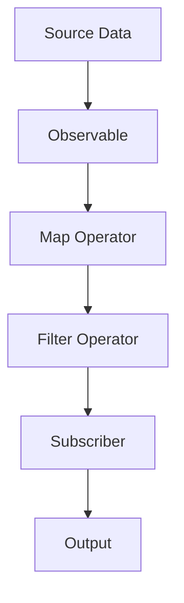
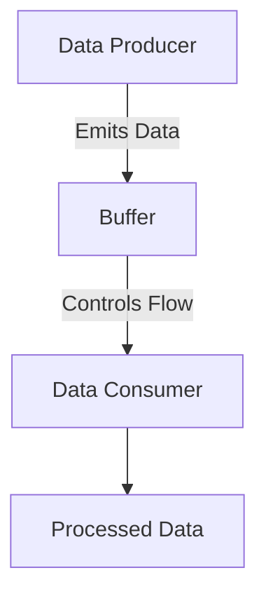

## 9.5. Reactive Extensions Libraries

In the realm of modern software development, reactive programming has emerged as a powerful paradigm for building responsive, resilient, and scalable applications. Elixir, with its functional programming roots and robust concurrency model, is well-suited to leverage reactive programming principles. In this section, we delve into the world of Reactive Extensions Libraries in Elixir, focusing on enhancing reactive capabilities by leveraging existing libraries for common reactive patterns.

### Enhancing Reactive Capabilities

Reactive programming revolves around the concept of data streams and the propagation of change. It allows developers to express dynamic behavior in a declarative manner, making it easier to manage asynchronous data flows. In Elixir, reactive programming can be significantly enhanced by utilizing Reactive Extensions Libraries, which provide a rich set of operators for transforming and combining data streams.

#### Leveraging Existing Libraries for Common Reactive Patterns

Reactive Extensions Libraries offer a comprehensive toolkit for implementing reactive patterns in Elixir applications. These libraries abstract away the complexities of managing asynchronous data flows, enabling developers to focus on building robust and efficient systems. By leveraging these libraries, you can seamlessly integrate reactive programming principles into your Elixir projects, enhancing their responsiveness and scalability.

### Available Libraries

In the Elixir ecosystem, several libraries are available to facilitate reactive programming. Two prominent libraries are RxElixir and Reactive Streams. Let's explore each of these libraries in detail.

#### RxElixir

RxElixir is an Elixir implementation of the Reactive Extensions (Rx) library, which is widely used in various programming languages for reactive programming. RxElixir provides a set of operators that allow you to work with asynchronous data streams in a declarative manner. It enables you to compose complex data flows by chaining together operators, making it easier to handle events and data transformations.

##### Key Features of RxElixir

- **Observable Sequences**: RxElixir introduces the concept of observables, which represent data streams that can emit values over time. Observables can be created from various sources, such as collections, timers, or external events.
- **Operators for Data Transformation**: RxElixir provides a rich set of operators for transforming and combining data streams. These operators allow you to filter, map, reduce, and merge data streams, enabling you to build complex data processing pipelines.
- **Error Handling**: RxElixir includes mechanisms for handling errors in data streams, allowing you to gracefully recover from failures and ensure the robustness of your applications.
- **Concurrency and Scheduling**: RxElixir supports concurrency and scheduling, enabling you to control the execution context of your data streams and optimize performance.

##### Sample Code Snippet: Using RxElixir

```elixir
defmodule ReactiveExample do
  use RxElixir

  def run do
    observable = Observable.from([1, 2, 3, 4, 5])
    |> Observable.map(&(&1 * 2))
    |> Observable.filter(&(&1 > 5))

    observable
    |> Observable.subscribe(fn value ->
      IO.puts("Received value: #{value}")
    end)
  end
end

ReactiveExample.run()
```

In this example, we create an observable sequence from a list of numbers, apply a map operator to double each value, and then filter out values less than or equal to 5. Finally, we subscribe to the observable to receive and print the transformed values.

#### Reactive Streams

Reactive Streams is another powerful library for reactive programming in Elixir. It provides a standard for asynchronous stream processing with non-blocking backpressure. Reactive Streams is designed to handle large volumes of data efficiently, making it ideal for building high-performance applications.

##### Key Features of Reactive Streams

- **Backpressure Management**: Reactive Streams includes mechanisms for managing backpressure, ensuring that data producers do not overwhelm consumers with too much data. This feature is crucial for maintaining system stability and preventing resource exhaustion.
- **Asynchronous Data Processing**: Reactive Streams supports asynchronous data processing, allowing you to build responsive and scalable applications that can handle varying workloads.
- **Interoperability**: Reactive Streams is designed to be interoperable with other reactive libraries and frameworks, enabling you to integrate it seamlessly into your existing systems.

##### Sample Code Snippet: Using Reactive Streams

```elixir
defmodule StreamExample do
  use ReactiveStreams

  def run do
    stream = Stream.from_enumerable(1..10)
    |> Stream.map(&(&1 * 2))
    |> Stream.filter(&(&1 > 10))

    Stream.run(stream, fn value ->
      IO.puts("Processed value: #{value}")
    end)
  end
end

StreamExample.run()
```

In this example, we create a stream from a range of numbers, apply a map operation to double each value, and filter out values less than or equal to 10. The stream is then processed asynchronously, and the results are printed to the console.

### Features of Reactive Extensions Libraries

Reactive Extensions Libraries in Elixir provide a wide range of features that enhance the capabilities of reactive programming. These features include operators for transforming and combining data streams, error handling mechanisms, concurrency support, and backpressure management. Let's explore these features in more detail.

#### Operators for Transforming and Combining Data Streams

Reactive Extensions Libraries offer a rich set of operators that allow you to transform and combine data streams in various ways. These operators enable you to build complex data processing pipelines by chaining together multiple operations. Some common operators include:

- **Map**: Transforms each element of a data stream by applying a function to it.
- **Filter**: Filters elements of a data stream based on a predicate function.
- **Reduce**: Aggregates elements of a data stream into a single value using a specified accumulator function.
- **Merge**: Combines multiple data streams into a single stream, emitting values from all input streams.

These operators provide a powerful and expressive way to manipulate data streams, enabling you to implement complex data processing logic with ease.

#### Error Handling Mechanisms

Reactive Extensions Libraries include robust error handling mechanisms that allow you to gracefully recover from failures in data streams. These mechanisms enable you to handle errors at various stages of the data processing pipeline, ensuring the reliability and robustness of your applications. Common error handling strategies include:

- **Retry**: Automatically retries a failed operation a specified number of times before propagating the error.
- **Fallback**: Provides a fallback value or operation in case of an error, allowing the data stream to continue processing.
- **Catch**: Catches and handles errors in the data stream, preventing them from propagating further.

By incorporating these error handling mechanisms, you can build resilient applications that can gracefully handle unexpected failures.

#### Concurrency and Scheduling

Reactive Extensions Libraries support concurrency and scheduling, allowing you to control the execution context of your data streams. This feature enables you to optimize the performance of your applications by distributing work across multiple threads or processes. Common concurrency and scheduling strategies include:

- **Parallel Execution**: Distributes data processing tasks across multiple threads or processes, improving throughput and reducing latency.
- **Schedulers**: Control the execution context of data streams, allowing you to specify when and where operations should be executed.

By leveraging concurrency and scheduling features, you can build high-performance applications that can efficiently handle large volumes of data.

#### Backpressure Management

Backpressure management is a critical feature of Reactive Extensions Libraries, ensuring that data producers do not overwhelm consumers with too much data. This feature is essential for maintaining system stability and preventing resource exhaustion. Common backpressure management strategies include:

- **Buffering**: Temporarily stores excess data in a buffer until the consumer is ready to process it.
- **Throttling**: Limits the rate at which data is emitted from the producer, preventing the consumer from being overwhelmed.
- **Dropping**: Discards excess data when the consumer is unable to keep up with the producer.

By implementing backpressure management strategies, you can build scalable applications that can handle varying workloads without compromising performance.

### Visualizing Reactive Extensions Libraries

To better understand the concepts and workflows associated with Reactive Extensions Libraries, let's visualize the data flow and transformations using Mermaid.js diagrams.

#### Visualizing Data Flow in RxElixir



**Caption**: This diagram illustrates the data flow in an RxElixir pipeline. The source data is transformed into an observable, which is then processed by a series of operators (map and filter) before being consumed by a subscriber.

#### Visualizing Backpressure Management in Reactive Streams



**Caption**: This diagram depicts the backpressure management process in Reactive Streams. The data producer emits data into a buffer, which controls the flow of data to the consumer, ensuring that the consumer is not overwhelmed.

### References and Links

For further reading on reactive programming and Reactive Extensions Libraries in Elixir, consider exploring the following resources:

- [ReactiveX Documentation](http://reactivex.io/)
- [Elixir School: Reactive Programming](https://elixirschool.com/en/lessons/advanced/reactive_programming/)
- [RxElixir GitHub Repository](https://github.com/ReactiveX/RxElixir)
- [Reactive Streams Specification](https://www.reactive-streams.org/)

### Knowledge Check

To reinforce your understanding of Reactive Extensions Libraries in Elixir, consider the following questions and exercises:

1. What are the key differences between RxElixir and Reactive Streams?
2. How do operators in Reactive Extensions Libraries enhance data processing capabilities?
3. Implement a simple data processing pipeline using RxElixir and visualize the data flow.
4. Describe the importance of backpressure management in reactive programming.
5. Experiment with different error handling strategies in RxElixir and observe their effects on data streams.

### Embrace the Journey

Remember, mastering reactive programming with Elixir is a journey. As you explore Reactive Extensions Libraries and integrate them into your projects, you'll discover new ways to build responsive, resilient, and scalable applications. Keep experimenting, stay curious, and enjoy the journey!

### Quiz: Reactive Extensions Libraries



### What is the primary purpose of Reactive Extensions Libraries in Elixir?

- [x] To enhance reactive programming capabilities by providing operators for data streams
- [ ] To replace the need for concurrency in Elixir
- [ ] To simplify object-oriented programming in Elixir
- [ ] To eliminate the need for error handling

> **Explanation:** Reactive Extensions Libraries enhance reactive programming capabilities by providing operators for transforming and combining data streams.

### Which library is an Elixir implementation of the Reactive Extensions (Rx) library?

- [x] RxElixir
- [ ] Reactive Streams
- [ ] ElixirFlow
- [ ] StreamEx

> **Explanation:** RxElixir is an Elixir implementation of the Reactive Extensions (Rx) library.

### What is a key feature of Reactive Streams?

- [x] Backpressure management
- [ ] Object-oriented design
- [ ] Synchronous data processing
- [ ] Lack of error handling

> **Explanation:** Reactive Streams includes mechanisms for managing backpressure, ensuring that data producers do not overwhelm consumers.

### Which operator in Reactive Extensions Libraries is used to transform each element of a data stream?

- [x] Map
- [ ] Filter
- [ ] Reduce
- [ ] Merge

> **Explanation:** The Map operator is used to transform each element of a data stream by applying a function to it.

### What is the purpose of backpressure management in reactive programming?

- [x] To prevent data producers from overwhelming consumers
- [ ] To increase the speed of data processing
- [ ] To eliminate the need for error handling
- [ ] To simplify data transformations

> **Explanation:** Backpressure management ensures that data producers do not overwhelm consumers with too much data, maintaining system stability.

### Which strategy is NOT a common error handling mechanism in Reactive Extensions Libraries?

- [ ] Retry
- [ ] Fallback
- [ ] Catch
- [x] Ignore

> **Explanation:** Ignoring errors is not a common error handling strategy in Reactive Extensions Libraries.

### What does the Filter operator do in a data stream?

- [x] Filters elements based on a predicate function
- [ ] Transforms each element by applying a function
- [ ] Aggregates elements into a single value
- [ ] Combines multiple streams into one

> **Explanation:** The Filter operator filters elements of a data stream based on a predicate function.

### How does RxElixir handle concurrency?

- [x] By supporting concurrency and scheduling
- [ ] By eliminating the need for concurrency
- [ ] By using synchronous execution only
- [ ] By relying on external libraries

> **Explanation:** RxElixir supports concurrency and scheduling, allowing you to control the execution context of data streams.

### What is the role of a subscriber in an RxElixir pipeline?

- [x] To consume and process the transformed data
- [ ] To produce data for the pipeline
- [ ] To filter data based on conditions
- [ ] To manage backpressure

> **Explanation:** A subscriber in an RxElixir pipeline consumes and processes the transformed data.

### True or False: Reactive Extensions Libraries in Elixir are only useful for handling synchronous data flows.

- [ ] True
- [x] False

> **Explanation:** Reactive Extensions Libraries in Elixir are designed to handle asynchronous data flows, making them suitable for reactive programming.



By exploring Reactive Extensions Libraries in Elixir, you can unlock the full potential of reactive programming and build applications that are responsive, resilient, and scalable. Keep experimenting with these libraries, and you'll discover new ways to enhance your Elixir projects.
