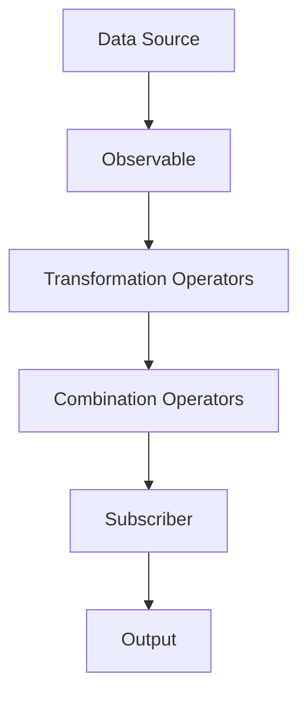

## 9.5. Reactive Extensions Libraries

In the realm of modern software development, the ability to handle asynchronous data streams efficiently is paramount. Elixir, with its robust concurrency model, is well-suited for reactive programming. However, to fully harness the power of reactive patterns, leveraging existing libraries such as RxElixir and Reactive Streams can significantly enhance your capabilities. In this section, we will explore these libraries, their features, and how they can be integrated into your Elixir projects to create more responsive and scalable applications.

### Enhancing Reactive Capabilities

Reactive programming is an approach that focuses on building systems that react to changes in data over time. This paradigm is particularly useful for applications that require real-time updates, such as live data feeds, interactive user interfaces, and IoT systems. By leveraging reactive extensions libraries, developers can simplify the process of managing asynchronous data streams and events.

#### Leveraging Existing Libraries

Elixir's ecosystem includes several libraries that facilitate reactive programming. Among these, **RxElixir** and **Reactive Streams** stand out for their comprehensive set of tools and operators designed to handle data streams efficiently. These libraries provide a declarative approach to composing asynchronous and event-based programs by using observable sequences.

### Available Libraries

#### RxElixir

**RxElixir** is an Elixir port of the popular Reactive Extensions (Rx) library. It provides a set of tools for composing asynchronous and event-based programs using observable sequences. RxElixir allows developers to work with data streams in a reactive manner, enabling the creation of complex data pipelines with ease.

- **Key Features of RxElixir:**
  - **Observable Sequences:** Core data structure for representing asynchronous data streams.
  - **Operators:** A rich set of operators for transforming, filtering, and combining data streams.
  - **Schedulers:** Control the execution context of observables, allowing fine-grained control over concurrency.

#### Reactive Streams

**Reactive Streams** is a specification for asynchronous stream processing with non-blocking backpressure. It provides a standard for handling streams of data in a reactive manner, ensuring that the consumer is not overwhelmed by the producer.

- **Key Features of Reactive Streams:**
  - **Backpressure Management:** Ensures that the data producer does not overwhelm the consumer.
  - **Interoperability:** Compatible with other reactive libraries and frameworks.
  - **Asynchronous Processing:** Supports non-blocking operations for efficient data handling.

### Features of Reactive Extensions Libraries

Reactive extensions libraries in Elixir provide a comprehensive set of features that make it easier to work with reactive patterns. These features include a variety of operators for transforming and combining data streams, as well as tools for managing concurrency and backpressure.

#### Operators for Transforming and Combining Data Streams

Reactive extensions libraries offer a wide array of operators that allow developers to transform and combine data streams in a declarative manner. These operators enable the creation of complex data pipelines with minimal boilerplate code.

- **Transformation Operators:** Map, filter, and reduce operators allow for the transformation of data streams.
- **Combination Operators:** Merge, zip, and combineLatest operators enable the combination of multiple data streams.
- **Error Handling Operators:** Catch and retry operators provide mechanisms for handling errors in data streams.

#### Managing Concurrency and Backpressure

Concurrency and backpressure are critical aspects of reactive programming. Reactive extensions libraries provide tools for managing these aspects effectively, ensuring that applications remain responsive and performant.

- **Schedulers:** Control the execution context of observables, allowing for fine-grained control over concurrency.
- **Backpressure Management:** Ensures that the data producer does not overwhelm the consumer, maintaining system stability.

### Code Examples

Let's explore some code examples to demonstrate how to use RxElixir and Reactive Streams in your Elixir applications.

#### Example 1: Creating an Observable with RxElixir

```elixir
defmodule Example do
  use RxElixir

  def run do
    observable = RxElixir.Observable.create(fn observer ->
      Enum.each(1..5, fn i ->
        observer.next(i)
      end)
      observer.complete()
    end)

    observable
    |> RxElixir.Observable.map(&(&1 * 2))
    |> RxElixir.Observable.subscribe(fn value ->
      IO.puts("Received: #{value}")
    end)
  end
end

Example.run()
```

> **Explanation:** In this example, we create an observable that emits numbers from 1 to 5. We then use the `map` operator to double each value and subscribe to the observable to print each transformed value.

#### Example 2: Combining Streams with Reactive Streams

```elixir
defmodule StreamExample do
  use ReactiveStreams

  def run do
    stream1 = ReactiveStreams.Publisher.create(fn subscriber ->
      Enum.each(1..3, fn i ->
        subscriber.next(i)
      end)
      subscriber.complete()
    end)

    stream2 = ReactiveStreams.Publisher.create(fn subscriber ->
      Enum.each(4..6, fn i ->
        subscriber.next(i)
      end)
      subscriber.complete()
    end)

    combined_stream = ReactiveStreams.Publisher.merge(stream1, stream2)

    combined_stream
    |> ReactiveStreams.Subscriber.subscribe(fn value ->
      IO.puts("Combined Stream Value: #{value}")
    end)
  end
end

StreamExample.run()
```

> **Explanation:** This example demonstrates how to combine two streams using the `merge` operator. The combined stream emits values from both streams, which are then printed to the console.

### Visualizing Reactive Extensions Libraries

To better understand how reactive extensions libraries work, let's visualize the flow of data through observables and operators.


```mermaid
graph TD;
    A[Data Source] --> B[Observable];
    B --> C[Transformation Operators];
    C --> D[Combination Operators];
    D --> E[Subscriber];
    E --> F[Output];
```

> **Diagram Explanation:** This diagram illustrates the flow of data in a reactive system. Data from the source is emitted through an observable, transformed and combined using operators, and finally consumed by a subscriber, producing an output.

### Try It Yourself

To deepen your understanding of reactive extensions libraries in Elixir, try modifying the code examples provided above. Experiment with different operators and observe how they affect the data streams. Consider creating your own observables and combining them in various ways to see the power of reactive programming in action.

### References and Links

For further reading on reactive programming and reactive extensions libraries, consider the following resources:

- [ReactiveX Documentation](http://reactivex.io/)
- [Elixir School: Reactive Programming](https://elixirschool.com/en/lessons/advanced/reactive_programming/)
- [RxElixir GitHub Repository](https://github.com/elixir-lang/rx_elixir)
- [Reactive Streams Specification](https://www.reactive-streams.org/)

### Knowledge Check

Before moving on, take a moment to reflect on what you've learned about reactive extensions libraries. Consider the following questions:

- How do reactive extensions libraries enhance the capabilities of reactive programming in Elixir?
- What are the key features of RxElixir and Reactive Streams?
- How do operators in reactive extensions libraries facilitate data stream manipulation?

### Embrace the Journey

Remember, mastering reactive programming with Elixir and its libraries is an ongoing journey. As you continue to explore and experiment with these tools, you'll gain a deeper understanding of how to build responsive and scalable applications. Keep experimenting, stay curious, and enjoy the journey!

## Quiz Time!



### What is the primary purpose of reactive extensions libraries in Elixir?

- [x] To enhance reactive programming capabilities
- [ ] To replace Elixir's built-in concurrency model
- [ ] To simplify synchronous programming
- [ ] To provide a new syntax for Elixir

> **Explanation:** Reactive extensions libraries enhance reactive programming capabilities by providing tools for managing asynchronous data streams.

### Which library is an Elixir port of the popular Reactive Extensions (Rx) library?

- [x] RxElixir
- [ ] Reactive Streams
- [ ] ElixirStream
- [ ] StreamX

> **Explanation:** RxElixir is an Elixir port of the popular Reactive Extensions (Rx) library.

### What is a key feature of Reactive Streams?

- [x] Backpressure management
- [ ] Synchronous data processing
- [ ] Immutable data structures
- [ ] Built-in logging

> **Explanation:** Reactive Streams provides backpressure management to prevent the consumer from being overwhelmed by the producer.

### Which operator is used to combine multiple data streams?

- [x] Merge
- [ ] Map
- [ ] Filter
- [ ] Reduce

> **Explanation:** The `merge` operator is used to combine multiple data streams into one.

### How do schedulers in reactive extensions libraries help manage concurrency?

- [x] By controlling the execution context of observables
- [ ] By providing a new syntax for concurrency
- [ ] By enforcing synchronous execution
- [ ] By eliminating the need for processes

> **Explanation:** Schedulers control the execution context of observables, allowing for fine-grained control over concurrency.

### What is the role of transformation operators in reactive extensions libraries?

- [x] To modify data streams
- [ ] To create new observables
- [ ] To handle errors
- [ ] To manage backpressure

> **Explanation:** Transformation operators modify data streams by applying functions like map, filter, and reduce.

### Which feature of reactive extensions libraries ensures that the data producer does not overwhelm the consumer?

- [x] Backpressure management
- [ ] Error handling
- [ ] Transformation operators
- [ ] Combination operators

> **Explanation:** Backpressure management ensures that the data producer does not overwhelm the consumer, maintaining system stability.

### What is the primary data structure used in RxElixir for representing asynchronous data streams?

- [x] Observable sequences
- [ ] Tuples
- [ ] Lists
- [ ] Maps

> **Explanation:** Observable sequences are the primary data structure used in RxElixir for representing asynchronous data streams.

### True or False: Reactive extensions libraries can be used to simplify the handling of synchronous data streams.

- [ ] True
- [x] False

> **Explanation:** Reactive extensions libraries are designed to simplify the handling of asynchronous data streams, not synchronous ones.

### What should you do to deepen your understanding of reactive extensions libraries in Elixir?

- [x] Experiment with different operators and create your own observables
- [ ] Memorize all available operators
- [ ] Focus solely on synchronous programming
- [ ] Avoid using reactive programming in Elixir

> **Explanation:** Experimenting with different operators and creating your own observables will deepen your understanding of reactive extensions libraries in Elixir.


