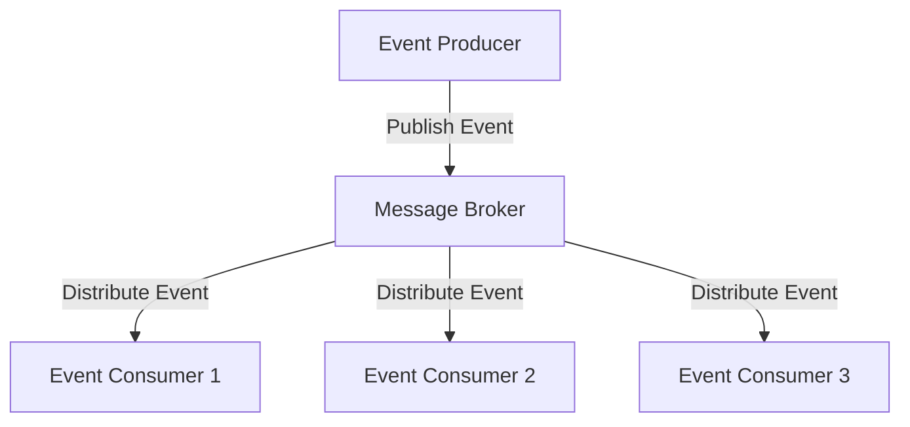

## 9.6. Event-Driven Architectures

Event-driven architectures (EDA) are a powerful paradigm for building scalable, decoupled systems. In Elixir, leveraging the BEAM VM's strengths, we can create robust event-driven systems that handle high concurrency and fault tolerance. This section will guide you through the principles of event-driven architectures, their implementation in Elixir, and practical use cases.

### Understanding Event-Driven Architectures

Event-driven architectures are systems where components communicate by producing and consuming events. This approach decouples the components, allowing them to operate independently and react to changes asynchronously. 

#### Key Concepts

- **Event**: A significant change in state or an occurrence that components can react to.
- **Event Producer**: The component that generates events.
- **Event Consumer**: The component that listens for and processes events.
- **Event Channel**: The medium through which events are transmitted, often implemented using message brokers.

### Designing Decoupled Systems

Decoupling is a core principle of EDA, allowing components to evolve independently and scale without affecting others. In Elixir, we can achieve decoupling using processes and message passing, which are native to the language.

#### Benefits of Decoupled Systems

- **Scalability**: Components can be scaled independently based on demand.
- **Resilience**: Failures in one component do not directly affect others.
- **Flexibility**: Easier to modify or replace components without impacting the entire system.

#### Implementing Decoupled Systems in Elixir

1. **Processes and Message Passing**: Utilize Elixir's lightweight processes to handle events asynchronously.
2. **GenServer**: Use GenServer for managing state and handling synchronous and asynchronous messages.
3. **PubSub**: Implement publish-subscribe patterns using libraries like `Phoenix.PubSub`.

### Implementing Event-Driven Patterns

Event-driven patterns in Elixir can be implemented using message brokers, topics, and subscriptions. These components facilitate the flow of events between producers and consumers.

#### Message Brokers

Message brokers are intermediaries that manage the transmission of events between producers and consumers. In Elixir, we can use tools like RabbitMQ or Kafka.

- **RabbitMQ**: A robust message broker supporting multiple messaging protocols.
- **Kafka**: A distributed streaming platform ideal for high-throughput messaging.

#### Topics and Subscriptions

- **Topics**: Named channels through which events are published. Consumers subscribe to topics to receive events.
- **Subscriptions**: Consumers register interest in specific topics to receive relevant events.

#### Code Example: Implementing a Simple Event-Driven System

Let's implement a basic event-driven system using `Phoenix.PubSub`.

```elixir
# Define a module for the event producer
defmodule EventProducer do
  def produce_event(event) do
    Phoenix.PubSub.broadcast(MyApp.PubSub, "events", event)
  end
end

# Define a module for the event consumer
defmodule EventConsumer do
  use GenServer

  def start_link(_) do
    GenServer.start_link(__MODULE__, %{}, name: __MODULE__)
  end

  def init(state) do
    Phoenix.PubSub.subscribe(MyApp.PubSub, "events")
    {:ok, state}
  end

  def handle_info(event, state) do
    IO.inspect("Received event: #{inspect(event)}")
    {:noreply, state}
  end
end

# Start the consumer and produce an event
{:ok, _} = EventConsumer.start_link([])
EventProducer.produce_event(%{type: :user_signed_in, user_id: 123})
```

### Use Cases for Event-Driven Architectures

Event-driven architectures are particularly useful in scenarios requiring asynchronous communication and decoupling.

#### Microservices Communication

In a microservices architecture, services often need to communicate asynchronously. EDA facilitates this by allowing services to publish and subscribe to events.

- **Example**: A user authentication service publishes an event when a user signs in, and other services (e.g., analytics, notifications) consume this event to perform their respective tasks.

#### Inter-Process Messaging

EDA is also effective for inter-process communication within a single application, allowing different parts of the application to react to changes without direct dependencies.

- **Example**: A shopping cart service updates inventory levels by consuming events from an order processing service.

### Visualizing Event-Driven Architectures

Below is a diagram illustrating a simple event-driven architecture with producers, consumers, and a message broker.



**Diagram Explanation**: The event producer publishes events to the message broker, which distributes them to subscribed consumers.

### Challenges and Considerations

While event-driven architectures offer many benefits, they also come with challenges:

- **Complexity**: Managing distributed components and ensuring reliable message delivery can be complex.
- **Consistency**: Achieving eventual consistency across components requires careful design.
- **Latency**: Asynchronous communication can introduce latency, which must be managed.

### Elixir's Unique Features for EDA

Elixir's concurrency model and process isolation make it particularly suited for event-driven architectures. The language's ability to handle millions of processes concurrently allows for highly scalable systems.

- **Fault Tolerance**: Elixir's "let it crash" philosophy and supervision trees provide robust error handling.
- **Hot Code Swapping**: Elixir supports live updates, allowing systems to evolve without downtime.

### Differences and Similarities with Other Patterns

EDA shares similarities with other architectural patterns like service-oriented architecture (SOA) but differs in its emphasis on decoupled, asynchronous communication.

- **Similarities**: Both EDA and SOA promote modular design and service reuse.
- **Differences**: EDA focuses on event-based communication, while SOA often relies on synchronous service calls.

### Try It Yourself

Experiment with the provided code example by:

- Adding more event consumers to handle different types of events.
- Implementing a message broker using RabbitMQ or Kafka for more complex scenarios.
- Exploring how different consumers can process the same event differently.

### Knowledge Check

- What are the main components of an event-driven architecture?
- How does Elixir's concurrency model benefit EDA?
- What are some challenges associated with implementing EDA?

### Summary

Event-driven architectures offer a powerful way to build decoupled, scalable systems. By leveraging Elixir's strengths, we can implement robust EDA solutions that handle high concurrency and fault tolerance. Remember, this is just the beginning. As you progress, you'll build more complex and interactive systems. Keep experimenting, stay curious, and enjoy the journey!

## Quiz: Event-Driven Architectures



### What is a key benefit of event-driven architectures?

- [x] Decoupled components
- [ ] Synchronous communication
- [ ] Increased latency
- [ ] Tight coupling

> **Explanation:** Event-driven architectures decouple components, allowing them to operate independently.

### Which Elixir feature is particularly beneficial for EDA?

- [x] Concurrency model
- [ ] Static typing
- [ ] Object-oriented design
- [ ] Manual memory management

> **Explanation:** Elixir's concurrency model allows for handling millions of processes concurrently, which is beneficial for EDA.

### What is the role of a message broker in EDA?

- [x] To manage the transmission of events between producers and consumers
- [ ] To store events permanently
- [ ] To execute events
- [ ] To generate events

> **Explanation:** A message broker manages the transmission of events between producers and consumers.

### Which of the following is a challenge of EDA?

- [x] Complexity in managing distributed components
- [ ] Lack of scalability
- [ ] Tight coupling
- [ ] Synchronous communication

> **Explanation:** Managing distributed components and ensuring reliable message delivery can be complex in EDA.

### What is a common use case for EDA?

- [x] Microservices communication
- [ ] Single-threaded applications
- [ ] Monolithic architectures
- [ ] Synchronous APIs

> **Explanation:** EDA is commonly used for microservices communication due to its asynchronous nature.

### How does Elixir's "let it crash" philosophy benefit EDA?

- [x] It provides robust error handling through supervision trees
- [ ] It increases system latency
- [ ] It decreases system reliability
- [ ] It promotes synchronous communication

> **Explanation:** Elixir's "let it crash" philosophy and supervision trees provide robust error handling.

### What is a topic in the context of EDA?

- [x] A named channel through which events are published
- [ ] A type of event consumer
- [ ] A method for storing events
- [ ] A process for generating events

> **Explanation:** A topic is a named channel through which events are published in EDA.

### What is a subscription in EDA?

- [x] A registration of interest in specific topics to receive events
- [ ] A method for generating events
- [ ] A type of event producer
- [ ] A process for storing events

> **Explanation:** A subscription is a registration of interest in specific topics to receive events.

### Which tool is NOT typically used as a message broker in Elixir?

- [ ] RabbitMQ
- [ ] Kafka
- [x] MySQL
- [ ] Phoenix.PubSub

> **Explanation:** MySQL is a database, not a message broker.

### True or False: EDA is suitable for synchronous communication.

- [ ] True
- [x] False

> **Explanation:** EDA is designed for asynchronous communication, not synchronous.


