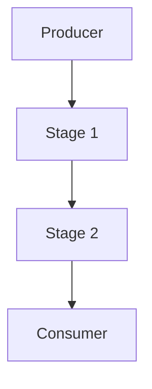

## 9.7. Real-Time Data Processing

In today's fast-paced digital world, the ability to process data in real-time is crucial for many applications, from live analytics to monitoring systems. Elixir, with its robust concurrency model and powerful libraries like GenStage and Flow, is well-suited for building real-time data processing systems. In this section, we'll explore the concepts, tools, and techniques necessary to master real-time data processing in Elixir.

### Understanding Real-Time Data Processing

Real-time data processing involves handling data as it arrives, with minimal delay. This is essential for applications that require immediate insights or actions based on incoming data. Examples include:

- **Live Analytics**: Providing up-to-the-minute insights into user behavior, financial markets, or system performance.
- **Monitoring Systems**: Continuously tracking the health and performance of applications, networks, or infrastructure.
- **Event-Driven Architectures**: Reacting to events in real-time, such as user interactions, sensor data, or system alerts.

### Key Concepts in Real-Time Data Processing

Before diving into the implementation details, let's clarify some key concepts:

- **Streaming Data**: Data that is continuously generated by various sources, often in small sizes, and sent in real-time to a processing system.
- **Latency**: The time delay between data generation and processing. In real-time systems, minimizing latency is crucial.
- **Throughput**: The amount of data processed in a given time period. High throughput is essential for handling large volumes of streaming data.
- **Backpressure**: A mechanism to control the flow of data, ensuring that producers do not overwhelm consumers.

### Handling Streaming Data in Elixir

Elixir provides several tools and libraries for handling streaming data efficiently. Let's explore some of the most popular options:

#### GenStage

GenStage is a powerful library for building data processing pipelines in Elixir. It provides a framework for defining producers, consumers, and stages that can be composed to form complex data flows.

**Key Features of GenStage:**

- **Producer-Consumer Model**: GenStage uses a producer-consumer model, where data flows from producers to consumers through intermediate stages.
- **Backpressure Support**: GenStage implements backpressure to ensure that consumers are not overwhelmed by data from producers.
- **Concurrency**: GenStage leverages Elixir's concurrency model to process data in parallel, improving throughput.

**Implementing a Simple GenStage Pipeline:**

Let's start with a simple example of a GenStage pipeline that processes a stream of numbers:

```elixir
defmodule NumberProducer do
  use GenStage

  def start_link(initial) do
    GenStage.start_link(__MODULE__, initial, name: __MODULE__)
  end

  def init(initial) do
    {:producer, initial}
  end

  def handle_demand(demand, state) when demand > 0 do
    events = Enum.to_list(state..(state + demand - 1))
    {:noreply, events, state + demand}
  end
end

defmodule NumberConsumer do
  use GenStage

  def start_link() do
    GenStage.start_link(__MODULE__, :ok, name: __MODULE__)
  end

  def init(:ok) do
    {:consumer, :ok}
  end

  def handle_events(events, _from, state) do
    Enum.each(events, fn event ->
      IO.inspect(event, label: "Received number")
    end)
    {:noreply, [], state}
  end
end

{:ok, producer} = NumberProducer.start_link(0)
{:ok, consumer} = NumberConsumer.start_link()

GenStage.sync_subscribe(consumer, to: producer)
```

**Explanation:**

- **NumberProducer**: A producer that generates a sequence of numbers. It handles demand from consumers and produces the requested number of events.
- **NumberConsumer**: A consumer that receives and processes numbers from the producer. It simply prints each number to the console.

**Try It Yourself:**

- Modify the `NumberProducer` to generate random numbers instead of a sequence.
- Add a new stage that filters out even numbers before they reach the consumer.

#### Flow

Flow is built on top of GenStage and provides a higher-level abstraction for data processing. It is designed for working with large datasets and supports parallel processing and partitioning.

**Key Features of Flow:**

- **Parallel Processing**: Flow automatically partitions data and processes it in parallel, leveraging multiple cores.
- **Windowing**: Flow supports windowing, allowing you to group data into time-based or count-based windows for processing.
- **Fault Tolerance**: Flow can recover from failures and continue processing data.

**Implementing a Flow Pipeline:**

Let's create a Flow pipeline that processes a stream of numbers and calculates their sum:

```elixir
alias Experimental.Flow

numbers = 1..1_000_000

flow = Flow.from_enumerable(numbers)
         |> Flow.partition()
         |> Flow.reduce(fn -> 0 end, &(&1 + &2))
         |> Flow.emit(:state)

result = Enum.to_list(flow)
IO.inspect(result, label: "Sum of numbers")
```

**Explanation:**

- **Flow.from_enumerable/1**: Creates a Flow from an enumerable source.
- **Flow.partition/1**: Partitions the data for parallel processing.
- **Flow.reduce/3**: Reduces the data by summing the numbers.
- **Flow.emit/2**: Emits the final state, which is the sum of the numbers.

**Try It Yourself:**

- Modify the pipeline to calculate the average of the numbers instead of the sum.
- Add a filter stage to exclude numbers greater than 500,000.

### Implementing Real-Time Systems

Real-time systems require careful design and implementation to ensure low latency and high throughput. Let's explore some best practices and techniques for building real-time systems in Elixir.

#### Designing for Low Latency

- **Minimize Blocking Operations**: Avoid blocking operations in your data processing pipeline. Use asynchronous operations and non-blocking I/O whenever possible.
- **Optimize Data Structures**: Choose data structures that provide fast access and manipulation. For example, use maps for key-value lookups and tuples for fixed-size collections.
- **Reduce Network Latency**: Minimize network latency by colocating data sources and processing nodes. Use efficient protocols and minimize data transfer.

#### Ensuring High Throughput

- **Leverage Concurrency**: Use Elixir's concurrency model to process data in parallel. GenStage and Flow automatically handle concurrency, but you can also use Tasks and Agents for custom solutions.
- **Optimize Backpressure**: Ensure that your system can handle varying loads by implementing backpressure. GenStage provides built-in backpressure support, but you can also implement custom solutions using message queues or rate limiting.
- **Scale Horizontally**: If your system needs to handle large volumes of data, consider scaling horizontally by adding more processing nodes. Use distributed systems techniques to manage state and coordination.

### Applications of Real-Time Data Processing

Real-time data processing is applicable to a wide range of domains and use cases. Let's explore some common applications:

#### Live Analytics

Real-time analytics provides immediate insights into data as it arrives. This is useful for monitoring user behavior, tracking financial markets, or analyzing system performance.

**Example Use Case:**

- **User Behavior Analytics**: Track user interactions on a website or application in real-time. Use this data to optimize user experience, personalize content, or detect anomalies.

#### Monitoring Systems

Monitoring systems continuously track the health and performance of applications, networks, or infrastructure. Real-time data processing enables immediate detection and response to issues.

**Example Use Case:**

- **Infrastructure Monitoring**: Monitor server performance, network traffic, and application logs in real-time. Use this data to detect and respond to outages, bottlenecks, or security threats.

#### Event-Driven Architectures

Event-driven architectures react to events in real-time, enabling responsive and scalable systems. This is useful for applications that need to respond to user interactions, sensor data, or system alerts.

**Example Use Case:**

- **IoT Systems**: Process sensor data from IoT devices in real-time. Use this data to trigger actions, update dashboards, or send alerts.

### Visualizing Real-Time Data Processing

To better understand the flow of data in a real-time processing system, let's visualize a typical GenStage pipeline:



**Diagram Explanation:**

- **Producer**: Generates data and sends it to the first stage.
- **Stage 1**: Processes the data and passes it to the next stage.
- **Stage 2**: Further processes the data and sends it to the consumer.
- **Consumer**: Receives and processes the final data.

### Knowledge Check

Let's reinforce what we've learned with some questions and exercises:

- **Question**: What is the primary purpose of backpressure in a real-time data processing system?
- **Exercise**: Modify the GenStage example to include a stage that filters out numbers less than 10.

### Conclusion

Real-time data processing is a powerful capability that enables applications to react to data as it arrives. By leveraging Elixir's concurrency model and libraries like GenStage and Flow, you can build efficient, scalable systems for live analytics, monitoring, and event-driven architectures. Remember, this is just the beginning. As you progress, you'll build more complex and interactive systems. Keep experimenting, stay curious, and enjoy the journey!

## Quiz: Real-Time Data Processing



### What is the primary purpose of backpressure in a real-time data processing system?

- [x] To prevent consumers from being overwhelmed by data from producers
- [ ] To increase the speed of data processing
- [ ] To reduce the memory usage of the system
- [ ] To ensure data is processed in order

> **Explanation:** Backpressure is used to control the flow of data, ensuring that consumers are not overwhelmed by data from producers.

### Which Elixir library provides a framework for building data processing pipelines?

- [x] GenStage
- [ ] Ecto
- [ ] Phoenix
- [ ] Plug

> **Explanation:** GenStage is a library for building data processing pipelines in Elixir.

### What is a key feature of Flow that distinguishes it from GenStage?

- [x] Parallel processing and partitioning
- [ ] Support for HTTP requests
- [ ] Built-in authentication
- [ ] Database integration

> **Explanation:** Flow provides parallel processing and partitioning, which distinguishes it from GenStage.

### In a GenStage pipeline, what role does the consumer play?

- [x] Receives and processes the final data
- [ ] Generates data and sends it to the first stage
- [ ] Processes data and passes it to the next stage
- [ ] Manages backpressure

> **Explanation:** The consumer in a GenStage pipeline receives and processes the final data.

### What is a common application of real-time data processing?

- [x] Live analytics
- [ ] Batch processing
- [ ] Static website hosting
- [ ] Offline data analysis

> **Explanation:** Real-time data processing is commonly used for live analytics.

### Which of the following is NOT a key concept in real-time data processing?

- [ ] Latency
- [ ] Throughput
- [ ] Backpressure
- [x] Serialization

> **Explanation:** Serialization is not a key concept in real-time data processing.

### What is the purpose of windowing in Flow?

- [x] To group data into time-based or count-based windows for processing
- [ ] To increase the speed of data processing
- [ ] To reduce memory usage
- [ ] To ensure data is processed in order

> **Explanation:** Windowing in Flow is used to group data into time-based or count-based windows for processing.

### Which of the following is a best practice for designing low-latency real-time systems?

- [x] Minimize blocking operations
- [ ] Use synchronous operations
- [ ] Increase network latency
- [ ] Use complex data structures

> **Explanation:** Minimizing blocking operations is a best practice for designing low-latency real-time systems.

### True or False: GenStage automatically handles concurrency in data processing pipelines.

- [x] True
- [ ] False

> **Explanation:** GenStage automatically handles concurrency in data processing pipelines.

### What is a common use case for event-driven architectures?

- [x] IoT systems
- [ ] Static website hosting
- [ ] Batch processing
- [ ] Offline data analysis

> **Explanation:** Event-driven architectures are commonly used for IoT systems.




