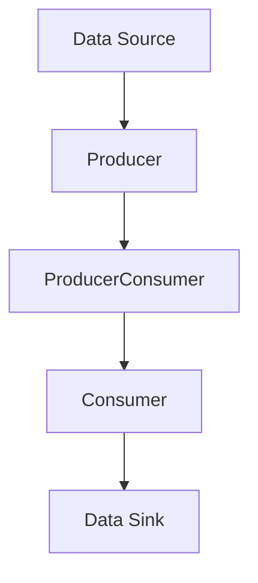

## 9.7. Real-Time Data Processing

In today's fast-paced digital landscape, the ability to process data as it arrives is crucial for building responsive and efficient systems. Real-time data processing allows applications to handle streaming data, providing immediate insights and actions. In Elixir, the combination of the BEAM VM's concurrency model and libraries like GenStage and Flow makes it an excellent choice for developing real-time systems. This section will delve into the concepts, tools, and techniques for implementing real-time data processing in Elixir.

### Handling Streaming Data

Streaming data is continuous, time-ordered data generated by various sources, such as sensors, user interactions, or network traffic. Unlike batch processing, where data is collected, processed, and then analyzed, streaming data is processed as it arrives, enabling near-instantaneous insights and actions.

#### Key Concepts

- **Latency**: The delay between receiving data and processing it. In real-time systems, minimizing latency is crucial to ensure timely responses.
- **Throughput**: The amount of data processed in a given time frame. High throughput is essential for handling large volumes of streaming data.
- **Scalability**: The ability to handle increasing amounts of data by distributing processing across multiple nodes or processes.

### Implementing Real-Time Systems with GenStage and Flow

Elixir provides powerful tools for building real-time data processing systems. Two of the most prominent libraries are GenStage and Flow, which leverage the BEAM VM's concurrency model to handle streaming data efficiently.

#### GenStage

GenStage is a specification for exchanging events between producers and consumers. It allows you to build data pipelines where data flows from producers to consumers, with the ability to control the flow of data to prevent bottlenecks.

##### Key Components

- **Producer**: Generates data and sends it downstream.
- **Consumer**: Receives data from producers and processes it.
- **ProducerConsumer**: Acts as both a producer and a consumer, transforming data as it passes through.

##### Example: Basic GenStage Pipeline

```elixir
defmodule Producer do
  use GenStage

  def start_link(initial) do
    GenStage.start_link(__MODULE__, initial, name: __MODULE__)
  end

  def init(initial) do
    {:producer, initial}
  end

  def handle_demand(demand, state) do
    events = Enum.to_list(state..(state + demand - 1))
    {:noreply, events, state + demand}
  end
end

defmodule Consumer do
  use GenStage

  def start_link() do
    GenStage.start_link(__MODULE__, :ok, name: __MODULE__)
  end

  def init(:ok) do
    {:consumer, :ok}
  end

  def handle_events(events, _from, state) do
    Enum.each(events, fn event ->
      IO.inspect(event, label: "Consumed")
    end)
    {:noreply, [], state}
  end
end

{:ok, producer} = Producer.start_link(0)
{:ok, consumer} = Consumer.start_link()
GenStage.sync_subscribe(consumer, to: producer)
```

In this example, the `Producer` generates a sequence of numbers, and the `Consumer` processes each number as it arrives.

#### Flow

Flow builds on top of GenStage to provide a high-level abstraction for data processing. It is designed to handle large volumes of data by automatically parallelizing the workload across multiple stages.

##### Key Features

- **Parallel Processing**: Automatically distributes data processing across multiple cores or nodes.
- **Backpressure**: Manages the flow of data to prevent overwhelming consumers.
- **Partitioning**: Splits data into partitions for parallel processing.

##### Example: Using Flow for Parallel Processing

```elixir
alias Experimental.Flow

Flow.from_enumerable(1..1000)
|> Flow.map(&(&1 * 2))
|> Flow.partition()
|> Flow.reduce(fn -> 0 end, &(&1 + &2))
|> Enum.to_list()
```

In this example, Flow processes a range of numbers in parallel, doubling each number and then summing them.

### Applications of Real-Time Data Processing

Real-time data processing is applicable in various domains, from live analytics to monitoring systems. Here are a few examples:

- **Live Analytics**: Process and analyze data as it arrives to provide real-time insights into user behavior, system performance, or market trends.
- **Monitoring Systems**: Continuously monitor systems or networks to detect anomalies, failures, or security threats in real-time.
- **IoT Applications**: Handle data from sensors and devices to enable real-time control and automation in smart homes, factories, or cities.

### Visualizing Real-Time Data Processing

To better understand the flow of data in a real-time processing system, let's visualize a simple pipeline using Mermaid.js:


```mermaid
graph TD;
    A[Data Source] --> B[Producer];
    B --> C[ProducerConsumer];
    C --> D[Consumer];
    D --> E[Data Sink];
```

In this diagram, data flows from the source through a series of processing stages, ultimately reaching the data sink where it can be stored or further analyzed.

### Try It Yourself

Experiment with the provided code examples by modifying the producer to generate different types of data or the consumer to perform different processing tasks. Consider adding additional stages to the pipeline or implementing error handling to make the system more robust.

### Knowledge Check

- What are the key differences between batch processing and real-time data processing?
- How does GenStage manage the flow of data between producers and consumers?
- What are some common applications of real-time data processing in various industries?

### Summary

Real-time data processing in Elixir leverages the power of GenStage and Flow to handle streaming data efficiently. By understanding the key concepts and tools, you can build responsive systems capable of processing large volumes of data with minimal latency. Remember to experiment with the examples provided and explore further to deepen your understanding.

### References and Further Reading

- [Elixir GenStage Documentation](https://hexdocs.pm/gen_stage/GenStage.html)
- [Elixir Flow Documentation](https://hexdocs.pm/flow/Flow.html)
- [Concurrency and Parallelism in Elixir](https://elixir-lang.org/getting-started/mix-otp/introduction-to-concurrency.html)

## Quiz Time!



### What is the primary advantage of real-time data processing?

- [x] Immediate insights and actions
- [ ] Reduced data storage costs
- [ ] Simplified data architecture
- [ ] Increased data redundancy

> **Explanation:** Real-time data processing provides immediate insights and actions by processing data as it arrives.

### Which Elixir library is used for building data pipelines with producers and consumers?

- [x] GenStage
- [ ] Ecto
- [ ] Phoenix
- [ ] Plug

> **Explanation:** GenStage is used for building data pipelines with producers and consumers in Elixir.

### What feature of Flow helps in distributing data processing across multiple cores?

- [x] Parallel Processing
- [ ] Serialization
- [ ] Data Aggregation
- [ ] Data Encryption

> **Explanation:** Flow's parallel processing feature automatically distributes data processing across multiple cores.

### In a GenStage pipeline, what role does a ProducerConsumer play?

- [x] Acts as both a producer and a consumer
- [ ] Only generates data
- [ ] Only processes data
- [ ] Stores data

> **Explanation:** A ProducerConsumer acts as both a producer and a consumer, transforming data as it passes through.

### What is a common application of real-time data processing?

- [x] Live analytics
- [ ] Batch reporting
- [ ] Data archiving
- [ ] Static website hosting

> **Explanation:** Live analytics is a common application of real-time data processing, providing immediate insights.

### Which of the following is a key concept in streaming data?

- [x] Latency
- [ ] Data redundancy
- [ ] Data encryption
- [ ] Data serialization

> **Explanation:** Latency is a key concept in streaming data, referring to the delay between receiving and processing data.

### How does Flow handle large volumes of data?

- [x] Automatically parallelizes the workload
- [ ] Stores data in a database
- [ ] Compresses data
- [ ] Encrypts data

> **Explanation:** Flow automatically parallelizes the workload to handle large volumes of data.

### What is the role of a consumer in a GenStage pipeline?

- [x] Receives and processes data
- [ ] Generates data
- [ ] Stores data
- [ ] Encrypts data

> **Explanation:** A consumer in a GenStage pipeline receives and processes data from producers.

### Which of the following is NOT a feature of GenStage?

- [ ] Backpressure management
- [ ] Event-driven architecture
- [x] Data encryption
- [ ] Producer-consumer model

> **Explanation:** Data encryption is not a feature of GenStage; it focuses on backpressure management and event-driven architecture.

### True or False: Real-time data processing is only applicable to IoT applications.

- [ ] True
- [x] False

> **Explanation:** Real-time data processing is applicable to various domains, including live analytics, monitoring systems, and IoT applications.



Remember, this is just the beginning. As you progress, you'll build more complex and interactive real-time systems. Keep experimenting, stay curious, and enjoy the journey!

---
