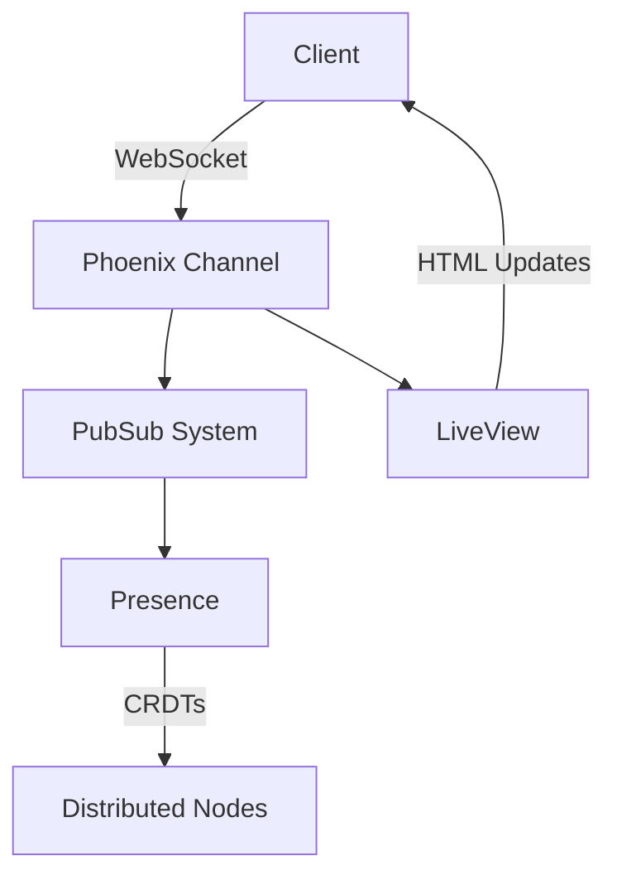

## 9.8. Integrating Reactive Patterns in Phoenix

Reactive programming has become a cornerstone in modern web development, enabling applications to provide real-time feedback and updates to users. In the Elixir ecosystem, Phoenix stands out as a powerful framework for building such applications. In this section, we will explore how to integrate reactive patterns in Phoenix to create responsive, interactive web applications.

### Building Reactive Web Applications

Reactive web applications are designed to respond to user interactions and other events in real-time. This is achieved by leveraging reactive programming patterns that allow the application to react to changes in data or user input immediately. In Phoenix, we can build reactive web applications using Phoenix Channels, Presence, and LiveView.

#### Using Phoenix Channels and Presence for Real-Time Features

Phoenix Channels provide a powerful abstraction for handling real-time communication between the server and clients. They are built on top of WebSockets, allowing for bidirectional communication. This makes them ideal for applications that require real-time updates, such as chat applications, live notifications, and collaborative tools.

**Key Concepts of Phoenix Channels:**

- **Topics:** Channels are organized around topics, which are strings that clients can subscribe to. This allows for efficient message broadcasting to all subscribers of a particular topic.
- **PubSub System:** Phoenix Channels use a publish-subscribe system to manage message distribution. This decouples the message sender from the receivers, allowing for scalable communication.
- **Presence:** Phoenix Presence is an extension of Channels that provides real-time tracking of users or processes. It is particularly useful for applications that need to display user presence or activity.

**Example: Implementing a Chat Application with Phoenix Channels**

```elixir
# In your Phoenix application, generate a channel:
mix phx.gen.channel Room

# Define the channel in `lib/my_app_web/channels/room_channel.ex`:
defmodule MyAppWeb.RoomChannel do
  use MyAppWeb, :channel

  def join("room:lobby", _message, socket) do
    {:ok, socket}
  end

  def handle_in("new_msg", %{"body" => body}, socket) do
    broadcast!(socket, "new_msg", %{body: body})
    {:noreply, socket}
  end
end

# In the client-side JavaScript, connect to the channel:
let socket = new Phoenix.Socket("/socket", {params: {userToken: "123"}})
socket.connect()

let channel = socket.channel("room:lobby", {})
channel.join()
  .receive("ok", resp => { console.log("Joined successfully", resp) })
  .receive("error", resp => { console.log("Unable to join", resp) })

channel.on("new_msg", payload => {
  console.log("New message:", payload.body)
})
```

**Benefits of Using Phoenix Channels:**

- **Scalability:** Channels can handle a large number of concurrent connections, making them suitable for high-traffic applications.
- **Real-Time Updates:** They enable real-time data updates, enhancing user experience.
- **Decoupled Architecture:** The PubSub system allows for a decoupled architecture, improving maintainability.

**Phoenix Presence:**

Phoenix Presence builds on top of Channels to provide a mechanism for tracking user presence in real-time. It uses CRDTs (Conflict-Free Replicated Data Types) to ensure consistency across distributed nodes.

**Example: Tracking User Presence**

```elixir
# Add Presence to your application
defmodule MyAppWeb.Presence do
  use Phoenix.Presence,
    otp_app: :my_app,
    pubsub_server: MyApp.PubSub
end

# Track presence in your channel
defmodule MyAppWeb.RoomChannel do
  use MyAppWeb, :channel
  alias MyAppWeb.Presence

  def join("room:lobby", _message, socket) do
    send(self(), :after_join)
    {:ok, socket}
  end

  def handle_info(:after_join, socket) do
    Presence.track(socket, socket.assigns.user_id, %{
      online_at: inspect(System.system_time(:seconds))
    })
    push(socket, "presence_state", Presence.list(socket))
    {:noreply, socket}
  end
end
```

**Benefits of Using Phoenix Presence:**

- **Real-Time User Tracking:** Provides real-time tracking of users or processes.
- **Consistency Across Nodes:** Uses CRDTs to ensure consistency in distributed systems.
- **Ease of Use:** Integrates seamlessly with Phoenix Channels.

#### Phoenix LiveView: Creating Interactive, Real-Time User Interfaces Without JavaScript

Phoenix LiveView is a revolutionary feature that allows developers to build rich, interactive user interfaces without writing JavaScript. It leverages server-rendered HTML and WebSockets to provide real-time updates to the client.

**Key Concepts of Phoenix LiveView:**

- **Server-Rendered HTML:** LiveView components are rendered on the server and sent to the client as HTML.
- **WebSockets for Updates:** LiveView uses WebSockets to push updates to the client, ensuring real-time interactivity.
- **State Management:** LiveView manages state on the server, reducing the complexity of client-side state management.

**Example: Building a Counter with Phoenix LiveView**

```elixir
# Create a LiveView module
defmodule MyAppWeb.CounterLive do
  use Phoenix.LiveView

  def mount(_params, _session, socket) do
    {:ok, assign(socket, count: 0)}
  end

  def handle_event("increment", _value, socket) do
    {:noreply, update(socket, :count, &(&1 + 1))}
  end

  def render(assigns) do
    ~L"""
    <div>
      <h1>Count: <%= @count %></h1>
      <button phx-click="increment">Increment</button>
    </div>
    """
  end
end

# In your router, define a route for the LiveView
live "/counter", MyAppWeb.CounterLive
```

**Benefits of Using Phoenix LiveView:**

- **Simplified Development:** Eliminates the need for client-side JavaScript for many use cases.
- **Responsive User Experiences:** Provides real-time updates and interactivity.
- **Reduced Complexity:** Manages state on the server, simplifying client-side code.

### Benefits of Integrating Reactive Patterns in Phoenix

Integrating reactive patterns in Phoenix offers several benefits:

- **Simplified Development:** By leveraging Phoenix Channels, Presence, and LiveView, developers can build complex, interactive applications with less code and reduced complexity.
- **Responsive User Experiences:** Reactive patterns enable real-time updates and interactivity, enhancing user engagement and satisfaction.
- **Scalability and Performance:** Phoenix's architecture is designed for scalability, allowing applications to handle large numbers of concurrent users efficiently.
- **Consistency Across Distributed Systems:** Features like Phoenix Presence ensure consistency across distributed nodes, making it easier to build reliable, distributed applications.

### Visualizing Reactive Patterns in Phoenix

To better understand how these components work together, let's visualize the architecture of a Phoenix application using reactive patterns.



**Diagram Explanation:**

- **Client:** The user's browser or application that connects to the Phoenix server.
- **Phoenix Channel:** Manages real-time communication between the client and server.
- **PubSub System:** Distributes messages to subscribers, enabling decoupled communication.
- **Presence:** Tracks user presence and activity in real-time.
- **Distributed Nodes:** Ensures consistency across distributed systems using CRDTs.
- **LiveView:** Provides real-time HTML updates to the client, enabling interactive user interfaces.

### Try It Yourself

To get hands-on experience with reactive patterns in Phoenix, try modifying the examples provided. For instance, you can:

- Extend the chat application to support multiple rooms.
- Add more features to the counter LiveView, such as decrementing or resetting the count.
- Experiment with Presence to track additional user data, such as location or activity status.

### Knowledge Check

Before moving on, let's review some key concepts:

- **What are the main components of Phoenix Channels?**
- **How does Phoenix Presence ensure consistency across distributed nodes?**
- **What are the benefits of using Phoenix LiveView for building interactive user interfaces?**

### Embrace the Journey

Remember, integrating reactive patterns in Phoenix is just the beginning. As you continue to explore and experiment, you'll discover new ways to build powerful, real-time applications. Keep pushing the boundaries, stay curious, and enjoy the journey!

### References and Links

For further reading and exploration, check out the following resources:

- [Phoenix Framework Documentation](https://hexdocs.pm/phoenix/)
- [Elixir Lang](https://elixir-lang.org/)
- [Reactive Programming on Wikipedia](https://en.wikipedia.org/wiki/Reactive_programming)

## Quiz: Integrating Reactive Patterns in Phoenix



### What is the primary purpose of Phoenix Channels?

- [x] To enable real-time communication between the server and clients
- [ ] To manage database connections
- [ ] To handle HTTP requests
- [ ] To render HTML templates

> **Explanation:** Phoenix Channels are designed to facilitate real-time, bidirectional communication between the server and clients, making them ideal for applications that require live updates.


### How does Phoenix Presence ensure consistency across distributed nodes?

- [x] By using CRDTs (Conflict-Free Replicated Data Types)
- [ ] By locking resources
- [ ] By using a central database
- [ ] By polling for updates

> **Explanation:** Phoenix Presence uses CRDTs to ensure consistency across distributed nodes, allowing for real-time tracking of users or processes without conflicts.


### What is a key benefit of using Phoenix LiveView?

- [x] It allows building interactive UIs without JavaScript
- [ ] It improves database performance
- [ ] It simplifies CSS styling
- [ ] It enhances image processing

> **Explanation:** Phoenix LiveView enables developers to create interactive, real-time user interfaces without the need for client-side JavaScript, simplifying development.


### Which of the following is NOT a component of Phoenix Channels?

- [ ] Topics
- [ ] PubSub System
- [x] SQL Queries
- [ ] Presence

> **Explanation:** SQL Queries are not a component of Phoenix Channels. Channels are organized around topics and use a PubSub system for message distribution, with Presence for tracking users.


### What technology underlies Phoenix Channels for communication?

- [x] WebSockets
- [ ] HTTP
- [ ] FTP
- [ ] SMTP

> **Explanation:** Phoenix Channels are built on top of WebSockets, which allow for real-time, bidirectional communication between the server and clients.


### What does the `handle_event` function do in a LiveView module?

- [x] It handles events triggered by user interactions
- [ ] It renders HTML templates
- [ ] It connects to the database
- [ ] It manages application configuration

> **Explanation:** The `handle_event` function in a LiveView module is responsible for handling events triggered by user interactions, such as button clicks.


### How can you track user presence in a Phoenix application?

- [x] By using Phoenix Presence
- [ ] By storing user data in cookies
- [ ] By using HTTP sessions
- [ ] By logging IP addresses

> **Explanation:** Phoenix Presence provides a mechanism for tracking user presence in real-time, leveraging CRDTs for consistency.


### What is the role of the PubSub system in Phoenix Channels?

- [x] To distribute messages to subscribers
- [ ] To manage database transactions
- [ ] To render HTML templates
- [ ] To handle file uploads

> **Explanation:** The PubSub system in Phoenix Channels is responsible for distributing messages to subscribers, enabling decoupled communication.


### True or False: Phoenix LiveView requires client-side JavaScript for interactivity.

- [ ] True
- [x] False

> **Explanation:** False. Phoenix LiveView allows developers to build interactive user interfaces without the need for client-side JavaScript, as it uses server-rendered HTML and WebSockets for updates.


### Which pattern is used by Phoenix Presence to ensure data consistency?

- [x] CRDTs (Conflict-Free Replicated Data Types)
- [ ] Mutex locks
- [ ] Database transactions
- [ ] HTTP polling

> **Explanation:** Phoenix Presence uses CRDTs to ensure data consistency across distributed nodes, allowing for real-time tracking without conflicts.


