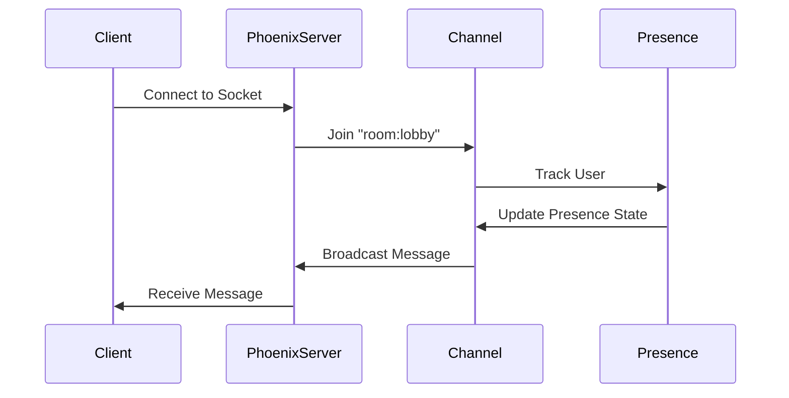
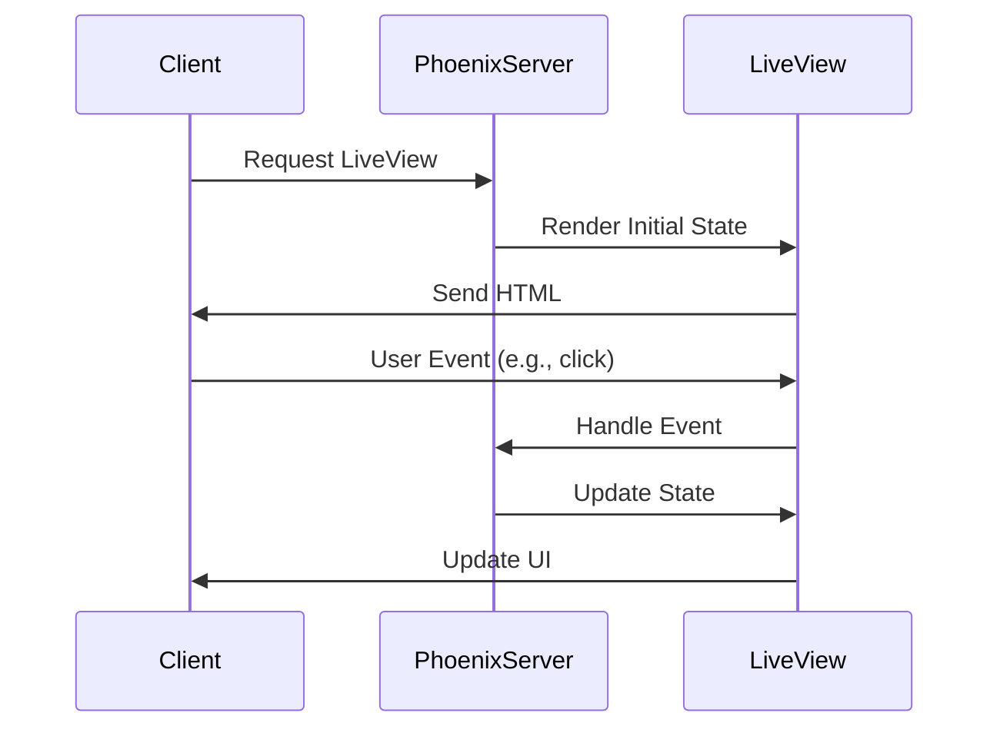

## 9.8. Integrating Reactive Patterns in Phoenix

As modern web applications continue to evolve, the demand for real-time, interactive user experiences has grown significantly. Elixir's Phoenix framework, with its robust support for reactive patterns, provides a powerful platform for building such applications. In this section, we'll explore how to integrate reactive patterns in Phoenix using Phoenix Channels, Presence, and LiveView. We'll delve into the concepts, provide code examples, and discuss the benefits of these approaches.

### Building Reactive Web Applications

Reactive programming is a paradigm that focuses on asynchronous data streams and the propagation of change. In the context of web applications, this means creating systems where the user interface (UI) can react to changes in data in real-time. Phoenix offers several tools to implement reactive patterns effectively.

#### Using Phoenix Channels and Presence for Real-Time Features

Phoenix Channels provide a means for bi-directional communication between clients and servers. This is particularly useful for applications that require real-time updates, such as chat applications, collaborative editing tools, or live dashboards.

**Key Features of Phoenix Channels:**

- **PubSub System:** Phoenix Channels leverage a Publish-Subscribe system that allows messages to be broadcast to multiple subscribers.
- **Scalability:** Channels are designed to scale across distributed systems, making them suitable for applications with high concurrency demands.
- **Fault Tolerance:** Built on top of Elixir's OTP, Channels inherit the fault-tolerant characteristics of the BEAM VM.

**Example: Implementing a Chat Application with Phoenix Channels**

Let's walk through a simple example of a chat application using Phoenix Channels.

**1. Setting Up the Channel**

First, define a channel in your Phoenix application:

```elixir
defmodule MyAppWeb.ChatChannel do
  use Phoenix.Channel

  def join("room:lobby", _message, socket) do
    {:ok, socket}
  end

  def handle_in("new_message", %{"body" => body}, socket) do
    broadcast!(socket, "new_message", %{body: body})
    {:noreply, socket}
  end
end
```

**Explanation:**

- **join/3:** This function is called when a client joins a channel. Here, we allow clients to join the "room:lobby" topic.
- **handle_in/3:** Handles incoming messages. In this case, when a "new_message" event is received, it broadcasts the message to all subscribers.

**2. Client-Side Integration**

On the client side, use JavaScript to connect to the channel and handle incoming messages:

```javascript
import { Socket } from "phoenix"

let socket = new Socket("/socket", { params: { userToken: "123" } })
socket.connect()

let channel = socket.channel("room:lobby", {})
channel.join()
  .receive("ok", resp => { console.log("Joined successfully", resp) })
  .receive("error", resp => { console.log("Unable to join", resp) })

channel.on("new_message", payload => {
  console.log("New message:", payload.body)
})
```

**Explanation:**

- **Socket and Channel:** Establish a connection to the Phoenix server and join the "room:lobby" channel.
- **Event Handling:** Listen for "new_message" events and log them to the console.

**3. Using Presence for User Tracking**

Phoenix Presence allows you to track users in real-time, providing information about who is online or participating in a particular channel.

**Server-Side Presence Setup:**

```elixir
defmodule MyAppWeb.Presence do
  use Phoenix.Presence, otp_app: :my_app, pubsub_server: MyApp.PubSub
end
```

**Integrating Presence in the Channel:**

```elixir
defmodule MyAppWeb.ChatChannel do
  use Phoenix.Channel
  alias MyAppWeb.Presence

  def join("room:lobby", _message, socket) do
    send(self(), :after_join)
    {:ok, socket}
  end

  def handle_info(:after_join, socket) do
    Presence.track(socket, socket.assigns.user_id, %{
      online_at: inspect(System.system_time(:seconds))
    })
    push(socket, "presence_state", Presence.list(socket))
    {:noreply, socket}
  end
end
```

**Explanation:**

- **Presence.track/3:** Tracks a user in the channel, storing metadata such as the time they joined.
- **Presence.list/1:** Retrieves the current presence information for the channel.

**Client-Side Presence Handling:**

```javascript
channel.on("presence_state", state => {
  console.log("Current presence state:", state)
})
```

**Benefits of Using Channels and Presence:**

- **Real-Time Updates:** Instantly broadcast messages and presence changes to all connected clients.
- **Scalability:** Designed to handle thousands of concurrent connections efficiently.
- **Fault Tolerance:** Leverages the robustness of the BEAM VM for reliable operation.

#### Phoenix LiveView: Creating Interactive, Real-Time User Interfaces Without JavaScript

Phoenix LiveView is a groundbreaking feature that allows developers to build rich, interactive, real-time user interfaces without writing JavaScript. LiveView leverages server-side rendering and WebSockets to update the UI in response to user interactions and data changes.

**Key Features of Phoenix LiveView:**

- **Real-Time Interactions:** Updates the UI in real-time based on server-side changes.
- **Minimal JavaScript:** Reduces the need for complex JavaScript code.
- **SEO-Friendly:** Server-rendered HTML ensures that content is accessible to search engines.

**Example: Building a Counter with LiveView**

Let's create a simple counter application using Phoenix LiveView.

**1. Defining the LiveView Module**

Create a LiveView module to handle the counter logic:

```elixir
defmodule MyAppWeb.CounterLive do
  use Phoenix.LiveView

  def mount(_params, _session, socket) do
    {:ok, assign(socket, count: 0)}
  end

  def handle_event("increment", _value, socket) do
    {:noreply, update(socket, :count, &(&1 + 1))}
  end

  def handle_event("decrement", _value, socket) do
    {:noreply, update(socket, :count, &(&1 - 1))}
  end
end
```

**Explanation:**

- **mount/3:** Initializes the LiveView with a `count` of 0.
- **handle_event/3:** Handles "increment" and "decrement" events to update the `count`.

**2. Creating the LiveView Template**

Define the HTML template for the LiveView:

```elixir
<div>
  <h1>Counter: <%= @count %></h1>
  <button phx-click="increment">Increment</button>
  <button phx-click="decrement">Decrement</button>
</div>
```

**Explanation:**

- **Dynamic Content:** The `@count` variable is dynamically updated and rendered in the template.
- **Event Binding:** The `phx-click` attribute binds button clicks to LiveView events.

**3. Integrating LiveView in Your Phoenix Application**

Update your router to serve the LiveView:

```elixir
defmodule MyAppWeb.Router do
  use MyAppWeb, :router

  live "/", CounterLive, :index
end
```

**Explanation:**

- **LiveView Route:** The `live` macro is used to define a route that serves the `CounterLive` LiveView.

**Benefits of Using Phoenix LiveView:**

- **Simplified Development:** Write server-side Elixir code to manage UI state and interactions.
- **Responsive User Experiences:** Real-time updates provide a seamless experience for users.
- **Reduced Complexity:** Minimize the need for frontend JavaScript frameworks.

### Visualizing Reactive Patterns in Phoenix

To better understand how Phoenix Channels, Presence, and LiveView work together, let's visualize the architecture and data flow using Mermaid.js diagrams.

**Diagram: Phoenix Channels and Presence**


```mermaid
sequenceDiagram
    participant Client
    participant PhoenixServer
    participant Channel
    participant Presence

    Client->>PhoenixServer: Connect to Socket
    PhoenixServer->>Channel: Join "room:lobby"
    Channel->>Presence: Track User
    Presence->>Channel: Update Presence State
    Channel->>PhoenixServer: Broadcast Message
    PhoenixServer->>Client: Receive Message
```

**Description:**

- **Client Connection:** The client connects to the Phoenix server via WebSocket.
- **Channel Join:** The client joins a channel, and the server tracks the user presence.
- **Message Broadcast:** Messages are broadcast to all connected clients.

**Diagram: Phoenix LiveView**


```mermaid
sequenceDiagram
    participant Client
    participant PhoenixServer
    participant LiveView

    Client->>PhoenixServer: Request LiveView
    PhoenixServer->>LiveView: Render Initial State
    LiveView->>Client: Send HTML
    Client->>LiveView: User Event (e.g., click)
    LiveView->>PhoenixServer: Handle Event
    PhoenixServer->>LiveView: Update State
    LiveView->>Client: Update UI
```

**Description:**

- **Initial Render:** The client requests a LiveView, and the server sends the initial HTML.
- **Event Handling:** User events are sent to the server, which updates the state and UI.

### Benefits of Integrating Reactive Patterns in Phoenix

Integrating reactive patterns in Phoenix offers several advantages:

- **Simplified Development:** By leveraging server-side rendering and real-time communication, developers can focus on business logic rather than complex client-side code.
- **Responsive User Experiences:** Real-time updates ensure that users receive the most current information without needing to refresh the page.
- **Scalability and Fault Tolerance:** Built on the BEAM VM, Phoenix applications can handle high concurrency and provide reliable performance.

### Try It Yourself

Now that we've covered the basics, it's time to experiment with the code examples provided. Try modifying the chat application to include additional features, such as private messaging or typing indicators. For the LiveView example, consider adding more complex interactions, such as form submissions or data visualizations.

### References and Further Reading

- [Phoenix Framework Official Documentation](https://hexdocs.pm/phoenix/)
- [Phoenix LiveView Documentation](https://hexdocs.pm/phoenix_live_view/)
- [Elixir Lang Official Site](https://elixir-lang.org/)

### Knowledge Check

1. Explain how Phoenix Channels enable real-time communication between clients and servers.
2. Describe the role of Phoenix Presence in tracking user activity.
3. Discuss the benefits of using Phoenix LiveView for building interactive UIs.
4. What are some potential use cases for reactive patterns in web applications?
5. How does the BEAM VM contribute to the scalability of Phoenix applications?

### Embrace the Journey

Integrating reactive patterns in Phoenix is a powerful way to build modern web applications that are both responsive and efficient. Remember, this is just the beginning. As you continue to explore Phoenix and Elixir, you'll discover even more ways to create innovative and engaging user experiences. Keep experimenting, stay curious, and enjoy the journey!

## Quiz Time!



### What is the primary purpose of Phoenix Channels?

- [x] To provide bi-directional communication between clients and servers.
- [ ] To manage database connections.
- [ ] To handle static file serving.
- [ ] To compile Elixir code.

> **Explanation:** Phoenix Channels are designed for real-time, bi-directional communication between clients and servers.

### Which feature of Phoenix allows you to track users in real-time?

- [ ] Phoenix Channels
- [x] Phoenix Presence
- [ ] Phoenix LiveView
- [ ] Phoenix Router

> **Explanation:** Phoenix Presence is used to track user presence and activity in real-time.

### How does Phoenix LiveView update the user interface?

- [ ] By using client-side JavaScript frameworks.
- [x] By leveraging server-side rendering and WebSockets.
- [ ] By compiling templates into static HTML.
- [ ] By using AJAX requests.

> **Explanation:** Phoenix LiveView uses server-side rendering and WebSockets to update the UI in real-time.

### What is a key benefit of using Phoenix LiveView?

- [ ] Requires extensive JavaScript coding.
- [ ] Increases server load significantly.
- [x] Simplifies development by reducing client-side complexity.
- [ ] Limits the application's scalability.

> **Explanation:** Phoenix LiveView simplifies development by reducing the need for complex client-side JavaScript.

### Which of the following is a use case for reactive patterns in web applications?

- [x] Real-time chat applications
- [x] Collaborative editing tools
- [ ] Static content websites
- [ ] Batch processing systems

> **Explanation:** Reactive patterns are ideal for applications requiring real-time updates, such as chat and collaborative tools.

### What does the `handle_in` function do in a Phoenix Channel?

- [ ] Initializes the channel.
- [x] Handles incoming messages from clients.
- [ ] Tracks user presence.
- [ ] Compiles templates.

> **Explanation:** The `handle_in` function processes incoming messages in a Phoenix Channel.

### How does Phoenix Presence track users?

- [ ] By storing user data in cookies.
- [x] By maintaining a list of users in a channel.
- [ ] By using client-side scripts.
- [ ] By logging user activity in a database.

> **Explanation:** Phoenix Presence tracks users by maintaining a list of active users in a channel.

### What is the role of the `mount` function in a LiveView module?

- [ ] To handle user events.
- [x] To initialize the LiveView state.
- [ ] To compile JavaScript code.
- [ ] To render static HTML.

> **Explanation:** The `mount` function initializes the state for a LiveView.

### True or False: Phoenix LiveView requires extensive use of JavaScript for real-time updates.

- [ ] True
- [x] False

> **Explanation:** Phoenix LiveView minimizes the need for JavaScript by handling real-time updates server-side.

### Which diagramming tool is used in this guide to visualize reactive patterns in Phoenix?

- [x] Mermaid.js
- [ ] Graphviz
- [ ] PlantUML
- [ ] Lucidchart

> **Explanation:** Mermaid.js is used to create diagrams in this guide.


