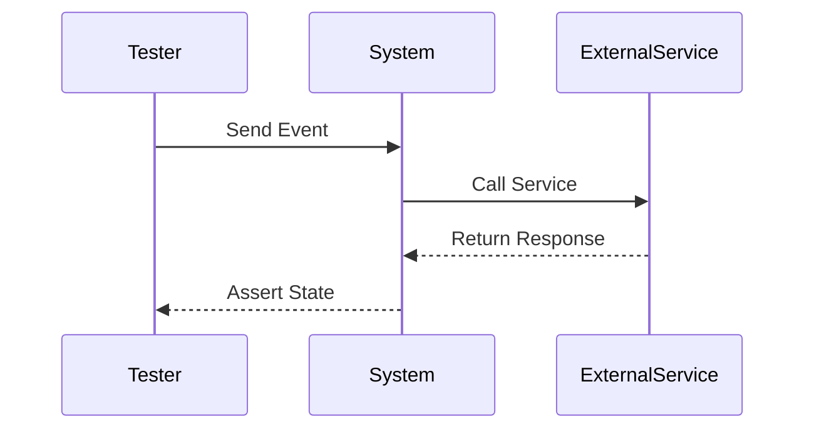

## 9.9. Testing Reactive Systems

Reactive systems are designed to be responsive, resilient, elastic, and message-driven. Testing such systems can be challenging due to their asynchronous and time-dependent nature. In this section, we will explore the challenges of testing reactive systems, strategies to overcome these challenges, and tools available in Elixir to facilitate effective testing.

### Understanding Reactive Systems

Reactive systems are characterized by their ability to react to changes in their environment, handle high loads gracefully, and recover from failures. They are often built using asynchronous message-passing and event-driven architectures. This makes them highly scalable and fault-tolerant, but also introduces complexity in testing.

#### Key Characteristics

- **Asynchronous Communication:** Reactive systems rely on non-blocking communication, often using message queues or event streams.
- **Event-Driven Architecture:** They respond to events, which can be user actions, system events, or messages from other services.
- **Scalability and Resilience:** Designed to scale horizontally and recover from failures without downtime.

### Challenges in Testing Reactive Systems

Testing reactive systems involves several challenges due to their inherent characteristics:

- **Asynchronous Behavior:** Events and messages are processed asynchronously, making it difficult to predict the order of operations.
- **Time-Dependent Logic:** Many reactive systems rely on time-based triggers, requiring precise control over time in tests.
- **State Management:** The state of the system can change rapidly, complicating assertions about expected outcomes.
- **Concurrency Issues:** Multiple components may interact concurrently, leading to race conditions and non-deterministic behavior.

### Strategies for Testing Reactive Systems

To effectively test reactive systems, we need to adopt strategies that address these challenges:

#### 1. Controlling Time

One of the most effective strategies is to control time within tests. This can be achieved by using libraries that allow you to manipulate time, such as `:timer` in Elixir, or by mocking time-dependent functions.

#### 2. Using Mocks and Stubs

Mocks and stubs can be used to simulate external dependencies and isolate the system under test. This is particularly useful for testing components that rely on external services or databases.

#### 3. Testing Asynchronous Code

Testing asynchronous code requires techniques to ensure that all asynchronous operations have completed before making assertions. This can be done using synchronization primitives or by polling for expected conditions.

#### 4. State Verification

Verifying the state of a system in a reactive environment can be challenging. Use assertions to check the state at various points in time, and consider using snapshot testing to capture the state of the system at specific moments.

#### 5. Testing for Concurrency

Concurrency issues can be difficult to reproduce in tests. Use stress testing and fuzz testing to uncover race conditions and other concurrency-related bugs.

### Tools for Testing Reactive Systems in Elixir

Elixir provides several tools and libraries to facilitate testing of reactive systems:

#### ExUnit

ExUnit is the built-in testing framework in Elixir. It provides a rich set of features for writing and running tests, including support for asynchronous tests and setup/teardown callbacks.

```elixir
defmodule MyReactiveSystemTest do
  use ExUnit.Case, async: true

  test "reacts to events correctly" do
    # Setup the initial state
    initial_state = MyReactiveSystem.init_state()

    # Simulate an event
    event = %Event{type: :user_action, payload: %{action: "click"}}
    new_state = MyReactiveSystem.handle_event(initial_state, event)

    # Assert the expected state
    assert new_state == %State{status: :clicked}
  end
end
```

#### Mocking Libraries

Libraries like `Mock` can be used to create mocks and stubs for external dependencies. This allows you to isolate the system under test and focus on its behavior.

```elixir
defmodule MyReactiveSystemTest do
  use ExUnit.Case
  import Mock

  test "handles external service call" do
    with_mock ExternalService, [call: fn _ -> {:ok, "response"} end] do
      result = MyReactiveSystem.call_external_service()
      assert result == {:ok, "response"}
    end
  end
end
```

#### Controlling Time

To control time in tests, you can use libraries like `:timer` or `timex` to manipulate time-dependent functions.

```elixir
defmodule MyReactiveSystemTest do
  use ExUnit.Case

  test "time-dependent behavior" do
    # Freeze time at a specific point
    :timer.sleep(1000)
    assert MyReactiveSystem.time_based_function() == :expected_result
  end
end
```

### Visualizing Reactive System Testing

To better understand the flow of testing in reactive systems, let's visualize the process using a sequence diagram.



**Diagram Description:** This sequence diagram illustrates the interaction between the tester, the system under test, and an external service. The tester sends an event to the system, which then calls an external service. The response is returned to the system, and the tester asserts the final state.

### Best Practices for Testing Reactive Systems

- **Isolate Components:** Test components in isolation to reduce complexity and focus on specific behaviors.
- **Use Test Doubles:** Employ mocks, stubs, and spies to simulate external dependencies and control interactions.
- **Control Time:** Use time manipulation techniques to test time-dependent logic accurately.
- **Verify State:** Use assertions and snapshot testing to verify the state of the system at different points.
- **Test Concurrency:** Use stress testing and fuzz testing to uncover concurrency issues.

### Try It Yourself

To gain hands-on experience, try modifying the provided code examples. Experiment with different events, states, and external service responses to see how the system reacts. Consider adding new tests to cover additional scenarios, such as error handling or edge cases.

### Knowledge Check

Before moving on, let's review some key concepts:

- What are the main challenges of testing reactive systems?
- How can you control time in tests?
- What role do mocks and stubs play in testing?
- How can you test asynchronous code effectively?

### Embrace the Journey

Testing reactive systems can be complex, but with the right strategies and tools, you can ensure your applications are robust and reliable. Remember, this is just the beginning. As you progress, you'll build more complex and interactive systems. Keep experimenting, stay curious, and enjoy the journey!

## Quiz: Testing Reactive Systems



### What is a key characteristic of reactive systems?

- [x] Asynchronous communication
- [ ] Synchronous processing
- [ ] Single-threaded execution
- [ ] Static configuration

> **Explanation:** Reactive systems rely on asynchronous communication to handle events and messages efficiently.

### Which tool is used for testing in Elixir?

- [x] ExUnit
- [ ] JUnit
- [ ] Mocha
- [ ] Jasmine

> **Explanation:** ExUnit is the built-in testing framework in Elixir, providing features for writing and running tests.

### How can you control time in tests?

- [x] Use time manipulation libraries
- [ ] Use sleep functions
- [ ] Ignore time-dependent logic
- [ ] Use random delays

> **Explanation:** Time manipulation libraries allow you to control time-dependent logic accurately in tests.

### What is the purpose of using mocks in testing?

- [x] To simulate external dependencies
- [ ] To increase test coverage
- [ ] To reduce test execution time
- [ ] To simplify test setup

> **Explanation:** Mocks simulate external dependencies, allowing you to isolate the system under test.

### How can you test asynchronous code effectively?

- [x] Use synchronization primitives
- [ ] Use random delays
- [ ] Ignore asynchronous operations
- [ ] Use synchronous alternatives

> **Explanation:** Synchronization primitives ensure that all asynchronous operations have completed before making assertions.

### What is a common challenge in testing reactive systems?

- [x] Asynchronous behavior
- [ ] Lack of test frameworks
- [ ] Limited scalability
- [ ] Static configuration

> **Explanation:** Asynchronous behavior makes it difficult to predict the order of operations in reactive systems.

### Which strategy helps in testing time-dependent logic?

- [x] Controlling time
- [ ] Ignoring time-based triggers
- [ ] Using random delays
- [ ] Relying on real-time execution

> **Explanation:** Controlling time allows you to test time-dependent logic accurately by manipulating time within tests.

### What is the role of ExUnit in Elixir?

- [x] It is a testing framework
- [ ] It is a deployment tool
- [ ] It is a logging library
- [ ] It is a database connector

> **Explanation:** ExUnit is the built-in testing framework in Elixir, used for writing and running tests.

### How can you verify the state of a system in tests?

- [x] Use assertions and snapshot testing
- [ ] Use random checks
- [ ] Ignore state verification
- [ ] Use manual inspection

> **Explanation:** Assertions and snapshot testing help verify the state of the system at different points in tests.

### True or False: Reactive systems are designed to be synchronous.

- [ ] True
- [x] False

> **Explanation:** Reactive systems are designed to be asynchronous, allowing them to handle events and messages efficiently.


