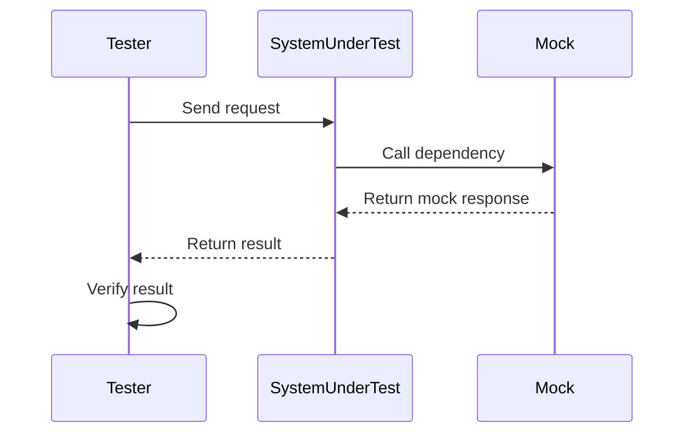

## 9.9. Testing Reactive Systems

In the world of reactive systems, testing can be a daunting task due to the inherent complexities of asynchronous and time-dependent behaviors. As expert software engineers and architects, it is crucial to master the art of testing these systems to ensure reliability and performance. In this section, we will delve into the challenges, strategies, and tools for effectively testing reactive systems in Elixir.

### Understanding the Challenges

Reactive systems are characterized by their responsiveness, resilience, elasticity, and message-driven nature. These systems often involve asynchronous operations, making it difficult to predict and control the flow of execution during testing. Some common challenges include:

- **Asynchronous Execution**: Operations do not occur in a predictable sequence, complicating the verification of outcomes.
- **Time-Dependent Behaviors**: Events may be scheduled or delayed, requiring precise timing control in tests.
- **Concurrency**: Multiple processes may interact simultaneously, leading to race conditions and other concurrency issues.
- **State Management**: The state of the system can change over time, making it difficult to capture the correct state during tests.

### Strategies for Testing Reactive Systems

To overcome these challenges, we can employ several strategies that leverage Elixir's strengths and testing tools:

#### 1. Using Mocks and Stubs

Mocks and stubs are instrumental in isolating components and controlling external dependencies. They allow us to simulate specific behaviors and responses, making it easier to test components in isolation.

```elixir
defmodule MyTest do
  use ExUnit.Case
  import Mock

  test "example with mock" do
    with_mock MyModule, [my_function: fn -> :ok end] do
      assert MyModule.my_function() == :ok
    end
  end
end
```

In this example, we use the `Mock` library to replace `my_function` with a mock implementation that returns `:ok`. This allows us to test the behavior of the code that depends on `my_function` without executing its actual implementation.

#### 2. Controlling Time in Tests

Time-dependent behaviors can be challenging to test. Elixir provides tools to control and manipulate time within tests, such as the `:timer` module and the `ExUnit.CaptureLog` for capturing logs during test execution.

```elixir
defmodule TimeTest do
  use ExUnit.Case

  test "simulate time passage" do
    :timer.sleep(1000)  # Simulate a delay
    assert MyModule.current_time() == :os.system_time(:seconds) + 1
  end
end
```

By simulating time passage, we can test how our system behaves over time without having to wait for real-time delays.

#### 3. Testing Concurrency

Concurrency introduces complexity due to the potential for race conditions and shared state. Elixir's process model and message passing are powerful tools for managing concurrency, but they also require careful testing.

```elixir
defmodule ConcurrencyTest do
  use ExUnit.Case

  test "concurrent process communication" do
    parent = self()
    spawn(fn -> send(parent, :hello) end)
    assert_receive :hello
  end
end
```

In this example, we spawn a new process that sends a message back to the parent process. The `assert_receive` function ensures that the message is received, verifying the communication between processes.

### Tools for Testing Reactive Systems

Elixir provides a rich ecosystem of tools for testing reactive systems, with `ExUnit` being the cornerstone of the testing framework. Additional libraries and tools can enhance our testing capabilities:

#### ExUnit

`ExUnit` is Elixir's built-in testing framework, offering a robust set of features for writing and running tests. It supports asynchronous tests, assertions, and setup/teardown callbacks.

```elixir
defmodule MyAppTest do
  use ExUnit.Case, async: true

  setup do
    # Setup code
    :ok
  end

  test "example test" do
    assert 1 + 1 == 2
  end
end
```

#### Mock

The `Mock` library simplifies the creation of mocks and stubs, allowing us to simulate dependencies and isolate components during testing.

#### ExUnit.CaptureLog

This module captures log output during test execution, enabling us to verify log messages and ensure that logging behavior is correct.

```elixir
defmodule LogTest do
  use ExUnit.Case
  import ExUnit.CaptureLog

  test "capture log output" do
    log = capture_log(fn ->
      Logger.info("Test log message")
    end)
    assert log =~ "Test log message"
  end
end
```

#### Wallaby

Wallaby is a browser automation library for Elixir, useful for integration testing of web applications. It allows us to simulate user interactions and verify the behavior of web interfaces.

### Visualizing Reactive System Testing

To better understand the flow of testing in reactive systems, we can use diagrams to represent the interactions and processes involved.


```mermaid
sequenceDiagram
  participant Tester
  participant SystemUnderTest
  participant Mock
  Tester->>SystemUnderTest: Send request
  SystemUnderTest->>Mock: Call dependency
  Mock-->>SystemUnderTest: Return mock response
  SystemUnderTest-->>Tester: Return result
  Tester->>Tester: Verify result
```

**Diagram Description**: This sequence diagram illustrates the interaction between the tester, the system under test, and a mock dependency. The tester sends a request to the system, which calls a dependency. The mock returns a simulated response, and the system returns the result to the tester for verification.

### Knowledge Check

Before we proceed, let's reflect on what we've learned:

- How can mocks and stubs help in testing reactive systems?
- What are some strategies for controlling time-dependent behaviors in tests?
- How does ExUnit facilitate testing of concurrent processes?

### Try It Yourself

To solidify your understanding, try modifying the code examples provided:

- Change the mock implementation to return a different value and observe how the test results change.
- Adjust the time delay in the `TimeTest` example and see how it affects the test outcome.
- Experiment with different message passing scenarios in the `ConcurrencyTest` example.

### Embrace the Journey

Testing reactive systems in Elixir is a journey that requires patience and practice. Remember, this is just the beginning. As you progress, you'll build more complex and reliable tests. Keep experimenting, stay curious, and enjoy the journey!

### References and Further Reading

- [Elixir ExUnit Documentation](https://hexdocs.pm/ex_unit/ExUnit.html)
- [Mock Library for Elixir](https://github.com/jjh42/mock)
- [Testing Elixir Applications](https://elixir-lang.org/getting-started/mix-otp/introduction-to-mix.html)

## Quiz Time!



### What is one of the main challenges in testing reactive systems?

- [x] Asynchronous execution
- [ ] Synchronous execution
- [ ] Lack of dependencies
- [ ] Static code analysis

> **Explanation:** Asynchronous execution is a key challenge because operations do not occur in a predictable sequence, complicating the verification of outcomes.

### Which Elixir module is used to capture log output during test execution?

- [x] ExUnit.CaptureLog
- [ ] Logger
- [ ] ExUnit.CaptureIO
- [ ] ExUnit

> **Explanation:** ExUnit.CaptureLog is used to capture log output, enabling verification of log messages during tests.

### How can time-dependent behaviors be controlled in tests?

- [x] By simulating time passage
- [ ] By using real-time delays
- [ ] By ignoring time dependencies
- [ ] By using synchronous execution

> **Explanation:** Simulating time passage allows us to test how systems behave over time without waiting for real-time delays.

### What is the purpose of using mocks and stubs in testing?

- [x] To isolate components and control external dependencies
- [ ] To execute real implementations
- [ ] To increase test execution time
- [ ] To reduce test coverage

> **Explanation:** Mocks and stubs help isolate components and control external dependencies, allowing us to simulate specific behaviors and responses.

### Which library is useful for integration testing of web applications in Elixir?

- [x] Wallaby
- [ ] Mock
- [ ] ExUnit
- [ ] Logger

> **Explanation:** Wallaby is a browser automation library for Elixir, useful for integration testing of web applications.

### What is a common issue in testing concurrent processes?

- [x] Race conditions
- [ ] Lack of dependencies
- [ ] Synchronous execution
- [ ] Static code analysis

> **Explanation:** Race conditions are a common issue because multiple processes may interact simultaneously, leading to unpredictable outcomes.

### How does ExUnit facilitate testing of concurrent processes?

- [x] By supporting asynchronous tests
- [ ] By enforcing synchronous execution
- [ ] By ignoring concurrency
- [ ] By using real-time delays

> **Explanation:** ExUnit supports asynchronous tests, allowing us to test concurrent processes effectively.

### What is the role of the `assert_receive` function in testing?

- [x] To ensure a message is received by a process
- [ ] To send a message to a process
- [ ] To capture log output
- [ ] To simulate time passage

> **Explanation:** `assert_receive` ensures that a message is received by a process, verifying communication between processes.

### Which strategy is NOT effective for testing reactive systems?

- [ ] Using mocks and stubs
- [ ] Controlling time in tests
- [ ] Testing concurrency
- [x] Ignoring asynchronous execution

> **Explanation:** Ignoring asynchronous execution is not effective because it is a key aspect of reactive systems that must be tested.

### True or False: Reactive systems are characterized by synchronous operations.

- [ ] True
- [x] False

> **Explanation:** Reactive systems are characterized by asynchronous operations, which are a key challenge in testing.


