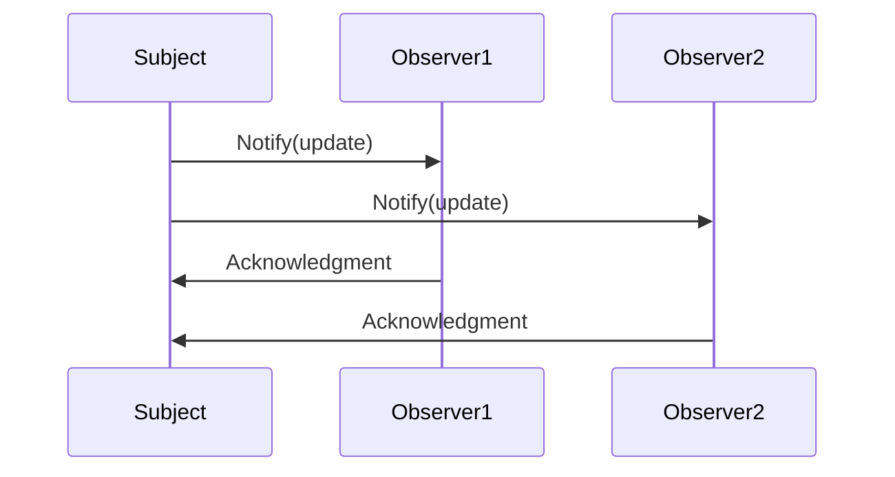

## 1.1 What Are Design Patterns in Erlang?

### Introduction

Design patterns are a fundamental concept in software engineering, providing reusable solutions to common problems encountered during software development. In the context of Erlang, a language renowned for its functional and concurrent programming capabilities, design patterns take on a unique form. This section delves into the essence of design patterns in Erlang, exploring their significance, how Erlang's features influence their implementation, and common scenarios where they are particularly beneficial.

### Understanding Design Patterns

**Design patterns** are established solutions to recurring design problems in software development. They encapsulate best practices and provide a template for solving problems that developers frequently encounter. By using design patterns, developers can create more robust, maintainable, and scalable software.

#### Role of Design Patterns in Software Development

- **Efficiency**: Design patterns streamline the development process by providing proven solutions, reducing the need to reinvent the wheel.
- **Communication**: They offer a common vocabulary for developers, facilitating better communication and understanding within teams.
- **Flexibility**: Patterns promote code reusability and adaptability, making it easier to modify and extend software systems.
- **Quality**: By adhering to best practices, design patterns help improve the overall quality and reliability of software.

### Significance of Design Patterns in Erlang

Erlang's unique characteristics, such as its functional nature and robust concurrency model, influence how design patterns are applied. Let's explore why design patterns are significant in Erlang:

#### Functional Programming Paradigm

Erlang is a functional programming language, which means it emphasizes immutability, first-class functions, and declarative code. This paradigm affects how design patterns are implemented:

- **Immutability**: Patterns in Erlang often leverage immutable data structures, leading to safer and more predictable code.
- **Higher-Order Functions**: Many patterns utilize higher-order functions to achieve flexibility and code reuse.
- **Pattern Matching**: This feature simplifies the implementation of certain patterns by allowing concise and expressive code.

#### Concurrency Model

Erlang's concurrency model is based on lightweight processes and message passing, making it ideal for building concurrent and distributed systems. This model influences design patterns in several ways:

- **Actor Model**: Erlang's processes align with the actor model, a common pattern for managing state and behavior in concurrent systems.
- **Fault Tolerance**: Patterns in Erlang often incorporate fault tolerance mechanisms, leveraging the "let it crash" philosophy.
- **Scalability**: Design patterns in Erlang are designed to handle high concurrency and distributed environments efficiently.

### Erlang's Features and Their Influence on Design Patterns

Erlang's features significantly impact the implementation and adaptation of design patterns. Let's examine some key features and their influence:

#### Lightweight Processes

Erlang's lightweight processes are a cornerstone of its concurrency model. They allow for the creation of thousands of concurrent processes with minimal overhead. This feature is crucial for patterns that involve parallelism and concurrency.

```erlang
% Example of spawning a lightweight process
spawn(fun() -> io:format("Hello from a process!~n") end).
```

#### Message Passing

Erlang processes communicate through message passing, a fundamental concept in many design patterns. This mechanism enables decoupled and asynchronous communication between components.

```erlang
% Example of message passing between processes
Pid = spawn(fun() -> receive
    {hello, From} -> From ! {hello, self()}
end end),
Pid ! {hello, self()}.
```

#### Fault Tolerance

Erlang's "let it crash" philosophy encourages building systems that can recover from failures automatically. This approach is integral to patterns that focus on reliability and fault tolerance.

```erlang
% Example of a supervisor process for fault tolerance
-module(my_supervisor).
-behaviour(supervisor).

init([]) ->
    {ok, {{one_for_one, 5, 10},
          [{worker, my_worker, {my_worker, start_link, []}, permanent, brutal_kill, worker, [my_worker]}]}}.
```

### Common Scenarios for Design Patterns in Erlang

Design patterns are particularly beneficial in Erlang for addressing specific challenges and scenarios:

#### Building Concurrent Systems

Erlang's concurrency model makes it ideal for building systems that require high levels of parallelism. Patterns like the actor model and process pipelines are commonly used to manage concurrency effectively.

#### Implementing Fault-Tolerant Systems

Erlang's fault tolerance capabilities are enhanced by design patterns that incorporate supervision trees and error handling strategies. These patterns ensure that systems can recover gracefully from failures.

#### Designing Scalable Architectures

Erlang's ability to handle distributed systems is supported by patterns that facilitate scalability, such as load balancing and distributed process management.

#### Developing Real-Time Applications

Erlang's low-latency capabilities make it suitable for real-time applications. Patterns that optimize message passing and process communication are crucial for achieving real-time performance.

### Example: Implementing a Simple Design Pattern in Erlang

Let's explore a simple example of a design pattern in Erlang: the **Observer Pattern**. This pattern allows an object, known as the subject, to maintain a list of dependents, called observers, and notify them of any state changes.

```erlang
-module(observer).
-export([start/0, add_observer/2, notify_observers/1]).

start() ->
    loop([]).

loop(Observers) ->
    receive
        {add_observer, Observer} ->
            loop([Observer | Observers]);
        {notify, Message} ->
            lists:foreach(fun(Observer) -> Observer ! {update, Message} end, Observers),
            loop(Observers)
    end.

add_observer(Pid, Observer) ->
    Pid ! {add_observer, Observer}.

notify_observers(Pid, Message) ->
    Pid ! {notify, Message}.
```

In this example, we define a simple observer pattern where a process can add observers and notify them of updates. This pattern is useful in scenarios where multiple components need to react to changes in a central entity.

### Visualizing Design Patterns in Erlang

To better understand how design patterns fit into Erlang's architecture, let's visualize the interaction between processes in a typical pattern implementation.



This sequence diagram illustrates the flow of messages in the observer pattern, where the subject notifies its observers of updates, and the observers acknowledge the notification.

### References and Further Reading

For more information on design patterns and their application in Erlang, consider exploring the following resources:

- [Erlang Programming Language](https://www.erlang.org/)
- [Design Patterns: Elements of Reusable Object-Oriented Software](https://en.wikipedia.org/wiki/Design_Patterns) by Erich Gamma, Richard Helm, Ralph Johnson, and John Vlissides
- [Erlang and OTP in Action](https://www.manning.com/books/erlang-and-otp-in-action) by Martin Logan, Eric Merritt, and Richard Carlsson

### Knowledge Check

- What are design patterns, and why are they important in software development?
- How do Erlang's functional and concurrent features influence the implementation of design patterns?
- Can you identify a scenario where the observer pattern would be beneficial in an Erlang application?

### Embrace the Journey

Remember, understanding design patterns in Erlang is just the beginning. As you continue your journey, you'll discover how these patterns can be adapted and extended to meet the unique challenges of your projects. Keep experimenting, stay curious, and enjoy the process of mastering Erlang's powerful capabilities!

## Quiz: What Are Design Patterns in Erlang?



### What is a design pattern in software development?

- [x] A reusable solution to a common problem
- [ ] A specific programming language feature
- [ ] A type of software bug
- [ ] A tool for debugging code

> **Explanation:** Design patterns are reusable solutions to common problems in software development, providing a template for solving recurring issues.

### How does Erlang's functional nature influence design patterns?

- [x] Emphasizes immutability and higher-order functions
- [ ] Focuses on object-oriented principles
- [ ] Relies on shared mutable state
- [ ] Uses inheritance for code reuse

> **Explanation:** Erlang's functional nature emphasizes immutability and higher-order functions, which influence the implementation of design patterns.

### What is a key feature of Erlang's concurrency model?

- [x] Lightweight processes and message passing
- [ ] Shared memory and locks
- [ ] Thread-based concurrency
- [ ] Synchronous communication

> **Explanation:** Erlang's concurrency model is based on lightweight processes and message passing, enabling efficient concurrent programming.

### Which pattern is commonly used for managing state in concurrent systems?

- [x] Actor model
- [ ] Singleton pattern
- [ ] Factory pattern
- [ ] Decorator pattern

> **Explanation:** The actor model is commonly used in Erlang for managing state and behavior in concurrent systems.

### What is the "let it crash" philosophy in Erlang?

- [x] Encourages building systems that can recover from failures automatically
- [ ] Promotes writing code that never crashes
- [ ] Focuses on preventing all runtime errors
- [ ] Relies on manual error handling

> **Explanation:** The "let it crash" philosophy encourages building systems that can recover from failures automatically, leveraging Erlang's fault tolerance capabilities.

### How do design patterns improve software quality?

- [x] By adhering to best practices and providing proven solutions
- [ ] By increasing code complexity
- [ ] By focusing on low-level optimizations
- [ ] By avoiding code reuse

> **Explanation:** Design patterns improve software quality by adhering to best practices and providing proven solutions to common problems.

### What is the role of a supervisor process in Erlang?

- [x] To manage and restart child processes in case of failure
- [ ] To handle user input and output
- [ ] To perform database operations
- [ ] To compile and execute code

> **Explanation:** A supervisor process in Erlang manages and restarts child processes in case of failure, ensuring system reliability.

### Which feature of Erlang supports building distributed systems?

- [x] Node communication and connectivity
- [ ] Global variables and shared memory
- [ ] Thread-based parallelism
- [ ] Synchronous function calls

> **Explanation:** Erlang supports building distributed systems through node communication and connectivity, enabling seamless interaction between distributed components.

### What is an example of a design pattern that enhances scalability in Erlang?

- [x] Load balancing pattern
- [ ] Singleton pattern
- [ ] Factory pattern
- [ ] Proxy pattern

> **Explanation:** The load balancing pattern enhances scalability in Erlang by distributing workload across multiple processes or nodes.

### True or False: Design patterns in Erlang are influenced by its functional and concurrent nature.

- [x] True
- [ ] False

> **Explanation:** True. Design patterns in Erlang are influenced by its functional and concurrent nature, affecting how they are implemented and adapted.


