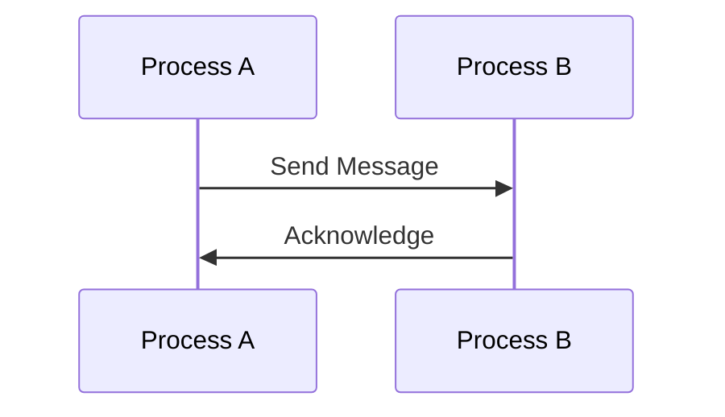

## 1.2 The Functional and Concurrent Programming Paradigm

Erlang is a unique programming language that stands out due to its strong emphasis on functional programming and concurrency. These paradigms are not just features of the language but are deeply embedded in its design philosophy, influencing how developers approach problem-solving and design patterns. In this section, we will explore these paradigms in detail, understand their principles, and see how they interrelate in Erlang.

### Principles of Functional Programming

Functional programming is a paradigm that treats computation as the evaluation of mathematical functions and avoids changing state or mutable data. Let's delve into some of its core principles:

#### Immutability

Immutability is a cornerstone of functional programming. It means that once a data structure is created, it cannot be changed. This leads to more predictable code and eliminates a whole class of bugs related to state changes.

```erlang
% Example of immutability in Erlang
-module(immutable_example).
-export([update_list/2]).

update_list(List, Element) ->
    [Element | List]. % Returns a new list with the element added
```

In the above example, `update_list/2` does not modify the original list but returns a new list with the added element. This immutability ensures that functions are side-effect-free, leading to more reliable and testable code.

#### Pure Functions

Pure functions are functions where the output value is determined only by its input values, without observable side effects. This makes them easier to reason about and test.

```erlang
% Example of a pure function
-module(pure_function_example).
-export([add/2]).

add(X, Y) ->
    X + Y.
```

The `add/2` function is pure because it always produces the same output for the same input and does not alter any external state.

#### Higher-Order Functions

Higher-order functions are functions that can take other functions as arguments or return them as results. This allows for powerful abstractions and code reuse.

```erlang
% Example of a higher-order function
-module(higher_order_example).
-export([apply_function/2]).

apply_function(F, X) ->
    F(X).

% Usage
1> higher_order_example:apply_function(fun(X) -> X * 2 end, 5).
10
```

In this example, `apply_function/2` takes a function `F` and an argument `X`, applying `F` to `X`. This demonstrates how functions can be passed around and used as first-class citizens in Erlang.

### Erlang's Approach to Concurrency

Erlang's concurrency model is one of its most distinctive features. It is based on the Actor model, where processes are the primary units of concurrency.

#### Lightweight Processes

Erlang processes are lightweight and managed by the Erlang runtime system, allowing thousands or even millions of processes to run concurrently.

```erlang
% Example of spawning a new process
-module(concurrency_example).
-export([start/0, loop/0]).

start() ->
    spawn(fun loop/0).

loop() ->
    receive
        stop -> ok;
        _ -> loop()
    end.
```

In this example, `start/0` spawns a new process running the `loop/0` function. Each process has its own memory and runs independently, making it easy to scale applications.

#### Message Passing

Processes communicate by sending and receiving messages. This decouples processes and avoids shared state, reducing the risk of concurrency-related bugs.

```erlang
% Example of message passing
-module(message_passing_example).
-export([send_message/1, receive_message/0]).

send_message(Pid) ->
    Pid ! {self(), "Hello"}.

receive_message() ->
    receive
        {From, Message} ->
            io:format("Received ~p from ~p~n", [Message, From])
    end.
```

Here, `send_message/1` sends a message to a process identified by `Pid`, and `receive_message/0` waits for a message and prints it. This model of communication is robust and scales well in distributed systems.

### Interrelation of Functional and Concurrent Paradigms in Erlang

The functional and concurrent paradigms in Erlang are not isolated; they complement each other to create a powerful programming model.

- **Immutability and Concurrency**: Immutability simplifies concurrent programming by eliminating issues related to shared mutable state. Since data cannot be changed, processes can safely share data without locks or synchronization mechanisms.
  
- **Pure Functions and Message Passing**: Pure functions ensure that message-passing operations do not have side effects, leading to more predictable and reliable inter-process communication.

- **Higher-Order Functions and Process Management**: Higher-order functions can be used to abstract common patterns in process management, such as creating worker processes or implementing supervision strategies.

### Influence on Design Patterns

Erlang's paradigms influence the design patterns used in the language. Let's explore a few examples:

#### Supervisor Pattern

The Supervisor pattern is a key design pattern in Erlang, leveraging both functional and concurrent paradigms. It involves creating a process that monitors other processes and restarts them if they fail.

```erlang
% Example of a simple supervisor
-module(simple_supervisor).
-behaviour(supervisor).

-export([start_link/0, init/1]).

start_link() ->
    supervisor:start_link({local, ?MODULE}, ?MODULE, []).

init([]) ->
    {ok, {{one_for_one, 5, 10},
          [{worker, worker1, {worker1, start_link, []}, permanent, brutal_kill, worker, [worker1]}]}}.
```

In this example, the supervisor is defined using the `supervisor` behavior, which is part of the OTP framework. It manages a worker process, restarting it if it crashes. This pattern is made possible by Erlang's lightweight processes and message-passing capabilities.

#### Try It Yourself

Experiment with the code examples provided. Try modifying the `loop/0` function to handle different messages or change the `apply_function/2` to accept different functions. Observe how these changes affect the behavior of the programs.

### Visualizing Erlang's Concurrency Model

To better understand Erlang's concurrency model, let's visualize the process communication using a sequence diagram.



This diagram illustrates how processes communicate by sending and receiving messages, a fundamental aspect of Erlang's concurrency model.

### References and Further Reading

- [Erlang Programming Language](https://www.erlang.org/)
- [Learn You Some Erlang for Great Good!](http://learnyousomeerlang.com/)
- [Erlang and OTP in Action](https://www.manning.com/books/erlang-and-otp-in-action)

### Knowledge Check

- What are the benefits of immutability in concurrent programming?
- How do pure functions contribute to reliable message passing?
- Why are lightweight processes advantageous in Erlang's concurrency model?

### Embrace the Journey

As you explore Erlang's functional and concurrent paradigms, remember that this is just the beginning. These paradigms offer a robust foundation for building scalable and fault-tolerant applications. Keep experimenting, stay curious, and enjoy the journey!

## Quiz: The Functional and Concurrent Programming Paradigm



### What is a key benefit of immutability in functional programming?

- [x] It eliminates issues related to shared mutable state.
- [ ] It allows for faster execution of code.
- [ ] It enables dynamic typing.
- [ ] It simplifies syntax.

> **Explanation:** Immutability ensures that data cannot be changed, which eliminates issues related to shared mutable state, especially in concurrent environments.

### How do pure functions contribute to reliable software?

- [x] They produce the same output for the same input.
- [ ] They allow for side effects.
- [ ] They enable dynamic typing.
- [ ] They simplify syntax.

> **Explanation:** Pure functions always produce the same output for the same input, making them predictable and easier to test.

### What is a characteristic of Erlang processes?

- [x] They are lightweight and managed by the Erlang runtime.
- [ ] They share memory with other processes.
- [ ] They require manual memory management.
- [ ] They are heavyweight and resource-intensive.

> **Explanation:** Erlang processes are lightweight and managed by the Erlang runtime, allowing for efficient concurrency.

### How do Erlang processes communicate?

- [x] By sending and receiving messages.
- [ ] By sharing memory.
- [ ] By using global variables.
- [ ] By direct function calls.

> **Explanation:** Erlang processes communicate by sending and receiving messages, which decouples them and avoids shared state.

### What is the role of a supervisor in Erlang?

- [x] To monitor and restart child processes if they fail.
- [ ] To execute business logic.
- [ ] To manage memory allocation.
- [ ] To handle user input.

> **Explanation:** A supervisor monitors child processes and restarts them if they fail, ensuring fault tolerance.

### What is a higher-order function?

- [x] A function that takes other functions as arguments or returns them.
- [ ] A function that only performs arithmetic operations.
- [ ] A function that modifies global state.
- [ ] A function that is executed in parallel.

> **Explanation:** Higher-order functions can take other functions as arguments or return them, allowing for powerful abstractions.

### What is the Actor model in Erlang?

- [x] A concurrency model where processes are the primary units of concurrency.
- [ ] A model for object-oriented programming.
- [ ] A model for dynamic typing.
- [ ] A model for memory management.

> **Explanation:** The Actor model is a concurrency model where processes are the primary units of concurrency, communicating via message passing.

### What is the advantage of message passing in Erlang?

- [x] It avoids shared state and reduces concurrency-related bugs.
- [ ] It allows for direct memory access.
- [ ] It simplifies syntax.
- [ ] It enables dynamic typing.

> **Explanation:** Message passing avoids shared state, reducing concurrency-related bugs and making the system more robust.

### How does Erlang handle state in concurrent systems?

- [x] By using processes with isolated memory.
- [ ] By using global variables.
- [ ] By sharing memory between processes.
- [ ] By using dynamic typing.

> **Explanation:** Erlang handles state by using processes with isolated memory, ensuring that each process manages its own state.

### True or False: Erlang's concurrency model is based on shared memory.

- [ ] True
- [x] False

> **Explanation:** Erlang's concurrency model is based on message passing, not shared memory, which helps avoid concurrency-related issues.




