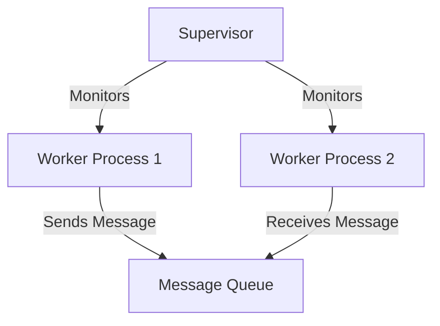

## 1.3 Why Design Patterns Matter in Erlang

Design patterns are a crucial aspect of software development, providing reusable solutions to common problems. In Erlang, a language renowned for its concurrency and fault tolerance, design patterns play an essential role in enhancing code quality, promoting best practices, and addressing specific challenges unique to Erlang programming. This section delves into why design patterns matter in Erlang, illustrating their benefits with real-world examples and encouraging critical thinking about their application in projects.

### The Importance of Design Patterns in Erlang

Design patterns offer a structured approach to solving recurring problems, enabling developers to write more efficient, maintainable, and scalable code. In Erlang, design patterns are particularly valuable due to the language's unique features, such as its functional programming paradigm and robust concurrency model.

#### Enhancing Code Quality

Design patterns help improve code quality by providing a blueprint for solving specific problems. They encourage developers to follow best practices, leading to cleaner, more organized code. This is especially important in Erlang, where the functional programming paradigm emphasizes immutability and pure functions. By adhering to design patterns, developers can ensure that their code is not only functional but also easy to understand and modify.

#### Promoting Best Practices

Using design patterns promotes best practices in software development. Patterns like the Supervisor pattern in Erlang's Open Telecom Platform (OTP) encourage developers to build fault-tolerant systems by structuring applications into manageable components. This approach aligns with Erlang's "let it crash" philosophy, which advocates for building systems that can recover from failures gracefully.

#### Solving Recurring Problems Efficiently

Design patterns provide tried-and-tested solutions to common problems, saving developers time and effort. In Erlang, patterns such as the GenServer and GenEvent behaviors simplify the implementation of server processes and event handling, respectively. By leveraging these patterns, developers can focus on solving the unique challenges of their applications rather than reinventing the wheel.

### Addressing Specific Challenges in Erlang Programming

Erlang's concurrency model and functional programming paradigm present unique challenges that design patterns can help address. Let's explore some of these challenges and how design patterns provide effective solutions.

#### Concurrency and Fault Tolerance

Erlang's concurrency model is based on lightweight processes that communicate via message passing. While this model offers significant advantages in terms of scalability and fault tolerance, it also introduces complexities in managing process communication and state.

**Example: Supervisor Pattern**

The Supervisor pattern is a cornerstone of Erlang's OTP framework, designed to manage process lifecycles and ensure system reliability. By organizing processes into supervision trees, developers can create systems that automatically restart failed processes, maintaining system stability without manual intervention.

```erlang
-module(my_supervisor).
-behaviour(supervisor).

%% API
-export([start_link/0]).

%% Supervisor callbacks
-export([init/1]).

start_link() ->
    supervisor:start_link({local, ?MODULE}, ?MODULE, []).

init([]) ->
    {ok, {{one_for_one, 5, 10},
          [{my_worker, {my_worker, start_link, []},
            permanent, brutal_kill, worker, [my_worker]}]}}.
```

In this example, the `my_supervisor` module defines a supervisor that manages a worker process. The supervisor's strategy is `one_for_one`, meaning it will restart a failed worker process individually.

#### Functional Programming and Immutability

Erlang's functional programming paradigm emphasizes immutability and pure functions, which can be challenging for developers accustomed to imperative programming. Design patterns help bridge this gap by providing functional solutions to common problems.

**Example: Higher-Order Functions**

Higher-order functions are a fundamental concept in functional programming, allowing functions to be passed as arguments or returned as results. In Erlang, patterns that leverage higher-order functions can simplify code and enhance reusability.

```erlang
-module(higher_order_example).
-export([apply_function/2]).

apply_function(Fun, List) ->
    lists:map(Fun, List).
```

In this example, the `apply_function/2` function takes a function `Fun` and a list `List`, applying `Fun` to each element of the list using the `lists:map/2` function.

### Real-World Examples of Design Patterns in Erlang

To illustrate the impact of design patterns in Erlang, let's explore some real-world examples where patterns have improved application design and performance.

#### Example 1: Building a Chat Application

In a chat application, managing concurrent user connections and message delivery is crucial. By using the GenServer pattern, developers can implement a robust server process that handles user sessions and message routing efficiently.

```erlang
-module(chat_server).
-behaviour(gen_server).

%% API
-export([start_link/0, send_message/2]).

%% gen_server callbacks
-export([init/1, handle_call/3, handle_cast/2, handle_info/2, terminate/2, code_change/3]).

start_link() ->
    gen_server:start_link({local, ?MODULE}, ?MODULE, [], []).

init([]) ->
    {ok, #{}}.

send_message(User, Message) ->
    gen_server:cast(?MODULE, {send_message, User, Message}).

handle_cast({send_message, User, Message}, State) ->
    %% Broadcast message to all users
    io:format("~p: ~s~n", [User, Message]),
    {noreply, State}.
```

In this example, the `chat_server` module uses the GenServer pattern to manage user messages. The `send_message/2` function sends a message to the server, which then broadcasts it to all connected users.

#### Example 2: Implementing a Fault-Tolerant Web Server

A web server must handle numerous concurrent requests while maintaining high availability. By leveraging the Supervisor and GenServer patterns, developers can build a fault-tolerant web server that scales with demand.

```erlang
-module(web_server).
-behaviour(gen_server).

%% API
-export([start_link/0, handle_request/1]).

%% gen_server callbacks
-export([init/1, handle_call/3, handle_cast/2, handle_info/2, terminate/2, code_change/3]).

start_link() ->
    gen_server:start_link({local, ?MODULE}, ?MODULE, [], []).

init([]) ->
    {ok, #{}}.

handle_request(Request) ->
    gen_server:call(?MODULE, {handle_request, Request}).

handle_call({handle_request, Request}, _From, State) ->
    %% Process the request
    Response = process_request(Request),
    {reply, Response, State}.

process_request(Request) ->
    %% Simulate request processing
    io:format("Processing request: ~p~n", [Request]),
    {ok, "Response"}.
```

In this example, the `web_server` module uses the GenServer pattern to handle incoming requests. The `handle_request/1` function processes each request and returns a response.

### Encouraging Critical Thinking About Pattern Application

While design patterns offer numerous benefits, it's essential to apply them judiciously. Developers should consider the specific requirements of their projects and evaluate whether a pattern is appropriate for their use case. Overusing patterns can lead to unnecessary complexity, while underusing them may result in missed opportunities for optimization.

#### Key Considerations for Pattern Application

- **Understand the Problem**: Before applying a pattern, ensure you fully understand the problem you're trying to solve. This will help you select the most appropriate pattern for your needs.
- **Evaluate Alternatives**: Consider alternative solutions and weigh their pros and cons. Sometimes, a simple solution may be more effective than a complex pattern.
- **Adapt Patterns to Your Context**: Design patterns are not one-size-fits-all. Adapt them to fit the specific context of your application, taking into account factors such as performance, scalability, and maintainability.

### Visualizing Design Patterns in Erlang

To better understand how design patterns fit into Erlang's architecture, let's visualize the relationship between processes, supervisors, and message passing using Mermaid.js diagrams.



**Diagram Description**: This diagram illustrates a simple supervision tree in Erlang, where a Supervisor monitors two Worker Processes. The Worker Processes communicate via a Message Queue, demonstrating Erlang's message-passing model.

### Conclusion

Design patterns are invaluable tools for Erlang developers, enhancing code quality, promoting best practices, and providing efficient solutions to recurring problems. By understanding and applying these patterns, developers can build robust, scalable applications that leverage Erlang's unique features. As you continue your journey in Erlang programming, remember to think critically about pattern application, adapt patterns to your context, and embrace the power of design patterns to elevate your code.

## Quiz: Why Design Patterns Matter in Erlang



### Why are design patterns important in Erlang?

- [x] They enhance code quality and promote best practices.
- [ ] They make code more complex and harder to understand.
- [ ] They are only useful in object-oriented programming.
- [ ] They are not applicable to functional programming.

> **Explanation:** Design patterns enhance code quality and promote best practices, making them valuable in Erlang's functional programming paradigm.

### How do design patterns help in Erlang's concurrency model?

- [x] They provide structured solutions for managing process communication and state.
- [ ] They eliminate the need for message passing.
- [ ] They replace Erlang's lightweight processes with threads.
- [ ] They make concurrency more difficult to implement.

> **Explanation:** Design patterns provide structured solutions for managing process communication and state, which are crucial in Erlang's concurrency model.

### What is the Supervisor pattern used for in Erlang?

- [x] Managing process lifecycles and ensuring system reliability.
- [ ] Replacing GenServer processes.
- [ ] Eliminating the need for fault tolerance.
- [ ] Simplifying message passing.

> **Explanation:** The Supervisor pattern is used to manage process lifecycles and ensure system reliability by organizing processes into supervision trees.

### How do higher-order functions benefit Erlang programming?

- [x] They allow functions to be passed as arguments or returned as results.
- [ ] They make code less readable and harder to maintain.
- [ ] They are only useful in object-oriented programming.
- [ ] They eliminate the need for pattern matching.

> **Explanation:** Higher-order functions allow functions to be passed as arguments or returned as results, enhancing code reusability and flexibility in Erlang.

### What should developers consider when applying design patterns?

- [x] Understand the problem and evaluate alternatives.
- [ ] Apply patterns indiscriminately to all problems.
- [ ] Avoid using patterns in functional programming.
- [ ] Focus solely on performance optimization.

> **Explanation:** Developers should understand the problem and evaluate alternatives to ensure they select the most appropriate pattern for their needs.

### How does the GenServer pattern improve Erlang applications?

- [x] It simplifies the implementation of server processes.
- [ ] It replaces the need for message passing.
- [ ] It complicates process communication.
- [ ] It is only useful for web applications.

> **Explanation:** The GenServer pattern simplifies the implementation of server processes, making it easier to manage concurrent operations in Erlang applications.

### What is a key benefit of using design patterns in Erlang?

- [x] They provide reusable solutions to common problems.
- [ ] They increase code complexity unnecessarily.
- [ ] They are only applicable to object-oriented languages.
- [ ] They eliminate the need for functional programming.

> **Explanation:** Design patterns provide reusable solutions to common problems, enhancing code efficiency and maintainability in Erlang.

### How can design patterns address Erlang's functional programming challenges?

- [x] By providing functional solutions to common problems.
- [ ] By eliminating the need for immutability.
- [ ] By making code less readable.
- [ ] By replacing functional programming with imperative programming.

> **Explanation:** Design patterns provide functional solutions to common problems, helping developers navigate Erlang's functional programming challenges.

### What is the "let it crash" philosophy in Erlang?

- [x] Building systems that can recover from failures gracefully.
- [ ] Avoiding error handling altogether.
- [ ] Eliminating the need for fault tolerance.
- [ ] Making systems more prone to crashes.

> **Explanation:** The "let it crash" philosophy advocates for building systems that can recover from failures gracefully, aligning with Erlang's fault tolerance capabilities.

### True or False: Design patterns are not applicable to Erlang's functional programming paradigm.

- [ ] True
- [x] False

> **Explanation:** Design patterns are applicable to Erlang's functional programming paradigm, providing structured solutions to common problems and enhancing code quality.


